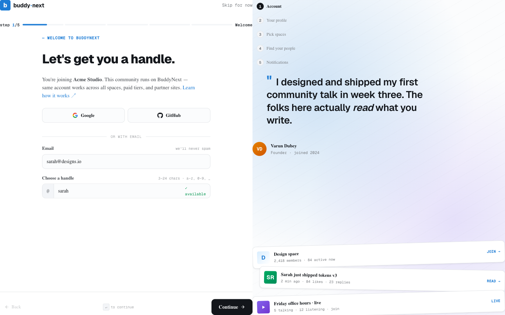
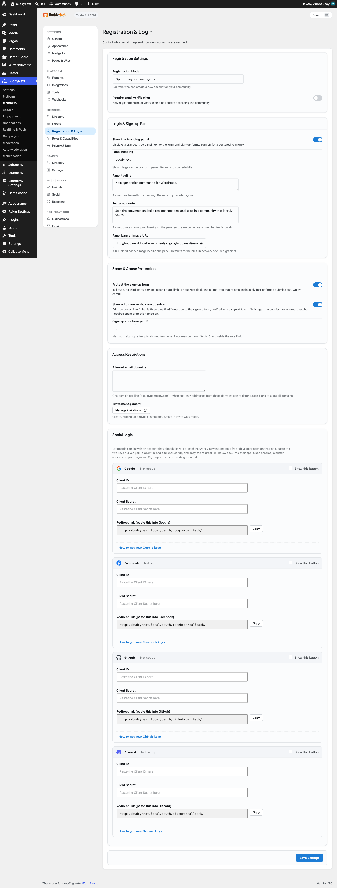

# Registration

Registration is how people create an account and join your community. BuddyNext gives you a branded sign-up form that lives on your own site, so newcomers never land on the plain WordPress sign-up screen. The form matches your community's look, collects the profile details you care about, and drops each new member straight into the experience you set up. It is the welcome mat for your community, and a good first impression keeps more people around.

## Why use it

- **On-brand, on-site.** The sign-up form picks up your site's colors, fonts, and spacing automatically, and on BuddyNext Pro it carries your white-label branding. Newcomers see your community, not generic WordPress chrome.
- **Stays inside your community.** People sign up and land on your feed, the welcome wizard, or a page you choose - they are never bounced out to a WordPress dashboard.
- **Collects the right details up front.** Show selected profile fields right on the sign-up form, so members arrive with a filled-in profile instead of an empty one.
- **Keeps spam out without a captcha service.** Built-in protections quietly screen out bots and fake sign-ups, with no third-party captcha to set up or pay for.
- **Fits how you run the community.** Open sign-up, invite-only, and admin-approval modes are all supported, plus optional email verification - so you can be as open or as selective as you like.

## How it works for members

1. **Open the sign-up page.** A member visits your sign-up page - your community's built-in login and sign-up hub, or any page where you placed the Registration form block.
2. **Fill in the form.** The form asks for an email address, a username, and a password. It also shows any profile fields you chose to collect at sign-up, plus a Terms of Service checkbox.
3. **Submit.** BuddyNext validates everything inline before creating the account. Errors (for example, a taken username or a weak password) show next to the field they belong to, so nothing is created on a bad submission.
4. **Arrive in the community.** What happens next depends on your registration mode and whether email verification is on - see the states below.

### Field rules members see

| Field | Requirement |
|---|---|
| Email | A valid address that is not already in use. |
| Username | At least 3 characters, valid characters only, not already taken. |
| Password | At least 8 characters. |
| Terms of Service | Must be checked to continue. |
| Profile fields | Any field you marked to show at registration. Required ones must be filled. |

> **Note:** If you restrict registration to certain email domains, an address outside those domains is rejected at sign-up.

## What happens after submit

The new member's path depends on two settings: your **Registration Mode** and whether **email verification** is required.

- **Instant access (Open mode, verification off).** The account is created and the member is signed in immediately. They land on the onboarding wizard if onboarding is enabled, otherwise on the activity feed.
- **Verification required.** The account is created and the member is sent to a verification screen. They must click the link in the confirmation email before getting full access. (See the Email Verification page for the full flow.)
- **Admin approval (Approval mode).** The account is created but held. The member sees a message that their account is awaiting administrator approval, and they cannot sign in until an admin approves them.
- **Invite only (Invite mode).** A valid invitation is required. Without one, sign-up is refused with a message that the community is invite-only. An invitation link can also drop the new member straight into the space they were invited to.

## Setting it up (for owners)

### Place the registration form

You have two ways to publish the sign-up form:

- **The built-in login and sign-up hub.** Out of the box, your community already has a login and sign-up page. New members can sign up there with no extra setup.
- **The Registration form block.** Add the block to any page to embed the same branded form wherever you want it.

To place it: edit a page, add the **Registration** form block (search for "registration" or "signup" in the block inserter, under the BuddyNext category), and publish. The block has one option, a redirect address, which sends the member to a specific page after they sign up. Leave it blank to use the default destination (the welcome wizard or the feed). Like any block, it also inherits the editor's color, typography, and spacing controls.

### Registration settings

These live under **BuddyNext > Settings > Registration**.

| Setting | What it does | Default |
|---|---|---|
| Registration Mode | Chooses who can create an account: **Open** (anyone), **Invite Only** (a valid invitation is required), or **Admin Approval** (an admin reviews each request). | Follows WordPress: Open when "Anyone can register" is on, otherwise closed |
| Require email verification | New members must confirm their email before getting full access. Only appears when the Email Verification feature is enabled under Features. | Off |
| Show the branding panel | Shows a branded side panel next to the login and sign-up forms. Turn off for a centered form only. | On |
| Panel heading | Large heading on the branding panel. | Your site title |
| Panel tagline | A short line beneath the heading. | Your site tagline |
| Featured quote | A short quote shown prominently on the panel. | A built-in welcome line |
| Panel banner image | A full-width banner image behind the panel. | Built-in gradient artwork |
| Protect the sign-up form | Turns on the built-in spam protection, which quietly screens out bots and fake sign-ups without a captcha service. | On |
| Show a human-verification question | Adds a simple "what is three plus five?" question to the form. No images, no cookies, no external captcha. Requires spam protection to be on. | On |
| Sign-ups per hour from one visitor | The most sign-up attempts allowed from a single visitor per hour. Set to 0 to remove this limit. | 5 |
| Allowed email domains | One domain per line. When set, only addresses from these domains can register. Leave blank to allow all. | Blank (all domains) |

> **Note:** Registration Mode also respects the core WordPress "Anyone can register" setting. If registration is closed in WordPress, sign-up is closed too, and visitors see a "Registration is currently closed" message.

### The default role for new members

BuddyNext does not add its own role picker for sign-up. New members are created with your site's standard WordPress **default role** (set under **Settings > General > New User Default Role** in wp-admin), which is **Subscriber** on a typical install. Set that role before opening registration if you want newcomers to start with different capabilities.

### Choose which profile fields appear at registration

You decide which profile fields show on the sign-up form. Go to **BuddyNext > Members > Profile Fields**, edit a field, and turn on **Show on registration**. Mark a field **Required** if a member must fill it in to sign up. Required registration fields are validated inline alongside the core fields, and their answers are saved to the new member's profile automatically.

### Manage invitations and approvals

- **Invitations.** When using Invite Only mode, manage invites under **BuddyNext > Members > Invitations** - create, resend, and revoke them there. (There is a shortcut button on the Registration settings tab.)
- **Approvals.** In Admin Approval mode, pending accounts wait for review. Approve them from the Members admin screen; until then they cannot sign in.

## Good to know

- **Account states members may hit:**
  - *Pending approval* - the account exists but sign-in is blocked until an admin approves it.
  - *Verification required* - the account exists and is signed in only to a verification screen until the email is confirmed.
- **Spam guards never get in a real person's way.** A genuine member always sees normal field errors first; the spam protections only kick in on suspicious submissions, so they stay invisible to legitimate sign-ups.
- **Domain allow-list is exact.** Only addresses ending in a listed domain can register when the allow-list is set, which is handy for a company or campus community.
- **Social sign-up.** If you enable social login, people can create an account with a provider like Google instead of filling in the form. See the Social Login page.
