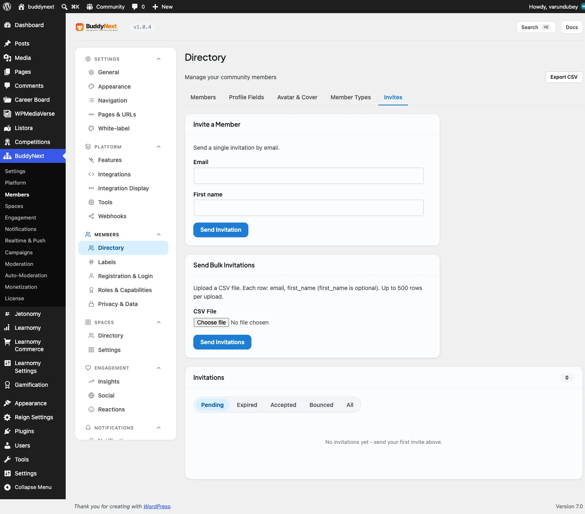

# Registration

Registration is how people create an account and join your community. BuddyNext gives you a branded sign-up form that lives on your own site, so newcomers never land on the plain WordPress sign-up screen. The form matches your community's look, collects the profile details you care about, and drops each new member straight into the experience you set up. It is the welcome mat for your community, and a good first impression keeps more people around.

## Why use it

- **On-brand, on-site.** The sign-up form picks up your site's colors, fonts, and spacing automatically, and on BuddyNext Pro it carries your white-label branding. Newcomers see your community, not generic WordPress chrome.
- **Stays inside your community.** People sign up and land on your feed, the welcome wizard, or a page you choose - they are never bounced out to a WordPress dashboard.
- **Collects the right details up front.** Show selected profile fields right on the sign-up form, so members arrive with a filled-in profile instead of an empty one.
- **Keeps spam out without a captcha service.** Built-in protections quietly screen out bots and fake sign-ups, with no third-party captcha to set up or pay for.
- **Fits how you run the community.** Open sign-up, invite-only, and admin-approval modes are all supported, plus optional email verification - so you can be as open or as selective as you like.

## How it works for members

1. **Open the sign-up page.** A member visits your sign-up page - your community's built-in login and sign-up hub, or any page where you added the `[buddynext_auth]` shortcode.
2. **Fill in the form.** By default the form asks for an email address, a name, and a password. It also shows any profile fields you chose to collect at sign-up, plus a Terms of Service checkbox. It does **not** ask for a username unless you switch that on - see below.
3. **Submit.** BuddyNext validates everything inline before creating the account. Errors (for example, a weak password) show next to the field they belong to, so nothing is created on a bad submission.
4. **Arrive in the community.** What happens next depends on your registration mode and whether email verification is on - see the states below.

### Field rules members see

| Field | Requirement | Shown by default? |
|---|---|---|
| Email | A valid address that is not already in use. | Always |
| Password | At least 8 characters. | Always |
| Name | The name other members see. | Yes - you can turn it off |
| Username | At least 3 characters, valid characters only, not already taken. | **No** - off by default |
| Terms of Service | Must be checked to continue. | Yes, when you have set a Terms page |
| Profile fields | Any field you marked to show at registration. Required ones must be filled. | Only the ones you chose |

> **Note on usernames:** BuddyNext does not ask a new member to invent a username. It generates a unique one from their email address, and the member can change it later in their settings. This is deliberate: "that username is taken" is one of the most common reasons someone abandons a sign-up form, and most people do not care what their handle is at the moment they join. If your community *is* about handles, switch **Let members choose their own username** on and the field appears.

> **Note:** If you restrict registration to certain email domains, an address outside those domains is rejected at sign-up.

> **Note:** The Terms of Service checkbox only appears if you have both switched **Require members to accept your terms** on (it is on by default) **and** chosen a Terms page. BuddyNext will not ask a member to agree to a document that does not exist.

## What happens after submit

The new member's path depends on two settings: your **Registration Mode** and whether **email verification** is required.

- **Instant access (Open mode, verification off).** The account is created and the member is signed in immediately. They land on the onboarding wizard if onboarding is enabled, otherwise on the activity feed.
- **Verification required.** The account is created and the member is sent to a verification screen. They must click the link in the confirmation email before getting full access. (See the Email Verification page for the full flow.)
- **Admin approval (Approval mode).** The account is created but held. The member sees a message that their account is awaiting administrator approval, and they cannot sign in until an admin approves them.
- **Invite only (Invite mode).** A valid invitation is required. Without one, sign-up is refused with a message that the community is invite-only. When someone opens their invitation link, the sign-up form already has their email address filled in, so they only need to choose a password. An invitation link can also drop the new member straight into the space they were invited to.
- **Closed.** Nobody can create an account, invitation or not. Use this to pause sign-ups entirely.

> **Important:** WordPress has its own "Anyone can register" setting, under Settings > General, and another plugin (or a hosting default) can flip it behind your back. If it disagrees with your BuddyNext registration mode, sign-ups break silently: BuddyNext can show registration as open while WordPress refuses every single person who tries to join, and you would never know unless someone told you. BuddyNext watches for this and shows an admin notice with a one-click fix when the two disagree. If you see that notice, act on it - it means people are being turned away right now.

## Setting it up (for owners)

### Place the registration form

You have two ways to publish the sign-up form:

- **The built-in login and sign-up hub.** Out of the box, your community already has a login and sign-up page. New members can sign up there with no extra setup.
- **The `[buddynext_auth]` shortcode.** Add the shortcode to any page to embed the same branded form wherever you want it. It renders the combined login and sign-up form (the same one the hub uses), so a single page handles both signing in and signing up.

To place it: edit a page, add a shortcode block (or type it directly), enter `[buddynext_auth]`, and publish. Signed-out visitors see the branded login and sign-up forms; signed-in members are sent on to the activity feed. Where members land after sign-up is set globally under **BuddyNext > Members > Registration & Login**, not per page.

### Registration settings

These live under **BuddyNext > Members > Registration & Login**.

| Setting | What it does | Default |
|---|---|---|
| Registration Mode | Chooses who can create an account: **Open** (anyone), **Invite Only** (a valid invitation is required), **Admin Approval** (an admin reviews each request), or **Closed** (nobody can create an account). | Follows WordPress: Open when "Anyone can register" is on, otherwise closed |
| Require members to accept your terms | Shows a consent checkbox on every sign-up route. Only takes effect once you have chosen a Terms page. | On |
| Ask new members for their name | Collects the name other members will see. Turn it off only if your community wants handles rather than names. | On |
| Let members choose their own username | Adds a username field to the sign-up form. With this off, a username is generated from the member's email and they can change it later in their settings. | Off |
| Also allow the WordPress sign-up form | With this off, anyone landing on the WordPress `wp-login.php` sign-up form is sent to your BuddyNext sign-up page instead. Turn it on only if another plugin depends on the WordPress form. Your registration rules apply either way. | Off |
| Require email verification | New members must confirm their email. How strictly is a separate setting - see below. Only appears when the Email Verification feature is enabled under Features. | Off |
| How strictly to enforce verification | **Restricted** (recommended): unverified members can look around but cannot post or comment. **Full**: they cannot use the community at all until they confirm. Only appears when verification is on. | Restricted |
| Require two-factor authentication | Who must use 2FA: Nobody, Administrators, Administrators and editors, or Everyone. See Two-Factor Authentication. | Nobody |
| Show the branding panel | Shows a branded side panel next to the login and sign-up forms. Turn off for a centered form only. | On |
| Panel heading | Large heading on the branding panel. | Your site title |
| Panel tagline | A short line beneath the heading. | Your site tagline |
| Featured quote | A short quote shown prominently on the panel. | A built-in welcome line |
| Panel banner image | A full-width banner image behind the panel. | Built-in gradient artwork |
| Protect the sign-up form | Turns on the built-in spam protection, which quietly screens out bots and fake sign-ups without a captcha service. | On |
| Show a human-verification question | Adds a simple "what is three plus five?" question to the form. No images, no cookies, no external captcha. Requires spam protection to be on. | On |
| Sign-ups per hour per IP | The most sign-up attempts allowed from a single IP address per hour. Untick the box to remove this limit. | 5 |
| Allowed email domains | One domain per line. When set, only addresses from these domains can register. Leave blank to allow all. | Blank (all domains) |

> **Note:** Registration Mode also respects the core WordPress "Anyone can register" setting. If registration is closed in WordPress, sign-up is closed too, and visitors see a "Registration is currently closed" message. A fresh BuddyNext install (1.0.4+) turns the core setting on to match its default Open mode, so registration works out of the box; changing the Registration Mode keeps the two in sync from then on.

### The default role for new members

BuddyNext does not add its own role picker for sign-up. New members are created with your site's standard WordPress **default role** (set under **Settings > General > New User Default Role** in wp-admin), which is **Subscriber** on a typical install. Set that role before opening registration if you want newcomers to start with different capabilities.

### Choose which profile fields appear at registration

You decide which profile fields show on the sign-up form. Go to **BuddyNext > Members > Profile Fields**, edit a field, and turn on **Show on registration**. Mark a field **Required** if a member must fill it in to sign up. Required registration fields are validated inline alongside the core fields, and their answers are saved to the new member's profile automatically.

### Manage invitations and approvals

- **Invitations.** When using Invite Only mode, manage invites under **BuddyNext > Members > Invites** - create, resend, and revoke them there. (There is a shortcut button on the Registration & Login settings tab.)
- **Approvals.** In Admin Approval mode, pending accounts wait for review. Approve them from the Members admin screen; until then they cannot sign in.

## Good to know

- **Account states members may hit:**
  - *Pending approval* - the account exists but sign-in is blocked until an admin approves it.
  - *Verification required* - the account exists and is signed in only to a verification screen until the email is confirmed.
- **Spam guards never get in a real person's way.** A genuine member always sees normal field errors first; the spam protections only kick in on suspicious submissions, so they stay invisible to legitimate sign-ups.
- **Domain allow-list is exact.** Only addresses ending in a listed domain can register when the allow-list is set, which is handy for a company or campus community.
- **Social sign-up.** If you enable social login, people can create an account with a provider like Google instead of filling in the form. See the Social Login page.
