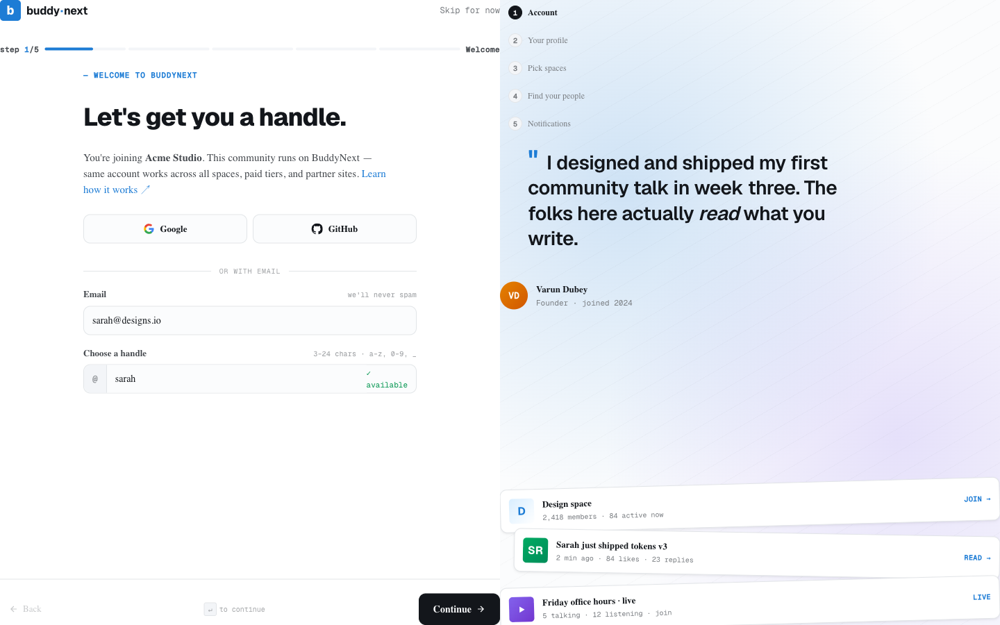

# Email Verification

Email verification asks every new member to confirm their email address before they get full access to your community. They click a link in a message sent to that address, which proves the inbox is real and belongs to them. It is a simple step that keeps your member list genuine and your community emails landing in real inboxes.

## Why use it

- **Confirm real addresses.** A member who verifies has a working inbox, so your welcome emails, notifications, and digests actually reach them.
- **Cut spam and throwaway sign-ups.** Bots and disposable accounts rarely complete the verify step, so requiring it keeps your member directory cleaner.
- **Protect community trust.** When you know addresses are real, password resets and account-recovery emails go to the right person.

Verification is optional. When it is turned off, every account is treated as verified the moment it is created.

## How it works for members

When verification is required, here is what a new member experiences.

1. **Sign up as usual.** After creating the account, the member lands on a verification screen instead of the main feed.
2. **Open the email.** BuddyNext sends a message with a confirmation link to the address used at sign-up. The email matches the rest of your community's branded emails.
3. **Click the link.** The link opens a confirmation page. Once it loads, the address is verified and the member can use the community normally.
4. **Resend if needed.** If the email did not arrive, the member can use the **Resend** button on the verification screen to send a fresh link. They should also check spam or promotions folders first.

### What members can do before verifying

A member with an unverified address can sign in and reach the verification screen, but full community access is held until they confirm. The verification step is meant to come first, so encourage new members to complete it before doing anything else.

> **Note:** The confirmation link is single-use. Once it has been clicked successfully, clicking it again does nothing - the account is already verified, and that state stays set.

## Setting it up (for owners)

Email verification is controlled in two places in the admin: a master feature switch, and a sub-toggle that requires it for new sign-ups.

### Step 1 - Turn on the feature

Go to **BuddyNext > Features** and enable **Email Verification**. This makes the verification system available. Until this is on, the require toggle below is hidden, because it would have no effect.

### Step 2 - Require it for new registrations

Go to **BuddyNext > Settings > Registration**. With the feature enabled, you will see the require toggle.

| Setting | What it does | Default |
|---|---|---|
| Registration Mode | Chooses who can create an account: **Open** (anyone), **Invite Only** (needs an invitation), or **Admin Approval** (an admin reviews each request). | Open |
| Require email verification | New registrations must verify their email before accessing the community. Only shown when the Email Verification feature is enabled. | Off |

### Admin Approval mode

Setting **Registration Mode** to **Admin Approval** is a separate gate from email verification. In approval mode, a new account is created but held until an administrator approves it. The new member sees a message that their account is awaiting administrator approval, and they cannot sign in until you approve them.

You can use approval mode and email verification together: the member confirms their email, and you still review and approve the account before they get in.

> **Note:** Approval mode and verification answer different questions. Verification proves the email address is real. Approval lets you personally review who joins. Turn on whichever (or both) match how tightly you want to control sign-ups.

### The verification email

The message that carries the confirmation link is a standard BuddyNext email, sent with your community's branding, sender identity, and footer - the same shell as every other email the platform sends. There is nothing extra to configure to make it match your other emails.

## Good to know

- **Unverified state.** A new account stays unverified until the link is clicked. While unverified, the member is steered to the verification screen rather than the full community.
- **Link expiry.** A confirmation link is valid for a limited time after it is sent. If a member clicks an old link, they are told it has expired and asked to request a new one - which they do with the **Resend** button.
- **Resending replaces the old link.** Each resend issues a fresh link and clears the previous pending one, so only the newest link works. Always tell members to use the most recent email.
- **Already verified.** If a member who is already verified tries to resend, BuddyNext tells them their address is already confirmed and does not send another email.
- **Verification off.** If you never turn the feature on, or leave the require toggle off, every account counts as verified automatically and members go straight into the community after sign-up.
