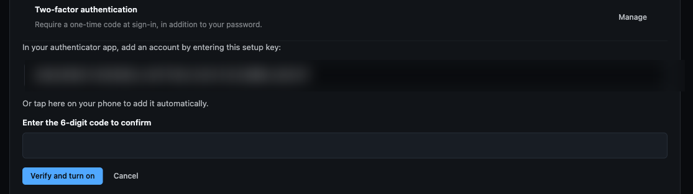
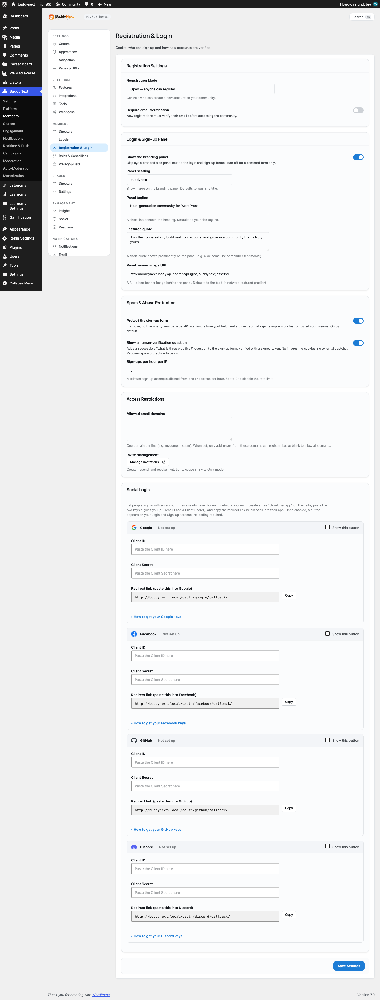

# Two-Factor Authentication

Two-factor authentication (2FA) adds a second step to signing in. After a member enters their password, they also enter a short one-time code. Even if someone learns the password, they still cannot get in without that code - which gives members real peace of mind that their account is theirs alone.

## Why use it

- **Stronger account security.** A password alone can be guessed, reused, or leaked. A second factor means a stolen password is not enough on its own.
- **Member peace of mind.** Members who manage groups, post publicly, or hold sensitive roles get real protection against takeover.
- **Built in, no extra service.** BuddyNext generates and checks the codes itself. There is no third-party service to sign up for or pay for.

2FA is opt-in. Every member chooses whether to turn it on for their own account.

## The methods BuddyNext supports

BuddyNext uses a standard authenticator app as the primary method, with two recovery options.

- **Authenticator app (primary).** Works with any standard app such as Google Authenticator, Authy, or 1Password. The app shows a fresh 6-digit code every 30 seconds.
- **Backup codes (recovery).** A set of one-time codes generated when 2FA is switched on. Each works once if the authenticator is unavailable.
- **Email code (sign-in fallback).** At the sign-in challenge, a member can ask BuddyNext to email a one-time code to their address instead of using the app.

## How it works for members

Members set up and manage 2FA from **Settings > Account**.

### Turning on 2FA

1. Go to **Settings > Account** and find the **Two-factor authentication** card.
2. Select **Set up two-factor authentication**.
3. In your authenticator app, add a new account and enter the setup key BuddyNext shows you.
4. The app starts producing 6-digit codes. Enter the current code on the BuddyNext screen to confirm.
5. Once the code is accepted, 2FA turns on and BuddyNext shows your **backup codes**.

> **Note:** Nothing is enforced until you enter that first code. If you start setup but never confirm, 2FA stays off.

### Saving your backup codes

Right after setup, BuddyNext shows a set of one-time backup codes. **Save these immediately** - they are shown only once and will not be displayed again. Keep them somewhere safe and separate from your phone, such as a password manager. Each code works a single time, as a way in if you ever lose access to your authenticator app.

### Signing in with 2FA on

1. Enter your email and password as usual.
2. BuddyNext asks for your one-time code.
3. Open your authenticator app and enter the current 6-digit code. (If you cannot reach the app, enter one of your backup codes instead, or use the email option below.)
4. Once the code is accepted, you are signed in.

If you cannot use your authenticator or your backup codes, choose the option to **email a code** on the sign-in screen. BuddyNext sends a one-time code to your account's email address; enter it to finish signing in. A mistyped code can be retried while the sign-in session is still active.

### Managing or turning off 2FA

From the **Two-factor authentication** card under **Settings > Account**, once 2FA is on you can:

- **Regenerate backup codes** - generate a fresh set, which immediately replaces and invalidates your old codes.
- **Turn off two-factor authentication** - switch 2FA off.

Both of these ask for your account password again before they take effect, so that someone using an already-open session cannot quietly weaken your account.

## Setting it up (for owners)

There is no admin screen to switch 2FA on or off for the whole site, and BuddyNext never blocks anyone from signing in for not having it. By default it is purely opt-in: each member decides for their own account.

A site can fine-tune two things (these are advanced options a developer sets up for you):

| Setting | What it does | Default |
|---|---|---|
| Suggested roles | Marks chosen roles as expected to use 2FA. This only adds a friendly prompt in those members' account area encouraging them to turn it on. It never stops anyone signing in. | None (no role marked) |
| Community name in the app | The community name shown next to the account inside the authenticator app, so members can tell your account apart from others. | Your site name |

> **Note:** Marking a role does not lock anyone out. The bar for signing in stays exactly the same - the setting only nudges members in those roles to turn 2FA on. To protect every administrator or moderator, encourage them directly; their sign-in works either way.

## Good to know

- **Lost device.** If you lose the phone with your authenticator app, sign in with one of your saved **backup codes**, or use the **email a code** option on the sign-in screen. Once back in, go to **Settings > Account** and regenerate backup codes or set up the app again on your new device.
- **Backup codes are one-time.** Each backup code works exactly once. When you are running low, regenerate a fresh set from your account settings - the old set stops working as soon as you do.
- **Email fallback is time-limited.** An emailed sign-in code is valid for a short window. If it expires, request a new one from the sign-in screen.
- **Re-enrolling.** To move 2FA to a new app or device, turn 2FA off (this asks for your password), then set it up again from scratch. Setting up fresh always produces a new set of backup codes.
- **Codes are checked on your device's clock.** Authenticator codes are time-based, so keep your phone's time accurate (automatic time is fine). A small amount of clock drift is tolerated.
