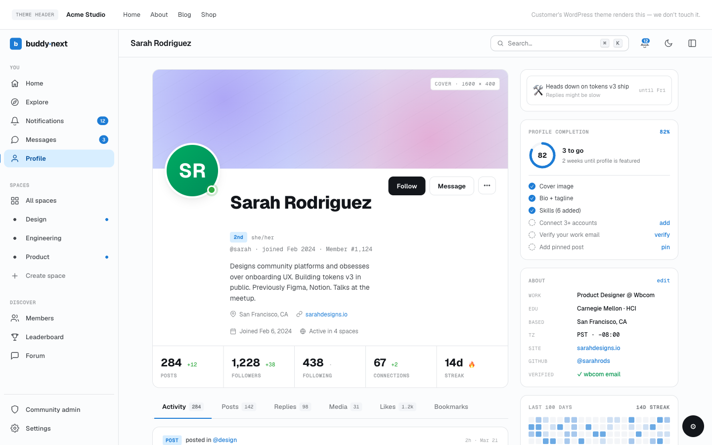
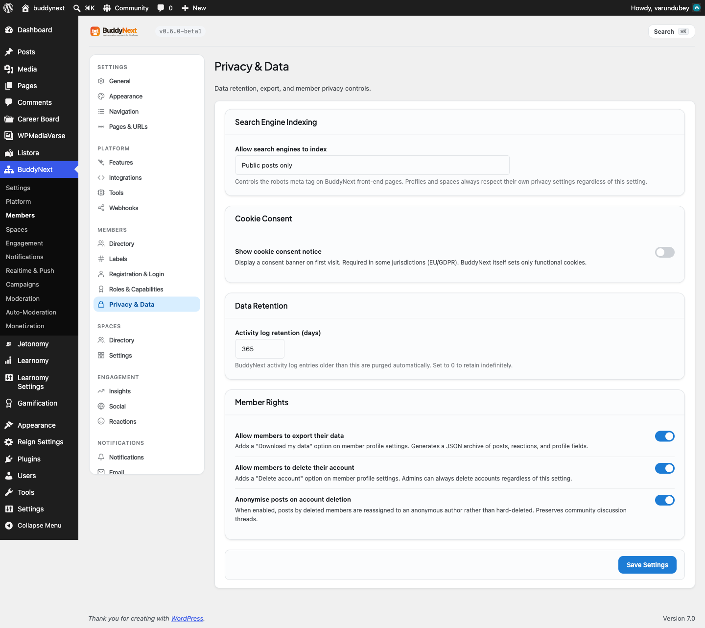

# Privacy and Data

BuddyNext gives members real control over their personal information and gives site owners the tools to run a community that respects that control. Members can download a copy of their data or delete their account at any time. Owners decide whether a cookie consent banner appears, how long inactive data is kept, whether search engines may index the community, and whether the self-service export and deletion tools are available.

These tools exist so your community can be trustworthy by default and so you can meet privacy obligations such as the GDPR without bolting on a separate plugin.

## Why it matters

People share more freely when they trust that they can get their data back and walk away cleanly. Privacy regulations such as the GDPR treat that as a right, not a courtesy: the right to access your data and the right to be forgotten. By wiring export and deletion into the member experience - and giving owners a single place to set retention and consent - BuddyNext keeps your community compliant and your members confident.

## Owner settings

These live in the admin area under Settings, in the Privacy section.

| Setting | What it controls | Default |
|---|---|---|
| Cookie consent banner | Shows a cookie consent notice to visitors so your community asks for consent before non-essential cookies. Turn on where local law requires a consent prompt. | Off |
| Data retention (days) | How many days member data is kept before it is eligible for cleanup. Use this to enforce a retention policy rather than holding data forever. | 365 |
| Allow data export | Lets members download a copy of their own data from their settings. Turning this off removes the Export control for members. | On |
| Allow account deletion | Lets members permanently delete their own account from their settings. Turning this off removes the Delete account control for members. | On |
| Search-engine indexing | Controls whether search engines may index community content. Choose the policy that matches how public you want the community to be. | Public posts |

> **Note:** Export and deletion are member rights under privacy law. Leave them on unless you have a specific reason and an alternative process for handling member requests. If you turn them off, make sure members know how else to reach you with a data request.

> **Note:** Members can also set their own profile to skip search engines from the Privacy section of their profile editor. The owner indexing setting is the community-wide policy; the per-member toggle is the individual override.

## Export my data

Members can download their own information at any time when the owner has left export enabled.

1. Open your account and go to the Privacy or Your data section.
2. Choose Export under "Export my data".
3. A file downloads with a copy of your profile, activity, and connections.

The file is a portable copy you can keep or move elsewhere. Exporting does not change or remove anything in the community - it is read-only.

## Delete my account

Members can permanently close their own account when the owner has left deletion enabled.

1. Open your account and go to the Privacy or Your data section.
2. Choose Delete account under "Delete my account".
3. Confirm. This cannot be undone.

When you delete your account, BuddyNext erases your community data - your follows, connections, blocks, preferences, posts, and comments - and then removes your account. You are signed out and returned to the home page.

> **Note:** Deleting your account is permanent. If you only want to step away, consider making your account private or muting people instead of deleting.

## What deleting an account removes

Deleting a member account is a full erasure - there is no "keep my content" option:

- Your personal profile data, preferences, follows, connections, and blocks are erased.
- Your posts and comments are permanently deleted along with the account - genuinely removed, not just hidden from view. Once the deletion runs, they are gone.

This matches the standard expectation that deleting an account removes the person and their content, rather than keeping it under another name.

## Good to know

- **GDPR alignment.** The export tool supports the right of access (members get a copy of their data), and the deletion tool supports the right to erasure (members can be forgotten). Retention and consent give owners the policy controls that privacy regimes expect.
- **What gets removed.** Deletion erases everything tied to the member: profile, preferences, follows, connections, blocks, and their own posts and comments. It is a complete erasure, not a hide, with no option to retain the content.
- **Administrators are protected.** A site administrator cannot delete their own account through the member-facing tool, so you cannot accidentally lock yourself out of your own community. Administrator accounts are managed through WordPress.
- **Consent and indexing are community-wide.** The cookie banner and the search-engine indexing policy apply to the whole community. Individual members can still choose to hide their own profile from search engines in their Privacy settings.
