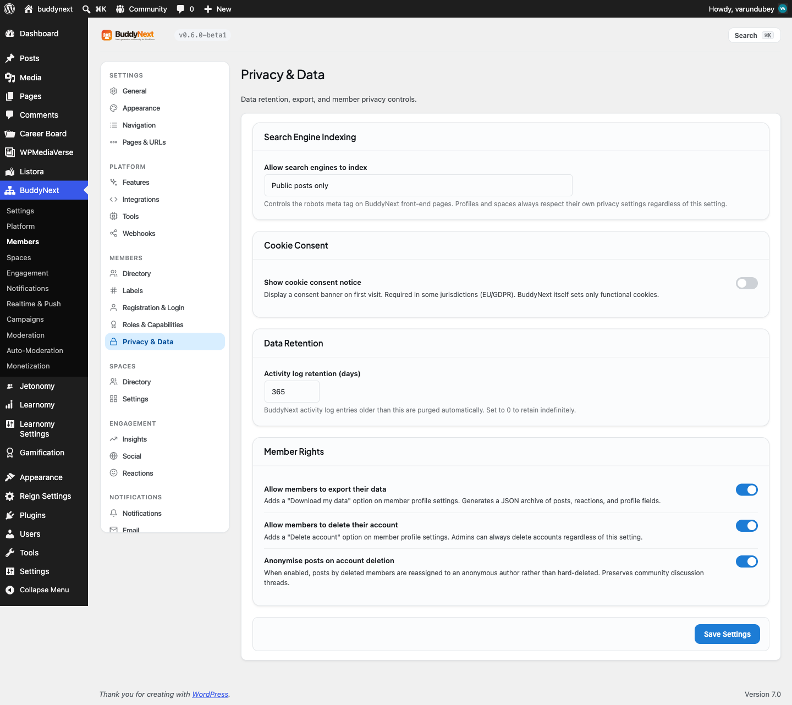

# Post Privacy and Visibility

Every post carries a privacy level that decides who can see it. Members choose the level when they post, and the community enforces it everywhere the post could appear: the feed, the Explore view, search, and the post's own permalink. This page explains each level and how it is enforced.

## Why use it

People only share honestly when they trust who is on the other side. A member who has to assume every post is broadcast to the entire internet will post less, and less openly. Per-post privacy lets the same member share a public update, a followers-only note, and a private draft from the same box, choosing the audience each time.

For owners, privacy controls are what make a community feel safe rather than exposed, which is the difference between members who participate and members who lurk. They also keep you on the right side of member expectations and data rules: a post a member marked private must stay private, with no path that leaks it into a feed, a search result, or a public permalink. Getting this right once, at read time, means every surface inherits it.

## The privacy levels

A member picks one of these audiences when posting. The first four are the choices in the composer's audience menu; the fifth applies automatically to posts made inside a space.

| Level | Who can see the post |
|-------|----------------------|
| Public | Everyone, including logged-out visitors on the Explore feed. |
| Followers | The author and any member who follows the author at the time they view it. |
| Connections | The author and the author's accepted connections. |
| Only me | The author alone. Useful for drafts and private notes. |
| Space members | For posts made inside a space, the members of that space. Hidden and secret spaces restrict this further to active members only. |

When a member does not pick a level, the post takes the community's default audience, which the owner sets (see Setting it up). Inside a space, the default audience is the space's members.

## How visibility is enforced (for members)

Visibility is checked when a post is read, not just when it is written, so the rule is always evaluated against the current relationship between the viewer and the author. The same checks run on every surface a post can appear in. When a viewer is not allowed to see a post, the community returns a "not found" or "This post is private or unavailable" response rather than revealing that the post exists or any of its contents.

The checks that apply at read time:

- **Blocked authors.** If either person has blocked the other, the post is hidden from both directions and its permalink returns "not found", so a block cannot be worked around by guessing a post URL. See Blocking and Muting for how blocks work.
- **Followers-only posts.** A followers-only post is shown to the author and to anyone following the author at view time. If a follower later unfollows, they stop seeing it.
- **Connections-only posts.** A connections-only post is shown to the author and the author's accepted connections; it never enters the public Explore feed or search.
- **Only me posts.** Visible to the author and no one else.
- **Secret and hidden spaces.** A post inside a hidden or secret space is visible only to active members of that space (and to moderators for review). Non-members get "not found", including on the permalink.
- **Suspended or shadow-banned authors.** Posts by an author who is suspended or shadow-banned are hidden from everyone except the author and moderators, across the feed, Explore, search, and permalinks. This lets moderators review the content while it is invisible to the community.

## Setting it up (for owners)

| Setting | What it does | Default |
|---------|--------------|---------|
| Default post visibility | The audience a post gets when the member does not choose one. Set it to a more private level for a closed community, or leave it public for an open one. Posts made inside a space always default to that space's members. | Public |

> **Tip:** If your community is members-only, consider setting the default post privacy to a non-public level so a member who forgets to pick an audience does not accidentally broadcast to the public Explore feed. Pair this with turning off the public Explore feed (see Activity Feed).

> **Warning:** Privacy is enforced at read time on the server, which is correct and safe, but it depends on the post carrying the right level. A post saved as public is public everywhere. When you change the default, it applies to new posts going forward, not to posts already published.

## Good to know

- **One resolver, every surface.** The feed, Explore, search, the member directory, and permalinks all apply the same most-restrictive-wins visibility rules, so a post cannot leak through one surface while being hidden on another.
- **Most-restrictive-wins.** Where more than one rule could apply (for example a followers-only post by a blocked author), the strictest outcome is used, which means hidden.
- **Public is the only level that reaches logged-out visitors.** Followers, connections, only-me, and space posts all require a signed-in viewer with the right relationship; none of them appear on the public Explore feed or in public search.
- **Editing the audience later works.** A member can change a post's audience after publishing (within the edit window described in Post Composer), and the new level takes effect immediately on the next read.

## Free vs Pro

Per-post privacy levels and their enforcement are fully part of Free. There is no Pro upgrade required to set a post's audience or to keep private content private; the visibility resolver that protects every surface is the same in both editions.
