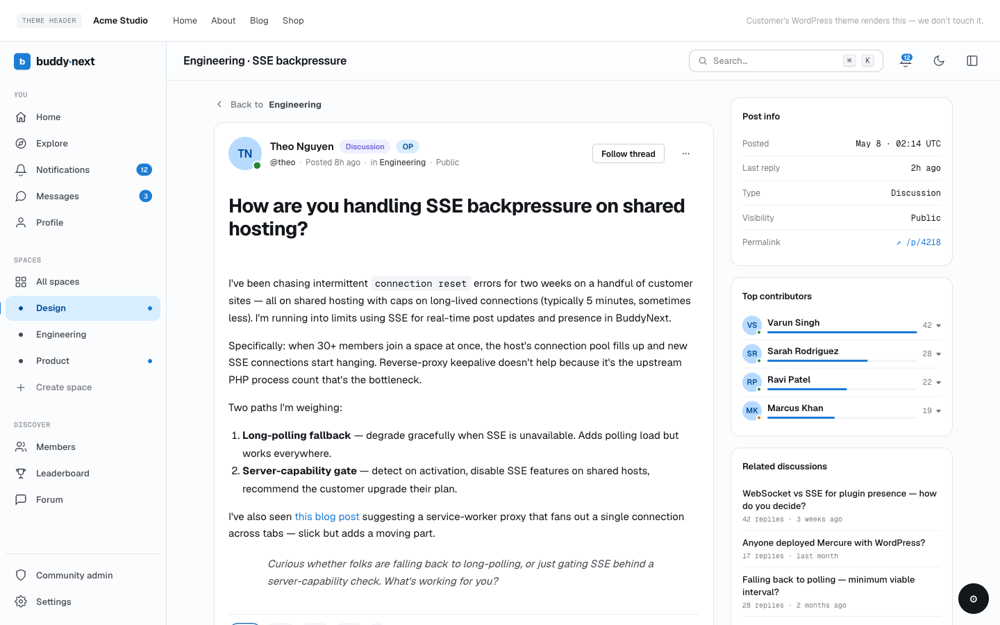

# Reactions

Reactions let members respond to a post or comment with an emoji instead of typing a reply. BuddyNext ships six reactions out of the box - like, love, haha, wow, sad, and angry.

## Why use it

A reaction is the lowest-effort way for a member to show they have seen and valued something. Most people will not write a comment, but they will tap a reaction, so reactions are where the bulk of your community's engagement actually happens. They give the author quick, visible feedback, and they give everyone else a fast read on what the room thinks.

The six reactions also carry more meaning than a single "like". Love, haha, wow, sad, and angry let a member match their response to the moment - celebrating good news, laughing at something funny, or showing sympathy on a hard post. That range is what members expect from a modern social feed, and it keeps interactions feeling human rather than mechanical.

For an owner, reactions work the moment the feature is on, with no per-post setup. They feed the rest of the platform too: the post author gets a notification, points are awarded where gamification is connected, and the activity stays lively without anyone having to write a word.

## How it works (for members)

### React to a post or comment

Open the reaction picker on any post or comment, then choose an emoji. Your reaction is recorded right away and the count next to it goes up by one.

### Swap your reaction

You get one reaction per item. If you have already reacted and you pick a different emoji, your reaction switches to the new one. The total count does not change - your single reaction simply moves from one emoji to another.

### Remove your reaction

To take your reaction back, choose the same emoji you picked before. That removes it, and the count goes down by one. You can react again at any time.

### See who reacted

Each post and comment shows a running count of reactions. Open the "who reacted" list to see the members who reacted and which emoji each of them chose, newest first.

## Setting it up (for owners)

Reactions are on by default. You can turn the whole feature off, and you can decide which of the six emoji members are allowed to use.

The feature toggle lives under Platform > Features. The reaction palette lives under the Activity Feed settings, in the Reactions block.

| Setting | What it does | Default |
|---|---|---|
| Reactions feature | Master on/off switch for reactions. When off, the reaction picker and counts are removed everywhere - on the page and over the API. Found under Platform > Features. | On |
| Reaction palette | Choose which of the six reactions (like, love, haha, wow, sad, angry) members may use on posts and comments. At least one is always kept. | All six enabled |

> **Note:** The reaction palette only takes effect while the Reactions feature is on. If you turn the feature off, the palette is disabled and shows a pointer back to the feature toggle.

> **Tip:** Trimming the palette to a smaller set (for example, removing angry) is a simple way to steer the tone of your community without disabling reactions entirely.

## Good to know

- One reaction per item. A member can hold at most one reaction on a given post or comment. Reacting again with the same emoji removes it; reacting with a different emoji swaps it.
- Counts are public. Anyone can see how many reactions an item has, including logged-out visitors. Logged-out visitors see the counts only - they cannot react, and the picker is not available to them until they sign in.
- The who-reacted list respects privacy. If a member has been restricted by the post owner, that reactor is hidden from other viewers in the list, while the overall count stays accurate.
- Reacting to your own post is allowed, but it does not notify you or award you points - the author-side follow-ups only fire when someone else reacts.
- The who-reacted list shows up to the most recent reactors for performance on busy posts.

## Free vs Pro

The six reactions, react/swap/remove, the counts, and the who-reacted list are all part of free BuddyNext.

Custom Reactions are a Pro feature. With Pro, an owner can define their own reaction emoji from the admin and add them to the set members can choose from, on top of the standard six. The combined set (the six defaults plus custom reactions) is capped so the picker stays usable. See Custom Reactions for the setup steps.
