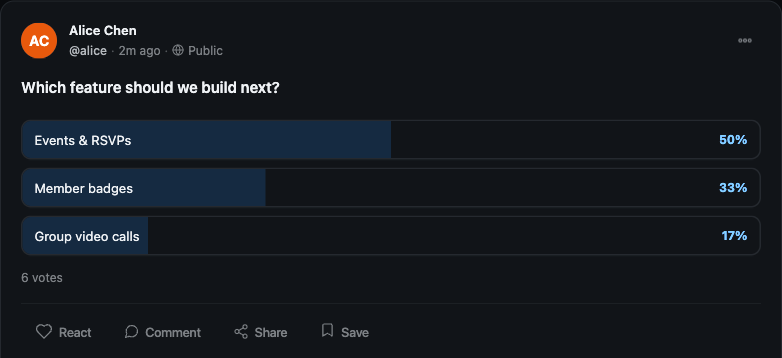

# Polls

A poll is a post that asks members a question and lets them choose from a short list of answers, then shows live results as votes come in. Members create a poll right inside the post composer, vote with one tap, and watch the percentages update in place.

## Why use it

A poll is the lowest-effort way for a member to take part in your community. Writing a comment takes thought; tapping an option takes a second. That low bar is exactly why polls drive engagement: people who would never write a reply will happily vote, and every vote is a small signal that pulls them back to see the result.

For an owner, polls turn the feed into a two-way channel. Use one to settle a decision (which feature should we build next, what time works for the next meetup), to spark a friendly debate, or just to give quiet members an easy way in. Because results update live, a poll keeps people returning to the same post over a day or two, which lifts time-on-site and gives the post far more reach than a plain text update.

## How it works (for members)

### Create a poll

1. Open the post composer at the top of the feed.
2. Switch the composer to poll mode using the poll tool.
3. Type your **question** in the main composer field. The question is required, the same as the text on any other post.
4. Fill in the answer **options**. You start with two option fields and can add more, up to a maximum of five.
5. Post it. The poll appears in the feed as a card showing the question and its options.

> **Note:** A poll needs at least two options and allows at most five. The composer will not let you post a poll with fewer than two filled-in options.

### Vote

Tap any option on the poll card to cast your vote. The card immediately switches to its results view, showing the percentage for each option, a fill bar, and the total number of votes. You get one vote per poll.

### Switch or remove your vote

You are not locked into your first choice. Tap a different option to move your vote to it, or tap the option you already chose to remove your vote entirely. The percentages and totals re-calculate each time. There is always exactly one vote per person, so switching never inflates the count.

## Setting it up (for owners)

Polls are on by default. There is a single setting that controls whether members can attach a poll to a post.

| Setting | What it does | Default |
|---------|--------------|---------|
| Allow polls | Lets members attach a poll to their posts. Turn it off to remove the poll tool from the composer for everyone. | On |

When the setting is off, the poll tool no longer appears in the composer and members post only regular text, link, and photo updates.

## Good to know

- **Minimum two, maximum five options.** Every poll must offer between two and five choices. This keeps polls quick to read and quick to answer.
- **One vote per person.** Each member can hold one vote on a poll at a time. They can switch it to another option or remove it, but they cannot stack multiple votes.
- **The question is required.** A poll posts as a normal feed post whose text is the question, so an empty question is not allowed.
- **Results are live.** There is no "submit" step and no waiting. The moment a vote lands, every viewer's card reflects the new totals on their next view.
- **No end date yet.** Polls stay open and votable for as long as the post exists. An automatic poll closing date is not available in this version, so do not rely on a poll locking itself at a set time.
