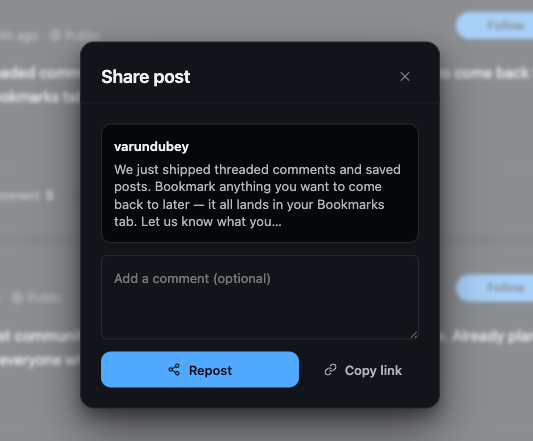

# Shares and reposts

A reshare (or repost) takes a post that someone else published and puts it back into the feed under your name, so your own followers see it. You can reshare a post as-is, or quote it by adding your own note before it goes out.

## Why use it

Resharing is how good content travels. A member finds a post worth seeing, reshares it, and now everyone who follows that member sees it too, without the original author having to do anything. That single tap is how a strong post reaches well beyond the people who happened to be scrolling when it was first published.

For an owner, reshares multiply the value of every good post and reward the members who curate. They give quieter members a way to contribute (passing along something they liked) without having to create from scratch, and they help the best content surface naturally instead of sinking down the feed. Quote reshares add a layer of conversation on top: a member can agree, push back, or add context, turning one post into a thread of viewpoints across the community.

## How it works (for members)

Every post card carries a share action. Tapping it opens a small share menu with three choices.

### Repost

Choose **Repost** to share the post exactly as it is. It appears in the feed as a reshare card crediting the original author, and the original post's share count goes up by one. This is the bare, one-tap reshare with nothing added.

### Quote

Choose **Quote** to add your own note. This opens the post composer with a link to the original post already filled in, so you can type your comment above it and publish. Your quote goes out as your own post with the original attached.

### Copy link

Choose **Copy link** to copy the post's web address to your clipboard. Use this to paste the post anywhere outside the feed - a message, an email, another site.

### View your own shares

The posts you reshare appear in your own feed as reshare cards, alongside everything else you have posted, so your shares are part of your public activity.

### Unshare

If you change your mind about a bare repost, remove it the same way you remove any of your own posts. Taking down the reshare drops the original post's share count back by one.

## Setting it up (for owners)

Resharing is on by default. One setting controls it.

| Setting | What it does | Default |
|---------|--------------|---------|
| Allow re-shares | Lets members share other members' posts to their own feed. Turn it off to remove the share action from post cards. | On |

When the setting is off, the share action no longer appears and members cannot repost or quote each other's posts.

## Good to know

- **You must be logged in.** Resharing is a member action. A logged-out visitor cannot reshare a post, so the share menu is only useful to signed-in members.
- **No resharing a reshare.** The share action is hidden on reshare cards themselves. Members share the original post, not someone else's copy of it, which keeps the credit pointing at the author and avoids endless chains.
- **Quote is a new post; repost is a bare copy.** A quote publishes as your own post with your note and a link to the original. A bare repost carries no note. Both credit the original author and both raise the original's share count.
