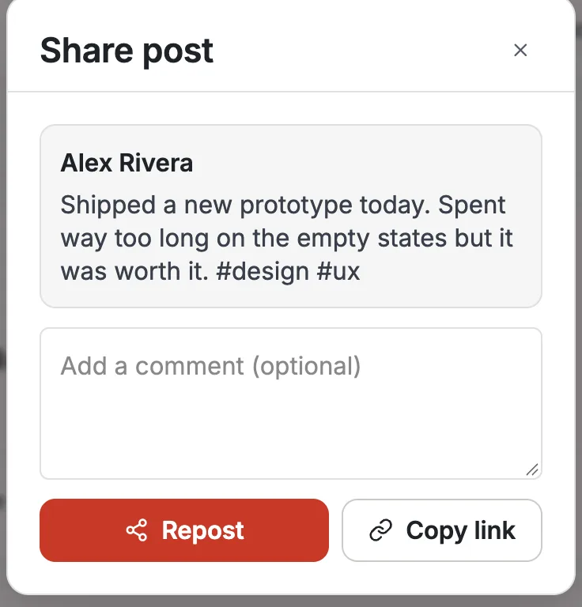

# Shares and reposts

A reshare (or repost) takes a post that someone else published and puts it back into the feed under your name, so your own followers see it. You can reshare a post as-is, or add your own note before it goes out.

## Why use it

Resharing is how good content travels. A member finds a post worth seeing, reshares it, and now everyone who follows that member sees it too, without the original author having to do anything. That single tap is how a strong post reaches well beyond the people who happened to be scrolling when it was first published.

For an owner, reshares multiply the value of every good post and reward the members who curate. They give quieter members a way to contribute (passing along something they liked) without having to create from scratch, and they help the best content surface naturally instead of sinking down the feed. Adding a comment to a reshare puts a layer of conversation on top: a member can agree, push back, or add context, turning one post into a thread of viewpoints across the community.

## How it works (for members)

Every post card carries a share action. Tapping it opens a Share dialog that previews the post and gives you an optional comment box, a **Repost** button, and **Copy link**.

### Repost

Leave the comment box empty and tap **Repost** to share the post exactly as it is. It appears in the feed as a reshare card crediting the original author, and the original post's share count goes up by one. This is the bare, one-tap reshare with nothing added.

### Repost with a comment

Type a note in the comment box before you tap **Repost**, and your note rides along with the reshare so you can agree, push back, or add context on top of the original. The reshare still credits the original author.

### Copy link

Tap **Copy link** to copy the post's web address to your clipboard. Use this to paste the post anywhere outside the feed - a message, an email, another site.

### View your own shares

The posts you reshare appear in your own feed as reshare cards, alongside everything else you have posted, so your shares are part of your public activity.

### Unshare

If you change your mind, remove your reshare. Taking it down drops the original post's share count back by one.

## Setting it up (for owners)

Resharing is on by default. One setting controls it.

| Setting | What it does | Default |
|---------|--------------|---------|
| Allow re-shares | Lets members share other members' posts to their own feed. Turn it off to remove the share action from post cards. | On |

When the setting is off, the share action no longer appears and members cannot repost or quote each other's posts.

## Good to know

- **You must be logged in.** Resharing is a member action. A logged-out visitor cannot reshare a post, so the share menu is only useful to signed-in members.
- **Sharing a reshare shares the original.** The share action is available on reshare cards too, but sharing one amplifies the original post rather than making a copy of a copy. Credit always points back to the original author, and there are no endless reshare chains.
- **One share per post.** You can reshare a given post once, with or without a comment. A second attempt is declined with "You have already shared this post." To share it again, remove your existing reshare first.
