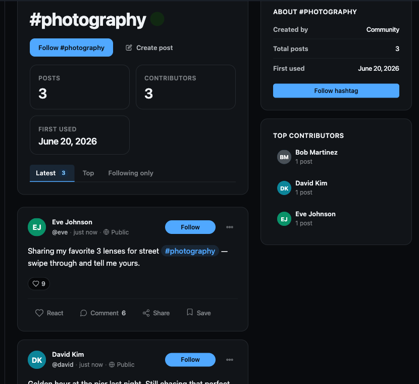

# Hashtags

Hashtags turn any word a member types with a leading `#` into a clickable, shareable topic. Every tag gets its own feed page that collects the public posts using it, a follow button, and a place in the trending list so members can discover what the community is talking about right now.

## Why use it

A growing community produces more posts than any one person can read. Hashtags give members a lightweight way to file a post under a topic without choosing a category from a dropdown - they type `#welcome` or `#release` mid-sentence and the tag does the rest. For the people reading, a hashtag is a one-tap path from a single post into every public post on that subject, and the trending list surfaces the topics gaining momentum in the last day.

For an owner, hashtags are discovery you do not have to curate. You do not build the topic list - members build it by posting, and the trending list keeps the most active topics visible on the Explore page and in the Trending Hashtags block. When a topic matters to a member, they can follow the hashtag and keep an eye on its feed. The result is a community that organizes itself around the conversations people actually care about.

## How it works (for members)

### Writing hashtags

Type `#` followed by letters, numbers, hyphens, or underscores anywhere in a post or comment - for example `#wordpress` or `#product-update`. When the post is saved, BuddyNext finds each tag, creates it automatically if it does not exist yet, links the post to it, and renders the tag as a clickable link in the post. There is no separate "add a tag" step and no limit list to pick from - the tag is created the first time anyone uses it.

The same linking happens in comments, so a `#tag` in a reply is clickable too.

### The `#` autocomplete in the composer

As you type a `#` and start a word in the post composer, BuddyNext shows a short list of matching existing hashtags. Pick one to finish the tag without typing it in full and to reuse a tag the community already uses rather than creating a near-duplicate. You can always ignore the suggestions and type a brand-new tag.

### The hashtag feed page

Click any rendered hashtag to open its own feed page. The page shows:

- A hero with the tag name, its post count, and a follow button.
- The public posts that use the tag, newest first.
- A sidebar with details about the tag and related topics.

This page is the single destination for a topic - share its link and anyone can open it.

### Following and unfollowing a hashtag

On a hashtag feed page, use the follow button to follow the tag. Following is a single tap, and the button switches to an unfollow state immediately; tap it again to unfollow. Following a hashtag adds you to its follower count and signals interest in the topic.

> **Note:** Following and unfollowing are separate actions behind the button - following adds you, unfollowing removes you, and the state persists when you reload the page.

### Trending hashtags

The trending list ranks hashtags by how active they have been over a rolling 24-hour window, so it reflects what the community is discussing today rather than all-time totals. You will see trending hashtags on the Explore page and anywhere an owner has placed the Trending Hashtags block.

## Setting it up (for owners)

Hashtags are on by default. The feature and its banned-tag list are controlled from the BuddyNext settings.

| Setting | What it does | Default |
|---|---|---|
| Hashtags feature | Turns the whole hashtag system on or off. When off, `#tags` stay as plain text everywhere (posts and comments) - no clickable links, no feed pages, no trending list. | On |
| Banned hashtags | A list of tags to block. A banned tag is stripped when a post is processed, so it never becomes a clickable link or a feed page. | Empty (nothing blocked) |

### The Trending Hashtags block

Add the Trending Hashtags block to any page, post, or block-themed template to show the current trending tags. In the block editor, look for the Trending Hashtags block in the BuddyNext block category. The block has two controls:

| Setting | What it does | Default |
|---|---|---|
| Count | How many trending hashtags to show. | Block default |
| Display | How the list is presented (for example a compact list or a fuller layout). | Block default |

## Good to know

- **Tags are case-normalized to lowercase.** `#WordPress`, `#wordpress`, and `#WORDPRESS` all resolve to the same tag - there is never a near-duplicate from capitalization, and they all share one feed and one count.
- **The hashtag feed is public-only.** A tag's feed page lists only public posts. Posts limited to a space or to a narrower audience do not appear on the public hashtag feed, even though their `#tag` is still clickable inside the post.
- **Tags are created on first use.** You never pre-create a hashtag; the first post or comment to use it creates it.
- **Turning the feature off is safe.** Existing `#tags` simply render as plain text - no broken links are left behind.
- **An empty or quiet topic** still has a feed page; it just shows no posts (or no trending entry) until members start using the tag.

## Free vs Pro

Hashtags - auto-creation, the feed page, follow and unfollow, the 24-hour trending list, the `#` autocomplete, and the Trending Hashtags block - are all part of free BuddyNext. There is no separate Pro hashtag feature; Pro adds value elsewhere in the platform.
