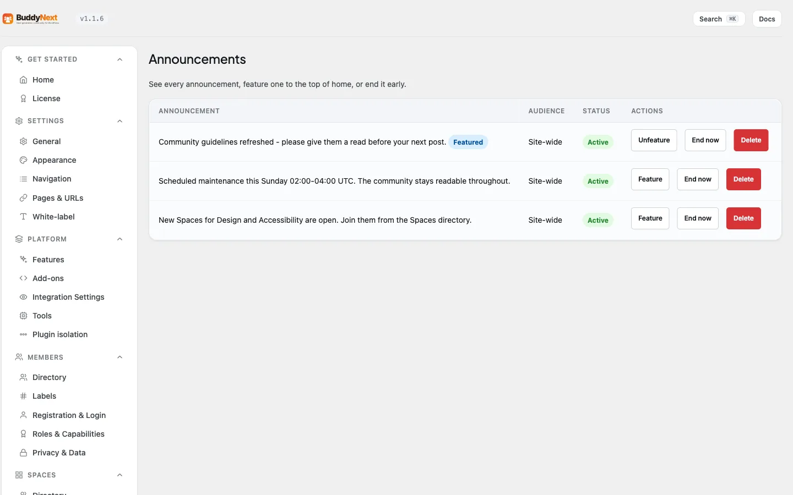

# Announcements

An announcement is an admin post that pins to the top of every member's home feed until each member dismisses it. It is the one message you can be confident reaches everyone, regardless of who they follow.

## Why use it

Normal feed posts only reach people who follow you or share a space with you. An announcement ignores the follow graph: it surfaces above all other activity on the first page of every member's home feed, so a notice lands in front of the whole community at once.

Reach for an announcement when the message is for everyone and timing matters - scheduled maintenance, a new feature, community guidelines, an event, or an important policy change. Each member can clear it once they have seen it, so it does its job without permanently cluttering the feed. For the site owner, it is the closest thing to a community-wide broadcast that still lives inside the feed members already read.

## How it works (for members)

Members do not create announcements. From a member's point of view there are two things to know.

### Seeing an announcement

When an administrator posts an announcement, it appears as the first item on the first page of your home feed. It shows even if you do not follow the person who posted it. The same announcement appears for every member, so everyone sees the same notice.

### Dismissing an announcement

Each announcement can be dismissed. Once you dismiss it, it never appears at the top of your feed again - the dismissal is recorded against your own account only, so clearing it for yourself does not clear it for anyone else.

> **Note:** Dismissing an announcement does not delete the post. The underlying post stays in the feed as an ordinary post; it simply stops being pinned to the top for you.

## Creating an announcement (for administrators)

Only site administrators can create an announcement. Space owners, space moderators, and ordinary members cannot - there is no per-space announcement and no delegated "announcer" role.

To create one, post to the feed as you normally would, with the post marked as an announcement. The post is published immediately and pinned to the top of every member's home feed.

### Ending an announcement

An administrator can end an announcement at any time from the Engagement → Announcements admin tab, which lists every announcement and offers an **End now** action (and a control to feature one to the top). Ending it removes the pin so the post stops appearing at the top of members' feeds, while the post itself stays in the feed as a normal post. Only administrators can end an announcement.

> **Tip:** Ending an announcement is the clean way to retire a notice once it is no longer relevant. You do not have to delete the post to stop it pinning - end it and it becomes an ordinary feed post.

## Good to know

- **One announcement is pinned at a time.** By default the most recently created live announcement is the one pinned to the top of the feed; older ones drop back to being ordinary posts. An administrator can override this by featuring a specific announcement from the Engagement → Announcements admin tab, and that featured notice then leads the feed (even if a newer announcement exists) until it is dismissed, ended, or expires. To keep a single, clear community notice at the top, post one announcement at a time or feature the one you want.
- **Only administrators create or end announcements.** A member who tries to create one is refused. The capability is the standard WordPress administrator capability.
- **Dismissal is per member.** One member dismissing an announcement has no effect on what other members see.
- **The post is never lost.** Both dismissing (member) and ending (admin) only change whether the post is pinned. The post remains in the feed.

## Free vs Pro

| Capability | Free | Pro |
|---|---|---|
| Admin announcement pinned to every member's home feed | Yes | Yes |
| Per-member dismiss | Yes | Yes |
| Admins end an announcement | Yes | Yes |
| Announcements pinned at once | One (newest, or the admin-featured one) | One (newest, or the admin-featured one) |

Announcements themselves work the same in Free and Pro. Pro adds a separate capability for ordinary feed posts: it lifts Free's single-pinned-post limit so up to 10 posts can be pinned at once (on a profile). That pinned-post feature is distinct from the site-wide announcement above. (Pinning is profile-only; inside a space, use an Announcement to feature a post.)
