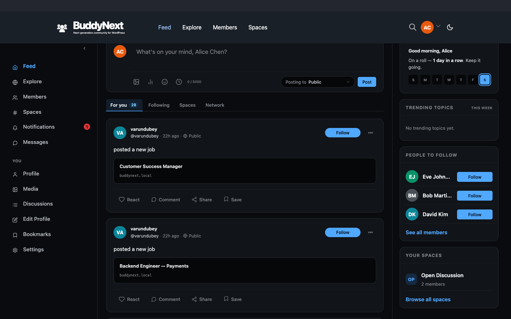
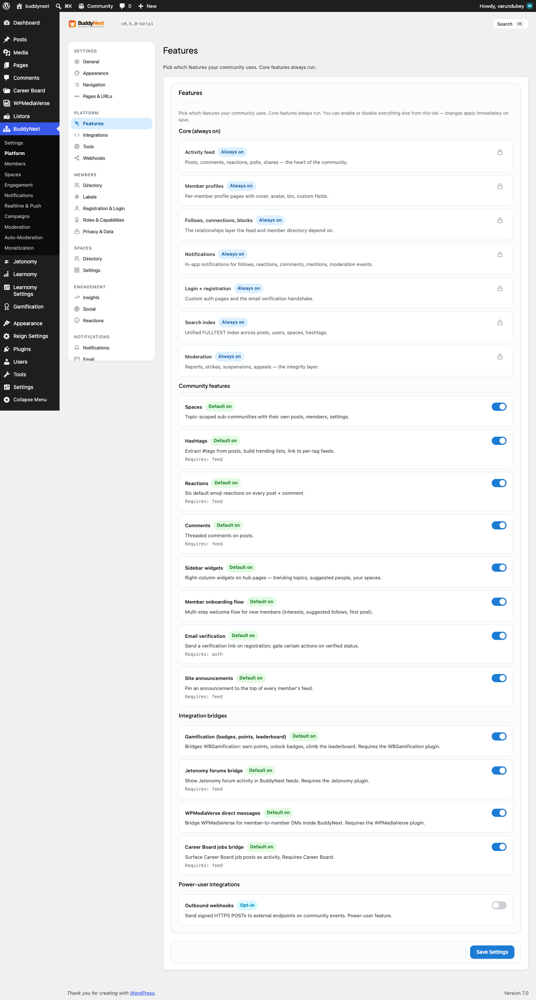

# Sidebar widgets

The sidebar is the right-hand column on community hub pages. It shows a set of discovery cards - trending topics, people to follow, and spaces - populated automatically from your community's own activity. There is nothing to fill in; the cards keep themselves current.

## Why use it

A community grows when members find new people to follow, new spaces to join, and new conversations to read. The sidebar puts those next steps in front of members on the pages they already visit, without anyone having to curate them. The trending card shows what the community is talking about right now, the people card suggests members worth following, and the spaces card surfaces places to join or discover.

For the site owner, this is discovery and retention working in the background. A member who lands on the directory or a space page is gently pointed toward more of the community, which keeps people moving through it instead of hitting a dead end. Because every card is built from live data, the sidebar stays relevant as the community changes - no manual upkeep.

## How it works (for members)

The sidebar appears on hub pages such as the member directory and the spaces directory. What a member sees depends on whether they are signed in.

### For signed-in members

A signed-in member sees, from the top:

- **A greeting and streak card** - a personal welcome with their activity streak.
- **This week** - upcoming events for the week ahead.
- **Trending topics** - the most-used hashtags across the community right now, so members can jump into active conversations.
- **People to follow** - up to three suggested members to follow. Suggestions exclude the member, anyone they already follow, and anyone involved in a block (in either direction). Each suggestion shows a follow control.
- **Your spaces** - up to four spaces the member belongs to, ordered by size.

### For guests (not signed in)

Guests see a reduced sidebar. The trending topics card and an upcoming-events card still show, and instead of personal suggestions the spaces card shows **Discover spaces** - the most popular open spaces. Guests do not see the greeting, the people-to-follow card, or a personal "your spaces" list, because those need a signed-in member.

## Setting it up (for owners)

The sidebar is on by default and needs no configuration. The one control is a single on/off toggle in the admin settings, under the Features tab.

| Setting | What it does | Default |
|---|---|---|
| Sidebar widgets | Turns the whole sidebar feature on or off. When on, hub pages show the discovery cards - trending topics, suggested people, and spaces. When off, those cards stop being populated and render nothing. | On |

There are no per-card settings. The number of items each card shows is fixed: up to 5 trending topics, up to 3 suggested people, and up to 4 spaces. The only owner control is the single toggle above.

> **Note:** The toggle controls the data-driven discovery cards (trending, people, spaces). It is the one switch that turns the sidebar's automatic content on or off.

## Good to know

- **Guests see less.** People-to-follow suggestions and a personal spaces list need a signed-in member, so guests get the trending card, an events card, and a "discover spaces" list of popular open spaces instead.
- **Cards fill themselves from live data.** Trending topics come from how often hashtags are used; suggested spaces come from member counts. As the community grows, the cards update on their own.
- **Empty is normal on a new site.** Until there are hashtagged posts, members to suggest, or spaces to join, a card shows its empty state rather than fabricated content. The cards fill in as activity builds.
- **Trending refreshes frequently.** The trending topics card is cached briefly and refreshes about once a minute, so it reflects current activity without re-querying on every page load.
- **Private and secret spaces stay private.** The guest "discover spaces" list only ever shows open spaces; it never reveals private or secret ones.

## Free vs Pro

The sidebar and all its discovery cards are part of Free. There is no separate Pro version of the sidebar - the same trending, people, and spaces cards work the same on Free and Pro sites.
