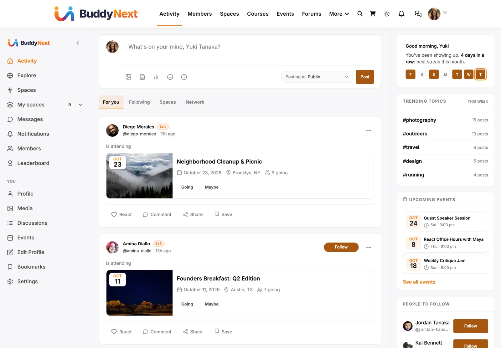

# Feature Groups and Tiers

BuddyNext is plug-and-play: every Layer 2 feature is a self-contained module that the site owner can turn on or off, and a developer can override by filter. This page documents the tier system that governs which features are active, the Free feature catalogue, the Pro entries that join it, and their tiers, and how toggling a feature removes its routes, templates, options, and admin pages together.




The source of truth is `BuddyNext\Core\FeatureRegistry` (`includes/Core/FeatureRegistry.php`), resolved through the `features` container key.

## The three tiers

| Tier | Default state | Can the owner disable it? | How it resolves |
|---|---|---|---|
| `mandatory` | On | No - no toggle, no disable filter | `is_enabled()` returns `true` immediately. |
| `default_on` | On | Yes (Settings -> Features) | Tier default `true`, overridable by the stored option, then by a per-feature filter. |
| `opt_in` | Off | Yes - owner must enable it | Tier default `false`, then the stored option / filter can turn it on. |

`FeatureRegistry::is_enabled( $slug )` resolves in this order (first match wins):

1. Unknown slug -> `false`.
2. Mandatory tier -> always `true`.
3. Any unmet dependency in `depends_on` -> forced `false`.
4. An absent partner plugin -> forced `false` (`presence_met()`). No catalogued feature has an external dependency today, so this returns `true` for every slug; it is the seam a future partner-wrapping feature uses.
5. A feature with a `state_from` callback reports that callback's state and stops here (today only `messages`, whose switch lives in WPMediaVerse).
6. Tier default (`default_on` = true, `opt_in` = false), overridden by the stored `buddynext_features` option if the owner set it.
7. The per-feature filter `buddynext_feature_{slug}` returns the final boolean.

```php
// Programmatic overrides (the filter wins over the stored option).
add_filter( 'buddynext_feature_sidebar', '__return_false' );   // force-disable
add_filter( 'buddynext_feature_webhooks', '__return_true' );   // force-enable

// Resolve a feature's state in code.
if ( buddynext_service( 'features' )->is_enabled( 'hashtags' ) ) {
    // hashtag indexing is active
}
```

Mandatory features cannot be persisted off: `clean_state()` drops them from any saved toggle map. Dependencies cascade - `hashtags`, `reactions`, `comments`, and `announcements` all depend on `feed`, and `verification` depends on `auth`, so disabling a dependency forces its dependents off too.

## The feature groups

Free's registry catalogs 22 features, organized into display groups (`core`, `community`, `integrations`) for the Settings -> Features UI. Tiers below are read straight from `FeatureRegistry::catalog()`. Pro adds 13 more entries through the `buddynext_features` filter; they are listed in the next section.

| Feature slug | Tier | Display group | Depends on | What it covers |
|---|---|---|---|---|
| `feed` | mandatory | core | - | Posts, comments, reactions, polls, shares - the heart of the community. |
| `profile` | mandatory | core | - | Per-member profile pages (cover, avatar, bio, custom fields). |
| `social_graph` | mandatory | core | - | Follows, connections, blocks - the relationships layer. |
| `notifications` | mandatory | core | - | In-app notifications for follows, reactions, comments, mentions, moderation. |
| `auth` | mandatory | core | - | Custom login + registration pages and the email-verification handshake. |
| `search` | mandatory | core | - | Unified FULLTEXT index across posts, users, spaces, hashtags. |
| `moderation` | mandatory | core | - | Reports, strikes, suspensions, appeals - the integrity layer. |
| `spaces` | mandatory | community | - | Topic-scoped sub-communities with their own posts, members, settings. Always on: member, profile and URL paths resolve spaces, so it cannot be toggled off. |
| `hashtags` | default_on | community | feed | Extract #tags, build trending lists, per-tag feeds. |
| `reactions` | default_on | community | feed | Emoji reactions on posts and comments. |
| `comments` | default_on | community | feed | Threaded comments on posts. |
| `sidebar` | default_on | community | - | Right-column hub widgets (trending, suggested people, your spaces). |
| `onboarding` | default_on | community | - | Multi-step welcome flow for new members. |
| `verification` | default_on | community | auth | Send a verification link on registration; gate actions on verified status. |
| `announcements` | default_on | community | feed | Pin an announcement to the top of every member's feed. |
| `bookmarks` | default_on | community | - | Let members save posts to a private Bookmarks list. |
| `polls` | default_on | community | feed | Attach a poll to a post and vote in the feed. |
| `shares` | default_on | community | feed | Re-share another member's post into your own feed. |
| `messages` | default_on | community | - | Direct messages, run by WPMediaVerse. Its state is read from WPMediaVerse (`state_from`), not stored by BuddyNext. |
| `pwa` | default_on | community | - | Installable app: manifest and service worker. |
| `scheduled-posts` | default_on | community | feed | Compose a post now and publish it at a chosen time. A Free feature. |
| `webhooks` | opt_in | integrations | - | Outbound signed HTTPS POSTs to external endpoints on community events. |

### Pro entries

Pro merges these into the same catalogue (`buddynext-pro` `Core\ProFeatures` and `Membership\MembershipPages::add_feature`), so each Pro capability has exactly one switch in Settings -> Features. Self-contained capabilities ship `default_on`; ones that need an external server or credential ship `opt_in`.

| Feature slug | Tier | Display group |
|---|---|---|
| `monetization` | opt_in | monetization |
| `white-label` | default_on | branding |
| `member-labels` | default_on | members |
| `broadcast` | default_on | campaigns |
| `drip` | default_on | campaigns |
| `mod-rules` | default_on | moderation |
| `bulk-mod` | default_on | moderation |
| `custom-reactions` | default_on | engagement |
| `analytics` | default_on | intelligence |
| `realtime` | opt_in | delivery |
| `push` | opt_in | delivery |
| `ai` | opt_in | intelligence |
| `ai-moderation` | opt_in | moderation |

None of the Pro entries declares `depends_on`.

> **Note:** The registry groups features for the admin UI; a feature is not a 1:1 owner of a route prefix, template folder or option. Trust the registry for tiers and the source for the route, template and option inventory.

## What a feature group binds

Each feature group ties together four kinds of surface. Examples:

- **Routes** - REST endpoints under `buddynext/v1`. `feed` owns `/feed/home`, `/feed/explore` and `/feed/announcements/{id}/dismiss`, among others; `spaces` and `webhooks` own their own route groups. Note: `REST/Router` registers its controllers unconditionally; only `webhooks` is wrapped in an `is_enabled()` check. A toggleable feature is disabled at the UI + hub layer (nav hidden, hub route redirected - see below), not by unregistering its REST controller, so its endpoints still answer for a direct API caller. Enforce a disabled feature's access rule in the controller's permission callback, never by assuming the route is absent.
- **Templates** - the hub templates and partials the feature renders. `spaces`, `profile` and `sidebar` each have their own template folders. A disabled feature's templates are never reached because the route or the `Container::has()` guard short-circuits first.
- **Options** - the settings the feature persists. Examples: `spaces` -> `buddynext_space_creation_role`, `buddynext_space_max_sub_spaces`, `buddynext_notif_default_space_join`; `reactions` -> `buddynext_enabled_reactions`; `hashtags` -> `buddynext_banned_hashtags`; `comments` -> `buddynext_notif_default_comment`; `webhooks` -> `buddynext_webhook_secret`.
- **Admin pages** - the dedicated wp-admin screens. `spaces` registers one (`buddynext-spaces`); the other features expose their settings inside the shared BuddyNext settings tabs rather than a standalone page.

The wiring lives in `Plugin::register_services()` and `Plugin::init()`. A feature binds its services only when the registry reports it enabled, and its listener is wired only when the binding exists:

```php
// In register_services(): bind the Service + Cache only when enabled.
if ( $features->is_enabled( 'sidebar' ) ) {
    $container->bind( 'sidebar_cache', fn() => new \BuddyNext\Sidebar\WidgetCache() );
    $container->bind( 'sidebar_widgets', fn( $c ) =>
        new \BuddyNext\Sidebar\WidgetService( $c->get( 'sidebar_cache' ) ) );
}

// In init(): wire the listener only when the binding exists.
if ( $container->has( 'sidebar_widgets' ) ) {
    ( new \BuddyNext\Sidebar\WidgetListener( $container->get( 'sidebar_cache' ) ) )->register();
}
```

## How toggling a feature removes its UI and REST surface

Turning a toggleable feature off removes it from the member's path - the nav links and the hub route - so a member never lands on a half-disabled page. BuddyNext enforces this at these points:

1. **Service + listener may not bind.** A feature whose Service/Cache is registered behind an `is_enabled()` guard in `register_services()` (e.g. `sidebar`, `webhooks`) leaves its container keys unregistered when off, so nothing downstream resolves them. Not every feature is wired this way - many controllers are plain and always constructed.
2. **REST controllers mostly register unconditionally.** `REST/Router::register_routes()` constructs every controller regardless of feature state; only `webhooks` is gated by `is_enabled('webhooks')`. So a disabled feature's endpoints usually still respond to a direct API caller - the toggle is a UI/hub control, not a route kill-switch. A route that must be closed when its feature is off enforces that in its own permission callback.
3. **Hub routes redirect.** `PageRouter::dispatch_hub_template()` re-checks the registry for the toggleable hubs and bounces visitors away from a disabled surface. For example, when a toggleable hub is off, its `/hub/` path redirects to the activity hub; the same guard protects `onboarding`, the `hashtags` per-tag feed, and (via `MessagesData::entry_enabled()`) the `wpmediaverse`-backed messages hub. (`spaces` is mandatory, so it is never in this set.)

Templates that optionally use a feature follow the plug-and-play degradation pattern - check `Container::has()`, and fall back to an empty result when the feature is absent:

```php
$widgets = function_exists( 'buddynext_service' )
    && \BuddyNext\Core\Container::instance()->has( 'sidebar_widgets' )
        ? buddynext_service( 'sidebar_widgets' )
        : null;

$trending = ( null !== $widgets ) ? $widgets->trending_hashtags( 5 ) : array();
```

The minimal-mode contract is the floor: with every `default_on` and `opt_in` feature disabled, Core plus the mandatory features must still deliver a working community - login/register, posts, direct follow, basic notifications, and search. If disabling a feature breaks any of those, that feature was misplaced in Layer 2 and belongs in Core.

## Extending the catalog

Third-party plugins register their own features under the same contract via the `buddynext_features` filter. Each entry uses the registry's shape (`slug`, `tier`, `group`, `depends_on`, and a translatable `label`/`description` supplied at the same time), after which it participates in the Settings -> Features UI, the `buddynext_feature_{slug}` override filter, and the same enable/disable resolution as the built-in features.

## Notes

- The Pro plugin (`BuddyNextPro`) layers its own modules on top of these free features - Membership, AI, Realtime, Push, Analytics, White-label, and enhancements to Reactions/Feed/Moderation/Members/Profile/Search. Each Pro capability that can be switched off registers one entry in the shared catalogue through the `buddynext_features` filter (see Pro entries above), so the owner finds every switch in Settings -> Features; the modules themselves boot at `plugins_loaded:20` and extend Free through the documented hooks and container rebinding.
- Read tiers from `FeatureRegistry::catalog()` - it is the only inventory, and it includes any entry added through the `buddynext_features` filter. Read it on a running site with `buddynext_service( 'features' )->catalog()`.
