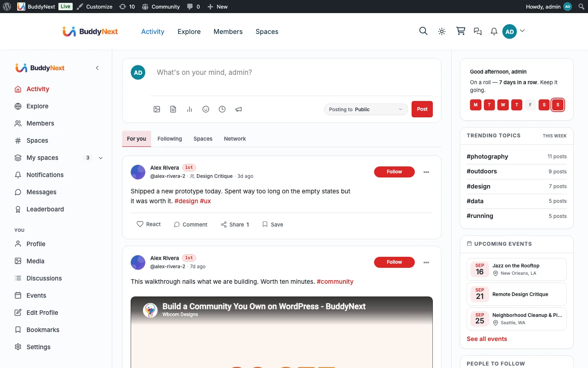

# REST: Feed, Posts, Reactions, and Comments

Reference for the feed, post-lifecycle, poll, share, bookmark, content-warning, reaction, and comment routes under the `buddynext/v1` namespace. These are the surfaces an app or custom client uses to read timelines and create or act on content.



## Contract

All routes in this page live under the `buddynext/v1` namespace and follow the conventions described in the BuddyNext REST Contract page (envelope, authentication, nonce, and cursor pagination). Read that page first; this page documents only the routes and their request/response shapes.

In short:

- Authentication is the standard WordPress REST cookie + `X-WP-Nonce` header for first-party clients, or an application password for external clients.
- Write routes require an authenticated user (`require_auth`); the controller returns a `401 rest_not_logged_in` when the caller is a guest.
- Feed reads use cursor pagination via `?cursor=` and `?per_page=` (max 50). List reads on comments and shares use `?page=` and `?per_page=`.
- Several feed routes are additionally gated by an owner setting (`buddynext_public_explore`): when a guest hits explore while that option is off, the route returns `401 rest_explore_members_only`.
- Reactions and Comments writes are gated by their feature switch (Platform > Features). When the feature is off the toggle/create routes return `403`.

> **Note:** The `Auth` column below reflects the route's `permission_callback`. A value of `auth` means an authenticated user is required; `public` means the route is readable by guests; `admin` means `manage_options`; `moderator` currently resolves to `manage_options`. Capability checks inside a handler (for example the role-mapped `buddynext-feed/create-post` check on post creation) are noted under the relevant route.

## Feed routes

The feed controller serves the home, explore, profile, and space timelines, plus the lightweight count endpoints the client polls for the "new posts" pill.

| Method | Path | Auth | Purpose |
|---|---|---|---|
| GET | `/feed/home` | auth | Home timeline for the current user. Accepts `?filter=` (one of the home filters, default `for-you`). |
| GET | `/feed/counts` | auth | Per-tab unread/seen counts for the home feed. |
| GET | `/feed/new-count` | auth | Number of new posts since `?after_id=`, for the "new posts" pill. Accepts `?filter=`. |
| GET | `/feed/viewer-state` | auth | Batch the viewer's reaction/bookmark/vote state for a set of posts. Requires `?post_ids=` (comma-separated IDs; the batch is capped at 100). |
| GET | `/feed/explore` | public* | Community-wide explore deck. Guests allowed only when `buddynext_public_explore` is on. |
| GET | `/feed/home/page` | auth | Next page of the home feed (cursor pagination). Accepts `?filter=`. |
| GET | `/feed/explore/page` | public* | Next page of the explore feed (cursor pagination). |
| GET | `/users/(?P<id>[\d]+)/feed` | public | A member's profile timeline. Private posts are filtered server-side by the viewer's relationship. |
| GET | `/spaces/(?P<id>[\d]+)/feed` | public | A space's timeline. Secret spaces are gated to members server-side. |
| GET | `/feed/announcements` | auth | The active announcements the viewer should see: the site-wide announcement plus one per space the viewer belongs to, each respecting the viewer's dismissals and expiry. |
| POST | `/feed/announcements/(?P<id>[\d]+)/dismiss` | auth | Dismiss a pinned announcement for the current user only. |
| POST | `/feed/announcements/(?P<id>[\d]+)/end` | auth | End an announcement for everyone. The handler requires `manage_options` (admin action). |

`*` The explore routes use the `require_public_explore` gate: logged-in members always pass; guests pass only when `buddynext_public_explore` (default on) is enabled, otherwise they receive `401 rest_explore_members_only`.

## Post routes

Post create/read/update/delete plus pin and the link-preview helper.

| Method | Path | Auth | Purpose |
|---|---|---|---|
| POST | `/posts` | auth | Create a post. Role-mapped: a feed post needs `buddynext-feed/create-post`; a space post needs `buddynext-spaces/post` (with `space_id` context); scheduling additionally needs `buddynext-feed/schedule-post`. |
| GET | `/posts/(?P<id>[\d]+)` | public | Read a single post (visibility enforced server-side). |
| PUT | `/posts/(?P<id>[\d]+)` | auth | Update a post (owner only, enforced in the handler). Body: any of `content`, `privacy`, `content_warning`, `content_warning_type`, `scheduled_at`. Passing `scheduled_at` is a **reschedule** and additionally requires `buddynext-feed/schedule-post` - see below. |
| DELETE | `/posts/(?P<id>[\d]+)` | auth | Delete a post (owner only, enforced in the handler). |
| POST | `/posts/(?P<id>[\d]+)/pin` | auth | Pin a post (owner action). |
| DELETE | `/posts/(?P<id>[\d]+)/pin` | auth | Unpin a post (owner action). |
| GET | `/me/pending-posts` | auth | The current member's own posts held for approval. Accepts `?per_page=` (1-100). |
| GET | `/link-preview` | auth | Resolve link-preview metadata for a `?url=`. Gated by the `buddynext_enable_link_preview` setting. |

### Scheduling and rescheduling

`scheduled_at` is accepted on **both** `POST /posts` (schedule at creation) and `PUT /posts/{id}` (reschedule an existing scheduled post). Both require the `buddynext-feed/schedule-post` capability, on top of the normal create/edit gate - otherwise `PUT` would be a back door into scheduling for anyone who can edit.

- **Format: UTC, `Y-m-d H:i:s`.** The column `bn_posts.scheduled_at` is stored in UTC and the API speaks UTC. The **UI** is what speaks site time: the composer and the edit control render a `datetime-local` in the site's timezone (WP's Settings -> General zone), name the zone in their label, and convert to UTC before they call the API. Clients doing their own conversion should use the site offset the feed state exposes rather than the browser's, or an author in IST picks `12:50` and the card answers `7:20 am` - the same instant, two numbers, which reads as a bug.
- A `POST /posts` carrying a future `scheduled_at` is saved with `status = 'scheduled'` (not live), and the response omits the rendered `html` card.
- A **reschedule** only applies to a post whose status is still `scheduled`. `PostService::update()` refuses anything else with `409 not_scheduled`, so the edit form cannot drag an already-published post back out of the feed.
- A past or unparseable time is refused with `400 schedule_in_past` / `400 invalid_schedule`.
- A successful reschedule re-arms the publisher cron (`buddynext_publish_scheduled`). This matters when a post is moved **earlier**: without the re-arm the cron would still be sitting on the old, later time and the post would miss its slot.

The related service seams - `PostService::set_schedule()`, `clear_schedule()`, `publish_scheduled_now()` - own the `status` / `scheduled_at` write so a scheduled-posts UI does not have to touch the table directly. They are PHP-level; Free exposes no separate REST route for them.

### Poll routes

| Method | Path | Auth | Purpose |
|---|---|---|---|
| POST | `/posts/(?P<id>[\d]+)/vote` | auth | Cast (or change) the current user's vote on a poll post. |
| GET | `/posts/(?P<id>[\d]+)/poll` | public | Poll options and their vote counts. |
| GET | `/posts/(?P<id>[\d]+)/my-vote` | auth | The current user's vote on this poll, if any. |

### Share routes

| Method | Path | Auth | Purpose |
|---|---|---|---|
| POST | `/posts/(?P<id>[\d]+)/share` | auth | Repost a post, with optional `content` quote text. |
| DELETE | `/posts/(?P<id>[\d]+)/share` | auth | Remove the current user's repost of a post. |
| GET | `/me/shares` | auth | The current user's share history. Accepts `?page=` and `?per_page=` (1-100). |

### Bookmark routes

| Method | Path | Auth | Purpose |
|---|---|---|---|
| POST | `/posts/(?P<id>[\d]+)/bookmark` | auth | Bookmark a post. Gated by the `buddynext_allow_bookmarks` setting. |
| DELETE | `/posts/(?P<id>[\d]+)/bookmark` | auth | Remove a bookmark. Gated by `buddynext_allow_bookmarks`. |
| GET | `/me/bookmarks` | auth | The current user's bookmarks. Accepts `?expand=posts` to hydrate full post objects (default returns IDs), plus `?per_page=`. |

### Content-warning routes

The content-warning state is owned by the moderation surface, not the post controller.

| Method | Path | Auth | Purpose |
|---|---|---|---|
| GET | `/posts/(?P<id>[\d]+)/content-warning` | public | Read a post's content-warning flag and type. |
| PUT | `/posts/(?P<id>[\d]+)/content-warning` | admin | Set or clear a post's content warning. Body: `content_warning` (bool, required) and `content_warning_type` (one of `nsfw`, `spoilers`, `violence`, `language`; default `nsfw`). |

> **Note:** A member can also set a content warning at creation time via the `content_warning` and `content_warning_type` fields on `POST /posts`. The PUT route above is the admin override that toggles it after the fact.

## Reaction routes

Reactions attach to any object identified by `object_type` + `object_id` (for example `post` + the post ID, or `comment` + the comment ID).

| Method | Path | Auth | Purpose |
|---|---|---|---|
| POST | `/reactions/toggle` | auth | Toggle the current user's reaction on an object. Body: `object_type` (required), `object_id` (required), `emoji` (default `like`). Returns `403 reactions_disabled` when the Reactions feature is off. |
| GET | `/reactions` | public | Reaction count for an object, plus the current user's state when authenticated. Query: `object_type`, `object_id`. |
| GET | `/reactions/list` | public | The list of reactors (user, emoji, hydrated name + avatar). Query: `object_type`, `object_id`, optional `limit` (1-100, default 100). |
| GET | `/reactions/types` | public | The owner-enabled reaction set - each with `label`, emoji char, colour, and icon URL. Returns `{ reactions: [...] }`. Lets a native app render the exact picker the web shows (including Pro custom reactions) instead of hardcoding the six defaults. |

## Comment routes

Comments also attach to an object via `object_type` + `object_id` and support one level of threading via `parent_id`.

| Method | Path | Auth | Purpose |
|---|---|---|---|
| POST | `/comments` | auth | Create a comment. Body: `object_type` (required), `object_id` (required), `content` (required), `parent_id` (optional, for a reply). Returns `403` when the Comments feature is off. |
| GET | `/comments` | public | List comments for an object. Query: `object_type`, `object_id`, `per_page` (1-50, default 20), `page`. |
| PUT | `/comments/(?P<id>[\d]+)` | auth | Update a comment (owner or admin, enforced in the handler). Body: `content` (required). |
| DELETE | `/comments/(?P<id>[\d]+)` | auth | Delete a comment (owner or admin, enforced in the handler). |
| POST | `/comments/(?P<id>[\d]+)/pin` | moderator | Pin a comment under its parent object. |
| DELETE | `/comments/(?P<id>[\d]+)/pin` | moderator | Unpin a comment. |

## Examples

### Create a post

```bash
curl -X POST 'https://example.com/wp-json/buddynext/v1/posts' \
  -H 'X-WP-Nonce: <nonce>' \
  -H 'Content-Type: application/json' \
  --cookie 'wordpress_logged_in_...=<cookie>' \
  -d '{
    "type": "text",
    "content": "Shipping the new release this week.",
    "privacy": "public"
  }'
```

A successful create returns `201 Created` with the hydrated post object. For a live (published) post the response includes a server-rendered `html` card the client can prepend without a reload. Held (pending) and scheduled posts omit `html` (the client shows a status toast instead).

```json
{
  "id": 4821,
  "user_id": 12,
  "type": "text",
  "content": "Shipping the new release this week.",
  "privacy": "public",
  "space_id": 0,
  "status": "published",
  "created_at": "2026-06-20 09:14:02",
  "reaction_count": 0,
  "comment_count": 0,
  "share_count": 0,
  "html": "<article class=\"bn-post-card\" ...>...</article>"
}
```

> **Note:** Every field on `POST /posts` is optional at the schema layer; `PostService::create()` owns the business rules (for example, `content` is required unless the post carries a poll or media). A rule violation returns a `400` (or the safeguard's own status code) with a `WP_Error` body.

### Toggle a reaction

```bash
curl -X POST 'https://example.com/wp-json/buddynext/v1/reactions/toggle' \
  -H 'X-WP-Nonce: <nonce>' \
  -H 'Content-Type: application/json' \
  --cookie 'wordpress_logged_in_...=<cookie>' \
  -d '{
    "object_type": "post",
    "object_id": 4821,
    "emoji": "celebrate"
  }'
```

The response reports the resulting state for that user plus the fresh total count:

```json
{
  "has_reacted": true,
  "emoji": "celebrate",
  "count": 18
}
```

Calling the same route again with the same `emoji` removes the reaction (`has_reacted: false`, `emoji: null`); calling it with a different `emoji` switches the reaction.

## Notes

- Counts (`reaction_count`, `comment_count`, `share_count`) are denormalized columns on `bn_posts` maintained by the services; clients should trust the count returned by the toggle/create response rather than re-fetching the whole feed.
- `object_type` is a free-form key, so reactions and comments extend to any future content type without new routes; the current surfaces are `post` and `comment`.
- The explore and announcement routes are the REST mirror of the public `/explore/` page gate; keep the `buddynext_public_explore` setting in mind when building a guest-facing client.
- Free vs Pro: every route on this page is in the free plugin. Pro adds push delivery on top of the same content events but does not change these routes.
