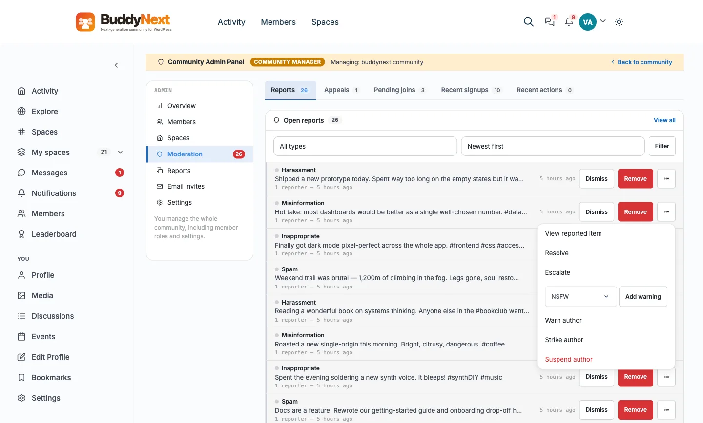

# REST: Moderation and Trust

This page documents the moderation REST surface in BuddyNext free: member reports, the moderation queue, appeals, the per-user trust actions (warnings, strikes, shadow-bans, suspensions, account type), per-space bans, and post content warnings. All routes live under the `buddynext/v1` namespace and are registered by `ModerationController` in `includes/Moderation/`.



## Overview / Contract

- Base namespace: `buddynext/v1`. Full base URL: `/wp-json/buddynext/v1`.
- Four permission plans gate these routes:
  - **Auth** (`require_auth`) - any logged-in user. Used for filing reports and appeals.
  - **Queue** (`require_queue_access`) - site admins and site-wide moderators holding the review-queue ability, plus space owners/moderators (scoped to their spaces). Used for reading and actioning the queue.
  - **Moderator** (`require_moderator`) - anyone holding a moderation ability: a site admin, a community moderator, or a member granted one. Used for the trust actions, listing reports, and setting a post's content warning.
  - **Admin** (`require_admin`) - site admins only (`manage_options`). Used for the appeals list and decisions.
- Unauthenticated calls to gated routes return `401 rest_forbidden`; authenticated-but-unprivileged calls return `403`.
- Path ids (`{id}` for a report, user, or appeal; `{sid}` for a strike) are positive integers validated server-side.
- Several surfaces share a path with both a GET (read) and a CREATE/EDIT (write) method; WordPress merges these registrations on the same route.

See the REST contract page (`14-rest-contract`) for the shared envelope, pagination, error shape, and nonce handling that apply to every route below.

## Report routes

A report is filed by a member against an object (post, reply, user, etc.). Admins and queue-access roles triage it from the queue, then dismiss, escalate, resolve, or remove the content.

| Method | Path | Auth | Purpose |
|--------|------|------|---------|
| POST | `/reports` | Auth | File a report. Body: `object_type`, `object_id`, `reason`, optional `notes`, `space_id`. |
| GET | `/reports` | Moderator | List reports for a given `object_type` + `object_id` (both required). |
| GET | `/reports/queue` | Queue | Paginated moderation queue (pending + escalated). Query: `space_id`, `object_type`, `reason`, `page`, `per_page` (default 20). Space mods see only their spaces. |
| POST | `/reports/{id}/dismiss` | Auth + report scope | Dismiss the report (no action warranted). |
| PUT | `/reports/{id}/escalate` | Auth + report scope | Escalate the report to site-admin review. |
| PUT | `/reports/{id}/resolve` | Auth + report scope | Resolve the report (handled). |
| POST | `/reports/{id}/remove` | Auth + report scope | Remove the reported content. |

> **Note:** `dismiss`, `escalate`, `resolve`, and `queue` are the report dispositions referenced across the moderation UI. `escalate` and `resolve` use `EDITABLE` (PUT/PATCH); `dismiss` and `remove` use `CREATABLE` (POST).

> **"Auth + report scope" is not "Admin".** The four report-action routes carry `require_auth` as their `permission_callback` - the route only checks that you are logged in. Authorization is per-report, inside the handler, via `guard_report_scope()`:
>
> - a caller with `manage_options` may action **any** report;
> - otherwise the report must carry a `space_id` the caller **owns or moderates** (`ModerationService::get_moderated_space_ids()`), or the call returns `403 bn_forbidden`.
>
> This is deliberate, and it is the reason a `manage_options` permission callback would be wrong here: a space owner or moderator has to be able to action the reports their own space Moderation tab shows them, and a site-admin-only gate would 403 them on their own queue. Do not "tighten" these callbacks to `require_admin` - you would break space moderation. The same pattern applies to `POST /users/{id}/warn` (authorized in `warn_user()`: site admins may warn anyone; a space owner/moderator may warn a member in the context of a space they moderate, passed as `space_id`).

### Related queue surfaces

These sit alongside the report queue and share the same queue-access plan.

| Method | Path | Auth | Purpose |
|--------|------|------|---------|
| GET | `/moderation/pending` | Queue | Posts awaiting pre-moderation approval (paginated). |
| POST | `/posts/{id}/approve` | Queue | Approve a pending post. |
| POST | `/posts/{id}/reject` | Queue | Reject a pending post (optional reason). |
| GET | `/moderation/log` | Moderator or queue | Moderation action log (paginated, filterable). Query: `space_id`, `user_id`, `action`, `since_days`, `page`, `per_page` (default 20). Moderators see the whole log; a space owner/moderator passes through the queue gate and is scoped to their spaces. |
| GET | `/moderation/suspension-reasons` | Moderator | The reason list the suspend dialogs use: `{ items: [ { code, label, note_required } ], note_max }`. |

## Appeal routes

A member appeals a moderation action against them. Admins approve or deny.

| Method | Path | Auth | Purpose |
|--------|------|------|---------|
| POST | `/appeals` | Auth | File an appeal. Body: `message`, optional `suspension_id`. |
| GET | `/appeals` | Admin | List appeals. |
| PUT | `/appeals/{id}/approve` | Admin | Approve the appeal (reverse the action). |
| PUT | `/appeals/{id}/deny` | Admin | Deny the appeal. |
| POST | `/appeals/{id}/resolve` | Admin | Mark the appeal resolved. Body: `decision` (`approved` or `denied`, required), `reviewer_note`. |
| POST | `/me/appeals` | Auth | File an appeal as the current user. Body: `message` (required). |
| GET | `/me/appeals` | Auth | The current user's own appeals. |
| GET | `/me/standing` | Auth | The current user's own trust/moderation standing (active warnings, strikes, suspension, shadow-ban state) - the self-service read behind the account "Standing" panel. |

## User trust routes

Per-user trust actions. All require the Moderator plan (a site admin, a community moderator, or a member granted the ability) **except `POST /users/{id}/warn`**, which a space owner or moderator may also call in the context of a space they moderate (see the note above). Reads (warnings, suspension state, shadow-ban state, strikes) share paths with their write counterparts.

| Method | Path | Auth | Purpose |
|--------|------|------|---------|
| GET | `/users/{id}/warnings` | Moderator | List warnings issued to the user. |
| POST | `/users/{id}/warn` | Auth + space scope | Issue a warning to the user. Body: `message` (required), `space_id`. Site admins may warn anyone; a space owner/moderator only within a space they moderate (pass `space_id`). |
| GET | `/users/{id}/strikes` | Moderator | List the user's strikes. |
| POST | `/users/{id}/strikes` | Moderator | Add a strike to the user. |
| POST | `/users/{id}/strikes/{sid}/reverse` | Moderator | Reverse a specific strike. |
| GET | `/users/{id}/shadow-ban` | Moderator | Read the user's shadow-ban state. |
| POST | `/users/{id}/shadow-ban` | Moderator | Shadow-ban the user. |
| DELETE | `/users/{id}/shadow-ban` | Moderator | Lift the shadow-ban. |
| GET | `/users/{id}/suspension` | Moderator | Read the user's current suspension state. |
| GET | `/users/{id}/suspensions` | Moderator | List the user's suspension history. |
| POST | `/users/{id}/suspend` | Moderator | Suspend the user. Body: optional `reason`, `duration_days`, `hide_posts`. |
| DELETE | `/users/{id}/suspend` | Moderator | Lift the suspension. |
| GET | `/users/{id}/account-type` | Auth | The user's account type (public/private). |

> **Note:** Strikes and shadow-ban use a single path for read and write (GET/POST, plus DELETE for shadow-ban). Suspend likewise pairs POST (suspend) and DELETE (lift) on `/users/{id}/suspend`, with separate GET reads on `/suspension` (current) and `/suspensions` (history).

## Community role assignment

`bn_community_role` (`member` < `moderator` < `admin`) is BuddyNext's own community-wide tier, independent of WordPress roles. It was previously writable only by the inbound access webhook; this is the write path the Community Admin > Members view and the wp-admin Members list both call.

| Method | Path | Auth | Purpose |
|--------|------|------|---------|
| PUT | `/community-admin/members/{id}/role` | Role manager | Assign a community role. Body: `role`, one of `member`, `moderator`, `admin`. |

A "role manager" is a WordPress administrator (`manage_options`) or a member who already holds the `admin` community role - so an existing community admin can promote/demote others without needing a WordPress role.

## Space bans

Per-space bans. Gated by `require_space_owner_or_admin` - site admins plus the owner/moderators of the target space.

| Method | Path | Auth | Purpose |
|--------|------|------|---------|
| GET | `/spaces/{id}/bans` | Space owner/admin | List the space's bans. |
| POST | `/spaces/{id}/bans` | Space owner/admin | Ban a user from the space. Body: `user_id` (required), optional `reason`. |
| DELETE | `/spaces/{id}/bans/{user_id}` | Space owner/admin | Lift a user's ban from the space. |

## Content warnings

A per-post content-warning flag. Reading it is public (so any viewer's client can show the interstitial); setting or clearing it needs the Moderator plan.

| Method | Path | Auth | Purpose |
|--------|------|------|---------|
| GET | `/posts/{id}/content-warning` | Public | Read the post's content-warning state. |
| PUT | `/posts/{id}/content-warning` | Moderator | Set or clear the warning. Body: `content_warning` (boolean, required), optional `content_warning_type`. |

## Examples

### File a report

```bash
curl -X POST "https://example.com/wp-json/buddynext/v1/reports" \
  -H "X-WP-Nonce: <wp_rest_nonce>" \
  -H "Content-Type: application/json" \
  --cookie "<auth cookies>" \
  -d '{
        "object_type": "post",
        "object_id": 128,
        "reason": "spam",
        "notes": "Repeated promotional links.",
        "space_id": 0
      }'
```

`object_type`, `object_id`, and `reason` are required; `notes` and `space_id` are optional. `reason` is sanitized as a key (lowercase, underscores).

### Suspend a user

```bash
curl -X POST "https://example.com/wp-json/buddynext/v1/users/42/suspend" \
  -H "X-WP-Nonce: <wp_rest_nonce>" \
  -H "Content-Type: application/json" \
  --cookie "<admin auth cookies>" \
  -d '{
        "reason_code": "harassment",
        "note": "Repeated harassment after warnings.",
        "duration_days": 7,
        "hide_posts": true
      }'
```

A reason is required (since 1.2.4): send `reason_code` from `GET /moderation/suspension-reasons` (with an optional `note`, required for `other`, max 300 characters), or a free-text `reason`. The member is shown the composed reason. A suspension with no reason returns `400 reason_required`. Omit `duration_days` for an indefinite suspension (administrators only), and set `hide_posts` to `true` to hide the user's content for the duration. Lift the suspension with `DELETE /users/42/suspend`.

`GET /moderation/suspension-reasons` (moderators) returns `{ items: [{ code, label, note_required }], note_max }`, the same list the web dialogs use.

## Notes / gotchas

- **Queue scoping.** `require_queue_access` grants site admins the full queue, but space owners/moderators see only reports tied to their spaces. Build clients against the scoped result, not the assumption of a global view.
- **Read/write share a path.** Where a GET and a POST/DELETE register on the same path (strikes, shadow-ban, appeals, `/me/appeals`), WordPress merges them. Pick the method deliberately.
- **Disposition verbs are non-destructive vs destructive.** `dismiss`, `escalate`, and `resolve` change a report's state; `remove` acts on the underlying content. Treat `remove` as the destructive path in any confirmation UI.
- **Appeals have two entry points.** `/appeals` (admin-facing list + per-appeal actions) and `/me/appeals` (the member's own create + read). They are not interchangeable.
- **Account type is shared with the social graph surface.** The same `/users/{id}/account-type` read documented in REST: Social Graph informs both follow-flow decisions and trust-context displays.
