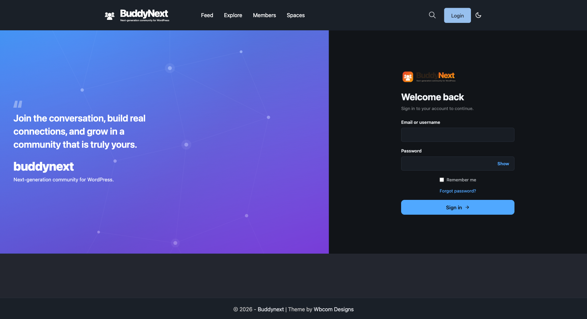

# REST: Auth and Account

The authentication and account-management routes under `buddynext/v1`. They cover front-end login, registration, two-factor verification, email verification, member approval, and the self-service account flows (change password, change email, sign out everywhere, manage 2FA). This page is for developers building a custom login UI, a mobile client, or any client that drives these flows over REST.



## Contract

These routes follow the same envelope, error shape, and nonce rules as the rest of the API - see the REST contract page (14-rest-contract) for the cross-surface conventions. Two things are specific to this surface:

- **Permission model is unusual here.** Most BuddyNext routes gate on a capability or login state. The auth routes intentionally do not: the pre-login routes are public (`permission_callback => __return_true`) because the caller has no session yet. The account routes and the post-login auth routes gate on "logged in" only. Per-route detail is in the tables below.
- **Authenticated calls still need the cookie + `wp_rest` nonce.** "Public" means no capability check, not "no authentication needed for state to be correct". A logged-in client calls these with the standard `X-WP-Nonce` header. If the nonce goes stale, mint a fresh one from `GET /auth/nonce` (see Notes).

Source: `includes/Auth/AuthController.php` (auth routes) and `includes/Auth/TwoFactorController.php` (account/2fa routes).

## Auth routes

All paths below are prefixed with `/wp-json/buddynext/v1`.

| Method | Path | Auth | Purpose |
|---|---|---|---|
| POST | `/auth/login` | Public | Log a user in by email/username + password. Returns a 2FA challenge token instead of a session when 2FA is enabled. |
| POST | `/auth/2fa` | Public | Complete a 2FA challenge with `twofa_token` + `code`, finishing the login. |
| POST | `/auth/2fa/email-code` | Public | Send a one-time 2FA code by email for the pending challenge (`twofa_token`). |
| POST | `/auth/register` | Public | Create a new user account (`email`, `user_login`, `password`, optional `terms_agreed`, `invite`). |
| POST | `/auth/lost-password` | Public | Start a password reset for `user_login` (email or username). |
| POST | `/auth/reset-password` | Public | Complete a reset with `key` + `login` + new `password`. |
| POST | `/auth/approve/{id}` | Admin | Approve a pending member (manual-approval registration mode). |
| POST | `/auth/verify/resend` | Logged in | Resend the email-verification message for the current user. |
| GET | `/auth/verify/status` | Logged in | Return the current user's email-verification status. |
| POST | `/auth/change-password` | Logged in | Set a new password after verifying `current_password`. Returns 422 with field-keyed errors on failure. |
| POST | `/auth/change-email` | Logged in | Change the current user's email (`email`). |
| POST | `/auth/sign-out-everywhere` | Logged in | Destroy all of the current user's sessions on every device. |
| GET | `/auth/nonce` | Public | Mint a fresh `wp_rest` nonce for the current session (stale-nonce recovery). |

> The login, register, 2FA, lost-password, and reset-password routes register with `permission_callback => __return_true`. They are reachable by anyone, by design, because the caller is pre-session. The manifest records a `users_can_register` note against the auth group; that is the registration setting these flows respect at the handler level, not a route-level permission gate. `/auth/approve/{id}` checks an admin capability in its own callback; the verify/change/sign-out routes check `require_auth` (logged in).

## Account (2FA) routes

Two-factor enrollment and management for the signed-in user. Every route here requires login (`require_auth`); there is no public or capability variant.

| Method | Path | Auth | Purpose |
|---|---|---|---|
| GET | `/account/2fa` | Logged in | Return the current user's 2FA status (enabled, method, backup-codes remaining). |
| POST | `/account/2fa/setup` | Logged in | Begin TOTP enrollment; returns the secret/QR provisioning data to confirm against. |
| POST | `/account/2fa/confirm` | Logged in | Confirm enrollment with a `code` from the authenticator app, activating 2FA. |
| POST | `/account/2fa/disable` | Logged in | Disable 2FA after re-verifying the account `password`. |
| POST | `/account/2fa/backup` | Logged in | Regenerate backup codes after re-verifying the account `password`. |

## Examples

### Log in

A successful login with 2FA off returns the session result. With 2FA on, the response carries a `twofa_token` and the client must follow up with `POST /auth/2fa`.

```bash
curl -X POST https://example.com/wp-json/buddynext/v1/auth/login \
  -H 'Content-Type: application/json' \
  -d '{
    "user": "ada@example.com",
    "password": "correct horse battery staple",
    "remember": true
  }'
```

Parameters: `user` (required, email or username), `password` (required), `remember` (optional boolean, default `false`). When the account has 2FA enabled, complete the challenge:

```bash
curl -X POST https://example.com/wp-json/buddynext/v1/auth/2fa \
  -H 'Content-Type: application/json' \
  -d '{ "twofa_token": "<token-from-login>", "code": "123456" }'
```

### Register

```bash
curl -X POST https://example.com/wp-json/buddynext/v1/auth/register \
  -H 'Content-Type: application/json' \
  -d '{
    "email": "grace@example.com",
    "user_login": "grace",
    "password": "a strong passphrase",
    "terms_agreed": true,
    "invite": "ABCD-1234"
  }'
```

Required: `email`, `user_login`, `password`. Optional: `terms_agreed` (boolean, default `false`), `invite` (string, used when the community runs invite-gated or referral registration). Registration honours the site's `users_can_register` setting and the configured approval mode - when manual approval is on, the new account stays pending until an admin calls `POST /auth/approve/{id}`.

### Change password (validation envelope)

State-changing account calls send the cookie + nonce and return field-keyed 422 errors on validation failure:

```bash
curl -X POST https://example.com/wp-json/buddynext/v1/auth/change-password \
  -H 'Content-Type: application/json' \
  -H 'X-WP-Nonce: <wp_rest nonce>' \
  --cookie 'wordpress_logged_in_...=...' \
  -d '{ "current_password": "old-pass", "new_password": "new-pass-8+chars" }'
```

```json
{
  "code": "rest_invalid_param",
  "message": "Current password does not match.",
  "data": {
    "status": 422,
    "fields": { "current_password": "Current password does not match." }
  }
}
```

## Notes

- **Stale-nonce recovery.** `GET /auth/nonce` mints a fresh `wp_rest` nonce for the current session and sends `Cache-Control: no-store`. The shared front-end REST client uses it to recover from a 403 on a stale nonce without a full page reload. It re-validates the auth cookie directly, so it never returns an anonymous nonce to a logged-in caller, and the minted nonce is usable only by the same session.
- **2FA login is a two-step flow.** `POST /auth/login` does not always return a session - if the account has 2FA on, it returns a `twofa_token`. The client then calls `POST /auth/2fa` (TOTP/backup code) or requests an email code first via `POST /auth/2fa/email-code`. Build clients to expect either outcome.
- **Re-authentication on sensitive 2FA changes.** Disabling 2FA and regenerating backup codes both require the account `password` in the request body, not just an active session.
- **Free vs Pro.** All routes on this page are part of Free (`buddynext/v1`). Pro adds its own account-scoped routes under `buddynext-pro/v1` (billing, subscriptions, push preferences) - see REST: Pro namespace (24-rest-pro).
