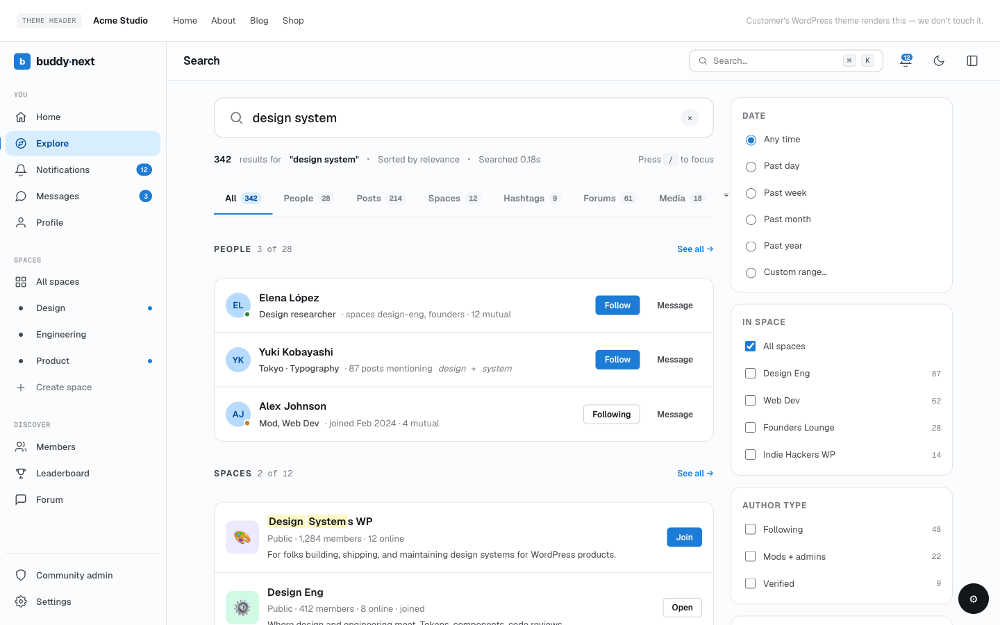

# REST: Search, Hashtags, and Misc Singletons

Reference for the cross-cutting `buddynext/v1` routes that do not belong to a single content domain: unified search and the member-search shortcut, the hashtag routes (trending, autocomplete, detail, feed, follow/unfollow), and four standalone singleton routes (link preview, CSV invite import, companion install, and admin slug-check). For developers calling or extending these surfaces.



## Overview / Contract

All routes are under the `buddynext/v1` namespace and follow the shared envelope, authentication, and pagination rules on the REST Contract page - read that first.

- **Auth.** `Public` routes use `__return_true`. `Auth` routes require a logged-in user. Hashtag routes additionally require the Hashtags feature to be enabled; write routes also require login. The admin singletons require capabilities (`manage_options` or `install_plugins`).
- **Feature gate.** Every hashtag route runs through a feature gate. When Hashtags are turned off for the community, read routes return `403` with code `hashtags_disabled`; write routes return `401` when the caller is logged out, then the same `403` when the feature is off.
- **Pagination.** Search accepts `page` and `per_page` (default 20). Hashtag feeds paginate over post results.

## Search

Served by `SearchController`. `/search` is the unified search across content types; `/search/members` is a directory-style member search with richer filters (several of which are Pro-only and ignored when buddynext-pro is inactive).

| Method | Path | Auth | Purpose |
|---|---|---|---|
| GET | `/search` | Public | Unified search. Params: `q`, `type` (optional), `per_page` (default 20), `page` (default 1). |
| GET | `/search/members` | Public | Member search/directory with filters: `search`, `location`, `skills`, `space_id`, `connection_status`, `online_only`, plus Pro filters (`tier_slug`, `member_label`, `joined_after`, `active_within_days`). |

The `type` parameter on `/search` narrows results to one object type (for example members, spaces, or posts); omit it to search across types. The Pro-only member filters are registered on `/search/members` so app and REST clients can pass them and so the schema documents them - Free forwards them through the `buddynext_search_query_args` filter seam, and they are simply ignored when Pro is not active.

## Hashtags

Served by `HashtagController`. Slugs match `[a-zA-Z0-9_-]+`. All routes are gated by the Hashtags feature toggle.

| Method | Path | Auth | Purpose |
|---|---|---|---|
| GET | `/hashtags/trending` | Public (feature on) | Trending hashtags. Optional `limit`. |
| GET | `/hashtags/autocomplete` | Public (feature on) | Autocomplete suggestions for a partial tag. |
| GET | `/hashtags/{slug}` | Public (feature on) | Hashtag detail (counts, follow state). |
| GET | `/hashtags/{slug}/feed` | Public (feature on) | Paginated feed of posts carrying the tag. |
| POST | `/hashtags/{slug}/follow` | Auth (feature on) | Follow the hashtag. Returns `{"following": true}`. |
| DELETE | `/hashtags/{slug}/follow` | Auth (feature on) | Unfollow the hashtag. Returns `{"following": false}`. |

> The read routes use the `require_hashtags_enabled` gate (feature toggle only). The follow/unfollow routes use `require_hashtags_enabled_auth`, which additionally requires a logged-in user.

## Misc singletons

Four standalone routes that do not belong to a domain controller.

| Method | Path | Auth | Purpose |
|---|---|---|---|
| GET | `/link-preview` | Auth | Resolve link-preview metadata (title, description, thumbnail) for a URL while composing a post. Served by `PostController`. |
| POST | `/invites/import-csv` | manage_options | Upload a CSV and bulk-create invites. Served by `InviteController`. |
| POST | `/companions/install` | install_plugins | Install and activate a catalog companion plugin in one step. Served by `CompanionController`. |
| GET | `/admin/slug-check` | manage_options | Probe whether a proposed page slug is available. Params: `slug`, `context`. Served by `SlugCheckController`. |

Capability detail:

- `/link-preview` requires authentication (`require_auth`); it is used by the post composer before submit.
- `/invites/import-csv` requires `manage_options` (and a logged-in user).
- `/companions/install` requires `install_plugins`.
- `/admin/slug-check` requires `manage_options`.

## Examples

### Unified search

```bash
curl "https://example.com/wp-json/buddynext/v1/search?q=design&type=members&per_page=10&page=1"
```

The `/search` handler returns the matched object type, the result rows, and the total count:

```json
{
  "type": "members",
  "total": 2,
  "results": [
    {
      "id": 17,
      "name": "Ada Lovelace",
      "initials": "AL",
      "bio": "Building the analytical engine.",
      "profile_url": "https://example.com/members/ada/",
      "is_self": false,
      "is_following": true
    },
    {
      "id": 31,
      "name": "Grace Hopper",
      "initials": "GH",
      "bio": "Compilers and nanoseconds.",
      "profile_url": "https://example.com/members/grace/",
      "is_self": false,
      "is_following": false
    }
  ]
}
```

Space results carry `id`, `name`, `initials`, `description`, `member_count`, `space_url`, and `is_member`. The `is_following` / `is_member` flags are populated only when a logged-in viewer makes the request.

### Follow a hashtag

```bash
curl -X POST https://example.com/wp-json/buddynext/v1/hashtags/photography/follow \
  -H "X-WP-Nonce: <nonce>" \
  --cookie "<auth cookies>"
```

```json
{ "following": true }
```

## Notes and gotchas

- **Hashtag routes 403 when the feature is off**, not 404. Check the Hashtags toggle before assuming a route is missing; the error code is `hashtags_disabled`.
- **Pro search filters are documented but inert in Free.** `tier_slug`, `member_label`, `joined_after`, and `active_within_days` on `/search/members` are accepted and ignored unless buddynext-pro is active and merges them through the `buddynext_search_query_args` seam.
- **`/link-preview` lives on the Feed controller**, not a dedicated search/preview controller; it requires authentication because it is part of the post composer.
- **The admin singletons are owner tooling.** `/invites/import-csv`, `/companions/install`, and `/admin/slug-check` are administrator-only and are not part of the member-facing surface.
