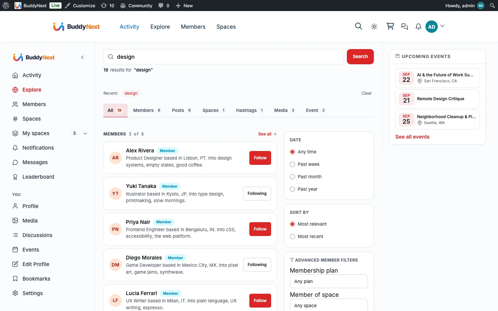

# REST: Search, Hashtags, and Misc Singletons

Reference for the cross-cutting `buddynext/v1` routes that do not belong to a single content domain: unified search (unified, member directory, and as-you-type suggest), the hashtag routes (trending, autocomplete, detail, feed, follow/unfollow, related, contributors, and the current user's followed tags), and a set of standalone singleton routes (shell nav, kudos, achievements, member types, link preview, CSV invite import, companion install, and admin slug-check). For developers calling or extending these surfaces.



## Overview / Contract

All routes are under the `buddynext/v1` namespace and follow the shared envelope, authentication, and pagination rules on the REST Contract page - read that first.

- **Auth.** `Public` routes use `__return_true`. `Auth` routes require a logged-in user. Hashtag routes additionally require the Hashtags feature to be enabled; write routes also require login. The admin singletons require capabilities (`manage_options` or `install_plugins`).
- **Feature gate.** Every hashtag route runs through a feature gate. When Hashtags are turned off for the community, read routes return `403` with code `hashtags_disabled`; write routes return `401` when the caller is logged out, then the same `403` when the feature is off.
- **Pagination.** Search accepts `page` and `per_page` (default 20). Hashtag feeds paginate over post results.

## Search

Served by `SearchController`. `/search` is the unified search across content types; `/search/members` is a directory-style member search with cursor pagination; `/search/suggest` powers the as-you-type typeahead overlay.

| Method | Path | Auth | Purpose |
|---|---|---|---|
| GET | `/search` | Public | Unified search. Params: `q` (required), `type` (optional), `per_page` (default 20), `page` (default 1), plus the Pro member filters (`tier_slug`, `space_id`, `member_label`, `joined_after`, `active_within_days`). |
| GET | `/search/members` | Public | Member search/directory (cursor-paginated). Params: `cursor`, `per_page` (default 20, max 50), `search`, `location`, `skills`, `space_id`, `connection_status`, `online_only`, `sort` (`newest`, `alphabetical`, `most_active`, `online`). |
| GET | `/search/suggest` | Public | Grouped as-you-type suggestions. Params: `q` (required), `per_group` (default 5, max 10). A blank/too-short `q` returns an empty `groups` list rather than an error. |

The `type` parameter on `/search` narrows results to one object type (for example members, spaces, or posts); omit it to return grouped results keyed by type. The Pro-only member filters are registered on `/search` so app and REST clients can pass them and so the schema documents them - Free forwards them through the `buddynext_search_query_args` filter seam, and they are simply ignored when Pro is not active.

## Hashtags

Served by `HashtagController`. The `{slug}` path segment matches `[^/]+` (any non-slash characters). All routes are gated by the Hashtags feature toggle.

| Method | Path | Auth | Purpose |
|---|---|---|---|
| GET | `/hashtags/trending` | Public (feature on) | Trending hashtags. Optional `limit` (default 10, max 50). |
| GET | `/hashtags/autocomplete` | Public (feature on) | Autocomplete suggestions for a partial tag. Params: `q` (required), `limit` (default 10, max 20). |
| GET | `/hashtags/{slug}` | Public (feature on) | Hashtag detail (counts, follow state). |
| GET | `/hashtags/{slug}/feed` | Public (feature on) | Cursor-paginated feed of posts carrying the tag. Params: `per_page` (default 20, max 50), `cursor`. |
| GET | `/hashtags/{slug}/related` | Public (feature on) | Hashtags frequently used alongside this one. Optional `limit` (default 6, max 20). |
| GET | `/hashtags/{slug}/contributors` | Public (feature on) | Top contributors to the tag plus a total count. Optional `limit` (default 5, max 20). |
| POST | `/hashtags/{slug}/follow` | Auth (feature on) | Follow the hashtag. Returns `{"following": true, "follower_count": N}`. |
| DELETE | `/hashtags/{slug}/follow` | Auth (feature on) | Unfollow the hashtag. Returns `{"following": false, "follower_count": N}`. |
| GET | `/me/hashtags` | Auth (feature on) | The current user's followed hashtags. Params: `per_page` (default 20, max 50), `offset` (default 0). |

> The read routes use the `require_hashtags_enabled` gate (feature toggle only). The follow/unfollow routes and `/me/hashtags` use `require_hashtags_enabled_auth`, which additionally requires a logged-in user.

## Shell nav, gamification, and member types

Standalone routes that back the app shell and the gamification/member-type surfaces.

| Method | Path | Auth | Purpose |
|---|---|---|---|
| GET | `/shell-nav` | Public | The fully resolved app-shell navigation (owner overrides applied) plus live unread badge counts. Optional `hub` param. Logged-out callers get the community items; logged-in callers also get their personal items and badges. Served by `ShellNavController`. |
| POST | `/kudos` | Auth | Give kudos to a member. Params: `receiver_id` (required), `message` (optional). Returns `{"sent": true}` (201). Only registered when wb-gamification is active. Served by `GamificationKudos`. |
| GET | `/users/{id}/achievements` | Public | A member's badges + standing (points, rank, level, streak) - the data behind the Achievements tab. Only registered when wb-gamification is active. Served by `GamificationAchievements`. |
| GET | `/member-types` | Public | List all member types. Served by `MemberTypeController`. (Create/update/delete and per-user assignment live on the same controller but are admin/self-scoped writes.) |

## Misc singletons

Standalone routes that do not belong to a domain controller.

| Method | Path | Auth | Purpose |
|---|---|---|---|
| GET | `/link-preview` | Auth | Resolve link-preview metadata (title, description, thumbnail) for a URL while composing a post. Served by `PostController`. |
| POST | `/invites/import-csv` | manage_options | Upload a CSV and bulk-create invites. Served by `InviteController`. |
| POST | `/companions/install` | install_plugins | Install and activate a catalog companion plugin in one step. Served by `CompanionController`. |
| GET | `/admin/slug-check` | manage_options | Probe whether a proposed page slug is available. Params: `slug`, `context`. Served by `SlugCheckController`. |

Capability detail:

- `/link-preview` requires authentication (`require_auth`); it is used by the post composer before submit.
- `/invites/import-csv` requires `manage_options` (and a logged-in user).
- `/companions/install` requires `install_plugins`.
- `/admin/slug-check` requires `manage_options`.

## Examples

### Unified search

```bash
curl "https://example.com/wp-json/buddynext/v1/search?q=design&type=members&per_page=10&page=1"
```

The `/search` handler returns the matched object type, the result rows, and the total count:

```json
{
  "type": "members",
  "total": 2,
  "results": [
    {
      "id": 17,
      "name": "Ada Lovelace",
      "initials": "AL",
      "bio": "Building the analytical engine.",
      "profile_url": "https://example.com/members/ada/",
      "is_self": false,
      "is_following": true
    },
    {
      "id": 31,
      "name": "Grace Hopper",
      "initials": "GH",
      "bio": "Compilers and nanoseconds.",
      "profile_url": "https://example.com/members/grace/",
      "is_self": false,
      "is_following": false
    }
  ]
}
```

Space results carry `id`, `name`, `initials`, `description`, `member_count`, `space_url`, and `is_member`. The `is_following` / `is_member` flags are populated only when a logged-in viewer makes the request.

### Follow a hashtag

```bash
curl -X POST https://example.com/wp-json/buddynext/v1/hashtags/photography/follow \
  -H "X-WP-Nonce: <nonce>" \
  --cookie "<auth cookies>"
```

```json
{ "following": true, "follower_count": 42 }
```

## Notes and gotchas

- **Hashtag routes 403 when the feature is off**, not 404. Check the Hashtags toggle before assuming a route is missing; the error code is `hashtags_disabled`.
- **Pro search filters are documented but inert in Free.** `tier_slug`, `member_label`, `joined_after`, and `active_within_days` on `/search` are accepted and ignored unless buddynext-pro is active and merges them through the `buddynext_search_query_args` seam.
- **`/link-preview` lives on the Feed controller**, not a dedicated search/preview controller; it requires authentication because it is part of the post composer.
- **The admin singletons are owner tooling.** `/invites/import-csv`, `/companions/install`, and `/admin/slug-check` are administrator-only and are not part of the member-facing surface.
