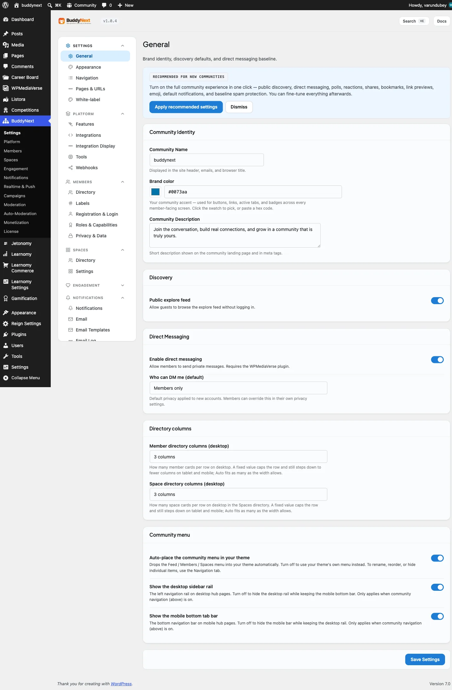

# Hooks Overview

BuddyNext is built to be extended through WordPress actions and filters. This page covers how hooks are named, the split between actions and filters, the difference between hooks BuddyNext provides and hooks it consumes, priority conventions, and which hook domain is documented on which reference page. Read this before any of the per-domain hook pages (27-33).



## Overview / Contract

### The source of truth is the code

**Grep the source before you rely on a signature.** The hook surface is large and it moves; these pages document it, but the `do_action()` / `apply_filters()` call site is what actually runs. Where a page here and the live code disagree, the code wins - and please file it, because the doc is then a bug.

This guide documents the hooks BuddyNext fires **itself**. It does not cover core WordPress hooks BuddyNext listens to, nor the actions and filters published by sibling plugins (Jetonomy, WPMediaVerse, Career Board, WBGamification) that BuddyNext consumes through its Bridges - those belong to those plugins' contracts. Pro adds its own surface on top, documented on the Pro and Integration Hooks page.

### Naming

Two prefixes are in use, and they mean different things:

| Prefix | Scope | Where it lives |
|---|---|---|
| `buddynext_*` | Public extension surface - the seams third parties hook | Services, listeners, controllers, and templates |
| `bn_*` | Internal plumbing - not part of the public contract | A small number of admin-internal hooks (`bn_admin_hub_sections`, `bn_admin_hub_tab_placement`, `bn_admin_hub_default_icon_map`, `bn_admin_hub_pages`) |

Author your integrations against `buddynext_*` hooks. The `bn_*` prefix matches the database table prefix and the CSS prefix, but as a hook prefix it marks internal admin wiring that may change without notice.

Within `buddynext_*`, the surface divides into two families:

- `buddynext_part_*` - the template-part theming seam, and the largest family by a wide margin. It is documented in full on its own page (see Hooks: Template Parts).
- Everything else under `buddynext_*` - the domain event and data-shaping hooks: social graph, feed, spaces, profiles, members, notifications, moderation, search, and so on. These are split across the per-domain pages described below.

> **These pages are a guide, not an exhaustive index.** The per-domain pages cover the hooks an integrator actually reaches for. A number of narrower seams are fired but not listed - navigation (`buddynext_rail_items`, `buddynext_nav_items`, `buddynext_mobile_nav_items`, `buddynext_user_links`, documented instead on the Navigation API page), the template loader (`buddynext_template_locations`, `buddynext_before_template`, `buddynext_after_template`), the theme tokens (`buddynext_css_vars`, `buddynext_css_vars_dark`), and per-template `_before` / `_after` actions. If you need a seam that is not on these pages, grep for it: it very likely exists.

### One hazard worth knowing before you hook anything

A handful of BuddyNext actions are fired from **more than one call site**, and two of them are currently fired with **fewer arguments** from one of those sites than the documented signature. WordPress passes a listener only the arguments the *firing* site supplied, so a typed callback registered for the full signature raises an `ArgumentCountError` when the short call site fires.

Defend against it by giving your callback defaults rather than trusting `accepted_args`:

```php
// Safe: survives a call site that supplies fewer arguments than documented.
add_action(
    'buddynext_space_updated',
    static function ( int $space_id, int $user_id = 0, array $fields = array() ): void {
        // ...
    },
    10,
    3
);
```

The two affected actions are called out on their own pages: `buddynext_space_updated` (Hooks: Spaces) and `buddynext_member_unsuspended` (Hooks: Moderation, Auth, Trust).

### Actions vs filters - the practical distinction

The split is not arbitrary. It tells you what the hook is for.

- An **action** (`do_action`) is a notification that something happened. BuddyNext does not use the return value. Use actions to react to events: award points, write an analytics row, send an external webhook, sync to a CRM. Example: `buddynext_post_created` fires after a post is saved.
- A **filter** (`apply_filters`) asks you to shape a value and return it. BuddyNext uses what you return. Use filters to change behavior or markup: rerank a feed, add a profile field type, raise a limit, inject markup into a template part. Example: `buddynext_post_pin_limit` lets Pro raise the pinned-post cap from 1 to 10.

> **Note:** A filter callback must return a value. Returning nothing (or the wrong type) from a filter can break the surface that depends on it. An action callback's return value is ignored.

### Provided vs consumed

BuddyNext sits on both sides of the hook system, and the distinction matters when you decide where to put your code.

- **Provided** (BuddyNext fires, you listen): all 1055 hooks counted above. These are the seams you build on. Free ships no `docs/specs/HOOKS.md`; the code is the contract - the per-domain hooks pages (25-33) and the live `do_action()` / `apply_filters()` call sites are the reference for the integration-grade actions.
- **Consumed** (a sibling plugin fires, BuddyNext listens): BuddyNext's Bridges hook events owned by other plugins - for example `mvs_message_sent` (WPMediaVerse), `jetonomy_after_create_post` (Jetonomy), `wcb_job_created` (Career Board), and `wb_gamification_badge_awarded` (WBGamification). You do not hook these through BuddyNext; you hook them on the plugin that fires them. They are listed here only so you know which direction a given event flows.

> **Note:** Some hooks are deliberately fired by Free as a seam that only Pro consumes today. For example `buddynext_feed_order_by` is the documented SQL-level feed-rerank seam; Pro ships an affinity ranker but reaches it by a container rebind rather than this filter, leaving the filter open for third-party use.

### Priorities

BuddyNext follows standard WordPress priority rules. Default priority is `10`. Lower numbers run earlier; higher numbers run later.

The priorities that are part of the contract (do not fight them):

| Hook point | Priority | Why |
|---|---|---|
| `plugins_loaded` -> Free boot (`Plugin::init`) | 15 | After addons (10), before Pro (20) |
| `plugins_loaded` -> Pro boot | 20 | After Free, so Free's services exist |
| `plugins_loaded` -> Bridge classes | 25 | After both Free and Pro |
| `buddynext_safeguard_check` -> Pro AI moderation | 20 | Runs after Free's keyword safeguard (priority 10) |
| `buddynext_notification_created` -> Pro push dispatch | 20 | Runs after the in-app notification is written |

When you hook a domain event, default priority is almost always correct. Raise the priority number only when your callback depends on another callback having already run (the AI moderation example above), and lower it only when you must run before BuddyNext's own listener.

## Hook domain map (pages 27-33)

The `buddynext_*` domain hooks (everything except the template-part family) are documented per domain. Use this map to jump to the right page.

| Page | Domain | Representative hooks |
|---|---|---|
| 27 | Feed, posts, reactions, comments | `buddynext_post_created`, `buddynext_post_updated`, `buddynext_post_deleted`, `buddynext_post_shared`, `buddynext_reaction_added`, `buddynext_comment_created`, `buddynext_feed_order_by` |
| 28 | Members, profiles, fields, social graph | `buddynext_user_followed`, `buddynext_user_unfollowed`, `buddynext_connection_requested`, `buddynext_connection_accepted`, `buddynext_member_approved`, `buddynext_member_type_assigned`, `buddynext_profile_field_render` |
| 29 | Spaces | `buddynext_space_created`, `buddynext_space_member_joined`, `buddynext_space_member_left`, `buddynext_space_member_removed`, `buddynext_space_join_approved`, `buddynext_can_join_space`, `buddynext_space_can_view_roster` |
| 30 | Notifications and email | `buddynext_notification_created`, `buddynext_notification_prefs_*`, the email-template and digest seams |
| 31 | Moderation, auth, trust | `buddynext_report_created`, `buddynext_user_warned`, `buddynext_user_suspended`, `buddynext_appeal_submitted`, `buddynext_safeguard_check`, `buddynext_registration_pending` |
| 32 | Search, hashtags, sidebar, admin | `buddynext_search_query_args`, `buddynext_hashtag_*`, the sidebar-widget and admin-hub filters |
| 33 | Pro and integration | Pro hooks (`buddynext_pro_subscription_created`, `buddynext_outbound_webhook_limit`) and the integration bridge seams |

The template-part family (`buddynext_part_*`, 705 hooks) is documented separately on the Hooks: Template Parts page (26), because it is a different kind of seam - presentation rather than events - and dominates the surface by count.

## Examples

### Reacting to an event with add_action

`buddynext_post_created` is a domain action. It fires after a post is saved, with the post ID, author ID, and a type string. Use it to do something in response - here, log every new post.

```php
add_action(
    'buddynext_post_created',
    function ( int $post_id, int $user_id, string $type ): void {
        // $type is one of: text, photo, file, link, poll, announcement,
        // activity, media, discussion, job, share.
        // Need the full post? Re-fetch by ID - the hook intentionally
        // passes only the identifiers.
        $post = buddynext_service( 'post_service' )->get( $post_id );

        error_log(
            sprintf( 'BuddyNext: user %d created a %s post (#%d).', $user_id, $type, $post_id )
        );
    },
    10,  // default priority
    3    // this action passes 3 arguments
);
```

> **Note:** Domain event actions pass identifiers, not hydrated objects, on purpose - it keeps the event cheap to fire. When you need more fields, re-fetch through the domain service (`buddynext_service( 'post_service' )->get( $post_id )`).

### Shaping a value with add_filter

`buddynext_post_pin_limit` is a domain filter. BuddyNext defaults the pinned-post cap to 1 and uses whatever you return. Here, raise it to 5 (this is the same seam Pro uses to lift the cap to 10).

```php
add_filter(
    'buddynext_post_pin_limit',
    function ( int $limit ): int {
        return 5;
    }
);
```

Always declare the argument count on `add_action` when the hook passes more than one argument (the fourth argument to `add_action`), and always `return` from a filter callback.

## Notes / gotchas

- **The code is the contract.** Free ships no `docs/specs/HOOKS.md`; an earlier revision of this page cited one as a "locked" source of truth, and it does not exist. Use the per-domain hooks pages (25-33) and the live `do_action()` / `apply_filters()` call sites, cross-checked against `audit/manifest.json`'s `hooks_fired` entries for the file and line where a hook actually fires (the manifest can lag the code, so the call site wins). A few moderation events (warn, shadow ban, appeal) may not fire yet where the service did not exist when the hook was first documented.
- **Do not hook `bn_*` as a public seam.** Those two hooks are internal admin wiring.
- **Free/Pro boundary.** Pro never calls Free code directly - it extends Free through container rebinds, class inheritance, or these hooks. If you are writing a Pro-style extension, prefer the same three mechanisms. Pro's own hook surface (events it emits, such as `buddynext_pro_subscription_created`) lives in the Pro plugin's `docs/specs/HOOKS.md`.
- **Consumed hooks live on the other plugin.** To react to a direct message, hook `mvs_message_sent` on WPMediaVerse, not a BuddyNext hook. To react to a Jetonomy discussion, hook `jetonomy_after_create_post`. BuddyNext's bridges already do this internally; your code should target the source plugin's hook directly.
