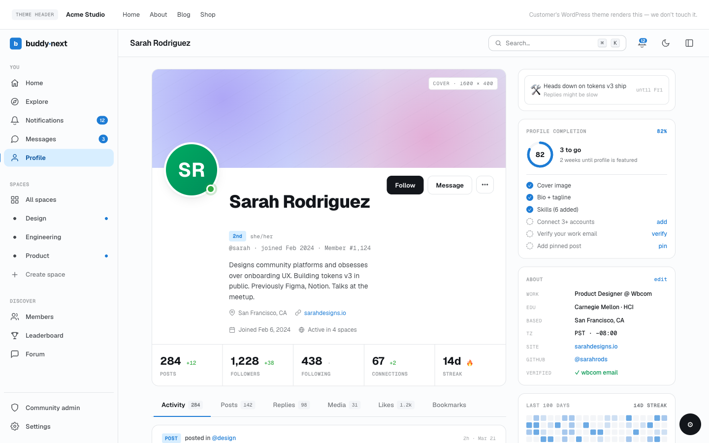

# Hooks: Members, Profiles, and Social Graph

The action and filter seams for user lifecycle, member profiles, profile fields, roles, and the social graph (follow, connection, block). This page is for developers building gamification plugins, integrations, or theme extensions that react to social activity or augment how members are rendered. Every hook below is fired or applied by BuddyNext Free, so it is available without Pro.




## Overview / Contract

- **Actions are notifications, not callbacks.** BuddyNext never calls addon code directly. It fires actions after a state change has committed, and you hook them. Listeners that need more than the passed IDs should re-fetch by ID (for example `buddynext_service( 'post_service' )->get( $post_id )`).
- **Filters either transform data or decide a yes/no.** A validation filter returns the data to keep, or a `WP_Error` to reject. A gate filter returns a boolean. A render filter returns a string of HTML.
- **Actor vs recipient.** BuddyNext fires an actor-perspective event for every social action (who did the thing) and, where it makes sense, a recipient-mirrored event alongside it (who the thing was done to). Gamification systems usually award the recipient. See Engagement events below.
- **User-overlay render filters echo their return value raw at the call site.** The hooked plugin is responsible for returning escaped HTML. The default value is an empty string, so BuddyNext renders nothing when no plugin hooks.

## User and member lifecycle actions

| Hook | Type | Fired when | Parameters |
|---|---|---|---|
| `buddynext_member_registered` | action | A member account is registered | `int $user_id` |
| `buddynext_member_updated` | action | A member account is updated | `int $user_id` |
| `buddynext_onboarding_completed` | action | A member finishes the onboarding wizard | `int $user_id` |
| `buddynext_member_suspended` | action | A member is suspended (member-domain mirror) | `int $user_id, int $by_user_id` |
| `buddynext_member_unsuspended` | action | A suspension is lifted | `int $user_id, int $by_user_id` |
| `buddynext_member_approved` | action | A pending registration is approved | `int $user_id` |
| `buddynext_member_rejected` | action | A pending registration is rejected | `int $user_id` |

## Profile view and stat-strip seams

| Hook | Type | Fired when | Parameters |
|---|---|---|---|
| `buddynext_profile_viewed` | action | A member's profile is served to a different viewer (never on self-view) | `int $profile_user_id, int $viewer_id` |
| `buddynext_profile_extra_data` | filter | Building the profile header stat row | `array $extra, int $user_id` |

`buddynext_profile_extra_data` lets you inject extra stat blocks into the profile header. Each entry is `[ 'label' => string, 'value' => string|int ]`. Entries missing a `label` or with an unset `value` are skipped.

```php
add_filter( 'buddynext_profile_extra_data', function ( array $extra, int $user_id ): array {
    global $wpdb;
    $count   = (int) $wpdb->get_var( $wpdb->prepare(
        "SELECT COUNT(*) FROM {$wpdb->prefix}jt_posts WHERE author_id = %d AND status = 'publish'",
        $user_id
    ) );
    $extra[] = [ 'label' => 'Discussions', 'value' => $count ];
    return $extra;
}, 10, 2 );
```

## Profile field type and rendering filters

These extend the profile field system. The default field types and labels are resolved through manager methods, never from a raw constant, so a filter is the supported way to add a type.

| Hook | Type | Fired when | Parameters |
|---|---|---|---|
| `buddynext_profile_field_types` | filter | Resolving the allowed field type slugs | `string[] $types` |
| `buddynext_profile_field_type_labels` | filter | Building the admin type dropdown | `array<string,string> $labels` |
| `buddynext_profile_field_render` | filter | Rendering a single field value (front-end / block) | `string $html, string $type, array $field, mixed $value, int $user_id` |
| `buddynext_profile_field_validate` | filter | Validating a field value before persistence | `true\|WP_Error $result, string $type, mixed $value, array $field, int $user_id` |
| `buddynext_profile_field_type_options` | action | Rendering per-type config in the admin field builder | `string $type, array $field` |
| `buddynext_profile_field_updated` | action | A profile field definition is saved in the admin builder | `int $field_id` |

Notes:

- The default for `buddynext_profile_field_types` is the 15 built-in types: `text`, `textarea`, `email`, `phone`, `url`, `social`, `number`, `date`, `daterange`, `select`, `multiselect`, `radio`, `checkbox`, `toggle`, `rating`. Pair a new slug with a `buddynext_profile_field_type_labels` entry so it shows a friendly name.
- `buddynext_profile_field_render` output is wrapped in `wp_kses_post()` by the block before emission, so allowed tags are the WordPress post-content set. `$field` carries `id`, `field_key`, `label`, `type`, `options`, `is_required`, `visibility`, `value`, `group_name`, and related keys.
- `buddynext_profile_field_validate` returning a `WP_Error` skips persisting that one value; other fields in the same save are unaffected. It fires in the profile save path for both flat and repeater fields.
- `buddynext_profile_field_type_options` output is rendered verbatim into the admin form. Escape on output.

## Social graph actions

These fire after the row is written and the relationship has changed.

| Hook | Type | Fired when | Parameters |
|---|---|---|---|
| `buddynext_user_followed` | action | A follow is created | `int $follower_id, int $following_id` |
| `buddynext_user_unfollowed` | action | A follow is removed | `int $follower_id, int $following_id` |
| `buddynext_connection_requested` | action | A connection request is sent | `int $connection_id, int $requester_id, int $recipient_id` |
| `buddynext_connection_accepted` | action | A connection request is accepted | `int $connection_id, int $requester_id, int $recipient_id` |
| `buddynext_connection_rejected` | action | A connection request is declined | `int $connection_id, int $requester_id, int $recipient_id` |
| `buddynext_connection_withdrawn` | action | A pending request is withdrawn by the requester | `int $connection_id, int $requester_id` |
| `buddynext_block` | action | One member blocks another | `int $blocker_id, int $blocked_id` |
| `buddynext_unblock` | action | A block is removed | `int $blocker_id, int $blocked_id` |
| `buddynext_mute` | action | One member mutes another | `int $muter_id, int $muted_id` |
| `buddynext_unmute` | action | A mute is removed | `int $muter_id, int $muted_id` |
| `buddynext_privacy_preference_changed` | action | A member changes a privacy preference | `int $user_id, string $key, string $value` |

## Role and capability seams

| Hook | Type | Fired when | Parameters |
|---|---|---|---|
| `buddynext_role_map` | filter | Resolving the capability-to-role map; composes with `buddynext_user_can` | `array $map` |
| `buddynext_abilities` | filter | Registering the ability catalog (WordPress Abilities API) | `string[] $catalog` |

`buddynext_role_map` maps a capability to the role that grants it; the result composes with the permission gate so a custom role can satisfy `buddynext_can()`. Use `buddynext_abilities` to register custom ability slugs.

## User-overlay filters - the six read surfaces

Six member-facing surfaces apply a render filter so an external plugin (typically gamification: levels, badges, ranks) can inject a small piece of markup next to a member's name or avatar. Each surface applies its own filter, defaults to an empty string, and echoes the returned value raw. **The hooked plugin must return escaped HTML.**

| Hook | Type | Fired when | Parameters |
|---|---|---|---|
| `buddynext_member_card_meta_html` | filter | Rendering a member-directory / search-members card (meta chip below the handle) | `string $html, int $user_id, array $args` |
| `buddynext_post_byline_meta_html` | filter | Rendering a feed card byline (inline chip beside the author name) | `string $html, int $author_id, int $post_id` |
| `buddynext_profile_hero_badges_html` | filter | Rendering the profile hero badges row under the display name | `string $html, int $user_id` |
| `buddynext_avatar_overlay_html` | filter | Rendering inside `.bn-avatar` (level frame / corner badge); fires from profile-hero at size `2xl` and member-card at size `xl` | `string $html, int $user_id, string $size` |
| `buddynext_search_member_meta_html` | filter | Rendering a search-result member row (chip beside the member name) | `string $html, int $user_id` |
| `buddynext_comment_author_meta_html` | filter | Building the REST-rendered `author_meta_html` on comment rows (list / create / update); the JS template echoes it raw beside the commenter name | `string $html, int $user_id, int $comment_id` |

Example - a gamification plugin appends a badge row to the profile hero:

```php
add_filter( 'buddynext_profile_hero_badges_html', function ( string $html, int $user_id ): string {
    $badges = wb_gamification_get_user_badges( $user_id );
    // Return escaped markup - BuddyNext echoes this value raw.
    return $html . wb_gamification_render_badge_row( $badges );
}, 10, 2 );
```

## Session and daily-login pulses - the streak driver

`BuddyNext\Engagement\SessionTracker` registers on `wp_loaded` (priority 5) and fires two idempotent engagement events. Both bail for guests and for AJAX, REST, cron, and WP-CLI contexts, so they only fire on real logged-in page views.

| Hook | Type | Fired when | Parameters |
|---|---|---|---|
| `buddynext_user_session_started` | action | First page view in a sliding 30-minute window; re-fires after 30 minutes of inactivity | `int $user_id` |
| `buddynext_user_daily_login` | action | First qualifying page view of a UTC calendar day | `int $user_id, string $date_ymd` |

`buddynext_user_daily_login` is the canonical streak driver. Gamification plugins should increment a daily streak here, not from activity events, so a streak reflects logins rather than posting volume. The guard transients are `bn_session_{user_id}` (30-minute TTL) and `bn_daily_login_{user_id}_{Y-m-d}` (25-hour TTL).

## Engagement events - recipient-perspective signals

Gamification usually rewards the recipient of engagement (the member whose work was liked, commented on, or followed), not the actor. The actor-perspective events (`buddynext_user_followed`, `buddynext_reaction_added`, `buddynext_comment_created`) always fire; these recipient-mirrored events fire alongside them only when the recipient differs from the actor.

| Hook | Type | Fired when | Parameters |
|---|---|---|---|
| `buddynext_follower_gained` | action | A member gains a follower (mirror of `buddynext_user_followed`) | `int $followee_id, int $follower_id` |
| `buddynext_post_reaction_received` | action | A post receives a reaction (only when reactor differs from author) | `int $post_id, int $author_id, int $reactor_id, string $emoji` |
| `buddynext_post_comment_received` | action | A post receives a comment (only when commenter differs from author) | `int $comment_id, int $post_id, int $author_id, int $commenter_id` |
| `buddynext_hashtag_used` | action | A native post uses a hashtag (once per tag, `object_type='post'` only) | `string $tag, int $post_id, int $user_id` |
| `buddynext_dm_sent` | action | A DM is sent (BuddyNext-domain adapter over WPMediaVerse `mvs_message_sent`); once per send with the full clean recipient list | `int $sender_id, int $message_id, int $conversation_id, int[] $recipient_ids` |
| `buddynext_dm_received` | action | A DM is received (per-recipient mirror of `buddynext_dm_sent`); once per recipient, sender stripped | `int $recipient_id, int $sender_id, int $message_id, int $conversation_id` |

Example - award points to the member who gained the follower (the recipient), not the follower:

```php
add_action( 'buddynext_follower_gained', function ( int $followee_id, int $follower_id ): void {
    // $followee_id is the member who was followed; reward them.
    wb_gamification_award_points( $followee_id, 'follower_gained', [
        'source_user' => $follower_id,
    ] );
}, 10, 2 );
```

## Sidebar widget data - gamification-bridge seams

Right-sidebar widgets fall back to inline `COUNT` queries from `bn_*` tables when no plugin owns the data. A gamification plugin overrides a value by returning a non-null integer from the matching filter. Hook with `add_filter( 'hook', 'fn', 10, 2 )` to receive `(int|null $default, int $user_id)`.

| Hook | Type | Fired when | Parameters |
|---|---|---|---|
| `buddynext_user_active_dates` | filter | Building the greeting + streak widget | `array\|null $dates, int $user_id, int $window_days` (default 30) |
| `buddynext_user_activity_streak` | filter | Computing the trailing consecutive-days streak | `int $streak, int $user_id` |
| `buddynext_user_activity_best_month_streak` | filter | Computing the longest run this month | `int $best, int $user_id` |
| `buddynext_user_weekly_notifications_count` | filter | "This week" stats widget | `int\|null $count, int $user_id` |
| `buddynext_user_weekly_followers_gained` | filter | "This week" stats widget | `int\|null $count, int $user_id` |
| `buddynext_user_weekly_engagement_received` | filter | "This week" stats widget | `int\|null $count, int $user_id` |

Return `null` from `buddynext_user_active_dates` to fall through to BuddyNext's inline query; return an array of `YYYY-MM-DD` strings to override it.

## Notes / gotchas

- **Re-fetch for full objects.** Social and engagement actions pass IDs, not full rows. Resolve the rest through the relevant service (`buddynext_service( 'social_graph' )`, `post_service`, and so on).
- **Recipient mirrors are conditional.** `buddynext_post_reaction_received` and `buddynext_post_comment_received` do not fire on self-engagement (author reacting to or commenting on their own post). `buddynext_follower_gained` always fires because following yourself is not possible.
- **Overlay filters are not sanitized for you.** The six read surfaces echo raw. A plugin that returns unescaped user input introduces an XSS hole. Escape before returning.
- **Free vs Pro.** Every hook on this page is fired by Free. Pro and gamification plugins are consumers - they attach to these seams rather than re-implementing the social graph. For notification and email seams, see Hooks: Notifications and Email.
