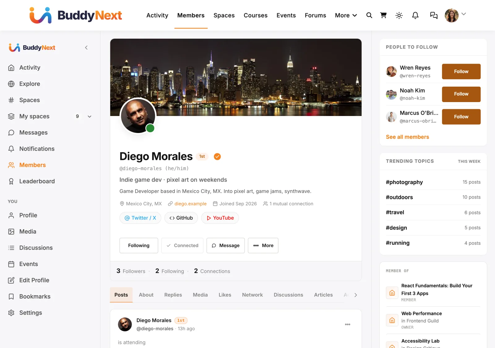
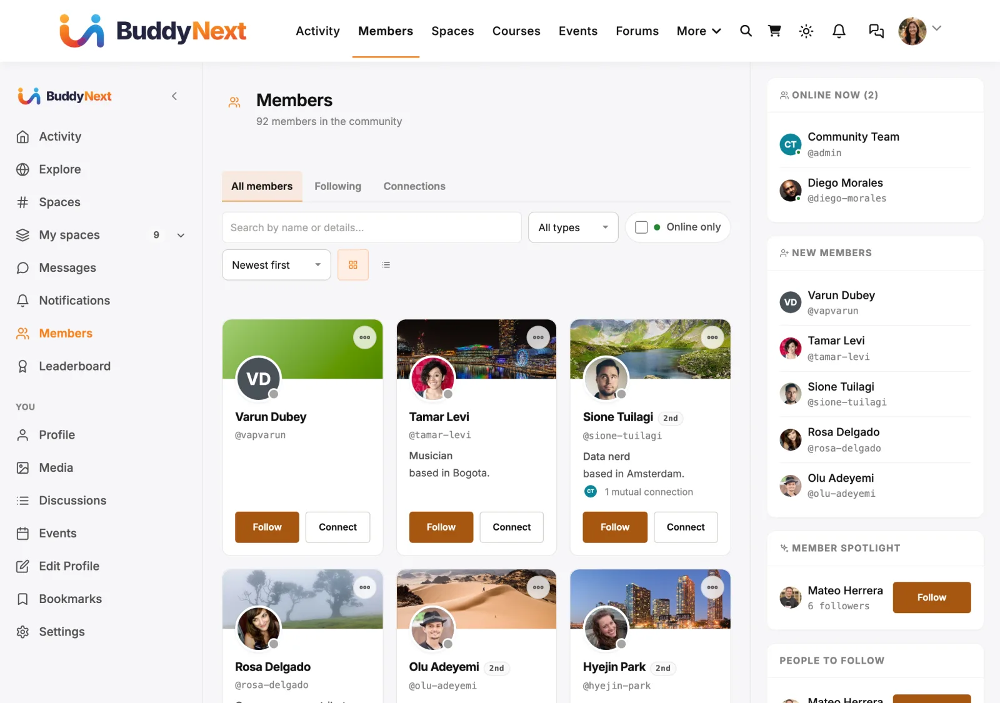

# Hooks: Members, Profiles, and Social Graph

The action and filter seams for user lifecycle, member profiles, profile fields, roles, and the social graph (follow, connection, block). This page is for developers building gamification plugins, integrations, or theme extensions that react to social activity or augment how members are rendered. Every hook below is fired or applied by BuddyNext Free, so it is available without Pro.





## Overview / Contract

- **Actions are notifications, not callbacks.** BuddyNext never calls addon code directly. It fires actions after a state change has committed, and you hook them. Listeners that need more than the passed IDs should re-fetch by ID (for example `buddynext_service( 'post_service' )->get( $post_id )`).
- **Filters either transform data or decide a yes/no.** A validation filter returns the data to keep, or a `WP_Error` to reject. A gate filter returns a boolean. A render filter returns a string of HTML.
- **Actor vs recipient.** BuddyNext fires an actor-perspective event for every social action (who did the thing) and, where it makes sense, a recipient-mirrored event alongside it (who the thing was done to). Gamification systems usually award the recipient. See Engagement events below.
- **User-overlay render filters echo their return value raw at the call site.** The hooked plugin is responsible for returning escaped HTML. The default value is an empty string, so BuddyNext renders nothing when no plugin hooks.

## User and member lifecycle actions

| Hook | Type | Fired when | Parameters |
|---|---|---|---|
| `buddynext_handle_history_limit` | filter | A member changes their handle and BuddyNext records the old one. Caps how many previous handles are kept per member, so an old handle can still resolve to its owner instead of 404ing or being silently re-issued. Default `0` (keep them all). | `int $limit` |
| `buddynext_profile_write_allowlist` | filter | The profile REST controller decides which fields a member may write about themselves. Anything not on the list is dropped rather than saved, so adding a custom field to the profile form also means adding it here. | `string[] $keys` (the accepted top-level keys) |
| `buddynext_reserved_profile_slugs` | filter | A member handle is generated or validated. These slugs are refused because they collide with BuddyNext's own profile sub-routes (`files`, `media`, `likes`, …); a member claiming one would shadow their own tab. Add your own to reserve them. | `string[] $slugs` |
| `buddynext_registration_pending` | action | A new registration is created but awaits admin approval | `int $user_id, string $email` |
| `buddynext_user_verified` | action | A member completes email verification | `int $user_id` |
| `buddynext_onboarding_completed` | action | A member finishes the onboarding wizard | `int $user_id` |
| `buddynext_member_suspended` | action | A member is suspended (member-domain mirror) | `int $user_id, int $by_user_id` |
| `buddynext_member_unsuspended` | action | A suspension is lifted | `int $user_id, int $by_user_id` from every call site, including the wp-admin Members screen. |
| `buddynext_member_approved` | action | A pending registration is approved | `int $user_id` |
| `buddynext_member_rejected` | action | A pending registration is rejected | `int $user_id` |
| `buddynext_purge_user_data` | action | A member is deleted and their relations are purged | `int $user_id, string $context` |

`buddynext_purge_user_data` is the canonical member-cleanup seam. It fires from `MemberCleanupService::purge_user_relations()` after BuddyNext removes the member's own social-graph rows, counters, and profile values, and **hard-deletes their authored posts and comments** (GDPR erasure). Hook it - rather than `deleted_user` - to clean up any per-user rows your addon stores. `$context` (`'delete'` or the erasure context) is informational only; both contexts hard-delete.

## Profile view seam

| Hook | Type | Fired when | Parameters |
|---|---|---|---|
| `buddynext_profile_viewed` | action | A member's profile is served to a different viewer (never on self-view) | `int $profile_user_id, int $viewer_id` |

> **Note:** The old `buddynext_profile_extra_data` filter that injected extra stat blocks into the profile header has been removed. Profile and space tabs are now registered through the unified Nav API - hook `buddynext_register_nav` to add a profile tab. See the integration registry (`buddynext_integrations`) for owner-toggle wiring.

## Profile tab pagination

A page past the end of a list answers 404 with BuddyNext's own "This page doesn't exist any more" view.
On a profile only the Articles tab pages; BuddyNext's other tabs are single pages, so `/page/N/` on them
is a 404. A tab your plugin adds is left alone unless it answers this filter.

| Hook | Type | Fires when | Args |
|------|------|------------|------|
| `buddynext_profile_tab_past_last_page` | filter | `/members/{slug}/{tab}/page/N/` is requested for a tab BuddyNext does not own | `bool\|null $past, string $tab, int $user_id, int $page` - return `true` for 404, `false` to render, `null` (default) to leave it to the tab |

## Profile field type and rendering filters

These extend the profile field system. The default field types and labels are resolved through manager methods, never from a raw constant, so a filter is the supported way to add a type.

| Hook | Type | Fired when | Parameters |
|---|---|---|---|
| `buddynext_profile_field_types` | filter | Resolving the allowed field type slugs | `string[] $types` |
| `buddynext_profile_field_type_labels` | filter | Building the admin type dropdown | `array<string,string> $labels` |
| `buddynext_profile_field_render` | filter | Rendering a single field value (front-end / block) | `string $html, string $type, array $field, mixed $value, int $user_id` |
| `buddynext_profile_field_validate` | filter | Validating a field value before persistence | `true\|WP_Error $result, string $type, mixed $value, array $field, int $user_id` |
| `buddynext_profile_field_type_options` | action | Rendering per-type config in the admin field builder | `string $type, array $field` |
| `buddynext_profile_field_updated` | action | A profile field definition is saved in the admin builder | `int $field_id` |
| `buddynext_profile_field_settings` | action | Rendering a field's Add or Edit panel, for EVERY type (unlike `buddynext_profile_field_type_options`, which is per type) | `array $field, array $group` - `$field` is empty on the Add panel |
| `buddynext_profile_field_options_sanitize` | filter | Sanitising the per-field add-on options posted as `bn_field_options[*]`. The built-in pass keeps scalars only; decode and sanitise structured values (e.g. JSON) for your own keys here | `array $out, array $raw` |
| `buddynext_profile_field_row_badges` | action | After a field's name in the admin field list | `array $field, array $group` |
| `buddynext_profile_field_setup_issues` | filter | Building the "Some profile fields need attention" notice on the Profile Fields screen. Append `array( 'field_id' => int, 'message' => string )`; the message follows the field label | `array $issues, array $groups` |
| `buddynext_profile_field_wrapper_attributes` | filter | Printing the wrapper of one profile field on any member form: profile edit, signup, complete-profile and the admin member editor. Free always adds `data-bn-field-key` | `string $extra, array $field, int $user_id` - return escaped attributes with a leading space; `$user_id` is `0` on signup |
| `buddynext_profile_group_wrapper_attributes` | filter | Printing the wrapper of one profile section on forms that render sections (profile edit, admin member editor). Free always adds `data-bn-group-key` | `string $extra, array $group, int $user_id` |
| `buddynext_profile_saved` | action | After `ProfileService::save_profile()` commits, from every entry point (REST self-edit, admin editor, onboarding, registration, importers) | `int $user_id, array $data` - `$data` is the submitted payload keyed by `field_key` |

Notes:

- The default for `buddynext_profile_field_types` is the 15 built-in types: `text`, `textarea`, `email`, `phone`, `url`, `social`, `number`, `date`, `daterange`, `select`, `multiselect`, `radio`, `checkbox`, `toggle`, `rating`. Pair a new slug with a `buddynext_profile_field_type_labels` entry so it shows a friendly name.
- `buddynext_profile_field_render` output is wrapped in `wp_kses_post()` by the block before emission, so allowed tags are the WordPress post-content set. `$field` carries `id`, `field_key`, `label`, `type`, `options`, `is_required`, `visibility`, `value`, `group_name`, and related keys.
- `buddynext_profile_field_validate` returning a `WP_Error` skips persisting that one value; other fields in the same save are unaffected. It fires in the profile save path for both flat and repeater fields.
- `buddynext_profile_field_type_options` output is rendered verbatim into the admin form. Escape on output.
- `buddynext_profile_field_settings` output is rendered verbatim inside the field's `<form>`. Post your values under `bn_field_options[your_key]`, then sanitise them on `buddynext_profile_field_options_sanitize`; they are merged into the field's `options` JSON.
- Updating a field's `options` over `PUT /buddynext/v1/profile-fields/{id}` replaces the choice list but keeps any string-keyed add-on options already stored on the field.
- `buddynext_profile_saved` is the place to react to "this member's answers changed". Re-entrant saves from inside it are allowed but must guard against recursion. BuddyNext Pro uses it to clear answers to fields that no longer apply to the member (see [Conditional Logic for Profile Fields](../pro/27-conditional-profile-fields.md)).

## Avatar and cover upload limits

Three filters set the ceiling for a profile image. Each takes a `$kind` of `'avatar'` or `'cover'`, so the two can be capped differently. All three are applied on the server in `ProfileController::validate_image_upload()` **and** passed to the browser through `AssetService`, so the client-side check and the server-side check stay in agreement - if you filter one, the other follows.

| Hook | Type | Fired when | Parameters |
|---|---|---|---|
| `buddynext_upload_max_megapixels` | filter | Validating a profile image's pixel count. Default `50.0` megapixels. | `float $megapixels, string $kind` |
| `buddynext_upload_max_dimension` | filter | Validating a profile image's longest side. Default `10000` pixels. | `int $pixels, string $kind` |
| `buddynext_upload_max_bytes` | filter | Validating a profile image's file size. Default 4 MB for `avatar`, 5 MB for `cover`. A value of `0` or less disables the byte check. | `int $bytes, string $kind` |

These exist because the previous fixed caps (1920x1080 for covers, 1024x1024 for avatars) refused an ordinary phone photo - a 4032x3024 shot is 12 megapixels and was rejected outright, so members had to crop by hand before uploading. The limits are now a generous pixel-count ceiling rather than a fixed frame, and an owner who needs a different ceiling raises or lowers it here.

```php
// Accept larger covers, keep avatars where they are.
add_filter( 'buddynext_upload_max_bytes', function ( int $bytes, string $kind ): int {
    return 'cover' === $kind ? 12 * 1024 * 1024 : $bytes;
}, 10, 2 );
```

## Social graph actions

These fire after the row is written and the relationship has changed.

| Hook | Type | Fired when | Parameters |
|---|---|---|---|
| `buddynext_user_followed` | action | A follow is created | `int $follower_id, int $following_id` |
| `buddynext_user_unfollowed` | action | A follow is removed | `int $follower_id, int $following_id` |
| `buddynext_connection_requested` | action | A connection request is sent | `int $connection_id, int $requester_id, int $recipient_id, string $note` |
| `buddynext_connection_accepted` | action | A connection request is accepted | `int $connection_id, int $requester_id, int $recipient_id` |
| `buddynext_connection_declined` | action | A connection request is declined | `int $connection_id, int $requester_id, int $recipient_id` |
| `buddynext_connection_withdrawn` | action | A pending request is withdrawn by the requester | `int $connection_id, int $requester_id, int $recipient_id` |
| `buddynext_block` | action | One member blocks another | `int $blocker_id, int $blocked_id` |
| `buddynext_unblock` | action | A block is removed | `int $blocker_id, int $blocked_id` |
| `buddynext_mute` | action | One member mutes another | `int $muter_id, int $muted_id` |
| `buddynext_unmute` | action | A mute is removed | `int $muter_id, int $muted_id` |
| `buddynext_privacy_preference_changed` | action | A member changes a privacy preference | `int $user_id, string $key, string $value` |

## Role and capability seams

| Hook | Type | Fired when | Parameters |
|---|---|---|---|
| `buddynext_role_map` | filter | Resolving the capability-to-role map; composes with `buddynext_user_can` | `array $map` |
| `buddynext_abilities` | filter | Registering the ability catalog (WordPress Abilities API) | `string[] $catalog` |

`buddynext_role_map` maps a capability to the role that grants it; the result composes with the permission gate so a custom role can satisfy `buddynext_can()`. Use `buddynext_abilities` to register custom ability slugs.

## User-overlay filters - the six read surfaces

Six member-facing surfaces apply a render filter so an external plugin (typically gamification: levels, badges, ranks) can inject a small piece of markup next to a member's name or avatar. Each surface applies its own filter, defaults to an empty string, and echoes the returned value raw. **The hooked plugin must return escaped HTML.**

| Hook | Type | Fired when | Parameters |
|---|---|---|---|
| `buddynext_member_card_meta_html` | filter | Rendering a member-directory / search-members card, or a space roster card (meta chip below the handle) | `string $html, int $user_id, array $context` (context carries `context` => `member_directory` \| `space_roster`) |
| `buddynext_member_card_min_bio_remainder` | filter | Deciding whether the tail of a bio is worth showing under an identical headline (default `12` characters) | `int $min` |
| `buddynext_post_byline_meta_html` | filter | Rendering a feed card byline (inline chip beside the author name) | `string $html, int $author_id, int $post_id` |
| `buddynext_profile_hero_badges_html` | filter | Rendering the profile hero badges row under the display name | `string $html, int $user_id` |
| `buddynext_avatar_overlay_html` | filter | Rendering inside `.bn-avatar` (level frame / corner badge); fires from profile-hero at size `2xl` and member-card at size `xl` | `string $html, int $user_id, string $size` |
| `buddynext_search_member_meta_html` | filter | Rendering a search-result member row (chip beside the member name) | `string $html, int $user_id` |
| `buddynext_comment_author_meta_html` | filter | Building the REST-rendered `author_meta_html` on comment rows (list / create / update); the JS template echoes it raw beside the commenter name | `string $html, int $user_id, int $comment_id` |

Example - a gamification plugin appends a badge row to the profile hero:

```php
add_filter( 'buddynext_profile_hero_badges_html', function ( string $html, int $user_id ): string {
    $badges = wb_gamification_get_user_badges( $user_id );
    // Return escaped markup - BuddyNext echoes this value raw.
    return $html . wb_gamification_render_badge_row( $badges );
}, 10, 2 );
```

## Session and daily-login pulses - the streak driver

`BuddyNext\Engagement\SessionTracker` registers on `wp_loaded` (priority 5) and fires two idempotent engagement events. Both bail for guests and for AJAX, REST, cron, and WP-CLI contexts, so they only fire on real logged-in page views.

| Hook | Type | Fired when | Parameters |
|---|---|---|---|
| `buddynext_user_session_started` | action | First page view in a sliding 30-minute window; re-fires after 30 minutes of inactivity | `int $user_id` |
| `buddynext_user_daily_login` | action | First qualifying page view of a UTC calendar day | `int $user_id, string $date_ymd` |

`buddynext_user_daily_login` is the canonical streak driver. Gamification plugins should increment a daily streak here, not from activity events, so a streak reflects logins rather than posting volume. The guard transients are `bn_session_{user_id}` (30-minute TTL) and `bn_daily_login_{user_id}_{Y-m-d}` (25-hour TTL).

## Engagement events - recipient-perspective signals

Gamification usually rewards the recipient of engagement (the member whose work was liked, commented on, or followed), not the actor. The actor-perspective events (`buddynext_user_followed`, `buddynext_reaction_added`, `buddynext_comment_created`) always fire; these recipient-mirrored events fire alongside them only when the recipient differs from the actor.

| Hook | Type | Fired when | Parameters |
|---|---|---|---|
| `buddynext_follower_gained` | action | A member gains a follower (mirror of `buddynext_user_followed`) | `int $followee_id, int $follower_id` |
| `buddynext_post_reaction_received` | action | A post receives a reaction (only when reactor differs from author) | `int $post_id, int $author_id, int $reactor_id, string $emoji` |
| `buddynext_post_comment_received` | action | A post receives a comment (only when commenter differs from author) | `int $comment_id, int $post_id, int $author_id, int $commenter_id` |
| `buddynext_hashtag_used` | action | A native post uses a hashtag (once per tag, `object_type='post'` only) | `string $tag, int $post_id, int $user_id` |
| `buddynext_dm_sent` | action | A DM is sent (BuddyNext-domain adapter over WPMediaVerse `mvs_message_sent`); once per send with the full clean recipient list | `int $sender_id, int $message_id, int $conversation_id, int[] $recipient_ids` |
| `buddynext_dm_received` | action | A DM is received (per-recipient mirror of `buddynext_dm_sent`); once per recipient, sender stripped | `int $recipient_id, int $sender_id, int $message_id, int $conversation_id` |

Example - award points to the member who gained the follower (the recipient), not the follower:

```php
add_action( 'buddynext_follower_gained', function ( int $followee_id, int $follower_id ): void {
    // $followee_id is the member who was followed; reward them.
    wb_gamification_award_points( $followee_id, 'follower_gained', [
        'source_user' => $follower_id,
    ] );
}, 10, 2 );
```

## Sidebar widget data - gamification-bridge seams

Right-sidebar widgets fall back to inline `COUNT` queries from `bn_*` tables when no plugin owns the data. A gamification plugin overrides a value by returning a non-null integer from the matching filter. Hook with `add_filter( 'hook', 'fn', 10, 2 )` to receive `(int|null $default, int $user_id)`.

| Hook | Type | Fired when | Parameters |
|---|---|---|---|
| `buddynext_user_active_dates` | filter | Building the greeting + streak widget | `array\|null $dates, int $user_id, int $window_days` (default 30) |
| `buddynext_user_activity_streak` | filter | Computing the trailing consecutive-days streak | `int $streak, int $user_id` |
| `buddynext_user_activity_best_month_streak` | filter | Computing the longest run this month | `int $best, int $user_id` |
| `buddynext_user_weekly_notifications_count` | filter | "This week" stats widget | `int\|null $count, int $user_id` |
| `buddynext_user_weekly_followers_gained` | filter | "This week" stats widget | `int\|null $count, int $user_id` |
| `buddynext_user_weekly_engagement_received` | filter | "This week" stats widget | `int\|null $count, int $user_id` |

Return `null` from `buddynext_user_active_dates` to fall through to BuddyNext's inline query; return an array of `YYYY-MM-DD` strings to override it.

## More member, profile, and social-graph seams

Narrower hooks that did not fit the sections above. Same table shape.

### Profile fields, groups, and strength

| Hook | Type | Fired when | Parameters |
|---|---|---|---|
| `buddynext_profile_fields` | filter | The full profile group and field tree is built. Add groups, or push fields onto an existing group's `fields`. | `array $groups` |
| `buddynext_profile_groups` | filter | The profile group list (without fields) is read. Register a virtual group in code here. | `array $groups` |
| `buddynext_profile_hero_fields` | filter | The profile hero's meta-row field keys are resolved, in render order. | `string[] $keys` |
| `buddynext_field_render_input` | filter | A profile field's edit input is rendered. Return an escaped HTML string to take over a custom field type; `null` falls through to the core types. | `string\|null $html, array $field, mixed $value, string $name` |
| `buddynext_field_sanitize` | filter | A submitted field value is validated and sanitized. Return a storable string or a `WP_Error` to take over; `null` falls through to the core types. | `string\|WP_Error\|null $result, array $field, mixed $raw` |
| `buddynext_field_searchable_text` | filter | A field value is turned into text for the member search index. | `string $text, array $field, mixed $value` |
| `buddynext_profile_strength_tasks` | filter | The Profile Strength checklist is built for a member. Each task is `array{label: string, done: bool}`. | `array $tasks, int $user_id, array\|null $profile` |
| `buddynext_profile_strength_changed` | action | A member's Profile Strength percentage actually changed. Reward systems keyed to "profile completed" should listen here (percent `100`). | `int $user_id, int $percent` |
| `buddynext_member_interests_updated` | action | A member's interests are saved, so suggestion caches can be refreshed. | `int $user_id` |
| `buddynext_handle_length_bounds` | filter | Handle length limits are read. The character set is not filterable. | `array $bounds` (`[ min, max ]`) |
| `buddynext_members_can_change_handle` | filter | A member tries to change their own handle. Return `false` for communities that fix handles to real names. | `bool $allowed, int $user_id` |
| `buddynext_account_deletion_requires_password` | filter | A member deletes their own account. Return `false` to skip the password re-check. | `bool $required` (default `true`) |
| `buddynext_user_search_visibility_changed` | action | A member changes the setting that decides whether their posts appear in global search, so their posts can be re-indexed. | `int $user_id` |
| `buddynext_author_link_to_profile` | filter | An author link is built. Return `false` to keep the default WordPress author URL. | `bool $to_profile, int $author_id` |

### Profile templates

| Hook | Type | Fired when | Parameters |
|---|---|---|---|
| `buddynext_profile_before` / `buddynext_profile_after` | action | Before and after the profile main content. | `int $user_id` |
| `buddynext_profile_connections_before` | action | Before the profile connections content. | `int $user_id` |
| `buddynext_profile_edit_before` | action | Before the profile edit form content. | `int $user_id` |
| `buddynext_profile_about_before` / `buddynext_profile_about_after` | action | Before and after the About tab's field-group cards. | `int $profile_user_id, int $viewer_id, array $profile` |
| `buddynext_profile_about_group_before` / `buddynext_profile_about_group_after` | action | Before and after one About group card. | `string $group_key, array $group, int $profile_user_id` |
| `buddynext_profile_about_groups` | filter | The About tab's group list is about to render. Reorder, add, or drop groups. | `array $groups, int $profile_user_id, int $viewer_id` |
| `buddynext_profile_group_upgrade_url` | filter | The profile editor shows a locked field group to its owner. Return the upgrade link for the plan that unlocks it; empty hides the link. | `string $url, string $group_key, int $user_id` |
| `buddynext_profile_articles_per_page` | filter | The Member Blog profile tab sets its page size (default `10`). | `int $per_page` |
| `buddynext_members_before` / `buddynext_members_after` | action | Before and after the members directory content. | `int $current_user_id` |
| `buddynext_messages_list_before` / `buddynext_messages_list_after` | action | Before and after the messages list. | none |
| `buddynext_messages_requests_before` / `buddynext_messages_requests_after` | action | Before and after the message requests list. | none |
| `buddynext_messages_thread_before` / `buddynext_messages_thread_after` | action | Before and after a message thread. | `int $conversation_id` |

### Member directory

| Hook | Type | Fired when | Parameters |
|---|---|---|---|
| `buddynext_member_directory_query_args` | filter | The directory query args are resolved, before the SQL is built. Adjust `per_page`, `sort`, and `filters`. | `array $query_args, string $scope, int $viewer_id` (`$scope` is always `member_directory`) |
| `buddynext_member_directory_order_by` | filter | The ORDER BY fragment is built (without the `ORDER BY` keyword). It is interpolated into SQL, so return only column references and `ASC`/`DESC`, and end with `u.ID` as a tie-breaker. | `string $order_by, int $viewer_id, array $query_args` |
| `buddynext_member_directory_items` | filter | The hydrated member rows are about to be returned. Reorder or enrich them; removing rows does not adjust `total` or the cursor. | `array $items, string $scope, int $viewer_id, array $query_args` |
| `buddynext_directory_members_primed` | action | Core has bulk-primed a page of members (directory and space roster), so an add-on can batch-load its own per-member data. | `int[] $page_ids, int $viewer_id` |
| `buddynext_rest_member_item` | filter | A member item is shaped for REST (directory and space roster rows). Only add fields; roster rows carry fewer keys. | `array $item, int $user_id` |
| `buddynext_member_card_cover_tone` | filter | A member card picks its cover tone (`sky`, `cyan`, `emerald`, `lime`, `amber`, `coral`). | `string $tone, int $member_id` |

### Follow, connection, and restrict

| Hook | Type | Fired when | Parameters |
|---|---|---|---|
| `buddynext_follow_requested` | action | A follow request lands on a private account. | `int $follower_id, int $following_id` |
| `buddynext_follow_request_approved` | action | An owner approves a pending follow request. | `int $owner_id, int $follower_id` |
| `buddynext_follow_request_rejected` | action | An owner rejects a pending follow request. | `int $owner_id, int $follower_id` |
| `buddynext_user_followed_first_time` | action | A user follows someone for the first time, once per user, for onboarding flows. | `int $follower_id, int $following_id` |
| `buddynext_can_follow` | filter | Whether an actor may follow a target. Default follows the target's who-can-follow preference. | `bool $can, int $target_id, int $actor_id` |
| `buddynext_can_connect` | filter | Whether an actor may send a connection request to a target. | `bool $can, int $target_id, int $actor_id` |
| `buddynext_can_view_connections` | filter | Whether a viewer may see a user's followers and following lists. | `bool $can, int $owner_id, int $viewer_id` |
| `buddynext_social_denied_error` | filter | A follow or connect is refused and the `WP_Error` is built. Listeners must return a `WP_Error`. | `WP_Error $error, string $action, int $actor_id, int $target_id` (`$action` is `follow` or `connect`) |
| `buddynext_follow_suggestions` | filter | The "who to follow" id list is built, in rank order. | `int[] $ids, int $user_id` |
| `buddynext_followers` | filter | A user's follower id list is read (approved follows, newest first). | `int[] $ids, int $user_id` |
| `buddynext_following` | filter | A user's following id list is read (approved follows, newest first). | `int[] $ids, int $user_id` |
| `buddynext_interest_match_ceiling` | filter | Interest matching for suggestions sets its selectivity ceiling; categories picked by more than this fraction of members are ignored (default `0.10`). | `float $fraction, int $user_id` |
| `buddynext_max_following` | filter | The follow cap per member is read (default `5000`). The app config route advertises the value from the same filter. | `int $cap, int $user_id` (the app config call passes `$cap` only) |
| `buddynext_max_connections` | filter | The connection cap per member is read (default `5000`). | `int $cap, int $user_id` (the app config call passes `$cap` only) |
| `buddynext_connect_note_max_length` | filter | The max length of a connection note is read (default and ceiling `280`). | `int $max` |
| `buddynext_connection_redeclare_cooldown` | filter | A declined requester asks again. How long they must wait (default 7 days). | `int $seconds, int $requester_id, int $recipient_id` |
| `buddynext_mutual_list_cap` | filter | A mutual-connections list is read. The ceiling on returned rows. | `int $cap, int $user_a, int $user_b` |
| `buddynext_user_restricted` | action | A member restricts another (only when a new restrict row was written). | `int $actor_id, int $target_id` |
| `buddynext_user_unrestricted` | action | A restrict is removed (only when a row was removed). | `int $actor_id, int $target_id` |
| `buddynext_user_relations_purged` | action | A deleted user's relations are purged. Kept for older listeners; prefer `buddynext_purge_user_data`. | `int $user_id` |
| `buddynext_credits_spent` | action | Credits are successfully spent from a member's balance. | `int $user_id, int $amount, string $reason` |
| `buddynext_presence_visible_to_anonymous` | filter | Whether online presence is shown to logged-out visitors (default `false`). | `bool $visible` |

### Export and erasure

| Hook | Type | Fired when | Parameters |
|---|---|---|---|
| `buddynext_member_erase_map` | filter | The member purge builds its list of user-keyed tables. Register an add-on table so it is deleted and counted before the member is reported erased. | `array $map` (unprefixed table => `where`, `sweep`) |
| `buddynext_member_retain_map` | filter | The list of tables deliberately kept on erasure. Every add-on user table must be on exactly one of the two maps. | `array $map` (unprefixed table => reason) |
| `buddynext_privacy_export_exclusions` | filter | Tables that are erased but not exported. Each needs a human reason. | `array $exclusions` (unprefixed table => reason) |
| `buddynext_privacy_export_redactions` | filter | Columns omitted from an otherwise exported table. | `array $redactions` (unprefixed table => columns) |
| `buddynext_privacy_export_table_label` | filter | The export group label for a derived table is resolved. | `string $label, string $table` |
| `buddynext_export_per_page` | filter | Rows per export page (default `100`). | `int $per_page` |
| `buddynext_data_export_cooldown` | filter | A member requests their data export. How long until they can request another (default 5 minutes). | `int $seconds` |
| `buddynext_purge_post_chunk` | filter | A member purge cascades authored posts in slices (default `100`). | `int $chunk` |
| `buddynext_purge_time_budget` | filter | A purge sets how long it may run in one request before deferring the rest (default `10` seconds). | `float $seconds, int $user_id, string $context` (`delete` or `gdpr-erase`) |

### Capability denial

| Hook | Type | Fired when | Parameters |
|---|---|---|---|
| `buddynext_capability_denied_error` | filter | A REST action is refused by a capability check and the `WP_Error` is built. Free's message blames the member's role; a listener that denies for another reason, such as a plan limit, replaces it. Listeners must return a `WP_Error`. | `WP_Error $error, string $capability, int $user_id, array $context` |

## Notes / gotchas

- **Re-fetch for full objects.** Social and engagement actions pass IDs, not full rows. Resolve the rest through the relevant service. Note the social graph is three separate container keys, not one: `follows`, `connections` and `blocks`. Posts are `post_service`. There is no `social_graph` binding - `social_graph` is a feature-registry slug, and asking the container for it throws.
- **Recipient mirrors are conditional.** `buddynext_post_reaction_received` and `buddynext_post_comment_received` do not fire on self-engagement (author reacting to or commenting on their own post). `buddynext_follower_gained` always fires because following yourself is not possible.
- **Overlay filters are not sanitized for you.** The six read surfaces echo raw. A plugin that returns unescaped user input introduces an XSS hole. Escape before returning.
- **Free vs Pro.** Every hook on this page is fired by Free. Pro and gamification plugins are consumers - they attach to these seams rather than re-implementing the social graph. For notification and email seams, see Hooks: Notifications and Email.

## Profile field presentation (About tab)

The profile About tab renders arbitrary owner-defined field groups by field **type**, never by field identity. The renderer cannot predict which groups or fields a site owner has created, so it never keys layout on a field's key or label - it asks the type engine how that type should look. `BuddyNext\Profile\FieldType::presentation_for( string $type )` maps every field type (built-in or add-on) to one of four presentation modes. The mode selects only the wrapper layout; the value itself is still produced by `render_display()`.

| Mode | When | Example types |
|---|---|---|
| `block` | A full-width block for long prose | `textarea` |
| `link` | A standalone external-link affordance | `url` |
| `chips` | A row of chips for any multi-value type (`value_kind === 'multi'`) | `multiselect`, `category_multiselect`, `member_type_multiselect` |
| `inline` | Label + value on one line (the default) | every scalar/bool type - `text`, `number`, `date`, `email`, `phone`, `select`, `radio`, `boolean`, `color` - plus any unknown type, which degrades here safely |

The decision order is: `textarea` maps to `block`, `url` maps to `link`, any type whose `value_kind` is `multi` maps to `chips`, and everything else maps to `inline`. An add-on can override the mode for any type through a filter.

| Hook | Type | Fired when | Parameters |
|---|---|---|---|
| `buddynext_field_presentation` | filter | Resolving the About-tab layout for a field type | `string $mode, string $type` - return one of `block`, `chips`, `link`, `inline` |
| `buddynext_field_render_display` | filter | A profile field is rendered as HTML for the profile-view (About tab). Return an escaped string to take over rendering for your own field type; return `null` to fall through to the core types | `string\|null $custom, array $field, mixed $value` |
| `buddynext_field_display_text` | filter | A profile field is rendered as plain text (no HTML) for app-native rendering, notifications, and exports. Return a string to take over rendering for your own field type; return `null` to fall through to the core types | `string\|null $custom, array $field, mixed $value` |
| `buddynext_field_rest_value` | filter | A profile field value is shaped for a REST or app payload. Same contract as above - return a value to take over, `null` to fall through | `bool\|int\|float\|string\|array\|null $custom, array $field, mixed $value` |
| `buddynext_profile_field_is_active` | filter | A profile save, or the registration requirements check, decides whether a field applies to this submission. An inactive field is not required and not validated. Called with an EMPTY `$data` for a render check (`FieldType::is_profile_field_active()`), where returning `false` renders a locked notice instead of an input | `bool $active, array $field, array $data, int $user_id` - `$data` is keyed by `field_key`; `$user_id` is `0` for a prospect at signup |
| `buddynext_profile_group_locked` | filter | A profile group is checked for lock state, meaning "not included in their plan". Defaults to `false`, so Free never locks anything | `bool $locked, string $group_key, int $user_id` |
| `buddynext_relation_list_cap` | filter | A whole-relation list is read (followers, following, connections), bounding how many rows load at once. Raise only if you know the memory is there; the paged reads are the safer route | `int $cap, string $relation, int $user_id` |

The filter's return value is clamped: `presentation_for()` accepts only the four valid modes, and any other return value falls back to `inline`. This keeps an add-on from breaking the About tab by returning an unrecognised layout name.

Example - render a custom `spotlight` type as a full-width block instead of the default inline row:

```php
add_filter( 'buddynext_field_presentation', function ( string $mode, string $type ): string {
    return 'spotlight' === $type ? 'block' : $mode;
}, 10, 2 );
```
