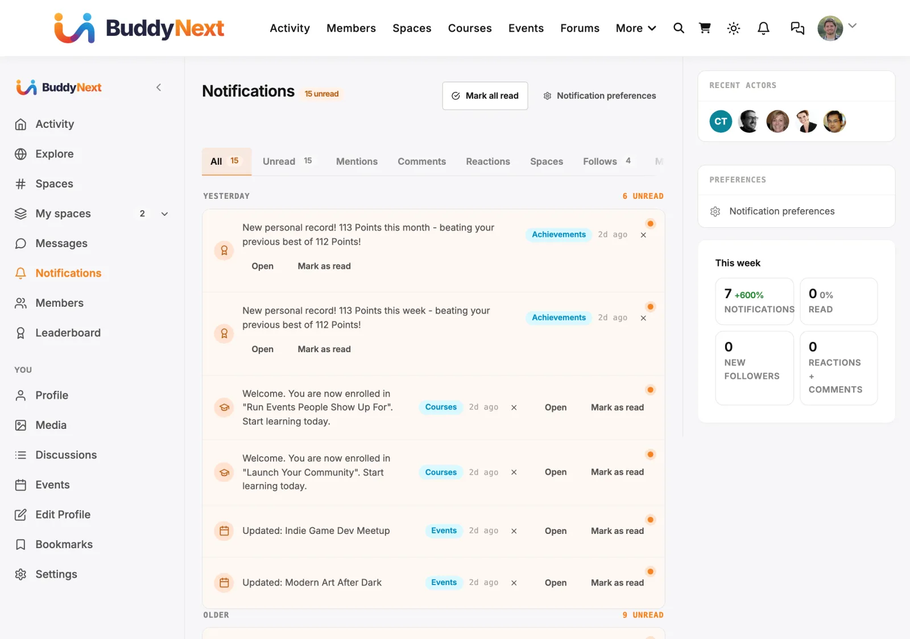

# Hooks: Notifications and Email

The action and filter seams for the notification lifecycle and the email system. This page is for developers adding a notification channel (push, SMS), suppressing or deferring notifications, capturing outbound email, or registering a new notification type that emails its recipient. Everything here is fired by BuddyNext Free; Pro push is the reference consumer.



## Overview / Contract

Every notification fans in through one method: `NotificationService::create( array $data )`. That method enforces a single, ordered pipeline so each notification passes the same gates regardless of which feature raised it.

```
NotificationService::create( $data )
  1. in-app preference check  -> buddynext_notification_force_on_site (filter, escape hatch)
  2. should-send gate         -> buddynext_notification_should_send   (filter, return false to drop)
  3. deferral resolution      -> buddynext_notification_send_at       (filter, schedule for later)
  4. write row (insert OR merge into an unread group row)
  5. fire                     -> buddynext_notification_created       (action)
       |- EmailDispatchListener -> EmailSender::send() -> email channel
       |- Pro PushDispatcher    -> push channel (priority 20)
```

Key contract rules:

- **One creation path, one created action.** Both the fresh-insert path and the group-merge path resolve the gate and deferral filters and then fire `buddynext_notification_created` with the same payload shape. A listener does not need to know whether a row was inserted or merged.
- **`$data` is the payload everywhere.** The `$data` array passed to `create()` is the same array handed to `buddynext_notification_should_send`, `buddynext_notification_send_at`, and the third argument of `buddynext_notification_created`. It carries at least `recipient_id` and `type`, plus optional `sender_id`, `object_type`, `object_id`, `group_key`, and a nested `data` array.
- **Returning 0 means nothing was sent.** If a preference suppresses the notification, the should-send gate returns false, or the write fails, `create()` returns `0` and never fires the created action. Channels (email, push) only run when a row actually exists.
- **Channels are listeners, not core branches.** The email channel is `EmailDispatchListener` hooked on `buddynext_notification_created` at priority 10. Pro's push channel is a separate listener on the same action at priority 20. Adding a channel means adding a listener, not editing core.

## Notification lifecycle hooks

| Hook | Type | Fired when | Parameters |
|---|---|---|---|
| `buddynext_notification_should_send` | filter | Before any write, deciding whether to persist the notification | `bool $should, array $payload` |
| `buddynext_notification_send_at` | filter | After the should-send gate passes, resolving deferred delivery | `?string $send_at, array $payload` |
| `buddynext_notification_force_on_site` | filter | When checking the recipient's in-app preference, to force-send a critical type | `bool $force, int $recipient_id, string $type, array $data` |
| `buddynext_transactional_notification_types` | filter | Resolving which notification types are **transactional**, meaning they bypass the member's email preferences entirely and always send. The core set is `email_verify` and `welcome`. Add a type here only when the member genuinely cannot opt out of it - the case this was opened for is Pro's upcoming-renewal notice, where EU and California auto-renewal rules require advance notice before a card is charged. The returned array is cast to strings, de-duplicated and emptied of blanks. | `string[] $types` |
| `buddynext_notification_created` | action | After a notification row is inserted or merged into an unread group | `int $notification_id, int $recipient_id, array $data` |
| `buddynext_notification_ungroupable_types` | filter | Resolving which notification types must never collapse into a grouped row | `string[] $types` |
| `buddynext_media_notification_url` | filter | Resolving where a media notification (comment, favorite, reaction, mention) opens | `string $url, int $media_id` |
| `buddynext_notification_visible_rows` | filter | Reading a page of a member's notifications, after rows whose object is gone are dropped | `array[] $rows` |
| `buddynext_notification_sources` | filter | Listing the integrations whose notification hook carries the shared payload | `array $sources` |
| `buddynext_notification_group_label` | filter | Naming a settings section BuddyNext does not own (an integration's) | `string $label, string $group` |

Details:

- `buddynext_notification_should_send` defaults to `true`. Return `false` to drop the notification silently before it reaches the database or any channel. Pro AI fatigue detection uses this to suppress low-signal notifications.
- `buddynext_notification_send_at` defaults to `null` (send now). Return a MySQL / ISO 8601 datetime string to mark the notification for deferred delivery. Free stores the value in the row's `data` JSON; Pro acts on it for quiet-hours and digest batching.
- `buddynext_notification_force_on_site` defaults to `false`. Unknown or system types already default to on-site = true, so critical notices are never suppressed by an absent preference; this filter is the escape hatch for forcing a normally-opt-out type through.
- `buddynext_notification_ungroupable_types` defaults to an empty array. A type belongs on this list when each occurrence is individually actionable or individually meaningful - a direct message is not "3 messages", it is three things you have to read. Grouping is per PAGE: repeats that span a page boundary stay separate, because aggregating in SQL would break the keyset cursor the list pages on. The visible item count therefore varies per page, while the cursor still advances by ROWS, so nothing is skipped.

  ```php
  add_filter( 'buddynext_notification_ungroupable_types', function ( array $types ): array {
      $types[] = 'my_plugin_approval_request'; // each one needs its own decision
      return $types;
  } );
  ```

- `buddynext_media_notification_url` defaults to `''`, which falls back to the activity feed. The WPMediaVerse bridge answers with the post the media is in, or the media's own page.
- WB Gamification decides which personal records reach the inbox with its own `wb_gam_personal_record_notify` filter (default: `week` and `month` records whose previous best was at least 10). A record is announced once per period (one row per member per site-calendar week or month); later records in the same period refresh that row's number without a new alert.

- `buddynext_notification_visible_rows` receives the raw rows of one page (each has `recipient_id`, `type`, `object_type`, `object_id`, `sender_id` and the JSON `data`). It is for a plugin whose notifications are mirrored into the bell: that plugin owns who may see its content, so it removes its own rows the recipient should not see (a banned author, trashed content). Return every other row untouched. It filters the list only; unread counts are not recalculated.

  ```php
  add_filter( 'buddynext_notification_visible_rows', function ( array $rows ): array {
      return array_filter( $rows, function ( array $row ): bool {
          return 'my_plugin.notice' !== $row['type'] || my_plugin_can_see( (int) $row['recipient_id'], (int) $row['object_id'] );
      } );
  } );
  ```

- `buddynext_notification_created` is the canonical "a notification happened" signal. The `$type` lives at `$data['type']`. Note the parameter order: `$notification_id, $recipient_id, $data` (the data array, not a bare type string).

- `buddynext_notification_sources` lists the integrations that send notifications to the bell through one shared payload. Each plugin passes that payload as the LAST argument of its own notification hook, so its other listeners are untouched; BuddyNext reads it, shows it in the bell with the plugin's words, link and icon, and never emails it (the plugin sends its own email). Our plugins are registered already. Add yours to take part:

  ```php
  add_filter( 'buddynext_notification_sources', function ( array $sources ): array {
      $sources['my_plugin'] = array(
          'hook'   => 'my_plugin_notification_created', // your existing hook
          'prefix' => 'my_plugin',                      // for my_plugin_community_notification_types / _visible / _removed
          'label'  => __( 'My plugin', 'my-plugin' ),
          'icon'   => 'bell',
      );
      return $sources;
  } );

  // Wherever you notify a member: your existing arguments, then the payload.
  do_action( 'my_plugin_notification_created', $notification_id, array(
      'recipient_id' => $user_id,
      'type'         => 'item_approved',
      'actor_id'     => 0,
      'object_type'  => 'item',
      'object_id'    => $item_id,
      'message'      => __( 'Your item was approved.', 'my-plugin' ), // plain text
      'url'          => get_permalink( $item_id ),
      'group_key'    => '', // same key = unread rows merge ("Aisha and 3 others...")
  ) );
  ```

  Declare your types on `{prefix}_community_notification_types` (slug => `label`, `description`, `default_on`) to give members a switch per type; answer `{prefix}_community_notification_visible` (`array $visible, int $viewer_id, array $targets`, return key => bool) to hide rows the viewer may no longer see; fire `{prefix}_community_notification_removed( $object_type, $object_id )` when an object is permanently deleted. A grouped row ("Aisha and 2 others replied") carries the container as its object (the topic) and one event per person: send `item_type` and `item_id` (the reply), `message_single` (one person, `{actor}` placeholder) and `message_grouped` (`{actor}` and `{others}`, which becomes a translated "1 other" / "3 others"). BuddyNext keeps each event as (person, item), counts people, not events, and asks your `_visible` filter about each item too (target `item => true`, with the person as `actor_id`): answer false for a gone, trashed or banned item and the row shrinks, then disappears when none is left. Send an anonymous event with `actor_id` 0 and its own `group_key` and it never merges. The `group_key` and the object must describe what `url` opens, because a merged row keeps the first event's link. BuddyNext reads the payload only once your types are declared. For a running notice whose number only grows (a weekly best), add `'renotify' => false` with a `group_key` per period: repeats then refresh the existing row quietly instead of alerting again.

  **Email.** Contract types are bell-only by default. While BuddyNext is active it owns member email, so a plugin that stops sending its own should let BuddyNext send it instead: add `'email' => true` to the type's declaration. That type then appears in the member's notification settings with email on (they can turn it off), and BuddyNext emails your `message` as the subject with a View link to your `url`, in the site's email layout. A site or another plugin can opt a type in or out without your release through `buddynext_notification_type_email` (`bool $emails, string $source, string $slug, array $type`). Example: BuddyNext's own MediaVerse bridge opts `mediaverse.media_mention` in, while reactions stay bell-only.
- `buddynext_notification_group_label` names a settings section by its group key when BuddyNext does not own the group. Integration sections are named already.

## Preference hooks

| Hook | Type | Fired when | Parameters |
|---|---|---|---|
| `buddynext_notification_prefs` | filter | Resolving a user's full preference map | `array[] $prefs, int $user_id` |
| `buddynext_notification_prefs_catalogue` | filter | Building the list of notification types shown on the preferences screen | `array $catalogue` |
| `buddynext_notification_prefs_before` | action | Rendering the top of the notification preferences template | `int $user_id` |
| `buddynext_notification_prefs_after` | action | Rendering the bottom of the notification preferences template | `int $user_id` |

`buddynext_notification_prefs` is how a channel plugin injects its own preference rows without modifying Free. The map is keyed by notification type; each entry follows Free's shape (at minimum `{ on_site: bool, email_freq: string }`) plus any channel keys your plugin owns. Pro push attaches here:

```php
// Pro PushPrefService registers on Free's filter.
add_filter( 'buddynext_notification_prefs', function ( array $prefs, int $user_id ): array {
    foreach ( $prefs as $type => &$row ) {
        $row['push_enabled'] = my_push_pref( $user_id, $type ); // bool
    }
    return $prefs;
}, 10, 2 );
```

## Email hooks

The email channel is driven by `EmailSender`. Event emails render from a `bn_email_templates` row keyed by notification type; a composed email (a campaign or drip step that carries its own subject and body) bypasses the template row. Both paths converge on one `wp_mail()` call wrapped by the same identity and shell.

| Hook | Type | Fired when | Parameters |
|---|---|---|---|
| `buddynext_email_payload` | filter | Immediately before `wp_mail()`, after subject/body/headers are assembled | `array $payload, string $template_slug, array $context` |
| `buddynext_email_shell` | filter | Wrapping the email body in the branded HTML shell; return HTML containing the literal `{{email_body}}` token to fully replace the default shell | `string $shell, string $body, string $subject` |
| `buddynext_queue_email_digest` | action | A notification is routed to a digest queue instead of an immediate send | `int $user_id, string $notification_type, array $data` |
| `buddynext_send_notification_email` | action | Action Scheduler callback to send a notification email asynchronously | `int $user_id, string $notification_type, array $data` |
| `buddynext_email_template_catalogue` | filter | Building the list of templates on Settings -> Notifications -> Email Templates | `array $catalogue` |
| `buddynext_logs_purged` | action | A retention purge finishes, so a site can log or monitor what was removed | `array{notifications:int,email_log:int} $deleted, int $window` |
| `buddynext_email_failure_alert_threshold` | filter | The Email Log admin banner decides whether to warn about delivery. It shows once failed sends in the last 24 hours reach this number. Default `5`; return `0` to never show it (1.2.0) | `int $threshold` |

Details:

- `buddynext_email_payload` receives `$payload` with keys `to`, `subject`, `body`, `headers`. Return the array to modify recipients, subject, or body. Return an array with `'send' => false` to suppress the `wp_mail()` call entirely - Pro broadcast and drip use this to capture the message for batched campaign delivery rather than sending inline. `$template_slug` is the notification type (matches `bn_email_templates.type`); `$context` is the original `$data` array.
- Sender identity is centralized: `EmailSender::from_name()` and `from_address()` fall back to the site name and admin email when Settings -> Email is blank, and `build_identity_headers()` applies the configured Reply-To as a per-message header so it survives any `wp_mail_from` override.
- `buddynext_email_template_catalogue` is how a plugin puts its own emails on the owner's editor screen, and it is not cosmetic. That screen writes to `bn_email_templates`, which is where `EmailSender` reads the subject, the body, and the `enabled` flag it checks before sending. **A type absent from the catalogue cannot be switched off by the owner at all** — on a screen that lists every other email the site sends, which reads as "that email does not exist here". Seeding a row is half the feature; this filter is the other half.

  Add a group keyed by its heading. Every key is required, and `tokens` drives the test-send sampler — a token you leave out of it reaches the owner's test email as a literal `{{brace}}`.

  ```php
  add_filter( 'buddynext_email_template_catalogue', function ( array $catalogue ): array {
      $catalogue[ __( 'Mentoring', 'my-plugin' ) ] = [
          'my.mentor_assigned' => [
              'name'    => __( 'Mentor assigned', 'my-plugin' ),
              'trigger' => __( 'When a mentor is assigned to a member', 'my-plugin' ),
              'tokens'  => [ '{{user_name}}', '{{site_name}}', '{{action_url}}', '{{unsubscribe_url}}', '{{mentor_name}}' ],
              'subject' => 'Meet your mentor, {{mentor_name}}',
              'preview' => 'Your mentor is ready to say hello',
              'body'    => '<p>Hi {{user_name}},</p><p>{{mentor_name}} is now your mentor on {{site_name}}.</p><p><a href="{{action_url}}">Say hello</a></p>',
          ],
      ];

      return $catalogue;
  } );
  ```

  Define this copy **once** and have your installer's seed read the same array. Two literals — one seeded, one for the editor — drift apart silently, and the drift lands in the worst possible place: the owner edits one body and the member receives the other.

- The digest path fires `buddynext_queue_email_digest` when an event is destined for a digest rather than an immediate email. There is no per-user accumulator meta: the daily and weekly digest crons batch straight from the `bn_notifications` rows (joined against `bn_notification_prefs`), so nothing has to be written to a queue and kept in sync. A member's per-type `email_freq` preference (`immediate`, `daily`, `weekly`, `off`) decides whether an event emails immediately, is picked up by the digest cron, or is suppressed.

## Examples

### Register a new notification type with its own listener

Raise a notification through the canonical service so it inherits the full pipeline (preferences, gating, grouping, email + push channels). You do not register a listener to *receive* the created action for your own type; you call `create()` and the existing channel listeners deliver it. Add an email template row for the type if you want it to email.

```php
// 1. Raise the notification from wherever your event commits.
add_action( 'my_plugin_mentor_assigned', function ( int $mentee_id, int $mentor_id ): void {
    buddynext_service( 'notifications' )->create( [
        'recipient_id' => $mentee_id,
        'sender_id'    => $mentor_id,
        'type'         => 'mentor_assigned',      // your custom type slug
        'object_type'  => 'user',
        'object_id'    => $mentor_id,
        'group_key'    => 'mentor_assigned_' . $mentee_id, // optional: merge bursts
        'data'         => [ 'mentor_id' => $mentor_id ],
    ] );
}, 10, 2 );

// 2. (Optional) Provide the human-readable message string for in-app + email + push.
//    The filter passes five arguments and expects a string back.
add_filter( 'buddynext_notification_message', function ( string $message, string $type, string $actor_name, int $object_id, array $data ): string {
    if ( 'mentor_assigned' === $type ) {
        return sprintf( __( '%s was assigned as your mentor.', 'my-plugin' ), $actor_name );
    }
    return $message;
}, 10, 5 );

// 3. (Optional) Provide the click-through URL for the notification. Same five-arg
//    shape; return an absolute URL (or the passed-in $url to leave it unchanged).
add_filter( 'buddynext_notification_url', function ( string $url, string $type, int $actor_id, int $object_id, array $data ): string {
    if ( 'mentor_assigned' === $type ) {
        return home_url( '/mentorship/' . $object_id . '/' );
    }
    return $url;
}, 10, 5 );
```

Because the notification flows through `create()`, the in-app row, the email (if a template or message exists), and Pro push all dispatch from the single `buddynext_notification_created` action - no per-channel wiring on your side.

### Suppress a notification with buddynext_notification_should_send

Drop a notification before it is written or emailed. This runs in both the insert and group-merge paths, so a suppressed type never leaks through grouping.

```php
add_filter( 'buddynext_notification_should_send', function ( bool $should, array $payload ): bool {
    // Stop low-signal 'reaction' notifications during a recipient's quiet window.
    if ( 'reaction' === ( $payload['type'] ?? '' ) && my_is_in_quiet_hours( (int) $payload['recipient_id'] ) ) {
        return false; // create() returns 0; no row, no email, no push.
    }
    return $should;
}, 10, 2 );
```

To defer rather than drop, return a future datetime from `buddynext_notification_send_at` instead:

```php
add_filter( 'buddynext_notification_send_at', function ( ?string $send_at, array $payload ): ?string {
    if ( my_is_in_quiet_hours( (int) $payload['recipient_id'] ) ) {
        return gmdate( 'Y-m-d H:i:s', strtotime( 'tomorrow 8:00' ) );
    }
    return $send_at;
}, 10, 2 );
```

## Notes / gotchas

- **`buddynext_notification_created` carries the data array, not a type string.** The third argument is the full `$data` payload; read the type from `$data['type']`. Some older integration snippets pass a bare `$type` as the third arg - the current signature is `( int $notification_id, int $recipient_id, array $data )`.
- **Channels run at distinct priorities.** Email dispatch is priority 10, Pro push is priority 20, both on `buddynext_notification_created`. Pick a priority that does not collide if you add another channel.
- **Suppression vs deferral are different filters.** `buddynext_notification_should_send` drops permanently; `buddynext_notification_send_at` schedules. Do not use a should-send return of false expecting a retry.
- **Composed emails bypass template rows.** A disabled `bn_email_templates` row suppresses its own event email but never a composed campaign or drip email, which carries its own subject and body through `buddynext_email_payload`. Suppressing campaign mail is the `'send' => false` return, not a template toggle.
- **Free vs Pro.** Free fires every hook on this page and ships the email channel. Pro push (`PushDispatcher` on `buddynext_notification_created`, `PushPrefService` on `buddynext_notification_prefs`) is the reference example of adding a channel without touching Free. For the social and engagement actions that typically raise notifications, see Hooks: Members, Profiles, and Social Graph.
