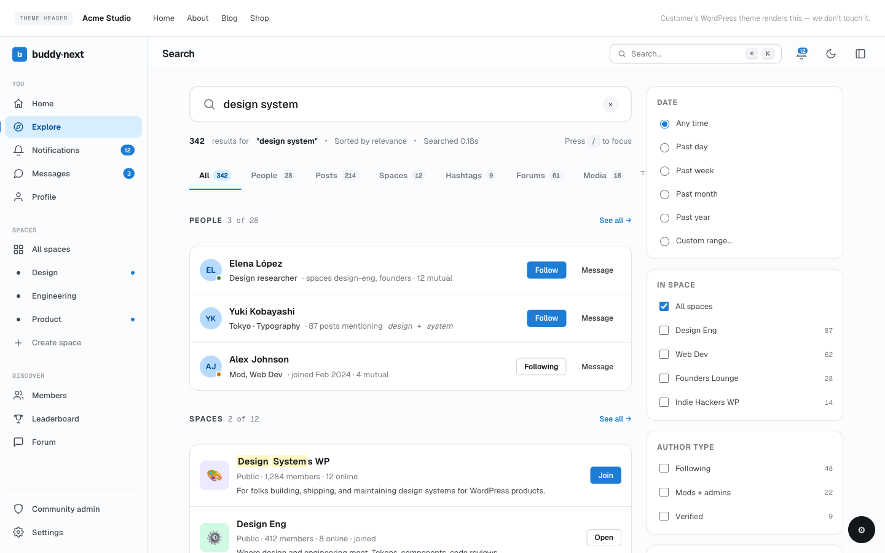

# Hooks: Search, Hashtags, Sidebar, and Admin

The action and filter seams for unified search, the hashtag system, the search index, the right-sidebar widgets (greeting, streak, this-week stats, leaderboard, gamification overlays), and the admin information architecture. This page is for developers building search drivers, hashtag analytics, gamification sidebars, or admin extensions that add or relocate settings tabs. Every hook below is fired or applied by BuddyNext Free, so it is available without Pro - and the Pro search seams (`buddynext_search_query_args` / `buddynext_search_filter_options`) are listed here because they are the points Pro plugs its advanced member filters into.



## Overview / Contract

- **Search has a layered extension model.** You can replace the entire result set with an external driver (`buddynext_search_results`), shape the query args before the built-in SQL runs (`buddynext_search_query_args`), enrich each row after it returns (`buddynext_search_item`), or react to a completed search (`buddynext_search_performed`). Pick the lowest-impact seam that does the job.
- **Do not drop rows in `buddynext_search_item`.** That filter is mutate-only. Removing items there desyncs the `total` count and the cursor. To exclude results, constrain the query through `buddynext_search_query_args`.
- **Sidebar gamification seams are null-default overrides.** Every `buddynext_user_weekly_*`, `buddynext_user_activity_*`, and `buddynext_user_active_dates` filter passes `null` by default; BuddyNext runs its own inline SQL only when the filter returns `null`. A gamification plugin returns its canonical value to take over, and BuddyNext skips the query entirely.
- **Admin tabs register against their origin section, then the hub places them.** A registrar always passes its own domain section to `register_tab()`; the canonical `TAB_PLACEMENT` map (filtered by `bn_admin_hub_tab_placement`) decides the final section, sidebar position, and visibility. This keeps the information architecture in one place while every feature stays decoupled.

## Search seams

| Hook | Type | Fired when | Parameters |
|---|---|---|---|
| `buddynext_search_results` | filter | Before the built-in SQL runs; return a non-null result set to bypass BuddyNext's query entirely (external search driver) | `null\|array $result, string $query, string $type, int $per_page, int $page` |
| `buddynext_search_query_args` | filter | The query args are assembled, before the built-in SQL builds its WHERE clauses (the Pro advanced-filter seam: tier, space, member-label, joined-after) | `array $args, string $query, int $viewer_id` |
| `buddynext_search_item` | filter | Once per result row on the built-in SQL path (mutate-only; does not run when a driver short-circuits) | `array $item, string $query, string $type, int $viewer_id, array $args` |
| `buddynext_search_results` (results side) | filter | After items are built, to post-process the result set | `array $results, ...` |
| `buddynext_search_performed` | action | A search has completed and the result set is finalised | `string $query, int $viewer_id, array $args, array $results` |
| `buddynext_search_filter_options` | filter | The advanced member-search controls are populated (Pro supplies tier / space / member-label option lists; empty groups hide their control) | `array $options` |
| `buddynext_search_member_meta_html` | filter | A member row in the results renders its meta line | `string $html, ...` |
| `buddynext_search_before` / `buddynext_search_after` | action | Around the search results page body | - |

> **Note:** `buddynext_search_query_args` is where the `member_label`, `tier_slug`, `space_id`, and `joined_after` keys enter the query. BuddyNext Free reads any of those keys if present, but only BuddyNext Pro populates them (and populates `buddynext_search_filter_options` so the controls appear). The page degrades cleanly with Pro inactive: no provider, no control.

## Hashtag seams

| Hook | Type | Fired when | Parameters |
|---|---|---|---|
| `buddynext_hashtag_pattern` | filter | The regex used to extract hashtags from content (default `/#([\p{L}][\p{L}\p{N}_]{0,49})/u`) | `string $pattern` |
| `buddynext_hashtag_used` | action | A hashtag is recorded against a piece of content (fires once per tag) | `string $tag, int $object_id, int $user_id` |
| `buddynext_hashtag_related_discussions` | filter | The "related discussions" list on a hashtag feed is built (Jetonomy supplies discussions here) | `array $discussions, ...` |
| `buddynext_hashtag_feed_before` / `_after` | action | Around the hashtag feed body | - |

The hashtag system also exposes the full `buddynext_part_hashtag_*` template-part family (hero, posts list, sidebar-about, sidebar-related, sidebar-top-contributors, empty-state), each with the standard `_before` / `_after` / `_args` / `_classes` four-hook contract. See Hooks: Template Parts for that convention.

## Search index

| Hook | Type | Fired when | Parameters |
|---|---|---|---|
| `buddynext_reindex_complete` | action | A full search-index rebuild finishes | - |
| `buddynext_index_user` | action | A user is (re)indexed into the search index | `int $user_id` |

## Sidebar and gamification seams

The right sidebar is the main surface a gamification plugin augments. The greeting/streak card, the this-week stats card, and the profile hero all expose override filters that default to `null` or empty, so BuddyNext computes a fallback only when nothing hooks them.

### Sidebar injection points

| Hook | Type | Fired when | Parameters |
|---|---|---|---|
| `buddynext_right_sidebar` | action | Inside the right-sidebar column, on every hub that opts in | `string $hub` |
| `buddynext_leaderboard_before` / `_after` | action | Around the leaderboard page body | - |
| `buddynext_greeting_string` | filter | The personalised greeting line in the sidebar card is built | `string $greeting, int $hour, WP_User $user` |
| `buddynext_profile_hero_badges_html` | filter | The badge strip on a profile hero renders (return pre-escaped HTML; default empty) | `string $html, int $user_id` |

### Streak override filters (greeting/streak card)

| Hook | Type | Fired when | Parameters |
|---|---|---|---|
| `buddynext_user_active_dates` | filter | Resolving which days a member was active in the trailing window | `array\|null $dates, int $user_id, int $window_days` |
| `buddynext_user_activity_streak` | filter | Resolving the current consecutive-day streak | `int $streak, int $user_id` |
| `buddynext_user_activity_best_month_streak` | filter | Resolving the best run within the current month | `int $best, int $user_id` |

### This-week stats override filters

Each metric on the this-week stats card defaults to `null` so a gamification plugin can supply its canonical figure; the inline COUNT runs only on a `null` return.

| Hook | Type | Fired when | Parameters |
|---|---|---|---|
| `buddynext_user_weekly_notifications_count` | filter | Notifications received in the last 7 days | `int\|null $count, int $user_id` |
| `buddynext_user_weekly_notifications_prev_count` | filter | Notifications received in the prior 7 days (for the week-over-week delta) | `int\|null $count, int $user_id` |
| `buddynext_user_weekly_notifications_read_count` | filter | Notifications read in the last 7 days | `int\|null $count, int $user_id` |
| `buddynext_user_weekly_followers_gained` | filter | Followers gained in the last 7 days | `int\|null $count, int $user_id` |
| `buddynext_user_weekly_engagement_received` | filter | Reactions + comments received in the last 7 days | `int\|null $count, int $user_id` |

> **Tip:** Returning a real value from any of these short-circuits BuddyNext's own query, so an integration that already tracks the metric removes that query from the page render. Return `null` to fall back to BuddyNext's computation.

## Admin information-architecture seams

The admin hub owns the BuddyNext top-level menu and arranges every settings tab into a fixed set of sections (Settings, Platform, Members, Spaces, Engagement, Notifications, Realtime and Push, Campaigns, Moderation, Auto-Moderation, Monetization). A section appears in the sub-menu only once a tab is registered into it.

| Hook | Type | Fired when | Parameters |
|---|---|---|---|
| `bn_admin_hub_sections` | filter | The section map is resolved; add, rename, or reorder top-level admin sections | `array $sections` |
| `bn_admin_hub_tab_placement` | filter | The tab-placement map is resolved; move, reorder, or hide any registered tab | `array $map` |
| `bn_admin_hub_default_icon_map` | filter | The fallback tab-slug -> icon map is resolved | `array $map` |
| `bn_admin_hub_pages` | filter | The admin page catalogue (used by the command-palette index) is built | `array $catalogue` |
| `buddynext_settings_tab_subtitles` | filter | Per-tab subtitle strings shown under the tab heading | `array $subtitles` |
| `buddynext_admin_license_tab_content` | action | The Settings > License tab renders (Pro hooks its activate/deactivate form here) | - |
| `buddynext_profile_field_types` | filter | The available custom-profile-field type list is built | `array $types` |
| `buddynext_profile_field_type_labels` | filter | Field-type labels for the admin UI | `array $labels` |
| `buddynext_before_edit_member_form` / `_after_edit_member_form` | action | Around the admin member-edit form | - |
| `buddynext_outbound_webhook_limit` | filter | The max number of outbound webhooks an admin can register | `int $limit` |

> **Note:** `bn_admin_hub_sections` and `bn_admin_hub_tab_placement` use the internal `bn_*` prefix because they wire admin chrome. They are stable extension points, but treat the section/tab keys as the public contract rather than the surrounding admin classes. See Hooks Overview for the `buddynext_*` vs `bn_*` distinction.

## Examples

### Relocate an admin tab via `bn_admin_hub_tab_placement`

The placement map is keyed by a tab's origin `section:slug`. Each rule can set the final `section`, the sidebar `position` (lower sorts earlier), or `hidden`. This moves the webhooks tab out of Settings into Notifications, and hides the social-connections tab entirely:

```php
add_filter(
	'bn_admin_hub_tab_placement',
	function ( $map ) {
		// Move the webhooks tab from Settings to the Notifications section.
		$map['settings:webhooks']['section']  = 'notifications';
		$map['settings:webhooks']['position'] = 40;

		// Hide a tab without touching the code that registers it.
		$map['settings:social']['hidden'] = true;

		return $map;
	}
);
```

To add a brand-new top-level section for your own tabs to live in, register it first via `bn_admin_hub_sections` (it stays hidden until a tab lands in it):

```php
add_filter(
	'bn_admin_hub_sections',
	function ( $sections ) {
		$sections['marketplace'] = array(
			'slug'  => 'buddynext-marketplace',
			'label' => __( 'Marketplace', 'my-ext' ),
		);
		return $sections;
	}
);
```

### Add a sidebar widget seam via `buddynext_right_sidebar`

`buddynext_right_sidebar` fires inside the right-sidebar column on every hub that opts in, passing the current hub slug so you can scope your widget to specific surfaces:

```php
add_action(
	'buddynext_right_sidebar',
	function ( $hub ) {
		// Only show this widget on the home feed and the explore hub.
		if ( ! in_array( $hub, array( 'home', 'explore' ), true ) ) {
			return;
		}

		printf(
			'<section class="bn-sidebar-card my-streak-widget"><h3>%s</h3><p>%s</p></section>',
			esc_html__( 'Your reputation', 'my-ext' ),
			esc_html( my_gamification_reputation_line( get_current_user_id() ) )
		);
	}
);
```

### Supply a gamification streak so BuddyNext skips its own query

```php
add_filter(
	'buddynext_user_activity_streak',
	function ( $streak, $user_id ) {
		// Our plugin already tracks streaks - return ours and BuddyNext
		// skips its 30-day UNION query for this card.
		return (int) my_gamification_current_streak( $user_id );
	},
	10,
	2
);
```

## Notes and gotchas

- **Choose the right search seam.** Use `buddynext_search_query_args` to constrain or extend the query, `buddynext_search_results` to replace the engine wholesale, and `buddynext_search_item` only to annotate rows. Never delete rows in `buddynext_search_item` - it breaks pagination totals.
- **The Pro search filters are present but unpopulated in Free.** `buddynext_search_query_args` and `buddynext_search_filter_options` are the exact points BuddyNext Pro injects advanced member filters; your own driver can use the same keys without Pro.
- **Sidebar override filters trade a query for your value.** Returning a real value from the `buddynext_user_weekly_*` / `buddynext_user_activity_*` filters removes the corresponding inline query from the page render. Return `null` to keep BuddyNext's fallback.
- **Admin sections are hidden until populated.** Registering a section via `bn_admin_hub_sections` does not show it; it appears only once a tab is placed into it. Hidden tabs (`'hidden' => true`) still keep their registration, so removing the filter restores them.
- **Free vs Pro.** Every hook here is Free. Pro contributes tabs into the same hub sections, populates the same search filters, and can override the same sidebar metrics - there is no separate Pro hub or Pro search pipeline. For the moderation, safeguard, and authentication seams, see Hooks: Moderation, Trust, and Authentication.
