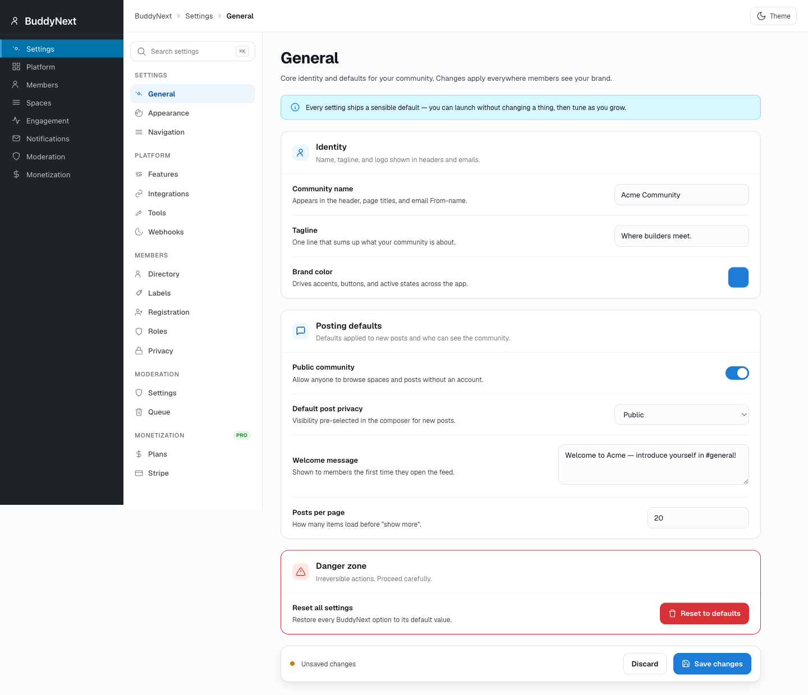

# Pro and Integration Hooks

This page covers the hooks that cross plugin boundaries: the actions and filters BuddyNext Pro emits, the integration seams BuddyNext exposes to companion plugins (WPMediaVerse, Jetonomy, the real-time transport), and the PWA seams. It is for developers extending Pro, building a companion plugin, or wiring a gamification/CRM layer onto the free/pro contract.




For the core free hook surface (post, reaction, comment, space, moderation events) see the Core Hooks reference. This page is the layer above it.

## The free/pro contract: the `consumed_by` field

Pro's manifest (`buddynext-pro/audit/manifest.json`) records every hook Pro fires under `hooks_fired`, and each entry carries a `consumed_by` array. That array is the documented cross-plugin contract: it names which plugins (`buddynext`, `buddynext-pro`, or neither) actually attach a listener to the hook.

- `consumed_by: ["buddynext", "buddynext-pro"]` - the hook is part of the live free<->pro wiring. Removing or renaming it breaks a real listener in the paired plugin. Treat it as a frozen contract.
- `consumed_by: ["buddynext-pro"]` - Pro fires it and Pro consumes it (internal to the Pro layer), but it is still a public seam you may hook.
- `consumed_by: []` - Pro fires it but nothing in the free/pro pair listens. It exists as an extension seam for your code or a companion plugin (gamification, CRM, analytics). These are safe, stable hooks; the empty array means "no first-party consumer," not "private."

The same `consumed_by` mapping is what lets a third party (for example wb-gamification) know which events are guaranteed to fire. Read the manifest entry before hooking - it tells you the firing site (`where`), the argument count (`args_count`), and who else is on the wire.

> **Note:** `consumed_by` describes first-party listeners only (the two BuddyNext plugins). Your own `add_action()`/`add_filter()` callbacks never appear there. An empty `consumed_by` is the normal state for a clean extension point.

## Pro-emitted hooks with their free<->pro mapping

The table lists every hook Pro fires. Names are exact. The `consumed_by` column reproduces the manifest contract.

| Hook | Type | Fired when | Parameters | consumed_by |
|---|---|---|---|---|
| `buddynext_ability_granted` | action | A Stripe `customer.subscription.created`/`.updated`/`invoice.paid` event resolves to an active or trialing subscription. Also fired by Free's access webhook. | `int $user_id, string $ability` (Pro) - Free's `AccessWebhookController` adds a third `string $source` | `buddynext`, `buddynext-pro` |
| `buddynext_ability_revoked` | action | A Stripe `customer.subscription.deleted` event (or expiry) removes a tier ability. Also fired by Free's access webhook. | `int $user_id, string $ability` | `buddynext` |
| `buddynextpro_stripe_subscription_synced` | action | After any Stripe subscription event has been synced into Pro state (created, updated, deleted, invoice). | `int $user_id, string $tier_slug, array $event` | (none) |
| `buddynext_pro_subscription_created` | action | A `bn_subscriptions` row is created (the canonical "user became a paying customer" event). | `int $sub_id, int $user_id, int $tier_id, string $source` | (none) |
| `buddynext_pro_subscription_expired` | action | A subscription lapses (daily expiry cron or webhook). | `int $sub_id, int $user_id, int $tier_id` | (none) |
| `buddynext_reaction_added` | action | A reaction is added (Pro re-fires through `SignalsCollector` for AI ranking). | `string $object_type, int $object_id, int $user_id, string $emoji` | `buddynext`, `buddynext-pro` |
| `buddynext_comment_created` | action | A comment is created (consumed by Pro's signal collector, realtime dispatcher, analytics). | `int $comment_id, string $object_type, int $object_id, int $user_id` | `buddynext`, `buddynext-pro` |
| `buddynext_user_followed` | action | A follow relationship is created (AI affinity + analytics signal). | `int $follower_id, int $following_id` | `buddynext`, `buddynext-pro` |
| `buddynext_post_created` | action | A post is created, including when a scheduled post is published. | `int $post_id, int $user_id, string $type` | `buddynext`, `buddynext-pro` |
| `buddynext_pro_ai_reply_generated` | action | An AI smart-reply suggestion request succeeds. | `int $user_id, int $post_id, int $suggestion_count` | (none) |
| `buddynext_pro_label_assigned` | action | A custom member label is assigned to a user. | `int $user_id, string $label_slug` | (none) |
| `buddynext_pro_label_unassigned` | action | A custom member label is removed from a user. | `int $user_id, string $label_slug` | (none) |
| `buddynext_pro_broadcast_dispatched` | action | A broadcast campaign is sent. | `int $broadcast_id, int $recipient_count` | (none) |
| `buddynext_pro_bulk_action_executed` | action | A moderator runs a Pro bulk moderation operation. | `string $action_slug, int $actor_id, array $target_ids` | (none) |
| `buddynext_pro_loaded` | action | End of Pro's `Plugin::init()` - the Pro equivalent of Free's `buddynext_loaded`, for binding vertical modules. | (none) | (none) |
| `buddynext_pro_bind_services` | action | During Pro service-container binding, for registering custom service bindings. | `object $container` | (none) |
| `buddynext_profile_field_render` | filter | A Pro advanced profile field type is rendered. | `string $html, string $type, array $field, mixed $value` | `buddynext-pro` |
| `buddynext_search_query_args` | filter | Pro injects advanced search filter args before the SQL is built. | `array $args, string $query, array $context` | `buddynext`, `buddynext-pro` |

> **Note:** `buddynext_ability_granted` is fired with two arguments by Pro's Stripe `WebhookController` and with three (the extra `$source`) by Free's `AccessWebhookController`. Always register your callback for the lowest arg count you need (`add_action( 'buddynext_ability_granted', $cb, 10, 2 )`) so it works regardless of which producer fires.

### Custom reactions

Pro's custom premium reactions do not get their own event. They flow through the standard `buddynext_reaction_added` action above. To distinguish a premium reaction, inspect `$emoji` against `CustomReactionsService::get_custom_reactions()`.

## Integration seam hooks (BuddyNext exposes)

These are filters and actions BuddyNext (Free) defines so companion plugins can plug in. They are the supply side of the contract - Pro and third parties hook them.

### Outbound webhooks

```php
// Maximum number of outbound webhook endpoints a site may register.
// Free returns 1; Pro's UnlimitedWebhooksIntegration returns PHP_INT_MAX.
apply_filters( 'buddynext_outbound_webhook_limit', int $limit )
// Default: 1
```

The webhook engine itself (`OutboundWebhookService`) lives in Free. Pro only lifts the cap through this filter - it does not duplicate the delivery code.

### Real-time transport

```php
// Filter the active real-time transport. Resolve via TransportFactory::current().
// Never instantiate a transport directly. The returned value must implement
// BuddyNext\Realtime\RealtimeTransport; a non-conforming return silently falls
// back to PollingTransport.
apply_filters( 'buddynext_realtime_transport', RealtimeTransport $transport )
// Default: new PollingTransport()  (clients poll via REST)
```

Free ships a polling transport (5s active poll). Pro returns a WebSocket-backed transport so events push to connected clients instantly:

```php
add_filter(
    'buddynext_realtime_transport',
    static fn() => new \BuddyNextPro\Realtime\WebSocketTransport( $config )
);
```

Pro's `RealtimeDispatcher` then fans the standard free events (`buddynext_post_created`, `buddynext_reaction_added`, `buddynext_comment_created`, `buddynext_notification_created`, `mvs_message_sent`) out to Soketi channels.

### White-label

```php
// Plugin brand name shown in the UI. Resolve via Plugin::brand_name().
apply_filters( 'buddynext_brand_name', string $name )
// Default: 'BuddyNext'

// Plugin brand logo URL shown in the UI. Resolve via Plugin::brand_logo_url().
apply_filters( 'buddynext_brand_logo_url', ?string $url )
// Default: null
```

### WPMediaVerse seams (mvs_* hooks BuddyNext uses)

Direct messaging runs on WPMediaVerse; BuddyNext is the UI layer over it. These filters live in WPMediaVerse and BuddyNext hooks them:

```php
// BuddyNext returns true so WPMediaVerse suppresses its own chat panel + nav link.
apply_filters( 'mvs_buddynext_active', bool $active )

// BuddyNext injects a bn_blocks check before a message can be sent.
apply_filters( 'mvs_can_send_message', bool $allowed, int $sender_id, int $recipient_id )

// BuddyNext Pro verifies WebSocket availability for real-time DM.
apply_filters( 'mvs_messaging_transport', object $transport )
```

WPMediaVerse fires these actions, which BuddyNext bridges into community surfaces:

```php
do_action( 'mvs_message_sent',     int $message_id, int $conversation_id, int $sender_id, array $recipient_ids )
do_action( 'mvs_media_uploaded',   int $media_id, int $user_id, array $media_data )
do_action( 'mvs_media_deleted',    int $media_id )
do_action( 'mvs_reaction_added',   int $media_id, int $user_id, string $emoji )
do_action( 'mvs_comment_created',  int $comment_id, int $media_id, int $user_id )
do_action( 'mvs_favorite_toggled', int $media_id, int $user_id, string $action ) // 'added' | 'removed'
do_action( 'mvs_mentions_created', array $mentioned_user_ids, string $context_type, int $context_id )
```

Pro's `RealtimeDispatcher` consumes `mvs_message_sent` to push a `message.new` event to the `private-conv-{N}` channel.

### Jetonomy

Jetonomy (forums/discussions) integrates through the general-purpose injection filters rather than a dedicated hook set:

```php
// Add a Discussions count to the profile header stat row.
apply_filters( 'buddynext_profile_extra_data', array $extra, int $user_id )

// Add a Forum tab to a space nav bar.
apply_filters( 'buddynext_space_tabs', array $tabs, int $space_id )

// Add a Forum link to the left navigation rail.
apply_filters( 'buddynext_rail_items', array $items, string $hub )
```

Jetonomy discussions also surface in the search index and the Explore deck as type `discussion`. See the Core Hooks reference for the full signatures of these injection filters.

### PWA seams

```php
// Gate service-worker registration. Return false to disable the PWA without
// unhooking PwaService. Front-end only (skipped in wp-admin).
apply_filters( 'buddynext_pwa_register_sw', bool $emit )
// Default: true

// Customise the Web App Manifest array before it is served at
// /wp-json/buddynext/v1/pwa/manifest.
apply_filters( 'buddynext_pwa_manifest', array $manifest )
```

> **Note:** The manifest filter is `buddynext_pwa_manifest` (it filters the whole manifest array). There is no separate `buddynext_pwa_register_manifest` hook - the manifest link tag is emitted on `wp_head` unconditionally and shaped through `buddynext_pwa_manifest`.

```php
// Disable the PWA entirely.
add_filter( 'buddynext_pwa_register_sw', '__return_false' );

// Override the install prompt name and theme color.
add_filter( 'buddynext_pwa_manifest', function ( array $manifest ): array {
    $manifest['name']        = 'Acme Community';
    $manifest['short_name']  = 'Acme';
    $manifest['theme_color'] = '#1d4ed8';
    return $manifest;
} );
```

## Example: provision access on `buddynext_ability_granted`

`buddynext_ability_granted` is the canonical "this user just gained an entitlement" event and the clearest illustration of the free<->pro contract. It is fired by two producers - Free's `AccessWebhookController` (an external CRM or payment platform POSTs to the access webhook) and Pro's Stripe `WebhookController` (a Stripe subscription went active) - and consumed by both plugins. Pro's `WebhookSubscriptionSync` listens for it to create a `bn_subscriptions` row whenever the ability matches the `tier:<slug>` convention.

Your own code hooks the same event to provision whatever the membership unlocks - a download, an LMS enrollment, a Slack invite - without caring which producer fired it:

```php
/**
 * Provision external access when a member gains a tier ability.
 *
 * Fires for BOTH the Stripe webhook (Pro) and the inbound access webhook (Free),
 * so a single listener covers every grant path. Register for 2 args - the Free
 * producer passes a third ($source) but you rarely need it.
 */
add_action(
    'buddynext_ability_granted',
    function ( int $user_id, string $ability ): void {
        // Tier grants follow the `tier:<slug>` convention.
        if ( 0 !== strncmp( $ability, 'tier:', 5 ) ) {
            return;
        }

        $tier_slug = substr( $ability, 5 );

        // Provision your own external access here.
        my_lms_enroll_user( $user_id, $tier_slug );
        my_crm_tag_customer( $user_id, 'tier-' . $tier_slug );
    },
    10,
    2
);
```

To reverse the provisioning when the entitlement is lost, hook the paired `buddynext_ability_revoked` action (also fired by both Stripe cancellation and the access webhook):

```php
add_action(
    'buddynext_ability_revoked',
    function ( int $user_id, string $ability ): void {
        if ( 0 === strncmp( $ability, 'tier:', 5 ) ) {
            my_lms_unenroll_user( $user_id, substr( $ability, 5 ) );
        }
    },
    10,
    2
);
```

## Notes and gotchas

- **Boot order.** Pro boots at `plugins_loaded:20` (Free at `:15`, bridges at `:25`). Register Pro-dependent listeners on `buddynext_pro_loaded`, not on an arbitrary `plugins_loaded` priority.
- **REST namespaces are separate.** Pro routes live under `buddynext-pro/v1`; Free under `buddynext/v1`. The PWA manifest and service worker are served from Free's `buddynext/v1` namespace.
- **An empty `consumed_by` is stable, not private.** Hooks like `buddynext_pro_subscription_created` and `buddynext_pro_broadcast_dispatched` have no first-party listener but are the documented contract for gamification/CRM integrations.
- **`buddynext_ability_granted` arg count differs by producer.** Free passes three args (`$source` last), Pro passes two. Register for two to stay compatible with both.
- **Future events.** Pro documents presence and voice-room events (`buddynext_pro_presence_online`, `buddynext_pro_voice_call_started`, `buddynext_pro_voice_call_joined`) as the contract for services that have not shipped yet. Do not rely on them firing until the corresponding Pro service exists.
