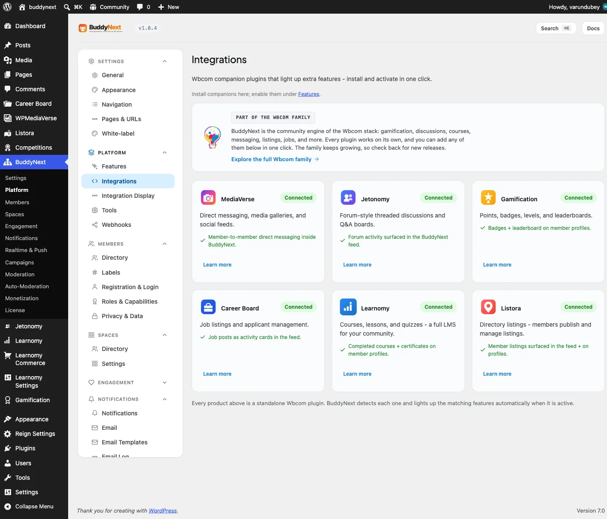

# Pro and Integration Hooks

This page covers the hooks that cross plugin boundaries: the actions and filters BuddyNext Pro emits, the integration seams BuddyNext exposes to companion plugins (WPMediaVerse, Jetonomy, the real-time transport), and the PWA seams. It is for developers extending Pro, building a companion plugin, or wiring a gamification/CRM layer onto the free/pro contract.




For the core free hook surface (post, reaction, comment, space, moderation events) see the Core Hooks reference. This page is the layer above it.

## The free/pro contract: the "consumed by" column

The table below carries a **consumed by** column for every hook Pro fires. It names which of the two BuddyNext plugins actually attaches a listener, and it is the cross-plugin contract:

- **`buddynext`, `buddynext-pro`** - the hook is part of the live free-to-Pro wiring. Removing or renaming it breaks a real listener in the paired plugin. Treat it as a frozen contract.
- **`buddynext-pro`** - Pro fires it and Pro consumes it, internal to the Pro layer, but it is still a public seam you may hook.
- **(none)** - Pro fires it and nothing in the pair listens. It exists as an extension seam for your code or a companion plugin (gamification, CRM, analytics). These are safe, stable hooks; "none" means no first-party consumer, not private.

This is what lets a third party such as wb-gamification know which events are guaranteed to fire. Confirm the argument list against the call site before you hook - grep the hook name in the Pro plugin's `includes/`.

> **Note:** the column describes first-party listeners only, meaning the two BuddyNext plugins. Your own `add_action()` / `add_filter()` callbacks never appear there, so "none" is the normal state for a clean extension point.

## Pro-emitted hooks with their free<->pro mapping

The table lists every hook Pro fires. Names are exact.

| Hook | Type | Fired when | Parameters | consumed_by |
|---|---|---|---|---|
| `buddynext_ability_granted` | action | A Stripe `customer.subscription.created`/`.updated`/`invoice.paid` event resolves to an active or trialing subscription. Also fired by Free's access webhook, and by every membership grant bridge (WooCommerce, Paid Memberships Pro, and any third-party source). | `int $user_id, string $ability, string $source` - Pro's Stripe path omits the third argument; the access webhook and the grant bridges supply it. **`$source` is honoured only when declared** - see the note below. | `buddynext`, `buddynext-pro` |
| `buddynext_ability_revoked` | action | A Stripe `customer.subscription.deleted` event (or expiry) removes a plan ability. Also fired by Free's access webhook, and by every membership grant bridge. | `int $user_id, string $ability` | `buddynext` |
| `buddynextpro_stripe_subscription_synced` | action | After any Stripe subscription event has been synced into Pro state (created, updated, deleted, invoice). | `int $user_id, string $tier_slug, array $event` | (none) |
| `buddynext_pro_subscription_created` | action | A `bn_subscriptions` row is created (the canonical "user became a paying customer" event). | `int $sub_id, int $user_id, int $tier_id, string $source` | (none) |
| `buddynext_pro_subscription_expired` | action | A subscription lapses (daily expiry cron or webhook). | `int $sub_id, int $user_id, int $tier_id` | (none) |
| `buddynext_reaction_added` | action | A reaction is added (Pro re-fires through `SignalsCollector` for AI ranking). | `string $object_type, int $object_id, int $user_id, string $emoji` | `buddynext`, `buddynext-pro` |
| `buddynext_comment_created` | action | A comment is created (consumed by Pro's signal collector, realtime dispatcher, analytics). | `int $comment_id, string $object_type, int $object_id, int $user_id` | `buddynext`, `buddynext-pro` |
| `buddynext_user_followed` | action | A follow relationship is created (AI affinity + analytics signal). | `int $follower_id, int $following_id` | `buddynext`, `buddynext-pro` |
| `buddynext_post_created` | action | A post is created, including when a scheduled post is published. | `int $post_id, int $user_id, string $type` | `buddynext`, `buddynext-pro` |
| `buddynext_pro_ai_reply_generated` | action | An AI smart-reply suggestion request succeeds. | `int $user_id, int $post_id, int $suggestion_count` | (none) |
| `buddynext_pro_label_assigned` | action | A custom member label is assigned to a user. | `int $user_id, int $label_id, int $assigned_by_id` | (none) |
| `buddynext_pro_label_unassigned` | action | A custom member label is removed from a user. | `int $user_id, int $label_id` | (none) |
| `buddynext_pro_broadcast_dispatched` | action | A broadcast campaign is sent. | `int $broadcast_id, int[] $user_ids` | (none) |
| `buddynext_pro_bulk_action_executed` | action | A moderator runs a Pro bulk moderation operation. | `string $action, int[] $ids, int $actor_id, array $summary` | (none) |
| `buddynext_pro_loaded` | action | End of Pro's `Plugin::init()` - the Pro equivalent of Free's `buddynext_loaded`, for binding vertical modules. | (none) | (none) |
| `buddynext_pro_bind_services` | action | During Pro service-container binding, for registering custom service bindings. | `object $container` | (none) |
| `buddynext_profile_field_render` | filter | A Pro advanced profile field type is rendered. | `string $html, string $type, array $field, mixed $value, int $user_id` | `buddynext-pro` |
| `buddynext_search_query_args` | filter | Pro injects advanced search filter args before the SQL is built. | `array $args, string $query, int $viewer_id` | `buddynext`, `buddynext-pro` |
| `buddynextpro_stripe_webhook_skipped` | action | A Stripe subscription event was accepted but not acted on. Fired from `WebhookController::skip()`, so attaching an existing book of subscriptions can be audited rather than guessed at. | `string $reason, string $reference, array $context` - `$reason` is one of `no_matching_user`, `no_tier_slug`, `unknown_tier_slug`, `create_failed`, `subscription_paused`, `unhandled_status`; `$reference` is the Stripe subscription id; `$context` is reason-specific detail. | (none) |
| `buddynextpro_subscription_renewal_upcoming` | action | A membership is about to auto-renew, one firing per configured offset. | `int $subscription_id, int $user_id, int $tier_id, string $expires_at, int $days_left` | `buddynext-pro` |
| `buddynextpro_subscription_expiring_soon` | action | A membership is about to **end** rather than renew. Separate from the hook above because the member needs a different message. | `int $subscription_id, int $user_id, int $tier_id, string $expires_at, int $days_left` | `buddynext-pro` |
| `buddynextpro_invoice_partially_refunded` | action | Part of an order is refunded. A partial refund adjusts the price and leaves the member's plan alone; only a full refund ends access, and that path fires the revoke hooks instead. | `int $invoice_id, int $user_id, int $plan_id, float $amount` | (none) |
| `buddynextpro_renewal_reminder_offsets` | filter | The day offsets at which a reminder fires, per subscription. Note the same string is **also an option name** (`RenewalReminderService::OPT_OFFSETS`) that the owner sets in the admin, default `30,7,1`; the filter runs afterwards and can vary the offsets per row. | `int[] $offsets, array $row` | (none) |
| `buddynextpro_renewal_reminder_batch` | filter | How many subscriptions one reminder sweep processes. Default 500, floored at 1. Raise it on a large community whose sweep is not keeping pace. | `int $batch` | (none) |

> **Note:** `buddynext_ability_granted` is fired with two arguments by Pro's Stripe `WebhookController` and with three (the extra `$source`) by Free's `AccessWebhookController`. Always register your callback for the lowest arg count you need (`add_action( 'buddynext_ability_granted', $cb, 10, 2 )`) so it works regardless of which producer fires.

### Custom reactions

Pro's custom premium reactions do not get their own event. They flow through the standard `buddynext_reaction_added` action above. To distinguish a premium reaction, inspect `$emoji` against `CustomReactionsService::get_custom_reactions()`.

## Integration seam hooks (BuddyNext exposes)

These are filters and actions BuddyNext (Free) defines so companion plugins can plug in. They are the supply side of the contract - Pro and third parties hook them.

### Outbound webhooks

```php
// Maximum number of outbound webhook endpoints a site may register.
// Free returns 1; Pro's UnlimitedWebhooksIntegration returns PHP_INT_MAX.
apply_filters( 'buddynext_outbound_webhook_limit', int $limit )
// Default: 1
```

The webhook engine itself (`OutboundWebhookService`) lives in Free. Pro only lifts the cap through this filter - it does not duplicate the delivery code.

### Real-time transport

```php
// Filter the active real-time transport. Resolve via TransportFactory::current().
// Never instantiate a transport directly. The returned value must implement
// BuddyNext\Realtime\RealtimeTransport; a non-conforming return silently falls
// back to PollingTransport.
apply_filters( 'buddynext_realtime_transport', RealtimeTransport $transport )
// Default: new PollingTransport()  (clients poll via REST)
```

Free ships a polling transport (5s active poll). Pro returns a WebSocket-backed transport so events push to connected clients instantly:

```php
add_filter(
    'buddynext_realtime_transport',
    static fn() => new \BuddyNextPro\Realtime\WebSocketTransport( $config )
);
```

Pro's `RealtimeDispatcher` then fans the standard free events (`buddynext_post_created`, `buddynext_reaction_added`, `buddynext_comment_created`, `buddynext_notification_created`, `mvs_message_sent`) out to Soketi channels.

### White-label

```php
// Plugin brand name shown in the UI. Resolve via Plugin::brand_name().
apply_filters( 'buddynext_brand_name', string $name )
// Default: 'BuddyNext'

// Plugin brand logo URL shown in the UI. Resolve via Plugin::brand_logo_url().
apply_filters( 'buddynext_brand_logo_url', ?string $url )
// Default: null
```

### WPMediaVerse seams (mvs_* hooks BuddyNext uses)

Direct messaging runs on WPMediaVerse; BuddyNext is the UI layer over it. These filters live in WPMediaVerse and BuddyNext hooks them:

```php
// BuddyNext returns true so WPMediaVerse suppresses its own chat panel + nav link.
apply_filters( 'mvs_buddynext_active', bool $active )

// BuddyNext injects a bn_blocks check before a message can be sent.
apply_filters( 'mvs_can_send_message', bool $allowed, int $sender_id, int $recipient_id )

// BuddyNext Pro verifies WebSocket availability for real-time DM.
apply_filters( 'mvs_messaging_transport', object $transport )
```

WPMediaVerse fires these actions, which BuddyNext bridges into community surfaces:

```php
do_action( 'mvs_message_sent',     int $message_id, int $conversation_id, int $sender_id, array $recipient_ids )
do_action( 'mvs_media_uploaded',   int $media_id, array $file_data, int $user_id, string $media_type )
do_action( 'mvs_media_deleted',    int $media_id, int $author_id, string $permalink )
do_action( 'mvs_reaction_added',   int $media_id, int $user_id, string $emoji )
do_action( 'mvs_comment_created',  int $media_id, int $user_id, int $comment_id, string $content, string $source )
do_action( 'mvs_favorite_toggled', int $media_id, int $user_id, string $action ) // 'added' | 'removed'
do_action( 'mvs_mentions_created', int $media_id, array $mentioned_user_ids, string $context, int $comment_id )
```

Pro's `RealtimeDispatcher` consumes `mvs_message_sent` to push a `message.new` event to the `private-conv-{N}` channel.

### Jetonomy

Jetonomy (forums/discussions) integrates through the unified Nav API and general-purpose injection seams rather than a dedicated hook set:

```php
// Register a Discussions tab on the profile and space nav surfaces. Fires with
// the NavRegistry; call $registry->register( [...] ) to add tabs. This is the
// current profile/space tab seam - it replaced the removed
// buddynext_profile_extra_data and buddynext_space_tabs filters.
do_action( 'buddynext_register_nav', BuddyNext\Nav\NavRegistry $registry )

// Add a Discussions link to the left navigation rail.
apply_filters( 'buddynext_rail_items', array $items, string $hub )

// Pull related Jetonomy discussions into a hashtag feed (shared tag slug).
apply_filters( 'buddynext_hashtag_related_discussions', array $discussions, string $hashtag_slug )
```

Jetonomy discussions also surface in the search index and the Explore deck as type `discussion`. See the Core Hooks reference for the full signatures of these seams.

> **Note:** The `buddynext_profile_extra_data` and `buddynext_space_tabs` filters were removed. The profile-stat-row and space-tab injection they provided is now the unified Nav API (`buddynext_register_nav` + `NavRegistry::register()`), which drives both the profile and space Discussions tabs from one registry.

### PWA seams

```php
// Gate service-worker registration. Return false to disable the PWA without
// unhooking PwaService. Front-end only (skipped in wp-admin).
apply_filters( 'buddynext_pwa_register_sw', bool $emit )
// Default: true

// Customise the Web App Manifest array before it is served at
// /wp-json/buddynext/v1/pwa/manifest.
apply_filters( 'buddynext_pwa_manifest', array $manifest )
```

> **Note:** The manifest filter is `buddynext_pwa_manifest` (it filters the whole manifest array). There is no separate `buddynext_pwa_register_manifest` hook - the manifest link tag is emitted on `wp_head` unconditionally and shaped through `buddynext_pwa_manifest`.

```php
// Disable the PWA entirely.
add_filter( 'buddynext_pwa_register_sw', '__return_false' );

// Override the install prompt name and theme color.
add_filter( 'buddynext_pwa_manifest', function ( array $manifest ): array {
    $manifest['name']        = 'Acme Community';
    $manifest['short_name']  = 'Acme';
    $manifest['theme_color'] = '#1d4ed8';
    return $manifest;
} );
```

## Example: provision access on `buddynext_ability_granted`

`buddynext_ability_granted` is the canonical "this user just gained an entitlement" event and the clearest illustration of the free<->pro contract. It is fired by two producers - Free's `AccessWebhookController` (an external CRM or payment platform POSTs to the access webhook) and Pro's Stripe `WebhookController` (a Stripe subscription went active) - and consumed by both plugins. Pro's `WebhookSubscriptionSync` listens for it to create a `bn_subscriptions` row whenever the ability matches the `tier:<slug>` convention.

Your own code hooks the same event to provision whatever the membership unlocks - a download, an LMS enrollment, a Slack invite - without caring which producer fired it:

```php
/**
 * Provision external access when a member gains a tier ability.
 *
 * Fires for BOTH the Stripe webhook (Pro) and the inbound access webhook (Free),
 * so a single listener covers every grant path. Register for 2 args - the Free
 * producer passes a third ($source) but you rarely need it.
 */
add_action(
    'buddynext_ability_granted',
    function ( int $user_id, string $ability ): void {
        // Tier grants follow the `tier:<slug>` convention.
        if ( 0 !== strncmp( $ability, 'tier:', 5 ) ) {
            return;
        }

        $tier_slug = substr( $ability, 5 );

        // Provision your own external access here.
        my_lms_enroll_user( $user_id, $tier_slug );
        my_crm_tag_customer( $user_id, 'tier-' . $tier_slug );
    },
    10,
    2
);
```

To reverse the provisioning when the entitlement is lost, hook the paired `buddynext_ability_revoked` action (also fired by both Stripe cancellation and the access webhook):

```php
add_action(
    'buddynext_ability_revoked',
    function ( int $user_id, string $ability ): void {
        if ( 0 === strncmp( $ability, 'tier:', 5 ) ) {
            my_lms_unenroll_user( $user_id, substr( $ability, 5 ) );
        }
    },
    10,
    2
);
```

## Branding the invoice (Pro)

The membership invoice (`templates/membership/invoice.php`) is a **standalone document**: it renders outside the app shell, with its own `<head>`, and loads none of the site's stylesheets. That is deliberate - it means an invoice prints the same on every theme. It also never follows dark mode, because its destination is a printer or a PDF and a dark invoice is a black page.

It is branded through filters rather than through settings fields. A business needs its company name, registered address, and VAT/GST number on an invoice, and every business needs a slightly different set - growing a settings screen one field at a time to chase that is how you end up with a settings maze. So the seams are filters, and if a field turns out to be near-universal we can promote it to an option later.

| Filter | Signature | What it controls |
|---|---|---|
| `buddynextpro_invoice_logo_url` | `string $url, array $invoice` | The mark at the top. Defaults to the Appearance logo (`buddynext_logo_url`) - the same setting the HTML emails use - and falls back to the seller name as a wordmark when no logo is set. |
| `buddynextpro_invoice_seller` | `array $seller` | `name`, `email`, `address`. |
| `buddynextpro_invoice_footer` | `string $html, array $invoice, array $seller` | The footer block. Accepts markup (`wp_kses_post`) - this is where VAT/GST numbers, company registration and payment terms go. |
| `buddynextpro_invoice_palette` | `array $palette, array $invoice` | `brand`, `page`, `surface`, `text`, `muted`, `border`, `paid_bg`, `paid_text`, `on_brand` (hex) plus `font` (a CSS font stack). `brand` is seeded from `buddynext_brand_color`. |
| `buddynextpro_invoice_title` | `string $title, array $invoice` | The document `<title>`. |

A colour that does not survive `sanitize_hex_color()` falls back to its default, so a bad value degrades the invoice rather than breaking it.

### Snippet: company details, registered address, and a VAT/GST number

Drop this in a site plugin (or your child theme's `functions.php`).

```php
// Who the invoice is FROM.
add_filter(
	'buddynextpro_invoice_seller',
	function ( array $seller ): array {
		$seller['name']    = 'Acme Communities Ltd.';
		$seller['email']   = 'billing@acme.example';
		$seller['address'] = "Unit 4, 12 Example Street\nBengaluru 560001\nIndia";

		return $seller;
	}
);

// The legal footer: registration number, tax id, payment terms.
add_filter(
	'buddynextpro_invoice_footer',
	function ( string $html, array $invoice, array $seller ): string {
		unset( $html, $invoice );

		return sprintf(
			'<p><strong>%s</strong></p><p>GSTIN: 29ABCDE1234F1Z5 &middot; CIN: U72900KA2020PTC000000</p><p>Payment due on receipt. Thank you for your business.</p>',
			esc_html( (string) $seller['name'] )
		);
	},
	10,
	3
);

// A print-specific logo (e.g. a dark mark that reads on white paper).
add_filter(
	'buddynextpro_invoice_logo_url',
	fn(): string => 'https://acme.example/brand/invoice-mark.png'
);
```

### Snippet: match the invoice to your brand

```php
add_filter(
	'buddynextpro_invoice_palette',
	function ( array $palette ): array {
		$palette['brand'] = '#0f766e';                       // accent (the Print button)
		$palette['text']  = '#111827';
		$palette['font']  = 'Georgia, "Times New Roman", serif';

		return $palette;
	}
);
```

## Notes and gotchas

- **Boot order.** Pro boots at `plugins_loaded:20` (Free at `:15`, bridges at `:25`). Register Pro-dependent listeners on `buddynext_pro_loaded`, not on an arbitrary `plugins_loaded` priority.
- **REST namespaces are separate.** Pro routes live under `buddynext-pro/v1`; Free under `buddynext/v1`. The PWA manifest and service worker are served from Free's `buddynext/v1` namespace.
- **An empty `consumed_by` is stable, not private.** Hooks like `buddynext_pro_subscription_created` and `buddynext_pro_broadcast_dispatched` have no first-party listener but are the documented contract for gamification/CRM integrations.
- **`buddynext_ability_granted` arg count differs by producer.** Free passes three args (`$source` last), Pro passes two. Register for two to stay compatible with both.

## Granting a membership from another system

`buddynext_ability_granted` is the contract a third-party membership system uses to say "this member now holds that plan". It is fired from three places: Pro's own Stripe handling, Free's HTTP access webhook, and every membership grant bridge.

**The `$source` argument is honoured only for a declared source.** `WebhookSubscriptionSync` writes the subscription row, and it accepts `$source` only when that slug has been declared through `buddynextpro_integration_subscription_sources`. An undeclared source is silently recorded as `manual`.

That failure is quiet and expensive. `manual` means "the owner comped this", so the member is told their membership was given to them rather than billed by your system, their Cancel and Manage controls resolve against the wrong place, and the revenue never appears as external billing. The grant works. Nothing errors.

If you are writing a WordPress plugin that grants BuddyNext plans, do not fire this action directly. Extend `BuddyNextPro\Bridges\AbstractGrantBridge`, which declares the source for you, keeps answering for rows it created after your plugin is deactivated, and gets reconciliation and dry-run support for free. See [Membership Grant Bridges](53-membership-grant-bridges.md).
