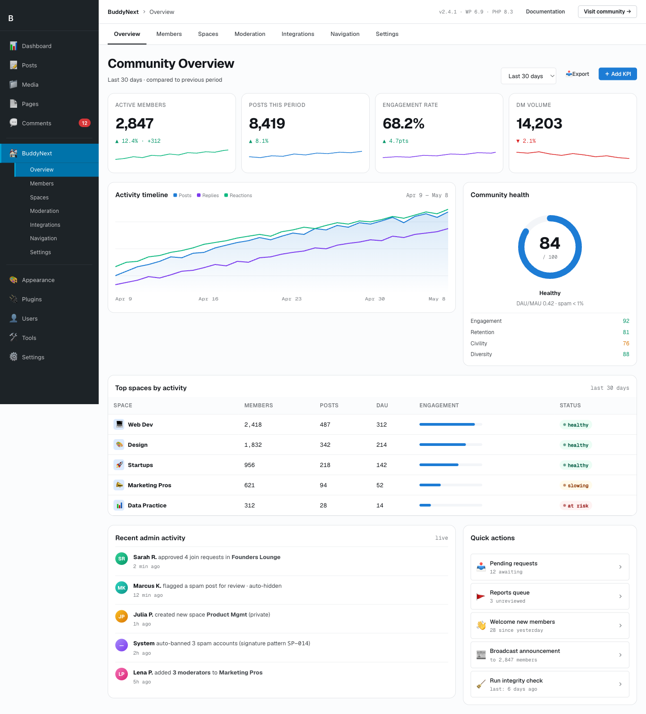

# Cron and Async Jobs

This page covers BuddyNext's scheduled jobs and background-work model: the recurring and single-shot cron hooks in Free and Pro, the Action Scheduler fan-out pattern used for heavy per-member work, and the cron policy every host must respect. Read it before adding a new scheduled job or wiring a new write fan-out.



## Overview / Contract

BuddyNext is built to be fast on a vanilla install with zero server changes. Three rules govern every scheduled job:

1. **Pick the lightest mechanism that fits.** Derivable data is computed lazily and cached - no job. Event responses use a single-shot async action. Only genuinely always-on work (digests, retries, reconciles) uses a recurring schedule, at the lowest acceptable cadence.
2. **Action Scheduler first, WP-Cron fallback.** When Action Scheduler is present, recurring and async actions run through it under the `buddynext` group so they are observable and retryable in Tools > Scheduled Actions. When it is absent, the same hooks run on WP-Cron.
3. **Never force-disable WP-Cron.** The plugin never defines `DISABLE_WP_CRON` and never requires a system cron to be fast. See Cron policy below.

The full engineering standard lives in the Background-Jobs standard (`docs/standards/BACKGROUND-JOBS.md`); this page documents the jobs that exist today.

## Scheduled jobs (Free)

Six scheduled hooks ship in Free. Handlers are plain `add_action` callbacks - Action Scheduler and WP-Cron both fire the same hook name.

| Hook | Schedule | What it does |
|---|---|---|
| `buddynext_daily_queue_check` | Daily | Sweeps the moderation queue for items needing a daily reconcile (aging reports, expiring strikes). Registered by the moderation listener. |
| `bn_onboarding_nudge_24h` | Single event (armed 24h after signup) | Sends the first onboarding nudge to a member who has not finished the setup steps. Armed per user when they register; self-clears once onboarding completes. |
| `bn_onboarding_nudge_72h` | Single event (armed 72h after signup) | Sends the second onboarding nudge if the member is still incomplete at 72 hours. Same per-user arming model as the 24h nudge. |
| `buddynext_webhook_retry` | Every 5 minutes (self-unscheduling) | Drains the outbound webhook retry queue with exponential backoff (300s, 600s, 1200s per attempt). Armed when a delivery fails; disarms itself when the queue is empty. |
| `buddynext_reindex_all_cron` | Single event | Runs a full rebuild of the `bn_search_index` table (members, posts, spaces, hashtags). Dispatched on demand - for example after a settings change that invalidates the index - not on a fixed cadence. |
| `edd_sl_sdk_weekly_license_check_` | Weekly | License-validation check from the bundled EDD Software Licensing SDK. Gates plugin updates only, never functionality. |

> **Note:** `buddynext_webhook_retry` uses the custom `buddynext_5min` recurrence. It is a self-(un)scheduling recurring job - it arms on the first failed delivery and clears itself once the retry queue drains, so it does not poll when there is no work.

## Scheduled jobs (Pro)

Pro adds four scheduled hooks. All run under the same `buddynext` Action Scheduler group.

| Hook | Schedule | What it does |
|---|---|---|
| `buddynextpro_publish_scheduled` | Every 5 minutes | Publishes posts whose scheduled publish time has arrived. Handled by `Feed\ScheduledPostsService`. |
| `buddynextpro_broadcast_send_pending` | Every 5 minutes | Sends the next batch of a pending email broadcast. Handled by `Email\BroadcastService`; self-(un)scheduling - armed when a broadcast is queued, disarmed when the send completes. |
| `buddynextpro_drip_tick` | Every 5 minutes | Advances drip email sequences - enqueues the next due email for each enrolled member. Handled by `Email\DripService`. |
| `buddynextpro_expire_subscriptions` | Daily | Expires membership subscriptions past their end date and revokes the matching entitlements. Handled by `Membership\SubscriptionService`. |

## The Action Scheduler fan-out pattern

Some events touch many rows. When a member posts in a space with 100,000 members, naively inserting 100,000 notification rows inside the request would time the request out. BuddyNext caps the synchronous cost and pages the rest through Action Scheduler.

The pattern, as implemented for new-space-post notifications:

1. The triggering request processes a **first bounded batch** synchronously (a keyset query limited to `SPACE_FANOUT_BATCH` members). Small spaces finish here with no background job at all.
2. If a full batch came back, more members remain. The request enqueues an async action, resuming from the last processed `user_id` (keyset, never `OFFSET`):

```php
if ( function_exists( 'as_enqueue_async_action' ) ) {
    as_enqueue_async_action(
        'buddynext_async_space_post_fanout',
        array(
            'post_id'       => $post_id,
            'space_id'      => $space_id,
            'author_id'     => $author_id,
            'after_user_id' => $after_user_id, // keyset cursor
        ),
        'buddynext' // group
    );
}
```

3. The worker processes one bounded batch, then **re-enqueues itself** for the next page until the roster is exhausted. Neither the request nor any single scheduled action ever loads or loops the whole roster.
4. When Action Scheduler is absent (local/test), the worker drains the remaining batches inline, still bounded to one batch per query, so every member is still notified.

Hashtag indexing follows the same shape on a smaller scale. When a post is created, the hashtag listener dispatches `buddynext_async_index_hashtags` instead of extracting and syncing tags inside the request:

```php
// includes/Hashtags/HashtagListener.php
if ( function_exists( 'as_enqueue_async_action' ) ) {
    as_enqueue_async_action( 'buddynext_async_index_hashtags', $args, 'buddynext' );
} else {
    wp_schedule_single_event( time(), 'buddynext_async_index_hashtags', $args );
}
```

### Async hooks you can extend

| Hook | Fired when | Args |
|---|---|---|
| `buddynext_async_space_post_fanout` | A space post needs background notification fan-out (RECORD stage) beyond the first batch | `array{ post_id, space_id, author_id, after_user_id }` |
| `buddynext_async_space_post_emails` | DELIVER stage: send the space new-post emails for a recipient batch, off the fan-out task (self-paginating in chunks of 50) | `array{ post_id, space_id, author_id, recipients }` |
| `buddynext_async_index_hashtags` | A post or other content needs hashtag extraction + sync | `object_type, object_id, content` |
| `buddynext_reindex_all` | A full search-index rebuild is requested | none |

Rules for any new fan-out you add:

- **One group.** Always pass `'buddynext'` as the group so the action is observable and bulk-cancelable in Tools > Scheduled Actions.
- **Idempotent handlers.** Action Scheduler retries on failure; the handler must tolerate re-running the same batch.
- **Keyset, not OFFSET.** Page with a `last_id` cursor so large rosters never get slower as you page deeper.
- **Cap the synchronous slice.** Do the first bounded batch in-request, only background the remainder.

## Cron policy - never force, detect and guide

BuddyNext never changes a site-wide cron setting on the owner's behalf.

- The plugin **never** defines `DISABLE_WP_CRON`. That constant disables WP-Cron for every plugin on the site (backups, WooCommerce, email queues) and silently breaks them if no real system cron is wired.
- Action Scheduler runs fine off WP-Cron by default. Running it off a real system cron is an optional, owner-applied server optimization - never a requirement for BuddyNext to be fast.
- The plugin **detects** the failure case and guides the admin. The Tools health check reports whether WP-Cron is disabled and whether any scheduled actions are overdue. Only when the site is genuinely stalled (WP-Cron off and actions overdue) does it surface a warning with a ready-to-paste system-cron line built from the site's own URL:

```cron
*/5 * * * * wget -q -O - 'https://SITE/wp-cron.php?doing_wp_cron' >/dev/null 2>&1
```

## Notes / gotchas

- **Schedule on `wp_loaded` or `init`, never `plugins_loaded`.** Action Scheduler is not initialized until `init`; an `as_schedule_*` call before that silently no-ops. If you cleared the WP-Cron event first, the job ends up unscheduled entirely. Always verify scheduling happened after the fact.
- **Deactivation clears both systems.** A job's deactivation handler must call `as_unschedule_all_actions( $hook, array(), 'buddynext' )` and `wp_clear_scheduled_hook( $hook )` so nothing is orphaned.
- **Free / Pro boundary.** Pro registers its four jobs independently on its own boot; it reuses the same `buddynext` group and the same AS-first / WP-Cron-fallback helper, so all jobs appear together in Tools > Scheduled Actions.
- **Pruning.** Action Scheduler's retention clears the `actionscheduler_*` tables on its own schedule (on by default). Leave it enabled so the logs do not bloat.

See also the Background-Jobs standard for the full decision tree and copy-paste patterns, and the Scale Contract for the fan-out and indexing rules that shaped these jobs.
