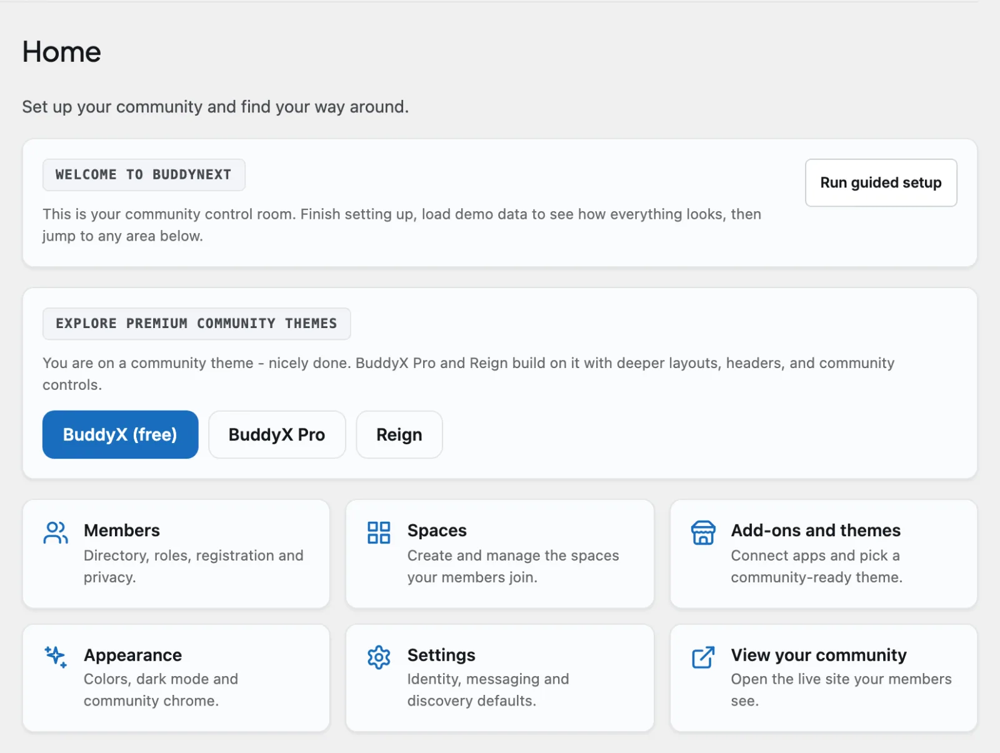

# Cron and Async Jobs

This page covers BuddyNext's scheduled jobs and background-work model: the recurring and single-shot cron hooks in Free and Pro, the Action Scheduler fan-out pattern used for heavy per-member work, and the cron policy every host must respect. Read it before adding a new scheduled job or wiring a new write fan-out.



## Overview / Contract

BuddyNext is built to be fast on a vanilla install with zero server changes. Three rules govern every scheduled job:

1. **Pick the lightest mechanism that fits.** Derivable data is computed lazily and cached - no job. Event responses use a single-shot async action. Only genuinely always-on work (digests, retries, reconciles) uses a recurring schedule, at the lowest acceptable cadence.
2. **Action Scheduler first, WP-Cron fallback.** When Action Scheduler is present, recurring and async actions run through it under the `buddynext` group so they are observable and retryable in Tools > Scheduled Actions. When it is absent, the same hooks run on WP-Cron.
3. **Never force-disable WP-Cron.** The plugin never defines `DISABLE_WP_CRON` and never requires a system cron to be fast. See Cron policy below.

The full engineering standard lives in the Background-Jobs standard (`docs/standards/BACKGROUND-JOBS.md`); this page documents the jobs that exist today.

## Scheduled jobs (Free)

Free registers a set of recurring maintenance jobs plus a handful of reactive single-event hooks. Handlers are plain `add_action` callbacks - Action Scheduler and WP-Cron both fire the same hook name.

### Recurring jobs

Registered on `wp_loaded` by `Core\CronScheduler` under the Action Scheduler group `buddynext` (WP-Cron fallback when AS is absent), except where a different registrar is noted.

| Hook | Schedule | What it does |
|---|---|---|
| `buddynext_daily_digest` | Daily | Sends the daily activity digest. |
| `buddynext_weekly_digest` | Weekly | Sends the weekly activity digest. |
| `buddynext_cleanup_tokens` | Daily | Prunes expired auth / verification tokens. |
| `buddynext_purge_logs` | Daily | Age-purges read notifications, `bn_email_log`, the webhook delivery logs and stale presence rows, in batches. The window is the `buddynext_log_retention_days` option (30, 60 or 90 days, default 60); unread notifications are kept until a hard maximum of 90 days. Registered by `Core\LogRetentionService` on `init`, group `buddynext`. |
| `buddynext_cleanup_reports` | Weekly | Prunes closed `bn_reports` rows past the data-retention window. |
| `buddynext_recount_stats` | Daily | Reconcile pass for counters. Counters are maintained incrementally on every write; this only repairs drift. |
| `buddynext_daily_queue_check` | Daily | Sweeps the moderation queue for items needing a daily reconcile (aging reports, expiring strikes). Registered by the moderation listener. |
| `buddynext_publish_scheduled_sweep` | Hourly | Safety sweep that publishes any scheduled post whose time has passed. Registered by `Feed\ScheduledPostsPublisher`. |

### Single-event / reactive hooks

Armed on demand and self-clearing - they do not poll when there is no work.

| Hook | When it fires | What it does |
|---|---|---|
| `buddynext_publish_scheduled` | Armed at the next due scheduled post's time | Publishes due scheduled posts, then re-arms for the next one (or stays disarmed). Free-owned - runs with Pro absent. |
| `bn_onboarding_nudge_24h` | Single event, 24h after signup | Sends the first onboarding nudge to a member who has not finished the setup steps. Armed per user at registration; self-clears once onboarding completes. |
| `bn_onboarding_nudge_72h` | Single event, 72h after signup | Sends the second onboarding nudge if the member is still incomplete at 72 hours. Same per-user arming model as the 24h nudge. |
| `buddynext_reindex_all_cron` | Single event, 30 seconds after a rebuild is requested | WP-Cron fallback for a full rebuild of the `bn_search_index` table (members, posts, spaces, hashtags), used when Action Scheduler is absent. With Action Scheduler the same rebuild runs as the async `buddynext_reindex_all` action. |
| `buddynext_webhook_deliver` | Single event, per outbound dispatch | Delivers the outbound webhooks for one event off-request. Enqueued async (Action Scheduler, group `buddynext`) when an event fires; `buddynext_webhook_deliver_one` delivers a single webhook the same way. |
| `buddynext_webhook_retry_single` | Single event, per failed delivery | Retries a failed webhook delivery with exponential backoff (300s base, up to 3 attempts). |
| `edd_sl_sdk_weekly_license_check_{slug}` | Weekly | License-validation check from the bundled EDD Software Licensing SDK. Gates plugin updates only, never functionality. |

> **Note:** `buddynext_cleanup_notifications`, `buddynext_cleanup_activity_log` and `buddynext_cleanup_email_log` are retired. The constants remain on `CronScheduler` only so that an upgrade can unschedule them where they are still armed; nothing listens to them.

> **Note:** There is no recurring webhook-retry poll. Outbound delivery uses single events (`buddynext_webhook_deliver` / `buddynext_webhook_retry_single`) scheduled per delivery with exponential backoff, so nothing polls when the queue is empty. The old custom sub-hour recurrences (`buddynext_1min`, `buddynext_5min`, `buddynext_30min`) were removed in the cron-minimisation pass - every remaining recurring job uses a built-in `daily` / `weekly` / `hourly` recurrence.

## Scheduled jobs (Pro)

Pro adds its own recurring jobs. Unlike Free they do **not** share the `buddynext` group - each Pro subsystem uses its own Action Scheduler group, so it can be observed and cancelled independently in Tools > Scheduled Actions.

| Hook | Schedule | Group | What it does |
|---|---|---|---|
| `buddynextpro_broadcast_send_pending` | Every 5 minutes | `buddynextpro_email` | Sends the next batch of a pending email broadcast. Handled by `Email\BroadcastService`; self-(un)scheduling - armed when a broadcast is queued, disarmed when the send completes. |
| `buddynextpro_drip_tick` | Hourly | `buddynextpro_email` | Advances drip email sequences - enqueues the next due email for each enrolled member. Handled by `Email\DripEnrollmentService` / `Email\DripService`; self-(un)scheduling - stays disarmed when no enrollments are active. |
| `buddynextpro_expire_subscriptions` | Daily | `buddynextpro` | Expires membership subscriptions past their end date and revokes the matching entitlements. Handled by `Membership\SubscriptionService`. |
| `buddynextpro_ai_mod_sweep` | Configurable cadence (from the AI-moderation settings) | `buddynextpro_ai_moderation` | Recurring AI-moderation sweep over recent content. Handled by `Moderation\AiModerationSweep`. |
| `buddynextpro_renewal_reminders` | Daily | `buddynextpro` | Sends renewal reminders for subscriptions nearing their end date. Handled by `Membership\RenewalReminderService`; re-enqueues itself while a full batch remains. |
| `buddynextpro_reconcile_memberships` | Daily | `buddynextpro` | Reconciles membership grants with the registered grant bridges. Registered by `Bridges\GrantBridgeRegistrar`. |
| `buddynextpro_data_retention` | Daily | `buddynextpro_analytics` | Prunes `bn_analytics_events` and `bn_ai_signals` rows past the `buddynext_data_retention_days` window; skipped when retention is set to keep forever. Handled by `Analytics\RetentionJob`. |

> **Note:** `buddynextpro_ai_mod_cleanup` is retired. `Moderation\AiModerationSweep` and `Analytics\RetentionJob` only unschedule it where an earlier version armed it.

> **Note:** Pro does not register its own scheduled-post publish cron. Publishing is Free-owned - `Feed\ScheduledPostsService` delegates the actual publish to Free's `Feed\ScheduledPostsPublisher` (the `buddynext_publish_scheduled` single event above).

## The Action Scheduler fan-out pattern

Some events touch many rows. When a member posts in a space with 100,000 members, naively inserting 100,000 notification rows inside the request would time the request out. BuddyNext caps the synchronous cost and pages the rest through Action Scheduler.

The pattern, as implemented for new-space-post notifications:

1. The triggering request processes a **first bounded batch** synchronously (a keyset query limited to `SPACE_FANOUT_BATCH` members). Small spaces finish here with no background job at all.
2. If a full batch came back, more members remain. The request enqueues an async action, resuming from the last processed `user_id` (keyset, never `OFFSET`):

```php
if ( function_exists( 'as_enqueue_async_action' ) ) {
    as_enqueue_async_action(
        'buddynext_async_space_post_fanout',
        array(
            'post_id'       => $post_id,
            'space_id'      => $space_id,
            'author_id'     => $author_id,
            'after_user_id' => $after_user_id, // keyset cursor
        ),
        'buddynext' // group
    );
}
```

3. The worker processes one bounded batch, then **re-enqueues itself** for the next page until the roster is exhausted. Neither the request nor any single scheduled action ever loads or loops the whole roster.
4. When Action Scheduler is absent (local/test), the worker drains the remaining batches inline, still bounded to one batch per query, so every member is still notified.

Hashtag indexing follows the same shape on a smaller scale. When a post is created, the hashtag listener dispatches `buddynext_async_index_hashtags` instead of extracting and syncing tags inside the request:

```php
// includes/Hashtags/HashtagListener.php
if ( function_exists( 'as_enqueue_async_action' ) ) {
    as_enqueue_async_action( 'buddynext_async_index_hashtags', $args, 'buddynext' );
} else {
    wp_schedule_single_event( time(), 'buddynext_async_index_hashtags', $args );
}
```

### Async hooks you can extend

| Hook | Fired when | Args |
|---|---|---|
| `buddynext_async_space_post_fanout` | A space post needs background notification fan-out (RECORD stage) beyond the first batch | `array{ post_id, space_id, author_id, after_user_id }` |
| `buddynext_async_space_post_emails` | DELIVER stage: send the space new-post emails for a recipient batch, off the fan-out task (self-paginating in chunks of 50) | `array{ post_id, space_id, author_id, recipients }` |
| `buddynext_async_index_hashtags` | A post or other content needs hashtag extraction + sync | `object_type, object_id, content` |
| `buddynext_reindex_all` | A full search-index rebuild is requested | none |
| `buddynext_async_index_post` | A post is created or edited and needs indexing | `int $post_id, int $user_id` |
| `buddynext_async_deindex_post` | A post is removed from search | `int $post_id` |
| `buddynext_async_index_space` | A space is created or edited and needs indexing | `int $space_id` |
| `buddynext_async_deindex_space` | A space is removed from search | `int $space_id` |
| `buddynext_async_reindex_space_posts` | A space's posts need re-indexing (self-paginating) | `int $space_id, int $offset` |
| `buddynext_async_index_user` | A member's profile changed and needs indexing | `int $user_id` |
| `buddynext_async_fetch_link_meta` | A post with a link needs its preview fetched | `int $post_id` |
| `buddynext_async_send_invite_email` | An invitation email is queued | `array $payload` |
| `buddynext_async_announcement_fanout` | An announcement needs notification fan-out | `array` |
| `buddynext_send_notification_email` | A notification email is sent off-request | `int $user_id, string $notification_type, array $data` |
| `buddynext_retry_notification_email` | A failed notification email is retried | `int $user_id, string $notification_type, array $data` |
| `buddynext_resync_hashtags` | A batched hashtag re-sync runs | `int $offset` |
| `buddynext_recount_hashtags` | A batched hashtag usage recount runs | `int $after_id` |
| `buddynext_mvs_media_activity` | A WPMediaVerse upload is turned into a feed post, two minutes after the upload | `$media_id, $user_id, $media_type` |

Rules for any new fan-out you add:

- **One group.** Always pass `'buddynext'` as the group so the action is observable and bulk-cancelable in Tools > Scheduled Actions.
- **Idempotent handlers.** Action Scheduler retries on failure; the handler must tolerate re-running the same batch.
- **Keyset, not OFFSET.** Page with a `last_id` cursor so large rosters never get slower as you page deeper.
- **Cap the synchronous slice.** Do the first bounded batch in-request, only background the remainder.

## Cron policy - never force, detect and guide

BuddyNext never changes a site-wide cron setting on the owner's behalf.

- The plugin **never** defines `DISABLE_WP_CRON`. That constant disables WP-Cron for every plugin on the site (backups, WooCommerce, email queues) and silently breaks them if no real system cron is wired.
- Action Scheduler runs fine off WP-Cron by default. Running it off a real system cron is an optional, owner-applied server optimization - never a requirement for BuddyNext to be fast.
- The plugin **detects** the failure case and guides the admin. The Tools health check reports whether WP-Cron is disabled and whether any scheduled actions are overdue. Only when the site is genuinely stalled (WP-Cron off and actions overdue) does it surface a warning with a ready-to-paste system-cron line built from the site's own URL:

```cron
*/5 * * * * wget -q -O - 'https://SITE/wp-cron.php?doing_wp_cron' >/dev/null 2>&1
```

## Notes / gotchas

- **Schedule on `wp_loaded` or `init`, never `plugins_loaded`.** Action Scheduler is not initialized until `init`; an `as_schedule_*` call before that silently no-ops. If you cleared the WP-Cron event first, the job ends up unscheduled entirely. Always verify scheduling happened after the fact.
- **Deactivation clears both systems.** A job's deactivation handler must call `as_unschedule_all_actions( $hook, array(), 'buddynext' )` and `wp_clear_scheduled_hook( $hook )` so nothing is orphaned.
- **Free / Pro boundary.** Pro registers its jobs independently on its own boot, using the same AS-first / WP-Cron-fallback pattern. Unlike Free's shared `buddynext` group, each Pro subsystem uses its own group (`buddynextpro_email`, `buddynextpro`, `buddynextpro_ai_moderation`); scheduled-post publishing is not a Pro job - Pro delegates it to Free's `ScheduledPostsPublisher`.
- **Pruning.** Action Scheduler's retention clears the `actionscheduler_*` tables on its own schedule (on by default). Leave it enabled so the logs do not bloat.

See also the Background-Jobs standard for the full decision tree and copy-paste patterns, and the Scale Contract for the fan-out and indexing rules that shaped these jobs.
