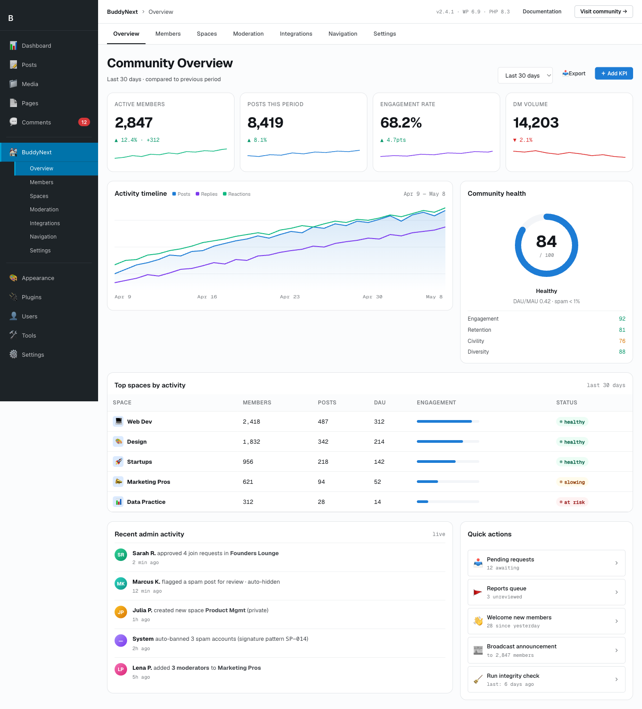

# WP-CLI Commands

BuddyNext registers two WP-CLI command namespaces in Free: `wp buddynext demo` (the demo-data seeder) and `wp buddynext cert` (the functional-certification harness). Both are registered in `Plugin::init()` and load only when WP-CLI is running. This page documents their subcommands, what they seed or verify, and example invocations.




## Overview

```php
// includes/Core/Plugin.php
if ( defined( 'WP_CLI' ) && WP_CLI ) {
    \WP_CLI::add_command( 'buddynext demo', new \BuddyNext\Demo\DemoCommand() );
    \WP_CLI::add_command( 'buddynext cert', new \BuddyNext\Cert\CertCommand() );
}
```

The demo command is a thin wrapper over `DemoDataService`, so the CLI and the admin "Demo Data" button share one engine. The cert command wraps `CertRunner`, the same gate that `bin/check.sh` and CI run.

## wp buddynext demo

Populates, inspects, or removes a realistic demo community. Useful for screenshots, manual QA, and verifying behavior against a populated dataset rather than five empty rows. The seeder uses bundled offline images, so it works with no network access.

### Subcommands

| Subcommand | What it does |
|---|---|
| `seed` | Populates the demo community: members, spaces, posts, the social graph between them, and profile fields. Refuses to run if demo data is already installed - run `cleanup` first. |
| `status` | Prints what is currently installed: counts of members, spaces, posts, and profile fields. Prints "No demo data installed." when the dataset is absent. |
| `cleanup` | Removes everything the seeder created (posts, spaces, members, profile fields) and reports the counts removed. |

### What `seed` creates

The seeder produces a connected community, not isolated rows:

- **Members** - demo users with avatars (bundled offline images) and populated profiles.
- **Spaces** - demo spaces with members assigned to them.
- **Posts** - activity posts authored across the members and spaces.
- **Social graph** - follow / connection relationships between the demo members.
- **Profile fields** - the custom profile fields the demo profiles fill in.

`seed` is idempotent-guarded: if `DemoDataService::is_seeded()` reports data already present, it warns and exits instead of double-seeding. `cleanup` is the inverse and is similarly guarded - it warns if there is nothing to remove.

### Examples

```bash
# Populate a demo community
wp buddynext demo seed

# See what is installed
wp buddynext demo status

# Remove everything the seeder created
wp buddynext demo cleanup
```

Sample `seed` output:

```
Seeded 24 members, 6 spaces, 80 posts, 9 profile fields.
```

Sample `status` output:

```
Members:        24
Spaces:         6
Posts:          80
Profile fields: 9
```

> **Note:** The exact counts depend on the bundled dataset; the numbers above are illustrative. Re-running `seed` without first running `cleanup` is a no-op that warns - it never duplicates the dataset.

## wp buddynext cert

The functional-certification harness. It is the one trustworthy release gate that asserts the plugin **behaves** - toggles actually enforce and REST routes do not fatal - rather than that the code merely parses or passes a linter. It is invoked by `bin/check.sh` and CI.

### Subcommands and flags

| Invocation | What it runs |
|---|---|
| `wp buddynext cert` | Runs all checks (`contract` + `boot`). Exits 1 if any check fails. |
| `wp buddynext cert contract` | Runs only the contract (dead-toggle / behaviour-flip) check. |
| `wp buddynext cert boot` | Runs only the REST boot smoke - dispatches every public GET route and asserts none return 500. |
| `wp buddynext cert --porcelain` | Emits the ledger as machine-readable JSON (for the MCP and CI) instead of the human summary. Combine with a check name to scope it. |

> **Note:** The machine-readable flag is `--porcelain`, not `--json`. WP-CLI reserves `--json` for its own output formatter and would reject it.

### The contract check (the cert contract)

The contract check proves that every gated setting is wired through to real behavior, catching "dead toggle" bugs - a setting saved in the database but never read on the enforcement path.

For each gated feature listed in the contract oracle (`audit/cert-oracles.json`, the one hand-authored input), the runner:

1. Snapshots the current setting state.
2. Flips the setting **OFF** and asserts the REST surface's behavior changes - the disabled error code appears.
3. Flips the setting **ON** and asserts the disabled error code is gone.
4. Restores the original state.

Each oracle yields a row with one of three statuses:

| Status | Meaning |
|---|---|
| `PASS` | The toggle enforces - behavior changed when flipped. |
| `FAIL` | The toggle is dead - flipping the setting did not change behavior. Fails the gate. |
| `HOLE` | The feature is toggleable but has no oracle, so enforcement is unproven. Add coverage via `cert learn`. |

A `HOLE` is uncovered surface, not a failure, but it signals a gap in the oracle.

### The boot check

The boot check dispatches every public/GET REST route under the BuddyNext namespaces and asserts none return `>= 500` (a thrown fatal is captured as a 500). A `4xx` (for example an auth-required `401/403`) is acceptable - only server faults fail the gate.

### Examples

```bash
# Full functional certification (contract + boot); exits 1 on any failure
wp buddynext cert

# Only the dead-toggle behaviour-flip check
wp buddynext cert contract

# Only the REST boot smoke
wp buddynext cert boot

# Machine-readable ledger for CI / MCP
wp buddynext cert --porcelain
```

Sample human output:

```
  PASS  contract  feature-x              disabled code appears when off
  PASS  boot      GET /spaces            200
  FAIL  contract  feature-y              flip had no effect
  HOLE  contract  feature-z              no oracle - enforcement unproven (add via `cert learn`)

  2 passed, 1 failed, 1 holes (uncovered)
Error: Functional certification FAILED - 2 passed, 1 failed, 1 holes (uncovered)
```

## Notes / gotchas

- Both commands declare `@when after_wp_load`, so WordPress is fully loaded before they run - they have access to services, settings, and the REST router.
- `cert` writes a ledger as a side effect of every run, so CI and the MCP can read the last result without re-running the gate.
- `demo` and `cert` are Free commands; there are no Pro-specific WP-CLI commands. The cert oracle covers gated features across the product.

See also the Cron and Async Jobs page for the scheduled-job surface these tools run alongside.
