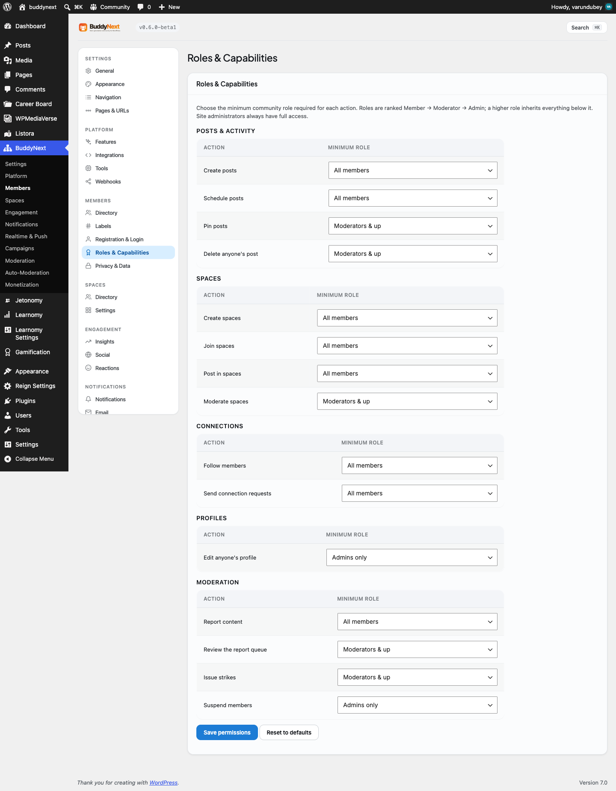

# Roles and Capabilities

How BuddyNext decides who can do what. This page covers the permission model developers extend: the single `buddynext_can()` entry point, the four resolution layers in `PermissionService`, the capability catalog registered through the WordPress Abilities API, and the filter seams (`buddynext_user_can`, `buddynext_role_map`, `buddynext_abilities`) an extension uses to add, gate, or override a capability.



## Overview / Contract

BuddyNext does **not** register any custom WordPress roles. The free plugin's manifest lists `customRoles: []`, and Pro adds none either (`customRoles: null`). There is no `add_role()` call and no new `WP_Role` capabilities to map. Member authority is modeled in two BuddyNext-owned layers instead:

- A **community role** stored in user meta (`bn_community_role`): one of `member`, `moderator`, `admin`, `owner`. Defaults to `member` when unset.
- A **per-space role** stored in the `bn_space_members` table (`role` column): `owner`, `moderator`, or `member` for an active membership.

WordPress site administrators are recognized through the native `manage_options` capability, not a BuddyNext role. Every wp-admin screen BuddyNext registers gates on `manage_options` (see Admin Pages and Settings).

Every permission decision in the plugin flows through one function:

```php
buddynext_can( int $user_id, string $capability, array $context = array() ): bool
```

Defined in `buddynext.php`, it resolves the `permissions` service from the container and calls `PermissionService::can()`. Never call `current_user_can()` against a BuddyNext capability or read `bn_community_role` directly to make an authorization decision - route it through `buddynext_can()` so all four layers and the filter seams apply.

### The four resolution layers

`PermissionService::can()` resolves a check in this order:

| Layer | Source | Effect |
|-------|--------|--------|
| 1. WP site admin | `manage_options` | Holders pass every check (`$result = true`). |
| 2. Community / space role | `ROLE_MAP` + role hierarchy | The capability needs a minimum role; the user's community role (or in-space role when `space_id` is in context) must meet or exceed it. |
| 3. Explicit ability grant | `bn_ability_{slug}` user meta | A per-user grant with an expiry (`0` = never, otherwise a unix timestamp). Checked only when the role check fails. |
| 4. Developer filter | `buddynext_user_can` | Runs on every check and can flip the resolved result in either direction. Always the final word. |

Two hard-deny short-circuits run before the layers above:

- A user who is **space-banned** (a row in `bn_space_bans`, or a `bn_space_members` row with `status = 'banned'`) is denied every `buddynext-spaces/*` capability when a `space_id` is in context, regardless of role.
- The space-scoped capabilities `buddynext-moderate-space` and `buddynext-manage-space` bypass the generic role map and resolve through dedicated methods that read the caller's role in that specific space.

### The role hierarchy

Roles are ranked numerically. A capability mapped to a role is granted to that role and everything above it.

| Role | Weight |
|------|--------|
| `owner` | 4 |
| `admin` | 3 |
| `moderator` | 2 |
| `member` | 1 |

A capability mapped to `null` in the role map has no role gate - it can only be granted through an explicit ability grant or the `buddynext_user_can` filter.

## The capability catalog

Capabilities are dot-namespaced slugs (`buddynext-{domain}/{action}`). The free catalog is defined in `BuddyNext\Core\Abilities::CATALOG` and registered with the WordPress Abilities API (WP 6.9+) so each one appears in the admin Abilities UI and can be granted or revoked through that API. On WordPress below 6.9 the registration no-ops silently and `PermissionService` still enforces the gate.

The free catalog holds 21 capabilities:

| Capability | Default required role |
|------------|----------------------|
| `buddynext-profile/edit-own` | `member` |
| `buddynext-profile/edit-any` | `admin` |
| `buddynext-profile/view` | none (public) |
| `buddynext-feed/create-post` | `member` |
| `buddynext-feed/delete-own-post` | `member` |
| `buddynext-feed/delete-any-post` | `moderator` |
| `buddynext-feed/pin-post` | `moderator` |
| `buddynext-feed/schedule-post` | `member` |
| `buddynext-spaces/create` | `member` |
| `buddynext-spaces/join` | `member` |
| `buddynext-spaces/join-gated` | none |
| `buddynext-spaces/post` | `member` |
| `buddynext-spaces/moderate` | `moderator` |
| `buddynext-spaces/manage-settings` | `moderator` |
| `buddynext-spaces/delete` | `moderator` |
| `buddynext-connections/follow` | `member` |
| `buddynext-connections/connect` | `member` |
| `buddynext-moderation/report` | `member` |
| `buddynext-moderation/review-queue` | `moderator` |
| `buddynext-moderation/issue-strike` | `moderator` |
| `buddynext-moderation/suspend-user` | `admin` |

Two additional space-scoped capabilities - `buddynext-moderate-space` and `buddynext-manage-space` - are resolved by dedicated per-space methods (`can_moderate_space()` / `can_manage_space()`) and are not part of the generic role map. `buddynext-moderate-space` is granted to a space `owner` or `moderator`; `buddynext-manage-space` only to the space `owner`.

> Ability slugs may contain `/` and `-`. The grant meta key translates those to `_`, so `buddynext-feed/pin-post` is stored as `bn_ability_buddynext_feed_pin_post`. Use `PermissionService::ability_meta_key( $slug )` to build the key rather than hand-rolling it.

## Examples

### Check a capability

```php
// A plain capability check.
if ( buddynext_can( get_current_user_id(), 'buddynext-feed/create-post' ) ) {
    // Render the composer.
}

// A space-scoped check - pass the space_id in context.
if ( buddynext_can( $user_id, 'buddynext-spaces/post', array( 'space_id' => 42 ) ) ) {
    // Allow posting into space 42.
}
```

### Register a new capability and gate it behind a role

Adding a capability is two filters: register the slug with the Abilities API, then give it a role in the role map. Do both on `plugins_loaded` (or earlier) so they are in place before any check runs.

```php
// 1. Add the slug to the catalog so the Abilities API registers it.
add_filter( 'buddynext_abilities', function ( array $abilities ) {
    $abilities[] = 'buddynext-feed/create-event';
    return $abilities;
} );

// 2. Gate it behind a community role. 'member', 'moderator', 'admin', 'owner',
//    or null for "no role gate" (explicit grant / filter only).
add_filter( 'buddynext_role_map', function ( array $map ) {
    $map['buddynext-feed/create-event'] = 'moderator';
    return $map;
} );
```

The capability is now enforceable through `buddynext_can( $user_id, 'buddynext-feed/create-event' )`.

### Override a capability for one decision

`buddynext_user_can` is the final layer and runs on every check, so it can grant or deny regardless of what the role and grant layers resolved.

```php
add_filter(
    'buddynext_user_can',
    function ( bool $result, int $user_id, string $capability, array $context ) {
        // Let verified members pin posts even though pin defaults to moderator.
        if ( 'buddynext-feed/pin-post' === $capability
            && get_user_meta( $user_id, 'is_verified_member', true ) ) {
            return true;
        }
        return $result;
    },
    10,
    4
);
```

### Grant a capability to one user

An explicit grant (layer 3) is a user-meta entry whose value is the expiry: `0` for no expiry, or a future unix timestamp.

```php
use BuddyNext\Core\PermissionService;

// Grant the review-queue capability to user 12, never expiring.
update_user_meta(
    12,
    PermissionService::ability_meta_key( 'buddynext-moderation/review-queue' ),
    0
);
```

## Notes / gotchas

- **No custom roles to clean up.** Because BuddyNext registers no `WP_Role`, there is nothing to remove on deactivation and no capability bloat on the `administrator` role. Authority lives in user meta and `bn_space_members`.
- **`manage_options` is the admin gate, not a BuddyNext role.** Site admins pass every `buddynext_can()` check by virtue of layer 1, and every BuddyNext admin screen checks `manage_options` directly.
- **`buddynext_role_map` fires once and is memoised** per request; `buddynext_user_can` fires on every check. Put baseline role mappings in the role map and per-decision logic in the filter.
- **Space context matters.** For `buddynext-spaces/*` capabilities, pass `['space_id' => N]` so the in-space role (from `bn_space_members`) is used. The `join` capability is the exception - a non-member has no in-space role yet, so `join` is gated by the community role, with space type (open/request/invite) enforced separately in the join flow.
- **Free / Pro boundary.** The catalog and the four-layer model live entirely in free. Pro consumes `buddynext_can()` like any other caller and does not add custom roles or its own permission engine.

See also Admin Pages and Settings for how the admin surface gates on `manage_options`, and the REST contract page for how controllers resolve `buddynext_can()` before serving a request.
