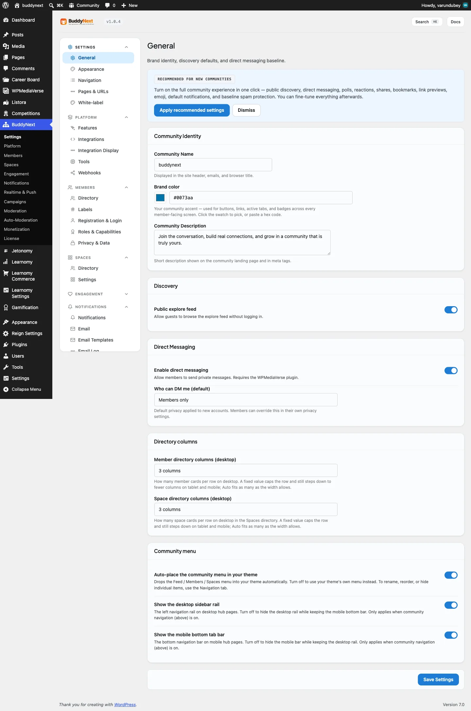
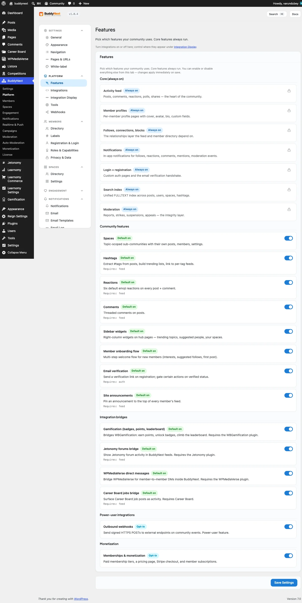

# The Free/Pro Contract

This page documents how BuddyNext Free and BuddyNext Pro couple: the service-container keys Pro consumes and rebinds, the Free filter and action seams Pro hooks, which cross-plugin hooks are frozen, and the shared-table ownership rule. Every list here is derived from the code and is verified by a test (`FreeProContractTest`) that fails when the code and this page drift apart. If you are building a Pro module, a vertical pack, or a third-party addon that sits on top of the free/pro pair, this is the contract you must respect so an update to either plugin does not break your code.





For the full per-hook reference (every Pro-emitted action/filter with its parameters) see Pro and Integration Hooks. This page is the structural contract above that table.

## Overview / Contract

Pro never copies Free code and never duplicates Free tables. It extends Free through exactly three seams, in this order of preference:

1. **Container rebind** - Pro binds a Pro class (that `extends` the Free class) onto an existing Free service key. The rest of the system keeps resolving the same key and transparently gets the Pro behaviour.
2. **Inheritance** - Pro service classes extend Free service classes and override one method, calling `parent::` for the base behaviour.
3. **Filters and actions** - Pro attaches callbacks to Free's documented filter/action seams to modify behaviour or collect signals, with no Free code change.

Boot order is fixed and load-bearing: Free boots at `plugins_loaded:15` (firing `buddynext_loaded`), Pro boots at `plugins_loaded:20`, bridge classes at `plugins_loaded:25`. Pro guards its own init on `buddynext_loaded` so it never runs when Free is absent. Do not add `plugins_loaded` hooks at other priorities from addon code that depends on this ordering.

> **Note:** An addon that needs Pro to be present should hook `buddynext_pro_loaded` (fired at the end of Pro's `Plugin::init()`) - it is the Pro equivalent of `buddynext_loaded`.

## Container service keys Pro consumes

Pro reads existing Free services out of the container by key rather than instantiating Free classes itself. These are the keys Pro depends on; renaming or removing one in Free breaks Pro.

**All 16 of them.** This list is derived from code (every `buddynext_service( '…' )` call and every `$c->get( '…' )` inside a Pro bind closure), not from a manifest field. If you rename a Free container key, every row here is a break.

| Key | Free class | Consumed by (Pro) | Purpose |
|---|---|---|---|
| `assets` | `AssetService` | `Membership\MembershipHub` | Enqueue shared styles/scripts on the membership hub. |
| `email_sender` | `EmailSender` | `Email\DripService`, `Email\BroadcastService`, `Membership\SubscriptionEmailListener` | Send Pro campaign, drip, and subscription mail through Free's sender (so Free's per-type prefs and suppression still apply). |
| `feed_cache` | `Feed\FeedCache` | `Core\Plugin` (feed rebind) | Passed to the AI feed subclass so the page-1 feed cache still engages. |
| `follows` | `SocialGraph\FollowService` | `Core\Plugin` (feed rebind) | Follow graph for affinity-weighted ranking. |
| `moderation` | `Moderation\ModerationService` | `Admin\BulkModAdmin`, `Moderation\BulkModService` | Route Pro bulk actions through Free's moderation pipeline. |
| `notification_message` | `Notifications\NotificationMessageService` | `Push\PushDispatcher` | Render the notification body for a push payload. |
| `notification_prefs` | `Notifications\NotificationPrefService` | `Push\PushDispatcher` | Master per-channel gate before a push is sent. |
| `notifications` | `Notifications\NotificationService` | `Push\PushDispatcher` | Read the notification being mirrored to push. |
| `permissions` | `PermissionService` | `Integrations\Learnomy\LearnomyLinkController`, `Analytics\Controllers\AnalyticsController` | Capability checks on Pro REST routes. |
| `post_service` | `Feed\PostService` | `Core\Plugin`, `Admin\ScheduledPostsAdmin`, `Feed\ScheduledPostsService`, `Feed\ScheduledPostsIntegration`, `Feed\Controllers\ScheduledPostsController` | Create/read posts for scheduling and AI ranking. |
| `privacy` | `PrivacyService` | `Suite\Controllers\PortfolioController` | Visibility checks before exposing portfolio panels. |
| `profiles` | `Profile\ProfileService` | `Profile\AdvancedFieldRenderer` | Read profile field values for the Pro field types. |
| `reactions` | `Reactions\ReactionService` | `Reactions\CustomReactionsService` | Extend Free's reaction set. |
| `search` | `Search\SearchService` | `Search\SavedSearchService` | Run a saved search through the live search service. |
| `spaces` | `Spaces\SpaceService` | `Admin\BroadcastAdmin`, `Admin\MembershipAdmin`, `Search\AdvancedSearchFilters`, `Realtime\RealtimeAssets` | Resolve spaces for targeting, filtering, and realtime channels. |
| `webhooks` | `Outbound\OutboundWebhookService` | `Membership\MembershipWebhookListener` | Fire outbound webhooks on membership events. |

Resolve a Free service from a Pro (or addon) class through the container, never with `new`:

```php
$follows = buddynext_service( 'follows' );        // global helper
// or, from a class holding the container instance:
$posts   = $container->get( 'post_service' );
```

## Container keys Pro rebinds

When a Pro feature toggle is on, Pro rebinds a Free key to a subclass. Every consumer that resolves the key gets the Pro behaviour with no further change.

Pro rebinds **two** Free keys. Both rebinds are behind a toggle and are skipped entirely when it is off, so on a default Pro install the container still hands you Free's class.

| Key | Rebound to | Gate | Behaviour |
|---|---|---|---|
| `feed` | `BuddyNextPro\AI\AiRankedFeedService extends BuddyNext\Feed\FeedService` | `AiRankedFeedService::is_enabled()` (default off) | Overrides `home_feed()`: calls `parent::home_feed()`, then re-ranks the hydrated result by `engagement_score + affinity_score`. |
| `search` | `BuddyNextPro\AI\SemanticSearchService extends BuddyNext\Search\SearchService` | `SemanticSearchService::is_enabled()` (default off) | Embedding-boosted search. Bails internally when no embedding provider is configured, so a misconfigured site still gets FULLTEXT results. |

A rebind changes what **every** caller of that key receives, including Free's own callers and yours. That is the point of the seam, and it is also the risk: `buddynext_service( 'search' )` does not return `SearchService` on an AI-search site.

The subclass does **not** have to keep Free's constructor signature — the bind closure constructs it explicitly, so it can take different dependencies. `AiRankedFeedService` happens to mirror Free's three (`follows`, `post_service`, `feed_cache`); `SemanticSearchService` takes a single `embedding_provider` that Free knows nothing about. What the subclass must keep is Free's **public method contract**, since existing callers keep calling it.

Pro also binds its own new keys (`pro_*`, `embedding_provider`). Those are additions, not rebinds — they overwrite nothing.

```php
// Pro's bind, run only when the AI-feed toggle is on. The Pro service
// takes the same FollowService + PostService + FeedCache dependencies as
// the parent (FeedService::__construct( $follows, $post_service, $cache )).
$container->bind( 'feed', fn( $c ) => new \BuddyNextPro\AI\AiRankedFeedService(
    $c->get( 'follows' ),
    $c->get( 'post_service' ),
    $c->get( 'feed_cache' )
) );
```

> **Note:** `AiRankedFeedService` re-ranks the result in PHP; it does not use the SQL-level `buddynext_feed_order_by` filter. That filter remains the documented seam for third-party rerankers that want to change the `ORDER BY` directly. `SemanticSearchService` follows the same inheritance pattern over Free's `SearchService`.

## Free filter and action seams Pro hooks

These are the Free-defined extension points Pro attaches to. They are public seams: your addon can hook the same ones.

| Free seam | Type | Pro behaviour |
|---|---|---|
| `buddynext_reaction_types` | filter | Extend the reaction set with Pro custom reactions (up to 14 on top of Free's 6). |
| `buddynext_reaction_meta` | filter | Merge Pro reaction metadata. |
| `buddynext_search_query_args` | filter | Add Pro search filter args (`tier_slug`, `space_id`, `member_label`, `joined_after`, `active_within_days`) before the SQL is built. |
| `buddynext_search_filter_options` | filter | Provide the Pro filter options surfaced in the search UI. |
| `buddynext_post_pin_limit` | filter | Raise the pinned-post limit from Free's 1 to 10. |
| `buddynext_profile_labels` | filter | Inject custom member labels into profile responses. |
| `buddynext_notification_prefs` | filter | Inject push-notification preferences. |
| `buddynext_part_space_settings_tabs_args` | filter | Register the per-space Brand tab. |
| `cron_schedules` | filter | Add the custom cron interval used by scheduled posts. |
| `buddynext_post_created` | action | Track post creation for analytics, AI ranking signals, and semantic-search indexing. |

Pro also listens to Free's content/social actions for signal collection and fan-out (`buddynext_reaction_added`, `buddynext_comment_created`, `buddynext_user_followed`, `buddynext_post_bookmarked`, `buddynext_notification_created`) and to the moderation pipeline filter `buddynext_safeguard_check`. See Pro and Integration Hooks for the full list with arguments.

```php
// Example: an addon raising the pinned-post limit the same way Pro does.
add_filter( 'buddynext_post_pin_limit', static function ( int $limit ): int {
    return max( $limit, 5 );
} );

// Example: collecting the same post-created signal Pro collects.
add_action( 'buddynext_post_created', static function ( int $post_id, int $user_id, string $type ): void {
    // your analytics / indexing here
}, 10, 3 );
```

## Which cross-plugin hooks are frozen

Some hooks are load-bearing for the free<->pro pair: a real listener in the *other* plugin depends on them, so renaming or removing one breaks the pair silently. Others are fired with no first-party listener at all — those are stable extension seams for your addon, and "no first-party consumer" is not the same as "private."

The hooks that carry a first-party listener today, with who actually listens:

| Hook | Type | Listened to by |
|---|---|---|
| `buddynext_post_created` | action | Free, Pro |
| `buddynext_comment_created` | action | Free, Pro |
| `buddynext_reaction_added` | action | Free, Pro |
| `buddynext_user_followed` | action | Free, Pro |
| `buddynext_ability_granted` | action | Free, Pro |
| `buddynext_ability_revoked` | action | Free |
| `buddynext_search_query_args` | filter | Free, Pro |
| `buddynext_profile_field_render` | filter | Pro |

Treat every row above as frozen. Your own `add_action()` / `add_filter()` callbacks are never counted in that column — it names first-party listeners only, so a hook listed as "Pro" may still have any number of addon listeners.

## Shared-table ownership rule

Free owns its tables. Pro creates only its own Pro tables and never re-creates a Free table. When a Pro feature needs a column a Free table lacks, Pro adds it through an idempotent `ALTER` guarded by an `INFORMATION_SCHEMA` existence check (`Installer::maybe_alter_tables()`), never through a duplicate table.

The trust/moderation and webhook tables are **Free-owned**. Pro reads and writes them through Free's services and reuses them directly:

| Table | Owner | Notes |
|---|---|---|
| `bn_user_suspensions` | Free | Pro bulk moderation suspends through Free's moderation service into this table. |
| `bn_appeals` | Free | Pro's spec names this `bn_mod_appeals`; that is naming drift, not a second table. Pro creates no duplicate and writes appeals into Free's `bn_appeals`. |
| `bn_space_bans` | Free | Per-space bans live here; Pro reads/writes via Free's `SpaceMemberService`. |
| `bn_outbound_webhooks` | Free | Free's `OutboundWebhookService` is the engine. Pro only lifts the endpoint cap via `buddynext_outbound_webhook_limit`. |
| `bn_outbound_webhook_log` | Free | Delivery log, owned and written by Free's webhook service. |

These tables appear in Pro's manifest table list because Pro touches them, not because Pro creates them. The ownership rule is the contract: an addon that needs to record a suspension, appeal, ban, or webhook must route through Free's service for that domain, not write a parallel table.

> **Warning:** Never copy a Free class into Pro (or an addon) and edit it, and never `CREATE TABLE` a name Free already owns. Both are maintenance traps that silently diverge from Free on the next update. Extend via the container, inheritance, or a filter instead.

## Examples

Rebinding a Free service key from an addon (same mechanism Pro uses for the feed):

```php
add_action( 'buddynext_loaded', static function (): void {
    $container = \BuddyNext\Core\Container::instance();
    $container->bind( 'feed', static function ( $c ) {
        // MyFeedService MUST extend BuddyNext\Feed\FeedService and keep its
        // constructor signature so the container can build it unchanged.
        return new \MyAddon\Feed\MyFeedService(
            $c->get( 'follows' ),
            $c->get( 'post_service' ),
            $c->get( 'feed_cache' )
        );
    } );
}, 30 );
```

Listening to a frozen `consumed_by` event from a gamification layer:

```php
add_action( 'buddynext_user_followed', static function ( int $follower_id, int $following_id ): void {
    my_award_points( $follower_id, 'followed_member' );
}, 10, 2 );
```

## Notes / gotchas

- **Licensing never gates features.** An invalid or expired Pro license blocks update downloads only. Every Pro feature keeps working. Do not call a license check to gate behaviour in an addon that builds on Pro.
- **Argument-count drift.** `buddynext_ability_granted` is fired with two arguments by Pro's Stripe webhook and three (an extra `$source`) by Free's access webhook. Register for the lowest count you need (`add_action( ..., 10, 2 )`) so your callback works regardless of producer.
- **REST namespaces are separate.** Free uses `buddynext/v1`, Pro uses `buddynext-pro/v1`. Do not mix them.
- **This page is the contract; the code is the source of truth.** An earlier version of this page sent you to a machine-generated inventory file for three fields that had never existed in it, and that file is not part of the distributed package in any case. The tables above are generated from the code instead, and `FreeProContractTest` fails if a Free key is renamed or a new coupling appears without this page being updated.
