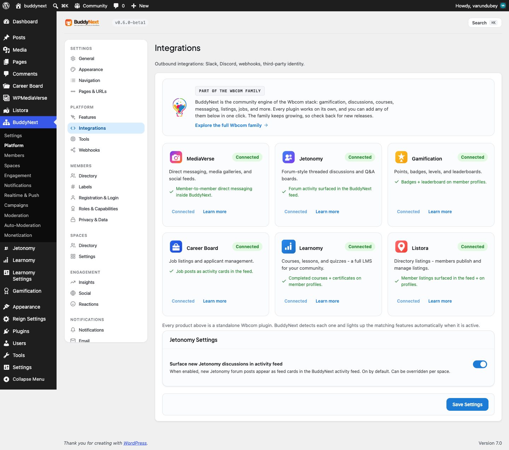

# The Companion Install Model

BuddyNext integrates with a set of Wbcom companion plugins (MediaVerse, Jetonomy, Gamification, Career Board, Learnomy, Listora) and can install and activate any of them in one click from the Integrations screen, with no manual zip upload or Plugins-screen search. This page documents that model: the declarative companion registry, the `buddynext_companions` filter that extends it, the `POST /companions/install` REST route, and the EDD-backed installer. It is for developers adding a new companion to the catalog or building an addon that wants to be one-click installable from BuddyNext.



## Overview / Contract

The model has three parts, each a class under `includes/Integrations/`:

- **`CompanionRegistry`** - a single declarative catalog of companions. Each entry is data, not code. The catalog is filterable via `buddynext_companions`.
- **`CompanionController`** - the REST controller exposing `POST /companions/install` under `buddynext/v1`.
- **`CompanionInstaller`** - resolves the signed package from the Wbcom store over the companion's own EDD channel, downloads it through WP core's `Plugin_Upgrader`, and activates it.

The Integrations admin tab (rendered by `Settings::render_tab_integrations()`) reads the registry and paints one card per companion with an Install / Activate / Connected state. The browser code in `assets/js/admin/settings.js` (`initCompanions`) wires the Install buttons to the REST route.

Every UI and integration decision keys off a runtime capability probe (`is_active()`), never a hardcoded plugin path. Capability present -> BuddyNext delegates to the companion; absent -> it offers to install. That is what lets BuddyNext work standalone and avoid duplicating a companion's features.

```
[Integrations tab] --reads--> CompanionRegistry::all() (filtered by buddynext_companions)
        |  Install click
        v
POST buddynext/v1/companions/install { slug }
        |
        v
CompanionController::install() --validates slug in registry-->
        |
        v
CompanionInstaller::install()
   1. activate free license at the store (edd_action=activate_license)
   2. resolve signed package URL  (edd_action=get_version)
   3. Plugin_Upgrader->install( $package )   [host locked to wbcomdesigns.com]
   4. activate_plugin( basename )
        |
        v
{ installed, slug, status, redirect_url }  ->  browser redirects to the companion's setup_url
```

## How a companion declares itself

A companion is one entry in the array returned by `CompanionRegistry::all()`, keyed by slug. The fields:

| Field | Type | What it is |
|---|---|---|
| `label` | string | Display name shown on the card. |
| `why` | string | One-line value proposition. |
| `detect` | callable | Returns `true` when the companion's capability is live (a runtime probe - a `class_exists`/`function_exists`/`defined` check, not a path). |
| `free` | array | `{ item_id, key, basename }` - the EDD store product id, the baked-in free distribution license key, and the plugin basename for one-click free install. |
| `store_url` | string | Product page on `wbcomdesigns.com` for the "Get Pro" link. |
| `unlocks` | string | What connecting this companion turns on inside BuddyNext. |
| `setup_url` | string (optional) | Admin path to send the user to after install so the companion's own setup flow runs. Falls back to `plugins.php` when absent. |

The `free.item_id` and `free.key` for each companion are the exact values baked into that plugin's own EDD SL SDK setup (its main file). The one-click free install therefore speaks the same delivery channel the companion already uses for its updates - BuddyNext does not invent a second channel.

> **Note:** `detect` must probe a real capability the companion exposes when active (its plugin class or a defined constant), not the plugin file path. A path check returns true for an installed-but-inactive plugin and gives the wrong card state.

## Adding a companion via the filter

Pro and third-party plugins add their own catalog entries through the `buddynext_companions` filter (introduced in 1.2.0). The installer and admin screen render whatever the filter returns, so an entry added this way is one-click installable with no further wiring.

```php
add_filter( 'buddynext_companions', static function ( array $companions ): array {
    $companions['my-companion'] = array(
        'label'     => 'My Companion',
        'why'       => __( 'What it adds, in one line.', 'my-addon' ),
        // Runtime capability probe - true only when the plugin is active.
        'detect'    => static fn(): bool => defined( 'MY_COMPANION_VERSION' ),
        'free'      => array(
            'item_id'  => 1660000,                 // the store product id
            'key'      => 'wbcomfree...',          // the plugin's baked-in free key
            'basename' => 'my-companion/my-companion.php',
        ),
        'store_url' => 'https://wbcomdesigns.com/downloads/my-companion/',
        'unlocks'   => __( 'What connecting this turns on inside BuddyNext.', 'my-addon' ),
        'setup_url' => 'admin.php?page=my-companion-settings', // optional
    );
    return $companions;
} );
```

`CompanionRegistry` derives every card state from the entry. `status()` returns one of:

| Status | Condition |
|---|---|
| `active` | `detect()` passes - the companion is installed and active. |
| `inactive` | The plugin file (`free.basename`) exists on disk but `detect()` is false. |
| `not_installed` | The plugin file is not on disk. |
| `unknown` | No catalog entry for the slug. |

## The install REST route

| Method | Path | Auth | Purpose |
|---|---|---|---|
| POST | `buddynext/v1/companions/install` | `install_plugins` capability + cookie `wp_rest` nonce | Install and activate a catalog companion by slug. |

Request body:

```json
{ "slug": "jetonomy" }
```

The `slug` is sanitized with `sanitize_key` and must exist in the registry; an unknown slug returns `404` before the installer is touched. Success response:

```json
{
  "installed": true,
  "slug": "jetonomy",
  "status": "active",
  "redirect_url": "https://example.com/wp-admin/plugins.php"
}
```

`redirect_url` is the companion's `setup_url` resolved through `admin_url()` when declared, otherwise the Plugins screen. The browser navigates there after a successful install so the user lands in the companion's own setup flow rather than back on the Integrations list.

```bash
curl -X POST "https://example.com/wp-json/buddynext/v1/companions/install" \
  -H "X-WP-Nonce: <wp_rest nonce>" \
  -H "Content-Type: application/json" \
  --cookie "<authenticated admin cookies>" \
  -d '{"slug":"jetonomy"}'
```

## The EDD-backed installer

`CompanionInstaller::install()` is the no-manual-upload engine. It is idempotent and host-locked:

1. **Already active** -> returns `true` immediately, nothing to do.
2. **Installed but inactive** (`free.basename` exists on disk) -> activates in place, never re-downloads.
3. **Not installed** -> activates the free license at the store (`edd_action=activate_license` with `item_id`, `license`, `url`), then resolves the signed package URL (`edd_action=get_version`), then downloads and unpacks it through WP core's `Plugin_Upgrader`, then activates the plugin.

EDD Software Licensing authorizes the download only after the free license is activated for the site's domain, which is why activation happens first; if the store refuses, the installer surfaces the store's real reason (for example an HTTP 401 with the license message) so the failure is diagnosable rather than a generic "download failed."

> **Warning:** The installer only ever talks to and downloads from `wbcomdesigns.com`. The resolved package URL host is checked and must be `wbcomdesigns.com` or a `*.wbcomdesigns.com` subdomain - it never follows a redirect off-domain. The download URL is resolved through EDD from the registry, never taken from client input.

BuddyNext's responsibility ends at activation. From that point the companion's own bundled EDD SL SDK manages its updates - BuddyNext does not proxy or duplicate update delivery.

## Notes / gotchas

- **Capability gate.** The route requires the `install_plugins` capability - the same gate WordPress puts on any plugin install - enforced in both the controller's `permission_callback` and again inside the installer. WordPress verifies the `wp_rest` nonce on the cookie-authenticated request.
- **Slug allow-list.** Only registry slugs are installable. The controller rejects anything else with `404` before the installer runs.
- **Filesystem access.** Install needs direct filesystem credentials. On hosts that cannot grant them, the installer returns a clear error pointing the admin to install from the Plugins screen instead.
- **No path-based detection.** Because `detect` is a runtime capability probe, the registry can tell `active` from `inactive` from `not_installed` correctly - which is what drives whether the card shows Connected, Activate, or Install.
- **Companion vs bridge.** Installing a companion makes its capability available; the actual integration behaviour (surfacing its events in the feed, on profiles, etc.) is wired by BuddyNext's bridge classes, which guard on the same capability probe. See the integration bridge documentation for that layer.
