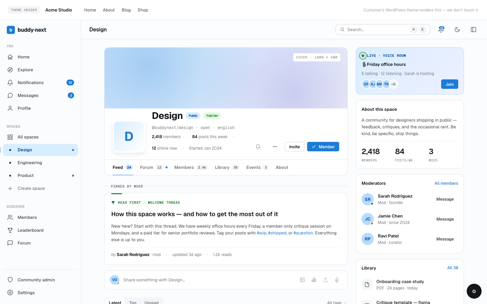

# Integration Bridges (Layer 1)

The bridge layer is how BuddyNext connects to optional companion plugins (Jetonomy forums, WPMediaVerse media + DM, wb-gamification, Career Board) and the host theme. Each bridge is an adapter class under `includes/Bridges/` that translates a companion's hooks and data into BuddyNext surfaces - and stays completely inert when the companion is not installed. This page is for developers writing a new bridge, theming a bridged surface, or extending one of the existing integrations.




## Overview / Contract

A bridge is a thin, one-directional adapter. The rules every BuddyNext bridge follows:

1. **One class per companion, `Bridge` suffix.** Adapter classes live in `includes/Bridges/` and are named `{Companion}Bridge` (for example `JetonomyBridge`). A companion that also needs to mirror inbound notifications ships a paired `{Companion}BridgeListener` implementing `BuddyNext\Contracts\ListenerInterface`.
2. **Self-guarding at hook time, not load time.** Every bridge's entry method (`init()` for adapters, `register()` for listeners) bails immediately with a `class_exists()` / `function_exists()` check against the companion. Nothing is registered on a site that does not run the companion, so no hooks are wasted and no fatals occur on activation-order differences.
3. **Loaded on a single seam after everyone else has booted.** Bridges are wired on `buddynext_load_bridges`, which BuddyNext fires at `plugins_loaded:25` - after BuddyNext itself (priority 15) and after Pro companions like Jetonomy Pro and WPMediaVerse Pro (priority 20). Activation order between BuddyNext and a companion therefore never matters.
4. **Feature-toggle gated.** Each integration bridge is additionally gated on its Platform -> Features toggle via `buddynext_feature_enabled( '{feature}' )` (all default-on). Turning a bridge off in the admin actually disables it, independent of whether the companion is active.
5. **BuddyNext owns companion table access.** When a bridge needs companion data (for example Jetonomy's `jt_posts` / `jt_replies`), the bridge class is the only place that reads those tables - templates and services never reach into a companion's schema directly.

### How bridges are wired

```php
// includes/Core/Plugin.php - fired at plugins_loaded:25
do_action( 'buddynext_load_bridges' );

add_action( 'buddynext_load_bridges', function (): void {
    // Theme bridge - always wired (it self-guards on the active template).
    ( new BuddyXBridge() )->init();

    if ( buddynext_feature_enabled( 'wpmediaverse' ) ) {
        ( new WPMediaVerseBridge() )->init();
    }
    if ( buddynext_feature_enabled( 'gamification' ) ) {
        ( new GamificationBridge() )->init();
        ( new GamificationBridgeListener() )->register();
        ( new \BuddyNext\Profile\GamificationAchievements() )->register();
    }
    if ( buddynext_feature_enabled( 'jetonomy' ) ) {
        ( new JetonomyBridge() )->init();
        ( new JetonomyBridgeListener() )->register();
    }
} );
```

A third-party bridge attaches the same way - hook `buddynext_load_bridges` and wire your own adapter inside a feature/`class_exists` guard.

### Bridge -> companion -> key seams

| Bridge | Companion | Guard (active when) | Feature toggle | Key seams |
|---|---|---|---|---|
| `JetonomyBridge` | Jetonomy (forums) | `class_exists( 'Jetonomy\Jetonomy' )` | `jetonomy` | `jetonomy_after_create_post`, `jetonomy_post_deleted`, `jetonomy_after_create_reply` (consume); `buddynext_rail_items`, `buddynext_register_nav`, `buddynext_context_nav`, `buddynext_hashtag_related_discussions` (provide); REST `POST /spaces/{id}/forum` |
| `JetonomyBridgeListener` | Jetonomy | `class_exists( 'Jetonomy\Jetonomy' )` | `jetonomy` | `jetonomy_notification_created` (consume); mirrors into one BN type `jt.notification` via the three notification render filters |
| `WPMediaVerseBridge` | WPMediaVerse (media + DM engine) | `class_exists( 'WPMediaVerse\Core\Plugin' )` | `wpmediaverse` | `mvs_buddynext_active`, `mvs_can_send_message`, `mvs_dm_denial_reason`, `mvs_user_profile_url`, `mvs_message_sent`, `mvs_favorite_toggled`, `mvs_comment_created`, `mvs_user_followed/unfollowed` (consume); fires `buddynext_dm_sent` / `buddynext_dm_received` |
| `GamificationBridge` | wb-gamification | `function_exists( 'wb_gam_submit_event' )` | `gamification` | Consumes BuddyNext engagement actions and submits `wb_gam_submit_event()`; consumes `wb_gam_badge_awarded` for feed activity. See the Gamification Engine Seam page. |
| `GamificationBridgeListener` | wb-gamification | `function_exists( 'wb_gam_submit_event' )` | `gamification` | `wb_gam_badge_awarded`, `wb_gam_level_changed` (consume) -> BN notifications `bn.badge_awarded` / `bn.level_up` |
| `CareerBoardBridge` (registered in Pro) | Career Board (`wp-career-board`) | `class_exists` guard inside the bridge | `career_board` | `wcb_run`, `wcb_job_created`, `wcb_application_*` (consume) -> `bn_search_index` (`object_type='job'`) + `bn_notifications`; pure inbound listener |
| `BuddyXBridge` | BuddyX theme | `'buddyx' === get_template()` | always wired | `buddyx_is_full_width_page` (provide) so plugin pages escape the theme's `.container` wrapper |
| `PwaService` (PWA, not a companion bridge) | none (first-party) | always wired | n/a | Serves the web-app manifest + service worker; opt-out filter `buddynext_pwa_register_sw` |

## JetonomyBridge

Routes Jetonomy forum events into BuddyNext search, the activity feed, the navigation rail, profile and space tabs, and the notification center. Active only when `Jetonomy\Jetonomy` exists.

### Inbound (what it consumes)

| Hook | Type | Fired when | Bridge handler |
|---|---|---|---|
| `jetonomy_after_create_post` | action (2 args: `$post_id`, `$space_id`) | A discussion is created | `on_post_created` |
| `jetonomy_post_deleted` | action (3 args) | A discussion is soft-deleted | `on_post_deleted` |
| `jetonomy_after_create_reply` | action (2 args) | A reply is posted | `notify_discussion_reply` |

On create, the bridge reads the discussion row from `{prefix}jt_posts` (Jetonomy fires the hook with IDs only), indexes it into `bn_search_index` as `object_type = 'discussion'`, parses `@username` mentions (firing `buddynext_user_mentioned`), and - for a published, non-private topic in a `public` space - publishes a `discussion` activity into the feed via `Feed\IntegrationActivity`. The discussion URL is rebuilt from the `jt_posts` / `jt_spaces` slugs as `{base}/s/{space}/t/{post}/`.

> **Note:** The privacy gate is strict. A private/secret space or a private topic never produces a public feed activity - only the search index entry, which respects its own visibility.

### Feed sync option

| Option key | Type | Default | Used by |
|---|---|---|---|
| `buddynext_jetonomy_feed_sync` | string (`'1'` / `'0'`) | `'1'` (on) | `JetonomyBridge::on_post_created` |

Feed sync is on by default whenever Jetonomy is active (the bridge only loads then). The owner can flip it off under Integrations -> Jetonomy Feed Sync; when off, discussions are still indexed for search but no feed activity is published. Per-discussion control is also available through the `buddynext_jetonomy_discussion_activity` filter (return `false` to skip a specific post).

### Outbound (what it provides)

| Hook / surface | Purpose |
|---|---|
| `buddynext_rail_items` (filter) | Adds a "Discussions" item to the BuddyNext left rail, linking to the Jetonomy community home. Active state derived from `REQUEST_URI`. |
| `buddynext_register_nav` (action) | Registers a "Discussions" tab on both the profile surface (with a lazy count badge of the member's published discussions) and the space surface (linking to the linked forum, or the on-demand provision trigger). |
| `buddynext_context_nav` (filter) | Injects Home / Search / Leaderboard sub-nav when the active section is `discussions`. |
| `buddynext_hashtag_related_discussions` (filter) | Returns Jetonomy discussions sharing a hashtag slug, so the hashtag feed can show "Related Discussions". |
| `buddynext_jetonomy_post_indexed` (action) | Fires after a discussion is indexed, for per-space sync extensions. |

### On-demand space forum

A BuddyNext space links to a Jetonomy forum through the option `bn_space_{space_id}_jetonomy_forum_id`. The forum is created the first time a member opens a forumless space's Discussions tab (no empty forums are pre-created):

- **Web:** the tab links to `/spaces/?bn_provision_forum={space_id}`; `maybe_provision_and_redirect()` (on `template_redirect:5`) provisions the forum and redirects to it.
- **App / REST:** `POST /buddynext/v1/spaces/{id}/forum` provisions (or fetches) the forum and returns `{ forum_id, forum_url }`.

Both paths gate provisioning on `buddynext-moderate-space` (space owner/moderator, plus site admins) - an arbitrary logged-in member cannot provision a forum on a space they do not moderate.

```bash
curl -X POST "https://example.com/wp-json/buddynext/v1/spaces/42/forum" \
  -H "X-WP-Nonce: $NONCE" --cookie "$COOKIES"
# -> { "forum_id": 7, "forum_url": "https://example.com/community/s/general/" }
```

### Messaging precedence

When BuddyNext messaging is available, the bridge filters `option_jetonomy_pro_extensions` at read time to drop Jetonomy Pro's `private-messaging` extension, so BuddyNext owns the `/messages/` route. Nothing is persisted (the filter only changes the value front-end at read time) and it reverts automatically if BN messaging is disabled. The setting is left untouched in wp-admin so the Jetonomy extensions screen still reflects and saves the real value.

> **Note:** A docblock at the top of `JetonomyBridge` and an `audit/manifest.json` `consumed` entry both reference suppressing Jetonomy's own community nav via `jetonomy_show_community_nav -> false`. The current code does **not** register that filter - per the owner rule that BuddyNext must not touch Jetonomy's own pages. The link *into* discussions lives on BuddyNext's own rail instead. Treat the manifest/docblock mention as stale; the live behavior is no suppression.

## JetonomyBridgeListener

Mirrors every Jetonomy notification (replies, mentions, accepted answers, join requests, votes) into BuddyNext's central notification center, so a member sees forum activity at `/notifications/` alongside everything else.

Jetonomy 1.5.0 fires one central hook for all of its notifications:

```php
do_action( 'jetonomy_notification_created', int $notification_id, int $user_id,
    string $type, string $object_type, int $object_id, string $message, string $url );
```

The listener subscribes with `acceptedArgs = 7` but defaults `$message` and `$url` so older five-argument firings cannot trigger an `ArgumentCountError`. Each event is mirrored into a single BuddyNext notification type, `jt.notification`, with `group_key = jt_{subtype}_{object_id}` for dedup. The stored `message` and `url` are rendered straight through the three Free notification seams (`buddynext_notification_message`, `buddynext_notification_url`, `buddynext_notification_meta`), so there is no per-type copy to maintain.

Two cross-cutting rules:

- **Blocks honored.** If the actor is resolvable from the object (`jt_replies` / `jt_posts` author) and either party has blocked the other (`bn_blocks`), the notification is suppressed.
- **Collect-only / no double email.** The prefs-catalogue entry registers `can_email = false`. Jetonomy owns its own emails; BuddyNext only displays the mirror and never emails it.

## WPMediaVerseBridge

Connects BuddyNext to the WPMediaVerse engine for media and direct messaging. Active only when `WPMediaVerse\Core\Plugin` exists. BuddyNext consumes WPMediaVerse at the REST/API level only and owns 100% of its own UX - WPMediaVerse JS/CSS is never enqueued on BuddyNext pages, and `/messages/` is a fully native BuddyNext surface (`templates/messages/native.php`) backed by the `mvs/v1` REST engine.

### Declaring BuddyNext active

```php
add_filter( 'mvs_buddynext_active', '__return_true' );
```

This tells WPMediaVerse to suppress its own floating chat panel, standalone messages page, and duplicate notifications - BuddyNext takes over those surfaces.

### DM gating

`check_block()` layers BuddyNext's access rules on top of WPMediaVerse's own DM controls through `mvs_can_send_message` (either side can deny; neither overrides the other):

- Site admins (`manage_options`) always pass.
- A recipient who has blocked the sender (`bn_blocks`, via the `blocks` service `has_blocked()`) denies the send.
- The recipient's "who can DM me" preference (`bn_privacy_dm` user meta, falling back to the `buddynext_default_dm_access` option) is enforced: `everyone` / `members` / `connections` / `nobody`.

`dm_denial_reason()` mirrors that logic on `mvs_dm_denial_reason` so the sender sees an accurate cause - `blocked`, `dms_disabled` (the `nobody` preference), or `connections_only` - instead of a generic "blocked".

### Message + favorite events

| Hook | Type | Result |
|---|---|---|
| `mvs_message_sent` | action (4 args) | Fires `buddynext_dm_sent` (sender perspective, once) and `buddynext_dm_received` (per recipient, sender stripped), then creates `bn.new_message` notifications. Restrict/mute on the recipient side suppresses the bell without blocking the message. |
| `mvs_favorite_toggled` | action (3 args) | On `'added'` only, notifies the media owner with `bn.media_favorited`. |
| `mvs_comment_created` | action | Syncs a lightbox photo comment into a `bn_comments` row threaded under the BuddyNext post holding the media, then fires `buddynext_comment_created` (canonical 4-arg). Deduped against re-fires. |
| `mvs_user_profile_url` | filter | Repoints WPMediaVerse author links at the BuddyNext member profile (`PageRouter::profile_url`). |

### Two-way follow mirror

`bn_follows` (BuddyNext) and `mvs_follows` (WPMediaVerse) are kept in sync in both directions so a member's follow state is identical on either profile. The bridge listens on `mvs_user_followed/unfollowed` and `buddynext_user_followed/unfollowed`; a re-entrancy guard (`$mirroring_follow`) plus an `is_following()` short-circuit prevent the mirror from looping back on itself.

### Connection-note delivery

When a connection request carries a note (only when the owner enabled the opt-in note step), `deliver_note_as_message_request()` writes it into a conversation as a pending **message request** via the engine's `find_or_create_conversation( …, [ 'force_request' => true ] )` seam (WPMediaVerse 1.7.1+), so it lands under the recipient's Messages "Requests" tab rather than auto-opening a thread. The engine still enforces every denial first; this only converts an otherwise-allowed send into a request. Errors are swallowed so a messaging-engine failure never breaks the connect flow.

### Media rail item

`inject_media_nav_item()` adds a "Media" link to the BuddyNext left rail, resolving the engine's mapped Explore page (`mvs_page_explore`) and falling back to `/media/`. This only adds a link on BuddyNext's own pages - it never alters a WPMediaVerse page.

## GamificationBridge and GamificationBridgeListener

The gamification integration is split into a write-side bridge (BuddyNext events -> engine), an inbound listener (engine events -> BuddyNext notifications), and an Achievements profile tab. BuddyNext ships zero gamification logic - it registers an action catalogue, emits events, and renders the engine's public read API. The full contract is documented on the **Gamification Engine Seam** page; in summary:

- `GamificationBridge` consumes BuddyNext engagement actions (follow, connection accepted, post created, space joined, strike issued, profile completion, reaction received, comment created) and submits each through `wb_gam_submit_event( $user_id, $action_id, $context )` against a registered `bn_*` action slug. It also posts a feed activity (`on_badge_awarded_activity` on `wb_gam_badge_awarded`) when a member earns a credential badge.
- `GamificationBridgeListener` consumes `wb_gam_badge_awarded` and `wb_gam_level_changed` (inbound only - it never submits an award, so it cannot double-count) and creates `bn.badge_awarded` / `bn.level_up` notifications.
- `BuddyNext\Profile\GamificationAchievements` registers an "Achievements" profile tab (badge grid + points/level/streak standing strip) read purely from `wb_gam_*` functions. The tab is data-gated - it appears only once the member has a badge or any points.

> **Note:** The conformance record `docs/conformance/contract-gamification-seam.md` describes profile gamification being surfaced via `buddynext_profile_extra_data`. The current implementation surfaces it through the dedicated `GamificationAchievements` profile tab instead (registered on `buddynext_register_nav`); the `profile_extra_data` injection is not present in `GamificationBridge`. Document the Achievements tab as the live surface.

## Career Board bridge (registered in Pro)

`CareerBoardBridge` was moved Free -> Pro: jobs are an application layer on top of the social core, so Free no longer registers it. Pro wires it on the same `buddynext_load_bridges` seam, gated on the `career_board` feature. It is a pure inbound listener - it consumes Career Board hooks (`wcb_run`, `wcb_job_created`, `wcb_application_*`), indexes jobs into `bn_search_index` (`object_type = 'job'`) via `SearchService::index()`, and creates `bn_notifications` for application events. It fires no `buddynext_*` hooks of its own and does not index hashtags. The hooks were reconciled against the real `wp-career-board` signatures (the `wcb_job_created` hook passes a `WP_REST_Request`, so the bridge reads from the job post; candidate and employer are resolved from `_wcb_candidate_id` meta and `post_author` since the hooks omit them).

## PWA

`PwaService` (`includes/PWA/PwaService.php`) is a first-party service, not a companion bridge, but it follows the same opt-out pattern. It is always wired (`Plugin::init()`), and on the front end it:

- Outputs the web-app manifest `<link>` in `wp_head`.
- Serves the manifest JSON and the generated service worker through REST routes (the service-worker response sets `Service-Worker-Allowed: /`).
- Enqueues the client bootstrap `assets/js/pwa/sw-register.js` (no inline script).

Two extension seams:

```php
// Customize the manifest array (name, theme_color, icons, ...).
add_filter( 'buddynext_pwa_manifest', function ( array $manifest ): array { /* ... */ return $manifest; } );

// Opt out of service-worker registration entirely (e.g. when another PWA owns the SW).
add_filter( 'buddynext_pwa_register_sw', '__return_false' );
```

The service skips entirely in wp-admin (the manifest only applies to the front end).

## BuddyXBridge

A theme bridge, always wired because it self-guards on `'buddyx' === get_template()`. Without it, BuddyX wraps every `get_header()` in a `.container` div that constrains plugin layouts. The bridge hooks `buddyx_is_full_width_page -> true` on WPMediaVerse front-end pages (detected via the `mvs_page_*` option page IDs) so the theme skips its container wrapper for those surfaces. A future seam will map BuddyX Customizer values to `--bn-*` tokens via `buddynext_css_vars`.

## Notes / gotchas

- **Bridges never call companion code directly outside a guard.** Every companion class/function reference is wrapped in a `class_exists` / `function_exists` / `method_exists` check, so a partial or older companion build degrades instead of fataling.
- **Feature toggle vs companion presence are independent gates.** A bridge runs only when both its feature toggle is on (`buddynext_feature_enabled`) and its companion is active. Disabling the toggle removes the bridge even if the companion is installed.
- **Companion table access is the bridge's job.** Jetonomy `jt_*` reads and the WPMediaVerse follow-graph access live inside the bridge classes; downstream templates and services consume bridge methods (for example `JetonomyBridge::user_discussions()`), never the companion schema.
- **Free/Pro boundary.** `CareerBoardBridge` is the only integration bridge that lives in Pro. Jetonomy, WPMediaVerse, gamification, BuddyX, and PWA all live in Free and run regardless of Pro.
- **Manifest may lag code.** The `audit/manifest.json` `consumed` list still records `jetonomy_show_community_nav` for `JetonomyBridge`; the live code no longer registers it. When the manifest and source disagree, the source is authoritative.
