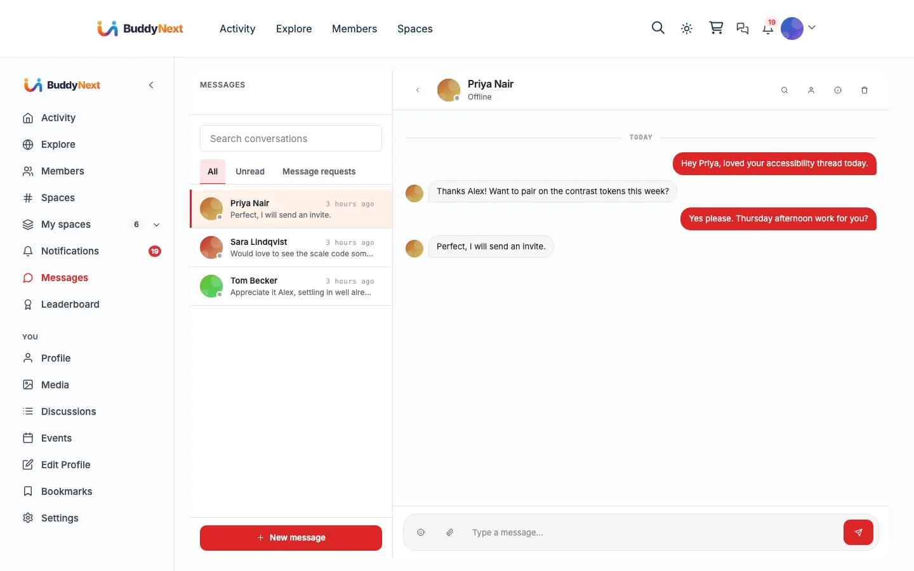

# Integration Bridges (Layer 1)

The bridge layer is how BuddyNext connects to optional companion plugins (Jetonomy forums, WPMediaVerse media + DM, wb-gamification, Career Board) and the host theme. Each bridge is an adapter class under `includes/Bridges/` that translates a companion's hooks and data into BuddyNext surfaces - and stays completely inert when the companion is not installed. This page is for developers writing a new bridge, theming a bridged surface, or extending one of the existing integrations.




## Overview / Contract

A bridge is a thin, one-directional adapter. The rules every BuddyNext bridge follows:

1. **One class per companion, `Bridge` suffix.** Adapter classes live in `includes/Bridges/` and are named `{Companion}Bridge` (for example `JetonomyBridge`). A companion that also needs to mirror inbound notifications ships a paired `{Companion}BridgeListener` implementing `BuddyNext\Contracts\ListenerInterface`.
2. **Self-guarding at hook time, not load time.** Every bridge's entry method (`init()` for adapters, `register()` for listeners) bails immediately with a `class_exists()` / `function_exists()` check against the companion. Nothing is registered on a site that does not run the companion, so no hooks are wasted and no fatals occur on activation-order differences.
3. **Loaded on a single seam after everyone else has booted.** Bridges are wired on `buddynext_load_bridges`, which BuddyNext fires at `plugins_loaded:25` - after BuddyNext itself (priority 15) and after Pro companions like Jetonomy Pro and WPMediaVerse Pro (priority 20). Activation order between BuddyNext and a companion therefore never matters.
4. **Feature-toggle gated.** Each integration bridge is additionally gated on its Platform -> Features toggle via `buddynext_feature_enabled( '{feature}' )` (all default-on). Turning a bridge off in the admin actually disables it, independent of whether the companion is active.
5. **BuddyNext owns companion table access.** When a bridge needs companion data (for example Jetonomy's `jt_posts` / `jt_replies`), the bridge class is the only place that reads those tables - templates and services never reach into a companion's schema directly.

### How bridges are wired

```php
// includes/Core/Plugin.php - fired at plugins_loaded:25
do_action( 'buddynext_load_bridges' );

add_action( 'buddynext_load_bridges', function (): void {
    // Theme bridge - always wired (it self-guards on the active template).
    ( new BuddyXBridge() )->init();

    if ( buddynext_feature_enabled( 'wpmediaverse' ) ) {
        ( new WPMediaVerseBridge() )->init();
    }
    if ( buddynext_feature_enabled( 'gamification' ) ) {
        ( new GamificationBridge() )->init();
        ( new GamificationBridgeListener() )->register();
        ( new \BuddyNext\Profile\GamificationAchievements() )->register();
    }
    if ( buddynext_feature_enabled( 'jetonomy' ) ) {
        ( new JetonomyBridge() )->init();
        ( new JetonomyBridgeListener() )->register();
    }
} );
```

A third-party bridge attaches the same way - hook `buddynext_load_bridges` and wire your own adapter inside a feature/`class_exists` guard.

### Bridge -> companion -> key seams

| Bridge | Companion | Guard (active when) | Feature toggle | Key seams |
|---|---|---|---|---|
| `JetonomyBridge` | Jetonomy (forums) | `class_exists( 'Jetonomy\Jetonomy' )` | `jetonomy` | `jetonomy_after_create_post`, `jetonomy_post_deleted`, `jetonomy_after_create_reply` (consume); `buddynext_rail_items`, `buddynext_register_nav`, `buddynext_context_nav`, `buddynext_hashtag_related_discussions` (provide); REST `POST /spaces/{id}/forum` |
| `JetonomyBridgeListener` | Jetonomy | `class_exists( 'Jetonomy\Jetonomy' )` | `jetonomy` | `jetonomy_notification_created` (consume); mirrors into one BN type `jt.notification` via the three notification render filters |
| `WPMediaVerseBridge` | WPMediaVerse (media + DM engine) | `class_exists( 'WPMediaVerse\Core\Plugin' )` | `wpmediaverse` | `mvs_buddynext_active`, `mvs_can_send_message`, `mvs_dm_denial_reason`, `mvs_user_profile_url`, `mvs_message_sent`, `mvs_favorite_toggled`, `mvs_comment_created`, `mvs_user_followed/unfollowed` (consume); fires `buddynext_dm_sent` / `buddynext_dm_received` |
| `GamificationBridge` | wb-gamification | `function_exists( 'wb_gam_submit_event' )` | `gamification` | Consumes `wb_gam_badge_awarded` to post a credential-badge feed activity. Point awards for BuddyNext activity are owned by the wb-gamification plugin's own `integrations/buddynext.php` manifest, not this bridge. |
| `GamificationBridgeListener` | wb-gamification | `function_exists( 'wb_gam_submit_event' )` | `gamification` | `wb_gam_badge_awarded`, `wb_gam_level_changed` (consume) -> BN notifications `bn.badge_awarded` / `bn.level_up` |
| `CareerBoardBridge` (registered in Pro) | Career Board (`wp-career-board`) | `defined( 'WCB_VERSION' )` guard inside the bridge | `career_board` | `wcb_job_created`, `wcb_job_expired`, `wcbp_resume_published`, `wcb_notification_created` (consume) -> `bn_search_index` (`object_type='job'`) + `bn_notifications`; pure inbound listener |
| `BuddyXBridge` | BuddyX theme | `'buddyx' === get_template()` | always wired | `buddyx_is_full_width_page` (provide) so plugin pages escape the theme's `.container` wrapper |
| `PwaService` (PWA, not a companion bridge) | none (first-party) | always wired | n/a | Serves the web-app manifest + service worker; opt-out filter `buddynext_pwa_register_sw` |

## Version floors and the staleness gate

A bridge is written against a specific version of its partner. Two failure modes follow: the partner can be **older** than a seam the bridge needs (the seam silently no-ops), or **newer** than the version the bridge was built for (the bridge may not use the partner's newest capabilities and can drift toward broken). Both are surfaced instead of left to rot.

Each bridge declares two version fields in its `buddynext_integrations` registry entry, both normalized null-safe by `IntegrationRegistry::all()` (Pro suite bridges declare them via `AbstractSuitePanelProvider::integration_min_version()` / `integration_tested_version()`):

- **`min_version`** — the floor below which the bridge's wired seams no-op. Declared per bridge (there is no central map).
- **`tested_version`** — the partner release the bridge was last built and verified against.

Three surfaces read them:

1. **Integration Settings** (Settings -> Integration Settings) shows one badge per integration: *Active*, *Update needed* (installed `< min_version`), or *Update available* (installed `> tested_version` — informational; the bridge still works, it is due a refresh).
2. **CLI gate** `wp buddynext bridge-status` walks the registry and prints installed / floor / tested / state per bridge. It exits non-zero when any bridge is below its floor; `--strict` also fails when a partner is ahead of `tested_version`. Run it in CI so bridges cannot silently fall behind as partners ship.
3. Per-bridge deep audits (what the partner offers vs what the bridge consumes) are tracked as Basecamp cards, not in code.

Current declared values (update the row when you re-verify a bridge against a new partner release):

| Integration | Partner constant | `min_version` | `tested_version` |
|---|---|---|---|
| `media` | `MVS_VERSION` | 2.4.0 | 2.5.0 |
| `gamification` | `WB_GAM_VERSION` | 1.6.3 | 1.6.4 |
| `careerboard` | `WCB_VERSION` | 1.4.3 | 1.6.0 |
| `learnomy` | `LEARNOMY_VERSION` | 1.9.4 | 1.9.5 |
| `eventonomy` | `EVENTONOMY_VERSION` | 1.6.0 | 1.6.0 |
| `jetonomy` | `JETONOMY_VERSION` | (none) | 1.9.7 |
| `listora` | `WB_LISTORA_VERSION` | (none) | 1.6.0 |
| `blog` | `BUDDYPRESS_MEMBER_BLOG_VERSION` | (none) | 4.1.0 |

## Identity takeover (BuddyNext is master)

Where a partner renders a member's name, @handle, avatar or profile link on a shared surface, BuddyNext owns that identity: one profile link, one name, one mention system across the whole site. A partner exposes filter seams for a host to claim; the bridge fills them so the partner defers to BuddyNext.

- **Jetonomy** fills all five identity seams (`JetonomyBridge`): `jetonomy_profile_url` -> `PageRouter::profile_url`, `jetonomy_user_handle` + `jetonomy_resolve_mention_handles` -> BuddyNext `Handle` (matched emit/resolve pair, incl. custom slug + reserved `user-{id}`), `jetonomy_user_display_name` -> WP `display_name`, and `jetonomy_profile_action_url` -> BuddyNext profile / edit / notification screens (`badges` / `digest` stay on Jetonomy). Avatars come through WP `pre_get_avatar_data` where BuddyNext's `AvatarService` (priority 50/99) already wins.
- **WPMediaVerse** fills `mvs_user_profile_url` -> BuddyNext profile and reports `mvs_has_custom_avatar`; its display name defaults to WP `display_name` already, and a single-media page redirects to the source BuddyNext activity by default, so identity there is native BuddyNext.

## JetonomyBridge

Routes Jetonomy forum events into BuddyNext search, the activity feed, the navigation rail, profile and space tabs, and the notification center. Active only when `Jetonomy\Jetonomy` exists.

### Inbound (what it consumes)

| Hook | Type | Fired when | Bridge handler |
|---|---|---|---|
| `jetonomy_after_create_post` | action (2 args: `$post_id`, `$space_id`) | A discussion is created | `on_post_created` |
| `jetonomy_post_deleted` | action (3 args) | A discussion is soft-deleted | `on_post_deleted` |
| `jetonomy_after_create_reply` | action (2 args) | A reply is posted | `notify_discussion_reply` |

On create, the bridge reads the discussion row from `{prefix}jt_posts` (Jetonomy fires the hook with IDs only), indexes it into `bn_search_index` as `object_type = 'discussion'`, parses `@username` mentions (firing `buddynext_user_mentioned`), and - for a published, non-private topic in a `public` space - publishes a `discussion` activity into the feed via `Feed\IntegrationActivity`. The discussion URL is rebuilt from the `jt_posts` / `jt_spaces` slugs as `{base}/s/{space}/t/{post}/`.

> **Note:** The privacy gate is strict. A private/secret space or a private topic never produces a public feed activity - only the search index entry, which respects its own visibility.

### Feed sync option

| Option key | Type | Default | Used by |
|---|---|---|---|
| `buddynext_jetonomy_feed_sync` | string (`'1'` / `'0'`) | `'1'` (on) | `JetonomyBridge::on_post_created` |

Feed sync is on by default whenever Jetonomy is active (the bridge only loads then). The owner can flip it off under Integrations -> Jetonomy Feed Sync; when off, discussions are still indexed for search but no feed activity is published. Per-discussion control is also available through the `buddynext_jetonomy_discussion_activity` filter (return `false` to skip a specific post).

### Outbound (what it provides)

| Hook / surface | Purpose |
|---|---|
| `buddynext_rail_items` (filter) | Adds a "Discussions" item to the BuddyNext left rail, linking to the Jetonomy community home. Active state derived from `REQUEST_URI`. |
| `buddynext_register_nav` (action) | Registers a "Discussions" tab on both the profile surface (with a lazy count badge of the member's published discussions) and the space surface (linking to the linked forum, or the on-demand provision trigger). |
| `buddynext_context_nav` (filter) | Injects Home / Search / Leaderboard sub-nav when the active section is `discussions`. |
| `buddynext_hashtag_related_discussions` (filter) | Returns Jetonomy discussions sharing a hashtag slug, so the hashtag feed can show "Related Discussions". |
| `buddynext_jetonomy_post_indexed` (action) | Fires after a discussion is indexed, for per-space sync extensions. |

### On-demand space forum

A BuddyNext space links to a Jetonomy forum through the option `bn_space_{space_id}_jetonomy_forum_id`. The forum is created the first time a member opens a forumless space's Discussions tab (no empty forums are pre-created):

- **Web:** the tab links to `/spaces/?bn_provision_forum={space_id}`; `maybe_provision_and_redirect()` (on `template_redirect:5`) provisions the forum and redirects to it.
- **App / REST:** `POST /buddynext/v1/spaces/{id}/forum` provisions (or fetches) the forum and returns `{ forum_id, forum_url }`.

Both paths gate provisioning on `buddynext-moderate-space` (space owner/moderator, plus site admins) - an arbitrary logged-in member cannot provision a forum on a space they do not moderate.

```bash
curl -X POST "https://example.com/wp-json/buddynext/v1/spaces/42/forum" \
  -H "X-WP-Nonce: $NONCE" --cookie "$COOKIES"
# -> { "forum_id": 7, "forum_url": "https://example.com/community/s/general/" }
```

### Messaging precedence

When BuddyNext messaging is available, the bridge filters `option_jetonomy_pro_extensions` at read time to drop Jetonomy Pro's `private-messaging` extension, so BuddyNext owns the `/messages/` route. Nothing is persisted (the filter only changes the value front-end at read time) and it reverts automatically if BN messaging is disabled. The setting is left untouched in wp-admin so the Jetonomy extensions screen still reflects and saves the real value.

> **Note:** A docblock at the top of `JetonomyBridge` references suppressing Jetonomy's own community nav via `jetonomy_show_community_nav -> false`. The current code does **not** register that filter - per the owner rule that BuddyNext must not touch Jetonomy's own pages. The link *into* discussions lives on BuddyNext's own rail instead. Treat the manifest/docblock mention as stale; the live behavior is no suppression.

## JetonomyBridgeListener

Mirrors every Jetonomy notification (replies, mentions, accepted answers, join requests, votes) into BuddyNext's central notification center, so a member sees forum activity at `/notifications/` alongside everything else.

Jetonomy 1.5.0 fires one central hook for all of its notifications:

```php
do_action( 'jetonomy_notification_created', int $notification_id, int $user_id,
    string $type, string $object_type, int $object_id, string $message, string $url );
```

The listener subscribes with `acceptedArgs = 7` but defaults `$message` and `$url` so older five-argument firings cannot trigger an `ArgumentCountError`. Each event is mirrored into a single BuddyNext notification type, `jt.notification`, with `group_key = jt_{subtype}_{object_id}` for dedup. The stored `message` and `url` are rendered straight through the three Free notification seams (`buddynext_notification_message`, `buddynext_notification_url`, `buddynext_notification_meta`), so there is no per-type copy to maintain.

Two cross-cutting rules:

- **Blocks honored.** If the actor is resolvable from the object (`jt_replies` / `jt_posts` author) and either party has blocked the other (`bn_blocks`), the notification is suppressed.
- **Collect-only / no double email.** The prefs-catalogue entry registers `can_email = false`. Jetonomy owns its own emails; BuddyNext only displays the mirror and never emails it.

## WPMediaVerseBridge

Connects BuddyNext to the WPMediaVerse engine for media and direct messaging. Active only when `WPMediaVerse\Core\Plugin` exists. BuddyNext consumes WPMediaVerse at the REST/API level only and owns 100% of its own UX - WPMediaVerse JS/CSS is never enqueued on BuddyNext pages, and `/messages/` is a fully native BuddyNext surface (`templates/messages/native.php`) backed by the `mvs/v1` REST engine.

Which plugin owns which shared screen - and which of them are still open - is tracked in [WPMediaVerse Surface Ownership Map](54-mediaverse-surface-ownership.md). Read it before building a screen WPMediaVerse also renders.

### Declaring BuddyNext active

```php
add_filter( 'mvs_buddynext_active', '__return_true' );
```

This tells WPMediaVerse to suppress its own floating chat panel, standalone messages page, and duplicate notifications - BuddyNext takes over those surfaces.

### DM gating

`check_block()` layers BuddyNext's access rules on top of WPMediaVerse's own DM controls through `mvs_can_send_message` (either side can deny; neither overrides the other):

- Site admins (`manage_options`) always pass.
- A recipient who has blocked the sender (`bn_blocks`, via the `blocks` service `has_blocked()`) denies the send.
- The recipient's "who can DM me" preference (`bn_privacy_dm` user meta, falling back to the `buddynext_default_dm_access` option) is enforced: `everyone` / `members` / `connections` / `nobody`.

`dm_denial_reason()` mirrors that logic on `mvs_dm_denial_reason` so the sender sees an accurate cause - `blocked`, `dms_disabled` (the `nobody` preference), or `connections_only` - instead of a generic "blocked".

### Message + favorite events

| Hook | Type | Result |
|---|---|---|
| `mvs_message_sent` | action (4 args) | Fires `buddynext_dm_sent` (sender perspective, once) and `buddynext_dm_received` (per recipient, sender stripped), then creates `bn.new_message` notifications. Restrict/mute on the recipient side suppresses the bell without blocking the message. |
| `mvs_favorite_toggled` | action (3 args) | On `'added'` only, notifies the media owner with `bn.media_favorited`. |
| `mvs_comment_created` | action | Syncs a lightbox photo comment into a `bn_comments` row threaded under the BuddyNext post holding the media, then fires `buddynext_comment_created` (canonical 4-arg). Deduped against re-fires. |
| `mvs_user_profile_url` | filter | Repoints WPMediaVerse author links at the BuddyNext member profile (`PageRouter::profile_url`). |

### Two-way follow mirror

`bn_follows` (BuddyNext) and `mvs_follows` (WPMediaVerse) are kept in sync in both directions so a member's follow state is identical on either profile. The bridge listens on `mvs_user_followed/unfollowed` and `buddynext_user_followed/unfollowed`; a re-entrancy guard (`$mirroring_follow`) plus an `is_following()` short-circuit prevent the mirror from looping back on itself.

### Media rail item

`inject_media_nav_item()` adds a "Media" link to the BuddyNext left rail, resolving the engine's mapped Explore page (`mvs_page_explore`) and falling back to `/media/`. This only adds a link on BuddyNext's own pages - it never alters a WPMediaVerse page.

## GamificationBridge and GamificationBridgeListener

The gamification integration is split into a write-side bridge (BuddyNext events -> engine), an inbound listener (engine events -> BuddyNext notifications), and an Achievements profile tab. BuddyNext ships zero gamification logic. It surfaces credential badges in the feed, mirrors badge and level events into notifications, and renders the engine's public read API for the Achievements tab. Point awards for BuddyNext activity are defined in the wb-gamification plugin's own BuddyNext manifest. The full contract is documented on the **Gamification Engine Seam** page; in summary:

- `GamificationBridge` posts a feed activity (`on_badge_awarded_activity` on `wb_gam_badge_awarded`) when a member earns a credential badge. Point awards for BuddyNext activity (follow, connection accepted, post created, space joined, reaction received, comment created, profile completion, strike issued) are defined in the wb-gamification plugin's `integrations/buddynext.php` manifest, not in this bridge.
- `GamificationBridgeListener` consumes `wb_gam_badge_awarded` and `wb_gam_level_changed` (inbound only - it never submits an award, so it cannot double-count) and creates `bn.badge_awarded` / `bn.level_up` notifications.
- `BuddyNext\Profile\GamificationAchievements` registers an "Achievements" profile tab (badge grid + points/level/streak standing strip) read purely from `wb_gam_*` functions. The tab is data-gated - it appears only once the member has a badge or any points.

> **Note:** The conformance record `docs/conformance/contract-gamification-seam.md` describes profile gamification being surfaced via `buddynext_profile_extra_data`. The current implementation surfaces it through the dedicated `GamificationAchievements` profile tab instead (registered on `buddynext_register_nav`); the `profile_extra_data` injection is not present in `GamificationBridge`. Document the Achievements tab as the live surface.

## Career Board bridge (registered in Pro)

Career Board is two Pro files (jobs are an application layer on the social core, so Free registers neither):

- **`CareerBoardBridge`** (event sync) — a pure inbound listener on `buddynext_load_bridges`, gated on the `career_board` feature and `defined( 'WCB_VERSION' )`. It consumes `wcb_job_created`, `wcb_job_updated`, `wcb_job_expired`, `wcbp_resume_published`, `wcb_notification_created`, plus WP core `transition_post_status` / `before_delete_post`. Jobs and (Pro) resumes become uniform `job` / `resume` feed cards via `Feed\IntegrationActivity`, are indexed into `bn_search_index`, and `wcb_notification_created` (fired by WCB's email layer in free and the notifications-bell module in Pro) is mirrored into `bn_notifications`. `wcb_job_created` passes a `WP_REST_Request` the bridge ignores — title/description/author are read from the job post (`post_author`).
  - **Job-edit sync:** `on_job_updated` (on `wcb_job_updated`) refreshes a published job's card in place via `IntegrationActivity::refresh` (`transition_post_status` ignores a no-status-change edit and `publish()` is idempotent, so a plain edit would otherwise leave a stale card). Resumes already re-fire `wcbp_resume_published` on update.
- **`CareerBoardSocial`** (`AbstractSuitePanelProvider`) — the member profile Jobs panel (`/wcb/v1/jobs?author=`) and, with Pro (`WCBP_VERSION`), the Resume panel (`/wcb/v1/resumes?author=`). Both render on BuddyNext with BuddyNext identity.

**Identity:** Career Board exposes no profile-URL / display-name / avatar filter (only generic `wcb_rest_prepare_*` REST shapers), so there is no seam to fill the way Jetonomy/MediaVerse are filled. Job/resume cards and profile panels are BuddyNext-rendered and already use BuddyNext identity; WCB's own `/jobs/` board and company pages remain WCB's surface. Whether to also own identity there (by rewriting author/employer fields in `wcb_rest_prepare_*`) is an open owner decision, tracked as a Basecamp card.

## Learnomy bridge (registered in Pro)

Learnomy is a custom-table LMS. Its Space (B2B team) and cohort models are Pro (`learnomy-pro`). Multiple files:

- **`LearnomyCommunityLink`** — the richest space link in the suite. A BuddyNext Space is linked to a Learnomy **course**, **Learnomy Space**, or **cohort** (link stored in `bn_space_meta`: `learnomy_link_type` / `_id` / `_managed`). Membership flows in one direction (Learnomy → community): `learnomy_student_enrolled`/`_unenrolled`, `learnomy_pro_space_member_added`/`_removed`/**`_suspended`/`_resumed`**, `learnomy_pro_cohort_member_added`/`_removed` add/revoke the member on the linked Space (managed-only, so independent joiners are untouched). Setting a link runs an Action-Scheduler **backfill** to enrol existing members; source deletion (`learnomy_course_deleted` / `_pro_space_deleted` / `_pro_cohort_deleted`) releases the link. Reverse lookup: `linked_bn_spaces( $type, $id )` (public). Suspension mirrors as a revoke so a suspended member loses community access.
- **`LearnomyBridge`** — outcome activity: `learnomy_course_completed` → "completed a course" card, `learnomy_certificate_issued` → "earned a certificate" card (verify-URL). Enrolment/progress produce no activity (outcomes only). The card is stamped with `linked_space_id( $course_id )`, so a completion in a linked course shows in **both** the member's profile **and** the linked Space's feed; unlinked courses stay profile/main-feed scoped.
- **`LearnomyLinkController`** (REST `/learnomy-link*`), **`LearnomyMembershipGrant`** (a membership plan grants a Space), **`LearnomyAdminBridge`** (Community tab on the Learnomy-Space admin), **`LearnomySocial`** (profile enrolled / certifications / teaching panels), **`LearnomyFrontendBridge`**.

**Known gaps (carded):** Learnomy-Space **sub-groups** (`lrn_pro_space_groups`) and **learning paths** are not yet linkable to a BuddyNext Space; Learnomy-Space **roles** are not mapped to BuddyNext-Space roles (members join as plain members).

## Eventonomy bridge (registered in Pro)

`EventonomyBridge` connects the Eventonomy events engine (custom `evnm_*` tables, not CPTs). The most complete suite bridge — it needs no host takeover because events are **natively space-aware**: `evnm_events.space_id` links an event to a BuddyNext Space, and the bridge simply reads it.

- **Feed activity, space-scoped:** `evnm_after_create_event` → "scheduled an event", `evnm_after_create_rsvp`/`_update_rsvp` (status `going`) → "is attending". Both `IntegrationActivity::publish(..., (int) $event['space_id'], ...)`, so an event bound to a Space posts to that Space's feed AND the member's profile; unbound events stay profile/main-feed. `evnm_event_status_changed` publishes on → published and removes on cancel; `evnm_after_delete_event` removes.
- **Edit sync:** `on_event_updated` → `publish_event_surfaces`, which re-indexes search and, when `publish()` dedups an existing card (returns 0), calls `IntegrationActivity::refresh()` to update the card in place. Note the refresh payload must include `title` + `description` alongside `event_card_meta()` (image/date/venue) — the card's headline and preview are `link_meta['title']`/`['description']`, which `event_card_meta` does not carry; passing only the meta refreshed the date/venue but left the headline stale (fixed on 1.2.1).
- **Surfaces:** profile **Events** tab (Organizing / Going / Interested / Maybe), space **Events** tab (`render_space_events` — a **List / Calendar** toggle + **Create event** button), left-rail item, an upcoming-events sidebar widget, and notification mirroring via `evnm_notification_dispatch`.
- **Identity:** Eventonomy's `evnm_user_display_names` default is already WP `display_name` (= BuddyNext's), avatars use core `get_avatar()` (BuddyNext's `AvatarService` wins), and event pages are Eventonomy's own surface (linked via `evnm_event_permalink`) — so nothing to take over.
- **No double activity:** Eventonomy Pro ships its own BuddyPress `ActivityRecorder`, but it is guarded on `function_exists( 'bp_activity_add' )` / `bp_is_active()` and is inert on a BuddyNext (non-BuddyPress) site — only this bridge records activity.

### Space Events module (create-in-space)

Eventonomy's own group-events UX (`GroupEventStamp` + `EventsGroupTab`) binds to classic BuddyPress **groups** (`bp_get_current_group_id`, `groups_*`), which never resolve for a BuddyNext **Space**. `SpaceEventStamp` (`includes/Integrations/Eventonomy/SpaceEventStamp.php`) is the Space-equivalent: it feeds the same three Eventonomy seams so a member can create an event from a Space and have it auto-bound, without picking a space. Without it, nothing writes a Space `space_id` through the UI and the space Events tab has no feeder.

- `evnm_event_editor_fields` — on the create URL carrying `?bn_space={id}`, injects `space_id` (NEW events only) so it rides the editor block's context into `POST /events`. Auto-bind, no picker.
- `evnm_user_can_bind_space` — authorises a bind to a **real BN space id only** (returns the prior decision otherwise, never vouching for another layer's ids). Re-checked on create AND update, so a forged `?bn_space` is refused server-side.
- `evnm_available_spaces` — offers the member's own bindable spaces to the editor picker.
- **Create button** links to `evnm_event_create_link` (the dashboard `/manage-events/?evnm_section=create` URL) + `bn_space`, NOT the Submit Event page — that page 302-redirects and drops query args, so `bn_space` would be lost.
- **Authorisation** mirrors `Galleries::can_create_space_album`: admin always; space manager/moderator always; any active member unless the owner set the per-space `event_creators` field to `admins`. Also gated on Eventonomy's own `evnm_user_can_create_events`.

**List / Calendar views** (`render_space_events`, view carried in `?bn_eview`):

- **List** (default) — BuddyNext's own `render_event_grid` + pager over `EventBuckets::resolve_space` (matches the hub's card styling), or an inviting empty state.
- **Calendar** — reuses Eventonomy's own `eventonomy/calendar` block via `render_block( [ 'spaceId' => $space_id ] )`, exactly as Eventonomy Pro's group tab does; the block's `render.php` maps `spaceId` → `space_id` in its range query, so the month grid is scoped to this space. No reimplemented calendar. Verified embedded in the hub: the block's Interactivity region hydrates (month nav works), events link out to their Eventonomy pages, and it is responsive (mobile agenda layout) and dark-mode-cohesive out of the box. The toggle links are ordinary full-load navigations so the block hydrates cleanly; degrades to the list if the block is unregistered.

**Per-space owner controls** (fields registered by the bridge on `buddynext_register_space_fields`, rendered in the space Settings → Integrations panel guarded by `SpaceFieldRegistry::get_field('events_tab')`):

- `events_tab` (boolean, default `0`) — show the Events tab in this space. Mirrors `mvs_media_tab`/`mvs_documents_tab`; the space nav item is gated on it, so the tab is owner-opt-in (shown even when empty, so members can create the first event).
- `event_creators` (select, default `members`; `members`|`admins`) — who may add events. Editing an event's **content** stays **author-only** (Eventonomy's `Capabilities::user_can_manage_event`, unchanged — a space owner gets no edit rights over a member's event). This setting is the "who may add" door.

**Multi-space linking (an event in several spaces).** An event has one **home** space (`evnm_events.space_id`, set at creation) and any number of **additional** spaces via the many-to-many table `evnm_event_spaces` (Eventonomy `1.7.0`; `PRIMARY KEY(event_id, space_id)`, `KEY(space_id)`). Eventonomy's own space filter in `EventRepository` and `OccurrenceRepository` unions the two — `space_id = X OR EXISTS(a link row for X)` — so an event shows in every space it belongs to, in both the **list and the calendar**, with no per-space duplication of the event.

- **API (Eventonomy `EventService`):** `attach_space()` (authorised via `evnm_user_can_bind_space`), `detach_space()`, `spaces_for($id)` (home + links, de-duped). Links are cleaned up on event delete.
- **"Link event" (BN):** a button beside Create in the space toolbar (same door as Create — `can_bind_space`; `event_creators=admins` restricts both). Paste an event URL → `SpaceEventStamp::resolve_event_ref()` resolves it (slug via `find_by_slug`, or numeric id) → must be **published + public** → `attach_space`. Rejects bad links and non-public events with a specific notice. No-JS `<details>` + POST, handled on `template_redirect` (PRG). Creation stays single home space (unchanged).

**Organiser moderation — "Remove from space" (unlink).** The removal half of space control: a space owner/manager/moderator (or site admin) can detach any event that belongs to their space, in the space Events **List** view. It never deletes or edits the event. Multi-space aware: if the space is the event's **home**, it clears `space_id`; if it's an **additional link**, it drops that link (`detach_space`) — either way the event stays in every OTHER space it belongs to. Membership is checked against `spaces_for()` (home **and** links), so a linked event can be removed, not only one created there.

- Authority: `SpaceEventStamp::can_moderate_space_events()` (space `buddynext-manage-space`/`buddynext-moderate-space`, or `manage_options`) — a **space** authority, deliberately separate from event authorship. `unbind_from_space()` also verifies the event is currently bound to *that* space, then calls Eventonomy's public `EventService::update( $id, ['space_id'=>0] )` (no table writes). Eventonomy's own `authorize_space_binding` always permits an unbind (`space_id<=0`); the author-gate is only in its REST controller, so BN authorises the organiser itself.
- Two entry points (portfolio rule): a progressive `<details>` two-step **POST form** on the web (nonce; works without JS; handled on `template_redirect` with a PRG redirect + status notice), and `POST buddynext-pro/v1/spaces/{space_id}/events/{event_id}/unbind` for the app. The control renders only for organisers, only in List view, and never inside the row link.
- The `on_event_updated` hook then re-syncs surfaces — the space feed card follows `space_id` to 0.

**Visibility:** an event created in a space defaults to Eventonomy's `public` visibility (the creator can change it), and `resolve_space` already queries `visibility='public'`, so the space tab and the global calendar both show it — a private space's events are therefore public unless the creator narrows them.

## PWA

`PwaService` (`includes/PWA/PwaService.php`) is a first-party service, not a companion bridge, but it follows the same opt-out pattern. It is always wired (`Plugin::init()`), and on the front end it:

- Outputs the web-app manifest `<link>` in `wp_head`.
- Serves the manifest JSON and the generated service worker through REST routes (the service-worker response sets `Service-Worker-Allowed: /`).
- Enqueues the client bootstrap `assets/js/pwa/sw-register.js` (no inline script).

Two extension seams:

```php
// Customize the manifest array (name, theme_color, icons, ...).
add_filter( 'buddynext_pwa_manifest', function ( array $manifest ): array { /* ... */ return $manifest; } );

// Opt out of service-worker registration entirely (e.g. when another PWA owns the SW).
add_filter( 'buddynext_pwa_register_sw', '__return_false' );
```

The service skips entirely in wp-admin (the manifest only applies to the front end).

## BuddyXBridge

A theme bridge, always wired because it self-guards on `'buddyx' === get_template()`. Without it, BuddyX wraps every `get_header()` in a `.container` div that constrains plugin layouts. The bridge hooks `buddyx_is_full_width_page -> true` on WPMediaVerse front-end pages (detected via the `mvs_page_*` option page IDs) so the theme skips its container wrapper for those surfaces. A future seam will map BuddyX Customizer values to `--bn-*` tokens via `buddynext_css_vars`.

## Notes / gotchas

- **Bridges never call companion code directly outside a guard.** Every companion class/function reference is wrapped in a `class_exists` / `function_exists` / `method_exists` check, so a partial or older companion build degrades instead of fataling.
- **Feature toggle vs companion presence are independent gates.** A bridge runs only when both its feature toggle is on (`buddynext_feature_enabled`) and its companion is active. Disabling the toggle removes the bridge even if the companion is installed.
- **Companion table access is the bridge's job.** Jetonomy `jt_*` reads and the WPMediaVerse follow-graph access live inside the bridge classes; downstream templates and services consume bridge methods (for example `JetonomyBridge::user_discussions()`), never the companion schema.
- **Free/Pro boundary.** The integration bridges documented on this page (Jetonomy, WPMediaVerse, gamification, BuddyX, PWA) all live in Free and run regardless of Pro. `CareerBoardBridge` was moved to Pro; Pro also registers `ListoraBridge` and `LearnomyBridge` on the same `buddynext_load_bridges` seam (those business-integration bridges are documented separately). Only `CareerBoardBridge` is covered here.
- **Docblocks may lag code.** `JetonomyBridge`'s own docblock still mentions `jetonomy_show_community_nav`; the live code no longer registers it. When a comment and the source disagree, the source is authoritative.
