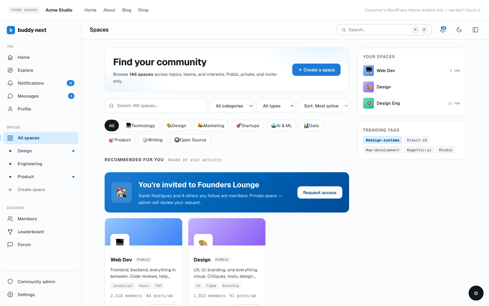

# Overriding templates in a child theme

How to override a BuddyNext template from your theme. BuddyNext resolves every template through a three-tier loader that checks your child theme and parent theme before its own defaults, so you can copy any template into your theme and edit it there. This page covers the resolution order, the copy workflow, the variable gotcha that trips people up, the wrap-hook alternative that needs no copy, and the template tree you can override.



## Overview / Contract

Every BuddyNext template is loaded by `BuddyNext\Core\TemplateLoader` (`includes/Core/TemplateLoader.php`). Its `locate()` method resolves a relative path in this order and returns the first hit:

1. `{active-child-theme}/buddynext/{relative}`
2. `{parent-theme}/buddynext/{relative}`
3. `{plugin}/templates/{relative}`

So to override `templates/parts/member-card.php`, you create `{your-theme}/buddynext/parts/member-card.php`. The subpath under `buddynext/` mirrors the subpath under the plugin's `templates/` directory exactly - keep `parts/`, `partials/`, `feed/`, `spaces/`, and so on.

The loader is reached through `buddynext_get_template( $relative, $vars )` (templates and parts) and `buddynext_service( 'template_loader' )->capture()` (string capture, used by shortcodes). Both run the same `locate()` resolution, so an override applies on every surface that renders the template.

## Workflow

1. Find the template you want to change under the plugin's `templates/` directory (the tree is below).
2. Copy it to your theme, preserving the subpath: `templates/<path>` becomes `{your-theme}/buddynext/<path>`. For example `templates/profile/view.php` becomes `{your-theme}/buddynext/profile/view.php`.
3. Edit your copy. The loader now serves it instead of the plugin's.

Many parts carry an `Overridable:` line in their PHP header (for example `templates/partials/post-card.php`: `Overridable: copy to {theme}/buddynext/partials/post-card.php`) - that header confirms the part is meant to be copied and shows the exact target path.

## The variable gotcha: the loader does not use extract()

This is the single most common override mistake. `TemplateLoader::render()` does **not** call `extract()` on the variables array. It imports variables manually, and the rules are strict (see `includes/Core/TemplateLoader.php`):

- Only **string** keys are imported. Numeric or non-string keys are skipped.
- A key must match the PHP identifier regex `^[a-zA-Z_][a-zA-Z0-9_]*$`. Stray / collision-prone keys are dropped.
- The loader's own locals are reserved and cannot be shadowed: `path`, `relative`, `variables`, plus the import internals `bn_reserved`, `bn_key`, `bn_value`, `bn_filtered`, `bn_html`. Passing a variable named `$path` or `$relative` into a template will not work - the loader's own value wins.

**Why not just `extract( $vars, EXTR_SKIP )`?** Fair question - `EXTR_SKIP` would also skip numeric keys and never overwrite an existing local, so the skipping itself is not the reason. The reason is **static analysability and an explicit contract**: `extract()` is opaque to PHPStan and IDEs, so inside a template every variable looks undefined and tooling can verify nothing. The manual import keeps each template's inputs knowable, which is what makes the `@var` header in every part an enforceable contract rather than a hopeful comment. The trade-off the reviewer is right to flag: a bad key is dropped **silently** instead of raising the notice `extract()` would. If you are debugging a missing variable, that silence is the trap - so the rule of thumb stands: **read the `@var` header; it is the authoritative list, and a name not listed there is not in scope.**

The practical effect: a copied template receives exactly the variables the caller passed, under their original names, and nothing more. **Read the `@var` block in the template's PHP header to learn the variables in scope** - that header is the authoritative list of what your override can use. Do not assume globals or extra variables are present; if the header does not list it, it is not in scope.

```php
// How the loader brings a variable into template scope (paraphrased):
//   $vars = array( 'user_id' => 42, 'context' => 'profile' );
// becomes, inside the template:
//   $user_id = 42;  $context = 'profile';
// A key like 'path', '2', or 'my-key' is silently skipped.
```

## Alternative: wrap a template without copying it

If you only need to inject markup around a template - not rewrite its body - you do not have to copy it. `TemplateLoader::render()` fires two actions on every render:

| Hook | Fired | Parameters |
| --- | --- | --- |
| `buddynext_before_template` | Before the template is included | `string $path, string $relative` |
| `buddynext_after_template` | After the template is included | `string $path, string $relative` |

Both pass the absolute `$path` and the `$relative` identifier, so you can target one template by its relative path:

```php
add_action( 'buddynext_after_template', static function ( string $path, string $relative ): void {
    if ( 'feed/home.php' !== $relative ) {
        return;
    }
    echo '<div class="my-addon-feed-footer">' . esc_html__( 'Powered by My Addon', 'my-addon' ) . '</div>';
}, 10, 2 );
```

This is update-safe (no copied file to drift) and is the right tool whenever wrapping is enough. For changing a card's body, prefer the part hooks (see Customizing cards and template parts) over a full override; reserve a copied override for genuine layout rewrites.

## The template tree

The overridable tree under `templates/` - mirror any path under `{your-theme}/buddynext/`:

```
templates/
  community-admin.php            community admin panel (self-chroming)
  auth/                          login, signup, verify, parts/
  blocks/                        Gutenberg block render templates
  directory/                     member directory
  feed/                          home, explore, parts/
  gamification/                  leaderboard
  hashtags/                      hashtag feed
  messages/                      DM list, thread, requests
  moderation/                    moderation queue
  notifications/                 notifications index
  onboarding/                    setup wizard
  profile/                       view, edit, connections
  search/                        results
  settings/                      member settings
  spaces/                        directory, home, members, settings, moderation, admin
  shell/                         hub-shell, rail, right-sidebar, auth-shell
  partials/                      composer, post-card, sidebar, modals, media-tab, nav
  parts/                         the reusable part + primitive layer (post-*, member-card,
                                 notification-row, profile-*, space-*, dm-*, search-*,
                                 empty-state, pagination, sidebar-card, section-head,
                                 stat-strip, filter-strip, ...)
```

`shell/` holds the page chrome (the left rail, the right sidebar, the hub wrapper). `partials/` holds the larger composed units (the post card, the composer, modals). `parts/` holds the leaf parts and shared primitives - this is the layer with the four-hook contract, so for most card-level changes you will hook a part rather than override it. The surface folders (`feed/`, `profile/`, `spaces/`, and so on) hold the top-level templates each hub routes to.

## Notes / gotchas

- **Preserve the subpath exactly.** `templates/parts/x.php` overrides at `{theme}/buddynext/parts/x.php`, not `{theme}/buddynext/x.php`. The loader matches on the full relative path.
- **Read the `@var` header before editing.** The loader does not `extract()`; only the listed variables are in scope, under their original names. `$path`, `$relative`, and `$variables` are reserved and cannot be passed in.
- **Prefer hooks over copies.** A copied template is frozen at copy time; the plugin's original can change between releases (new fields, new markup, new bindings) and your copy will not get them. For markup around a template use `buddynext_before_template` / `buddynext_after_template`; for card internals use the part hooks.
- **A few panels carry an Interactivity / transport contract - override these with extra care.** Most templates are plain presentation and safe to copy, but a handful are WordPress Interactivity API islands or carry client-navigation markers, and their behaviour lives in `data-*` attributes the JS binds to:
  - **Interactivity islands** - `partials/media-tab.php` (the upload + albums island), the feed/post-card reactions, and `parts/profile/people-panel.php` (follow buttons). They are driven by `data-wp-interactive` / `data-wp-context` / `data-wp-bind` / `data-wp-on`.
  - **Client-nav transport** - the nav shell (`parts/nav-bar.php`, `shell/hub-shell.php`) marks links with `data-bn-nav` and `data-bn-full-load` so the router can swap regions without a reload.

  Copy one of these and drop those attributes and the feature goes silently dead - the composer stops uploading, albums stop loading, reactions/follow stop working, or a client-side navigation stops re-binding the panel. The transport contract lives in the **nav shell**, not in the content parts, so overriding an ordinary panel never breaks navigation; the risk is confined to the islands above. **If you only want a restyle, reach for design tokens (`--bn-*`) or the part hooks first - they cover the common case without forking the markup.** If you genuinely must override an island, keep every `data-wp-*` / `data-bn-*` attribute and its wrapping element intact, then change only what is inside. See Frontend Interactivity for the full binding reference.
- **Child theme beats parent beats plugin.** With a child theme active, a file in the parent theme's `buddynext/` directory is only used when the child theme has no copy at that path.
- **Some templates self-chrome.** `auth/` and `community-admin.php` render their own full-bleed wrapper; the shortcode capture path treats them differently. Match the plugin's structure if you override them.

See also Customizing cards and template parts for the part-hook approach, Hooks: Template Parts for the four-hook contract, and Frontend Interactivity for why an override must keep the `data-wp-*` bindings intact for a surface to stay reactive after a client-side navigation.
