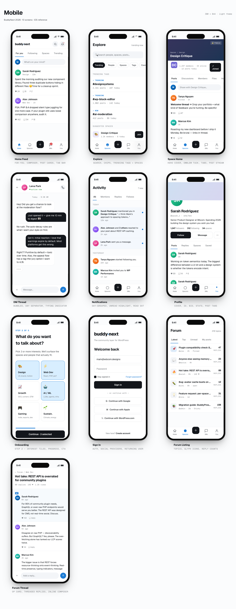
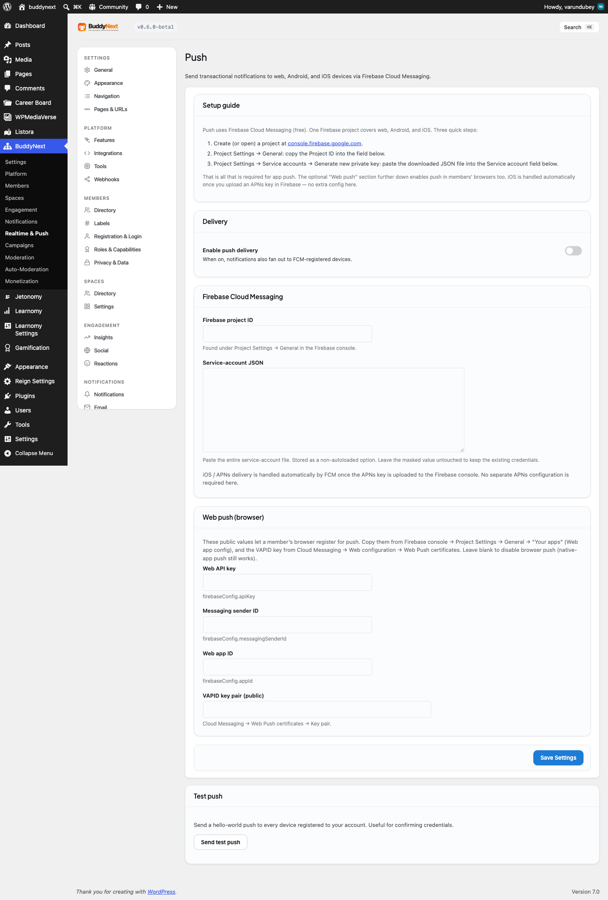

# Install as a Progressive Web App

BuddyNext ships your community as an installable Progressive Web App (PWA). Members can add it to a phone or desktop home screen and launch it in a standalone, app-like window, complete with an offline shell so the app opens even with no connection.

## Why use it

Most communities lose people in the gap between visits. A bookmark is easy to forget; an app icon on the home screen is not. A PWA puts your community one tap away on the home screen, so members come back more often, without you building, submitting, or maintaining a native app in any store.

When members install the community, it opens in its own window without the browser address bar and toolbars, which feels like a dedicated app rather than a web page. The offline shell means tapping the icon always opens something instead of a connection error, which keeps the experience smooth on flaky mobile networks. For the owner, this is return-visit and retention value at no extra cost: it is built from the same site you already run.

## How it works (for members)

The PWA experience is driven by the browser. There is nothing for a member to download from an app store.

### Installing to a home screen

When a member visits the community in a supported browser (Chrome, Edge, Safari, and other modern browsers), the browser offers to install it. On a phone this is "Add to Home Screen"; on desktop Chrome or Edge it is an install icon in the address bar. After installing, the community gets its own home-screen or app-launcher icon. The icon is generated from your site: a brand-coloured tile carrying the first letter of the site name.

### App-like navigation

Launched from the installed icon, the community opens in standalone mode: a full-window, app-style view in portrait orientation, without the usual browser chrome. Members move through the feed, spaces, profiles, and messages the same way they do on the web, but in a focused window that feels like a native app.

### The offline shell

The first time the app loads, it caches the home shell. If a member opens the app while offline, that shell still loads instead of a browser error page. Content that was loaded earlier may also be available from the cache. A cold launch with no connection shows the home shell; deeper pages that were never loaded need a connection to fetch.

## Setting it up (for owners)

The app experience is active by default on the front end and needs no admin action to turn on. There is no settings screen to configure: it works the moment your community is live, using sensible defaults drawn from your existing site.

| What it covers | What it does | Default |
|---|---|---|
| App name and details | The name, description, and colours members see when they install and launch the app. | Your site name, your site tagline, and your brand colour |
| App icon | The home-screen icon members tap to open the community. | A brand-coloured tile showing your site's initial |
| Launch window | How the app opens once installed. | Its own full-screen window, in portrait |
| Offline shell | Whether the app opens to a cached home screen when there is no connection. | On |

The defaults are ready to go: the app name is your site name, the icon uses your site's initial on a brand-coloured tile, and the app launches in its own portrait window. If you want a custom name, colour, or icon, or you want to turn off the offline behaviour, your developer can adjust those from your site's code. No technical setup is needed for the default installable experience to work.

## Good to know

- The install prompt and offline behaviour are evaluated by the browser, not by BuddyNext. Browsers require the site to be served over HTTPS (or localhost during development) before they offer to install. The PWA is intended for the front-end community surface and does not apply in the WordPress admin.
- The generated app icon is a single scalable image marked as maskable, so it crops cleanly into the rounded or circular shapes different phones use.
- Offline coverage is the home shell plus pages a member has already visited. A first-time, fully-offline visit to a deep page will not have cached content to show.
- Installability depends on the member's browser and device. Some browsers show the prompt automatically; others require the member to choose "Install" or "Add to Home Screen" from a menu.

## Free vs Pro

The installable PWA, the standalone app-like window, and the offline shell are all part of the free plugin.

A native mobile app, a separate app built for the Apple App Store and Google Play with native push notifications and store distribution, is a distinct item on the Pro roadmap. It is a different delivery vehicle from the PWA described here, not an upgrade of it. The PWA gives members an app-like, installable experience today without an app store; the native app is tracked separately for owners who need a true store presence.
