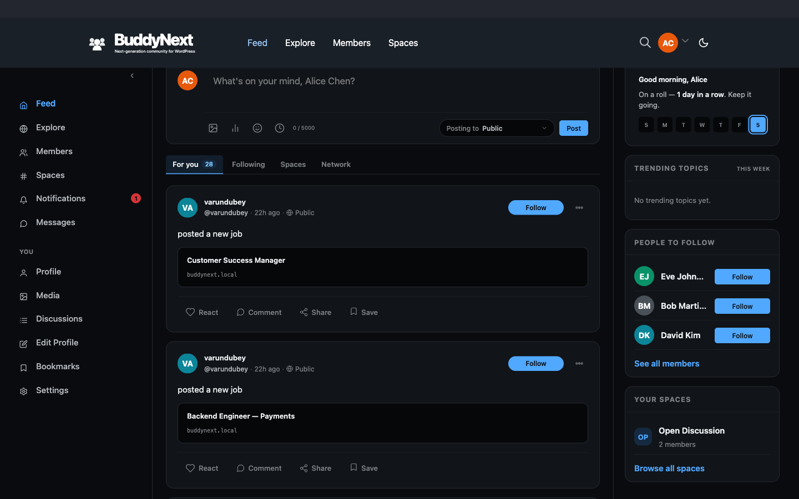

# Introduction to BuddyNext

BuddyNext is the social layer for WordPress. It turns a standard WordPress site into a real social network your members will recognise: an activity feed, communities (called spaces), member profiles and directories, private messaging, and moderation tools. The whole thing lives on your own site - your members, your content, your rules - with no third-party platform in the middle.

If you have ever wanted a home for your audience that feels like Facebook, X, or LinkedIn but is entirely yours, this is it. The free plugin is a complete community platform on its own, ready to launch the day you activate it. When your community grows, BuddyNext Pro adds the things you reach for after the first few months: scheduled posts, broadcast and drip emails, group messaging, instant real-time updates, deeper moderation, analytics, and ways to charge for access.

## What it is

BuddyNext gives your members the things they expect from a modern social product:

- An **activity feed** where people post text, links, polls, and photos, then react, comment, share, bookmark, and report.
- **Spaces** - public or request-to-join communities, each with its own feed, members, and optional forum and media tabs.
- **Member profiles and a searchable directory** with avatars, cover images, bios, custom fields, and follow or connect actions.
- **Direct messaging** for private one-to-one conversations (powered by the free WPMediaVerse companion).
- **Notifications and email** so members never miss a mention, reply, or message.
- **Moderation** with a report button on every piece of content and an admin review queue.
- **Search** across people, posts, spaces, and hashtags.

## Who it is for

BuddyNext is built for community owners who want to run a social network on their own WordPress site rather than rent space on someone else's platform. That includes creators building an audience, businesses running a customer or member community, course and membership sites adding social interaction, and agencies delivering communities for clients.

## Why use it

- **Own your community.** Your members and everything they post live on your own site. There is no outside service to depend on and no platform that can change the rules, raise the price, or switch off your reach overnight.
- **Free core, Pro when you grow.** The free plugin is a genuinely complete platform, not a trial. You only move to Pro when your community hits a need it solves, and upgrading never takes away anything you already use.
- **Works with the tools you build on.** BuddyNext fits standard WordPress themes, ships ready-made blocks and shortcodes for the page editor, and lets your designer restyle any part of it. The same community can power your website today and a mobile app tomorrow.
- **Built to stay fast.** Feeds, directories, and member lists load in pages and stay quick whether your community has fifty members or fifty thousand.

## How it works

As soon as you activate the plugin, BuddyNext sets up its community pages (feed, members, spaces, messages, notifications, profile, and more) with clean, readable links so they work right away. A first-run setup wizard walks you through the basics. From there, members sign up, complete a short welcome flow, and start posting, joining spaces, and connecting.

Your license key controls **plugin updates only** - it never switches features on or off. The free plugin activates itself the moment it is installed, with no key to enter. Pro adds its features on top and uses your paid license key purely to keep you on the latest version.

Some features are extended by optional companion plugins. Direct messaging is powered by WPMediaVerse, forums in spaces by Jetonomy, points and badges by WB Gamification, and a jobs board by Career Board. Each is optional - install only what you need.

## Free vs Pro

The free plugin covers everything a community needs to launch and run. Pro adds growth, automation, monetization, and analytics. License tier only changes the number of sites you can use Pro on, not the feature set (white-label and the mobile app are the two exceptions noted below).

| Area | Capability | Free | Pro |
|------|------------|------|-----|
| **Activity and posting** | Text, link, and poll posts | Free | Free |
| | Photo and file posts (via WPMediaVerse) | Free | Free |
| | React, comment, share, bookmark, report | Free | Free |
| | Pin 1 post per space or profile | Free | Free |
| | Edit and delete your own posts | Free | Free |
| | Admin site-wide announcement | Free | Free |
| | Scheduled posts (future publish date) | - | Pro |
| | Recurring scheduled posts | - | Pro |
| | Multiple pinned posts (up to 10) | - | Pro |
| | Custom reaction emoji set | - | Pro |
| | Post reach stats for authors | - | Pro |
| **Spaces** | Unlimited spaces | Free | Free |
| | Public and request-to-join spaces | Free | Free |
| | Space feed, members, forum, and media tabs | Free | Free |
| | Private (invite-only) spaces | - | Pro |
| | Gated spaces (membership-controlled) | - | Pro |
| | Post approval queue per space | - | Pro |
| | Paywall preview and member tiers | - | Pro |
| | Per-space custom branding | - | Pro |
| **Members and profiles** | Follow, connect, block | Free | Free |
| | Avatar, cover, bio, social links | Free | Free |
| | Up to 5 custom profile fields | Free | Free |
| | Filterable member directory | Free | Free |
| | Online status indicators | Free | Free |
| | Advanced profile fields (date, location, file, conditional) | - | Pro |
| | Custom member labels (Verified, Expert, Staff) | - | Pro |
| | Member segments, tags, and CSV export | - | Pro |
| | Profile completeness score and prompts | - | Pro |
| **Messaging** | 1:1 direct messaging (via WPMediaVerse) | Free | Free |
| | Message requests, mute, pin, archive | Free | Free |
| | Emoji reactions and quoted replies | Free | Free |
| | Read receipts | - | Pro |
| | Group messaging (up to 49 members) | - | Pro |
| | Instant real-time delivery and typing indicator | - | Pro |
| **Notifications and email** | In-app notification bell and page | Free | Free |
| | Transactional emails (mention, reply, DM, invite) | Free | Free |
| | Per-user notification preferences | Free | Free |
| | Broadcast email campaigns to members or segments | - | Pro |
| | Drip welcome email sequences | - | Pro |
| | Space digest emails (weekly or monthly) | - | Pro |
| | Open rate and click-through stats | - | Pro |
| **Moderation** | Report button on all content | Free | Free |
| | Admin review queue and moderation log | Free | Free |
| | Dismiss, remove, warn, strike, suspend | Free | Free |
| | Space-scoped moderation for space admins | Free | Free |
| | Keyword blocklist and auto-action rules | - | Pro |
| | Spam scoring | - | Pro |
| | Bulk moderation actions | - | Pro |
| | IP and email-domain blocklist | - | Pro |
| | Appeal system and moderator assignment | - | Pro |
| **Analytics** | Basic admin counts | Free | Free |
| | Full site analytics dashboard (DAU/WAU/MAU, churn) | - | Pro |
| | Space-level analytics | - | Pro |
| | Member self-analytics (profile views, reach) | - | Pro |
| | CSV export of analytics | - | Pro |
| **Monetization** | Gated and tiered space access | - | Pro |
| | Membership tiers and paywall UI | - | Pro |
| **Integrations** | Companion connections (Jetonomy, WPMediaVerse, WB Gamification, Career Board) | Free | Free |
| | 1 outbound connection to another system (webhook) | Free | Free |
| | Page-editor blocks and shortcodes (core set) | Free | Free |
| | Unlimited outbound connections | - | Pro |
| | Advanced page-editor blocks (Member Spotlight, Space Analytics) | - | Pro |
| **For developers** | Restyle any part from your theme | Free | Free |
| | Full developer API for custom integrations and apps | Free | Free |
| | AI feed ranking and AI moderation | - | Pro |
| | White-label (Unlimited license only) | - | Pro |
| | Native mobile app (ships with Pro) | - | Pro |

> **Note:** Photo and file posts, plus all direct messaging, are powered by the free WPMediaVerse companion plugin. The messaging tab only appears when WPMediaVerse is active. See the installation page for how to add it.

> **Tip:** Pro upgrades are additive. Activating Pro never removes or changes a free feature you already rely on - it only adds new capabilities and unlocks Pro settings.

## Good to know

- BuddyNext requires WordPress 6.9 or newer and PHP 8.2 or newer.
- The free plugin works fully on its own. Companion plugins are optional and extend specific features.
- White-label is available only on the Unlimited (Agency) license tier. All other Pro features are identical across every license tier.

## What's next

- See Installing BuddyNext for requirements, installing the free plugin, adding Pro with the one-click installer, and the optional companion plugins.
- After installation, the setup wizard walks you through naming your community, choosing default pages, and configuring registration. The installation page points you to it, and the Admin Setup Wizard page covers it step by step.
