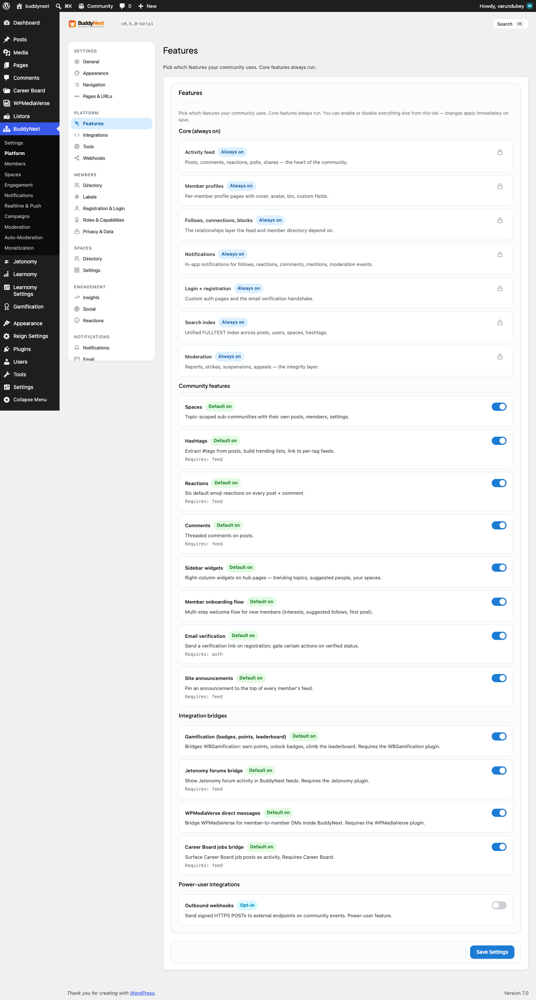

# Installing BuddyNext

This page walks you through installing the free BuddyNext plugin, adding BuddyNext Pro with the one-click installer, and choosing the optional companion plugins that extend specific features. The whole process takes a few minutes and ends at the setup wizard.

## Why this matters

A clean install is what makes BuddyNext work the moment you switch it on. Activating the plugin creates your community pages with readable links, so members can reach the feed, spaces, directory, and messages straight away. Getting the order right - free plugin first, then Pro, then any companions you need - means every feature lights up correctly the first time, and you avoid broken links or missing tabs.

## Requirements

| Requirement | Minimum |
|-------------|---------|
| WordPress | 6.9 or newer |
| PHP | 8.2 or newer |
| Database | MySQL 5.7+ or MariaDB 10.3+ (standard WordPress) |
| Permalinks | Pretty permalinks enabled (any setting other than Plain) |

> **Note:** BuddyNext uses pretty-permalink URLs for its community pages. If your site is set to Plain permalinks, switch to any other option under Settings > Permalinks before or right after activation.

## Steps: install the free plugin

1. In wp-admin, go to **Plugins > Add New** and upload the BuddyNext zip, or install it from your download.
2. Click **Activate**.
3. On activation, BuddyNext sets everything up for you automatically:
   - Prepares the storage it needs for the feed, spaces, members, messaging, notifications, and moderation.
   - Creates the community pages (feed, members, spaces, messages, notifications, profile, search) with clean, readable links.
   - Makes sure every community link works immediately.
4. The free plugin activates itself, so it is fully working the moment it is active. There is no key to enter for the free version.

> **Tip:** If a community link ever shows a "not found" page right after install, go to **Settings > Permalinks** and click **Save Changes** once. That refreshes the links and clears the issue.

## Steps: install BuddyNext Pro

Pro is delivered through a built-in one-click installer, not a manual upload. You do not download a separate Pro zip or search the plugin directory.

1. Buy a BuddyNext Pro license. You will receive a license key.
2. In wp-admin, open **BuddyNext > Integrations** (the companion hub).
3. Find **BuddyNext Pro** and click **Install**. BuddyNext fetches and installs Pro for you in one click.
4. Once installed, activate it.
5. Go to **BuddyNext > Settings > License**, paste your Pro license key, and activate it.

> **Note:** The license key gates **updates only**. It never unlocks or locks features. Pro is fully functional after activation, and the key simply lets your site receive Pro updates. Keep it active so you get security and feature updates.

## Optional companion plugins

These companion plugins extend specific BuddyNext features. They are all optional - install only the ones whose features you want. Each installs through the same one-click flow under **BuddyNext > Integrations**.

| Companion | What it adds | Required for |
|-----------|--------------|--------------|
| **WPMediaVerse** | Direct messaging engine and photo/file uploads | The Messages tab and image posts. The DM tab is hidden until this is active. |
| **Jetonomy** | Discussions and forums | The optional Forum tab inside spaces |
| **WB Gamification** | Points, badges, and levels | Member rewards and reputation |
| **Career Board** | A jobs and applications board | Posting and applying to jobs in your community |

> **Tip:** WPMediaVerse is the one most communities add first, because it powers both private messaging and photo posts. Its free version is enough to get started; the Pro features (group messaging, read receipts, real-time delivery) come bundled with BuddyNext Pro.

## Good to know

- **Order matters.** Install and activate the free plugin first, then Pro, then any companions. Pro requires the free plugin to be active.
- **No build step.** BuddyNext and Pro ship with everything they need. You never have to run a build command or install developer dependencies.
- **Companions are independent.** Removing a companion only disables the feature it powered (for example, deactivating WPMediaVerse hides the Messages tab). The rest of BuddyNext keeps working.
- **Updates.** Free updates arrive like any WordPress plugin. Pro updates require an active license key entered under Settings > License.

## What's next

After activation, the **Setup Wizard** runs on first visit and walks you through naming your community, choosing default pages, and configuring member registration and onboarding. Open it any time from **BuddyNext > Setup Wizard** in wp-admin to revisit those choices.

