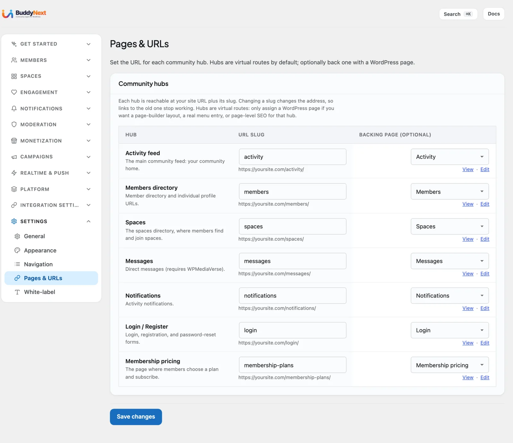

# Installing BuddyNext

This page walks you through installing the free BuddyNext plugin, adding BuddyNext Pro, and choosing the optional companion plugins that extend specific features. The whole process takes a few minutes and ends at the setup wizard.

## Why this matters

A clean install is what makes BuddyNext work the moment you switch it on. Activating the plugin creates your community pages with readable links, so members can reach the feed, spaces, directory, and messages straight away. Getting the order right - free plugin first, then Pro, then any companions you need - means every feature lights up correctly the first time, and you avoid broken links or missing tabs.

## Requirements

| Requirement | Minimum |
|-------------|---------|
| WordPress | 6.9 or newer |
| PHP | 8.1 or newer |
| PHP memory_limit | 512 MB recommended (128 MB can be exhausted with the full family active) |
| Database | MySQL 5.7+ or MariaDB 10.3+ (standard WordPress) |
| Permalinks | Pretty permalinks enabled (any setting other than Plain) |

> **Note:** BuddyNext uses pretty-permalink URLs for its community pages and cannot run on Plain links (`?p=123`). If your site is set to Plain, BuddyNext shows a notice across wp-admin with a **Use Post name permalinks** button that switches it in one click, plus a link to Settings > Permalinks if you prefer another structure. The Setup Checklist lists the same step.

> **Memory:** With BuddyNext, its Pro layer and the media/integration plugins all active, PHP's 128 MB default can run out mid-request. Set `memory_limit` to at least 512 MB in `php.ini` or `wp-config.php` (`define( 'WP_MEMORY_LIMIT', '512M' );`). **Tools > Site Health** shows a recommendation when your limit is below this.

## Steps: install the free plugin

1. In wp-admin, go to **Plugins > Add New** and upload the BuddyNext zip, or install it from your download.
2. Click **Activate**.
3. On activation, BuddyNext sets everything up for you automatically:
   - Prepares the storage it needs for the feed, spaces, members, messaging, notifications, and moderation.
   - Creates the community pages (Activity, Members, Spaces, Notifications and Login, plus Messages when WPMediaVerse is active) with clean, readable links. Profiles, search and onboarding live under these addresses and need no page of their own.
   - Makes sure every community link works immediately.
4. The free plugin activates itself, so it is fully working the moment it is active. There is no key to enter for the free version.

> **Tip:** If a community link ever shows a "not found" page right after install, go to **Settings > Permalinks** and click **Save Changes** once. That refreshes the links and clears the issue.

## Steps: install BuddyNext Pro

Pro is a separate plugin that you install on top of the free one. It is not in the Add-ons list.

1. Buy a BuddyNext Pro license from wbcomdesigns.com. You will receive a license key and a download.
2. Make sure the free BuddyNext plugin is active.
3. In wp-admin, go to **Plugins > Add New > Upload Plugin**, choose the BuddyNext Pro zip, and click **Install Now**.
4. Click **Activate**.
5. Go to **BuddyNext > Get Started > License**, paste your Pro license key, and activate it. The License tab appears only once Pro is active.

> **Note:** The license key gates **updates only**. It never unlocks or locks features. Pro is fully functional after activation, and the key simply lets your site receive Pro updates. Keep it active so you get security and feature updates.

## Optional companion plugins

These companion plugins extend specific BuddyNext features. They are all optional - install only the ones whose features you want. Each installs with the **Install free** button under **BuddyNext > Platform > Add-ons** (the same catalog the setup wizard's Addons step offers). A plugin that is already installed shows **Activate** instead.

| Companion | What it adds | Required for |
|-----------|--------------|--------------|
| **WPMediaVerse** | Direct messaging engine and photo/file uploads | The Messages tab and image posts. The DM tab is hidden until this is active. |
| **Jetonomy** | Discussions and forums | The optional Forum tab inside spaces |
| **WB Gamification** | Points, badges, and levels | Member rewards and reputation |
| **Career Board** | A jobs and applications board | Posting and applying to jobs in your community |
| **Learnomy** | Courses, lessons, and quizzes (a full LMS) | Completed courses and certificates shown on member profiles |
| **Listora** | Directory listings members can publish | Member listings surfaced in the feed and on profiles |
| **Eventonomy** | Events, RSVPs, and calendars | Events as feed cards and attended events on member profiles |
| **WB Member Blog** | Front-end post publishing without wp-admin | The Articles tab on member profiles and article cards in the feed |

> **Note:** Career Board, Listora, Learnomy and Eventonomy work on their own as plugins, but their community surfacing (feed cards, profile tabs, search) comes from bridges that ship in BuddyNext Pro. WPMediaVerse, Jetonomy, WB Gamification and WB Member Blog surface with BuddyNext Free.

> **Tip:** WPMediaVerse is the one most communities add first, because it powers both private messaging and photo posts. Its free version is enough to get started. BuddyNext Pro does not bundle WPMediaVerse; it is a separate plugin with its own editions.

## Good to know

- **Order matters.** Install and activate the free plugin first, then Pro, then any companions. Pro requires the free plugin to be active.
- **No build step.** BuddyNext and Pro ship with everything they need. You never have to run a build command or install developer dependencies.
- **Companions are independent.** Removing a companion only disables the feature it powered (for example, deactivating WPMediaVerse hides the Messages tab). The rest of BuddyNext keeps working.
- **Updates.** Free updates arrive like any WordPress plugin. Pro updates require an active license key entered under Get Started > License.

## What's next

Not sure which theme to use with BuddyNext - BuddyX, BuddyX Pro, or Reign? BuddyNext works with any theme, so this is a quick, no-wrong-answer decision: see [Choosing Your Theme](02a-choosing-a-theme.md).

After activation, the **Setup Wizard** runs on first visit and walks you through naming your community, choosing default pages, and configuring member registration and onboarding. Reopen it any time at `wp-admin/admin.php?page=buddynext-setup` to revisit those choices. If you leave it unfinished, a **Run the setup wizard** link stays in the wp-admin notices.

