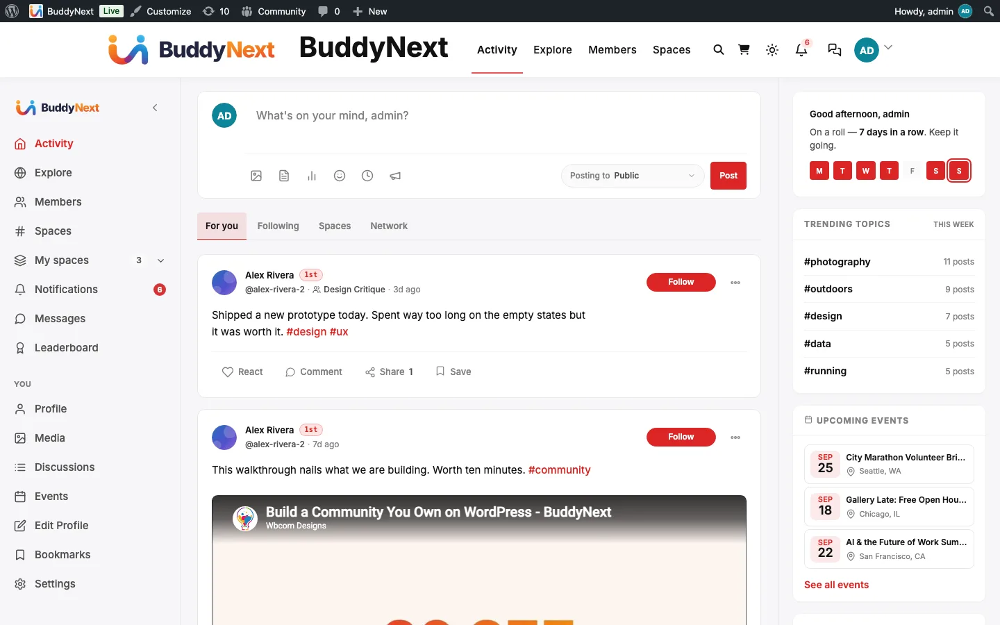
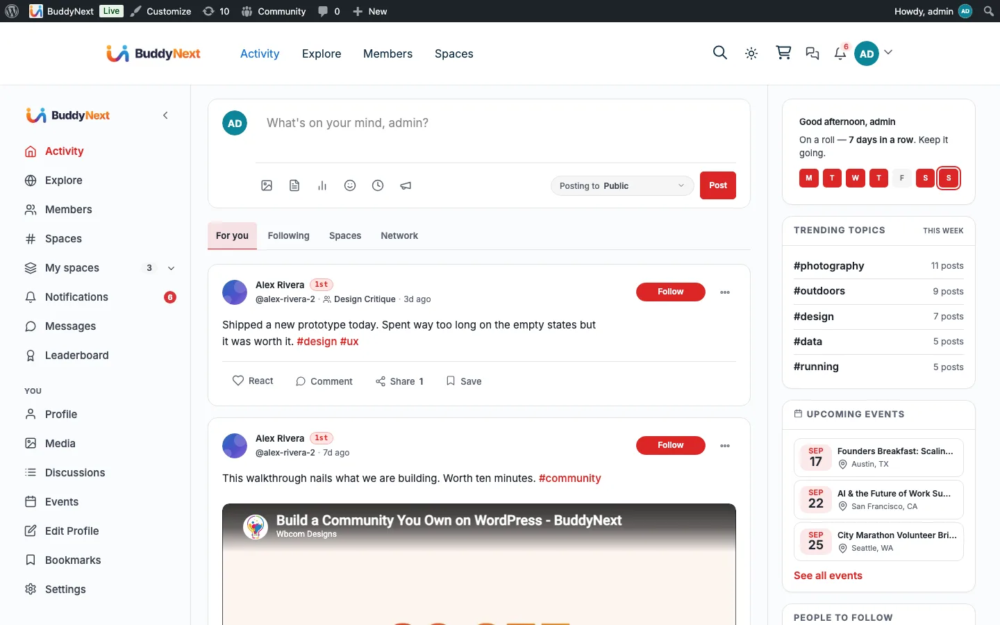

# Choosing Your Theme

If you are unsure which theme to use with BuddyNext - **BuddyX, BuddyX Pro, or Reign** - this page settles it. The short answer: **you do not have to choose carefully, because BuddyNext works with any WordPress theme.** Start with the free one and change your mind later at no cost.

## The one thing to understand first

BuddyNext brings its **own complete community interface** - the left navigation rail, the activity feed, spaces, member directory, profiles, messaging, the sidebar cards, everything a member touches. Your theme does **not** draw any of that.

What your theme controls is the **outer chrome** around the community: the top site header, the footer, the base fonts, and the site-wide colours. So swapping themes changes the frame, not the community inside it.

Here is the exact same BuddyNext community running on two different themes - notice the feed, rail, and sidebar are identical; only the top header differs:

Because of this, **you cannot pick a "wrong" theme** for BuddyNext. Any well-built theme works - including your existing one. The three themes below are simply the ones Wbcom Designs builds and tests BuddyNext against, so they are the safest, best-integrated starting points.

## The three Wbcom themes

| Theme | Price | Best for | Get it |
|---|---|---|---|
| **BuddyX** | **Free** | The recommended starting point. Purpose-built for community sites, includes a light/dark toggle, and costs nothing. | WordPress.org theme directory |
| **BuddyX Pro** | Premium | BuddyX plus more header/layout options, extra colour and typography controls, and additional community-page layouts. | wbcomdesigns.com |
| **Reign** | Premium | The most design-rich option, with many prebuilt layouts and the widest styling controls. Used for the BuddyNext demo. | wbcomdesigns.com |

All three ship a **light/dark colour-mode toggle**, and BuddyNext **follows that toggle automatically** - flip the theme's switch and the whole community, including form controls and badges, switches with it. No extra setup.

## Which should I start with?

**Start with BuddyX (free).** It is built for exactly this, it gives you the colour-mode toggle BuddyNext relies on, and it costs nothing - so you can launch a complete community today and decide on a premium theme later.

**Move up to BuddyX Pro or Reign when** you want more control over the outer design: additional header styles, more prebuilt page layouts, finer typography and colour options, or the specific look of the BuddyNext demo (that is Reign). Switching is a one-click activation and your community content is untouched.

If you already run a theme you like, **keep it.** Install BuddyNext, and the community works inside it. You only need one of the themes above if you want their community-tuned headers and the built-in colour-mode toggle.

## How to install and switch a theme

1. In WordPress admin, go to **Appearance > Themes**.
2. For **BuddyX**: click **Add New Theme**, search for `BuddyX`, then **Install** and **Activate**.
3. For **BuddyX Pro** or **Reign**: download the `.zip` from your wbcomdesigns.com account, then **Add New Theme > Upload Theme**, choose the zip, **Install**, and **Activate**.
4. That is it - reload any community page and it now renders inside the new theme. Your members, spaces, posts, and settings are all unchanged.

## After you pick a theme

Two quick settings finish the look:

- **Your logo and brand colour** live in BuddyNext itself, so they carry across any theme. See [Appearance and Branding](07-appearance-and-branding.md).
- **Light/dark default** - BuddyNext follows your theme's colour-mode toggle; set the default new visitors see under **Settings > Appearance**.

One small note if you use BuddyX or BuddyX Pro: those themes can show both a **logo image and the site-title text** in the header at once. If you only want the logo, hide the site title in the theme's own Customizer (Appearance > Customize > Site Identity).

## Related

- [Installation](02-installation.md) - installing the BuddyNext plugin itself
- [Appearance and Branding](07-appearance-and-branding.md) - logo, brand colour, and the light/dark default
- [The Member Journey, Screen by Screen](../members/00-member-journey.md) - what a new member sees, on whichever theme you choose
