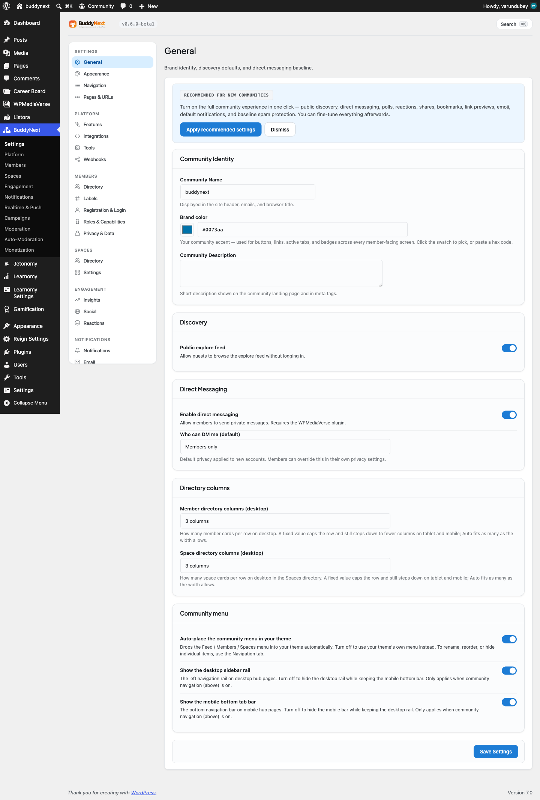
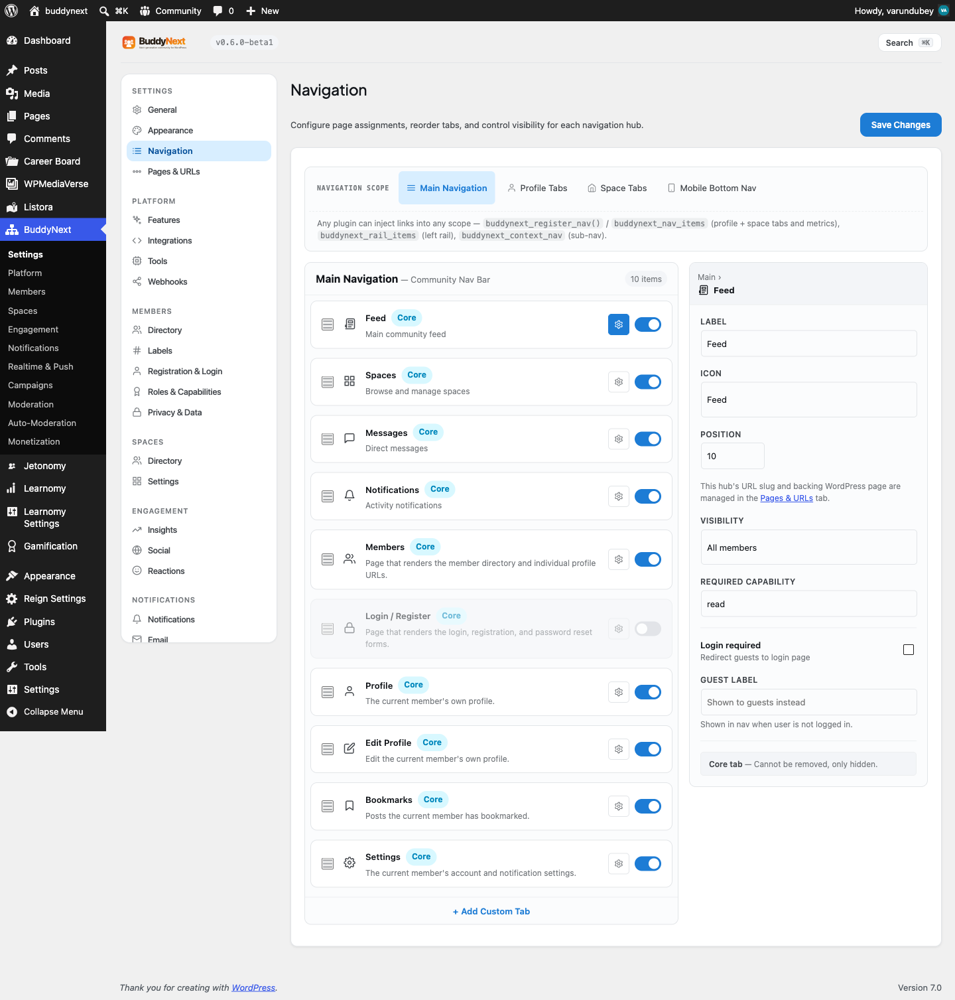

# Admin Overview

The BuddyNext admin hub is the single place you manage your whole community from. Instead of scattering settings across dozens of unrelated screens, BuddyNext groups every control into eleven labeled sections that follow how you actually run a community: set it up, manage your platform, look after members and spaces, drive engagement, handle notifications, and moderate. This page is your map - find any setting by the job it does.

## What it is

Every BuddyNext screen lives under one top-level **BuddyNext** menu in wp-admin, organized into sections. The sections are ordered from setup through day-to-day operation, and each holds a small, focused set of tabs. The goal is that a new owner can guess where a setting is from its job, and find it on the first try.

## Why it is organized this way

A community platform has a lot of settings. Listing them flat would be unusable. Grouping them by purpose means you spend less time hunting: branding and pages sit under Settings, anything about people sits under Members, anything about communities sits under Spaces, and so on. Pro features slot into the same sections rather than into a separate menu, so the structure stays the same as your community grows.

## Navigation map

Tabs marked **(Pro)** require BuddyNext Pro. Everything else is in the free plugin.

| Section | Tabs | What you configure |
|---------|------|--------------------|
| **Settings** | General; Appearance; Navigation | Core community name and identity, theme appearance and brand color, and the front-end navigation menu. |
| **Platform** | Features; Integrations; Tools; Webhooks | Turn whole features on or off, install and connect companion plugins, run maintenance tools, and send outbound webhooks to other systems. |
| **Members** | Directory; Labels **(Pro)**; Registration; Roles; Privacy | Manage the member directory, apply member labels, set how people register and verify, define roles and capabilities, and set default privacy. |
| **Spaces** | Directory; Spaces settings | Manage the spaces directory and configure how spaces, categories, and membership work. |
| **Engagement** | Insights **(Pro)**; Social; Reactions | View engagement analytics, configure social and social-login behavior, and choose which reactions members can use. |
| **Notifications** | Notifications; Email; Templates | Set notification defaults and channels, configure sending email identity, and edit the email templates members receive. |
| **Realtime & Push (Pro)** | Realtime; Push; Push Preferences | Configure real-time updates, web and mobile push delivery, and the default push preferences for members. |
| **Campaigns (Pro)** | Broadcasts; Drip | Send broadcast emails to members and build automated drip sequences. |
| **Moderation** | Moderation; Pending; Reports; Suspensions; Appeals; Bulk **(Pro)** | Set moderation policy, review pending content, work the report queue, manage suspensions, handle member appeals, and run bulk moderation actions. |
| **Auto-Moderation (Pro)** | Rules; AI Moderation | Build automatic moderation rules (including banned-word rules) and enable AI-assisted content moderation. |
| **Monetization (Pro)** | Tiers; Subscriptions; Stripe; License | Define paid membership tiers, manage subscriptions, connect Stripe, and enter your Pro license key. |

> **Note:** Sections marked (Pro) and individual (Pro) tabs appear only when BuddyNext Pro is active. With the free plugin alone you see Settings, Platform, Members, Spaces, Engagement, Notifications, and Moderation, with the Pro-only tabs inside them hidden.

## Jump to any setting with the command palette

You do not have to remember which section a setting lives in. BuddyNext registers every one of its settings with WordPress core's built-in **Command Palette**.

Press **Cmd + K** (Mac) or **Ctrl + K** (Windows / Linux) anywhere in wp-admin, start typing the name of the setting - for example "brand color", "registration", or "reactions" - and jump straight to it. This is the fastest way to reach a setting when you know what it is called but not where it lives.

> **Note:** The Command Palette is part of WordPress itself, so the keyboard shortcut works on every admin screen, not only inside BuddyNext.

## Where to go next

Each section has its own deep-dive in this documentation:

- New install? Start with the Admin Setup Wizard - it walks you through the most important Settings, Members, Spaces, and Notifications choices in one flow.
- For who can join and how members are managed, see the Members documentation.
- For communities, categories, and membership rules, see the Spaces documentation.
- For reactions, notifications, email, and moderation, see the matching feature pages.
- For Pro sections (Insights, Realtime & Push, Campaigns, Auto-Moderation, Monetization), see the BuddyNext Pro documentation.
