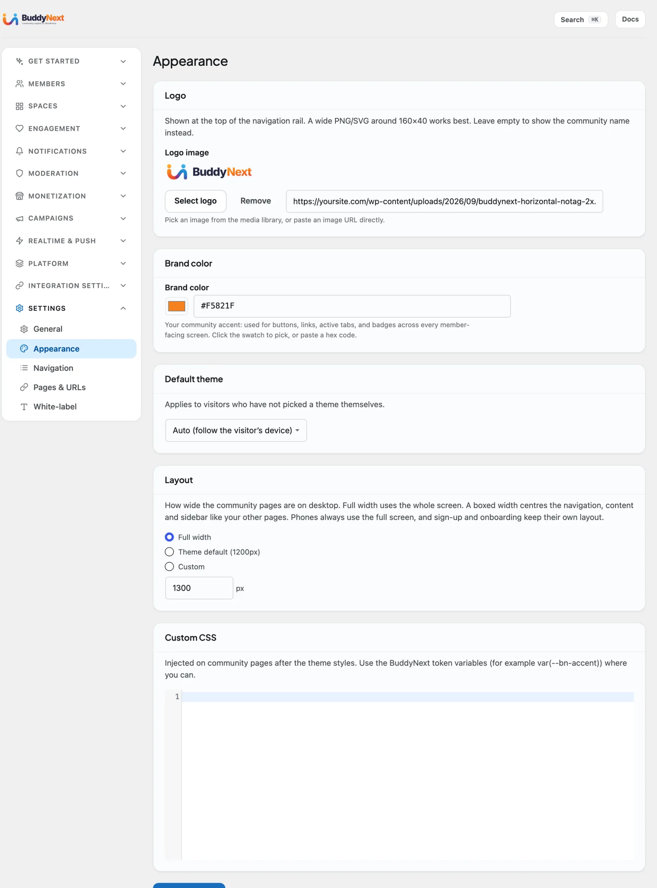

# Appearance and Branding

Appearance and Branding is where you make the community look like yours - your logo at the top of the navigation, your brand color running through buttons and links, and a default light or dark theme for visitors who have not chosen one. Most of it is a couple of fields and a color swatch, so a new community can carry your identity in minutes. The controls sit across **BuddyNext > Settings > General** (community name) and **BuddyNext > Settings > Appearance** (logo, brand color, default theme, custom CSS).

## Why use it

Members trust a community that looks like the brand that invited them. A generic install with no logo and a default blue accent feels like a demo; the same community with your mark in the corner and your color on every button feels like home. Branding is also practical - a recognizable accent color makes buttons, active tabs, and links obvious, which quietly improves how easy the community is to use.

## Community name

Set under **Settings > General**, the **Community name** (and the **Community description** below it) is how your community refers to itself in headings and copy. If you do not upload a logo, this name is shown at the top of the navigation instead, so it is worth getting right even on a logo-free site.

## Brand color

Under **Settings > Appearance**, **Brand color** is your community's accent. It is used for buttons, links, active tabs, and badges across every member-facing screen. Click the swatch to pick a color, or paste a hex code if you have an exact brand value. One color change re-themes the whole community consistently - you do not style each element by hand.

## Logo

Under **Settings > Appearance**, the **Logo** (labelled **Logo image** on the field, with a **Select logo** button) is shown at the top of the navigation rail. A wide PNG or SVG around 160 by 40 pixels works best. You can select an image from the WordPress media library or paste an image URL. Leave it empty and BuddyNext shows your community name in its place, so there is always something branded in the corner.

## Default theme (auto, light, or dark)

The **Default theme** setting chooses what new visitors see to start with. It offers three choices - **Auto** (follow the visitor's own device setting), **Light**, and **Dark** - and defaults to Auto, so someone whose phone or laptop is in dark mode sees a dark community without doing anything. It applies only to people who have not picked a theme for themselves - once a member chooses, their choice sticks.

BuddyNext does not add its own light/dark switch. Instead it follows the toggle your WordPress theme already provides. If your site runs a theme with a color-mode toggle, such as BuddyX or Reign, flipping that toggle switches BuddyNext along with it, with no extra setup. Dark mode reaches the whole community - including form controls, profile skill chips, and badges - so a dark layout stays dark end to end.

## Layout (page width)

Under **Settings > Appearance > Layout** you choose how wide the community pages are on desktop:

- **Full width** (the default) - the navigation, content and sidebar use the whole screen.
- **Theme default** - the community is centred at your theme's width, so it lines up with your other pages. BuddyNext reads the width from the theme (shown next to the option, 1200px when the theme does not say).
- **Custom** - centred at the width you enter, from 1025 to 2400px. Use this when your theme's boxed width is a theme setting BuddyNext cannot read, for example a 1300px BuddyX Pro container.

The page background still spans the screen; only the community columns are centred. Phones always use the full screen, and sign-up and onboarding keep their own layout. Developers can supply a theme's real width with the `buddynext_theme_container_width` filter.

## Custom CSS

For finer visual tweaks, the **Custom CSS** box under Settings > Appearance lets you add your own styles. It is injected on community pages after the theme's own styles. Where you can, use BuddyNext's built-in design variables (for example the accent color variable) so your tweaks track your brand color and dark mode automatically instead of fighting them.

> **Note:** Because the whole community reads from one brand color and one set of design tokens, small branding changes ripple everywhere at once. Set your color and logo first, then only reach for Custom CSS if you need something the standard controls do not cover.

## Related

- [Admin Setup Wizard](03-admin-setup-wizard.md) - sets your name and brand color on first run.
- [Choosing a Theme](02a-choosing-a-theme.md) - the host theme whose light/dark toggle BuddyNext follows.
- [Admin Overview](04-admin-overview.md) - where the Appearance and General settings live.
- [Design System Tokens](../developer-guide/46-design-system-tokens.md) - the variables to use in Custom CSS.
