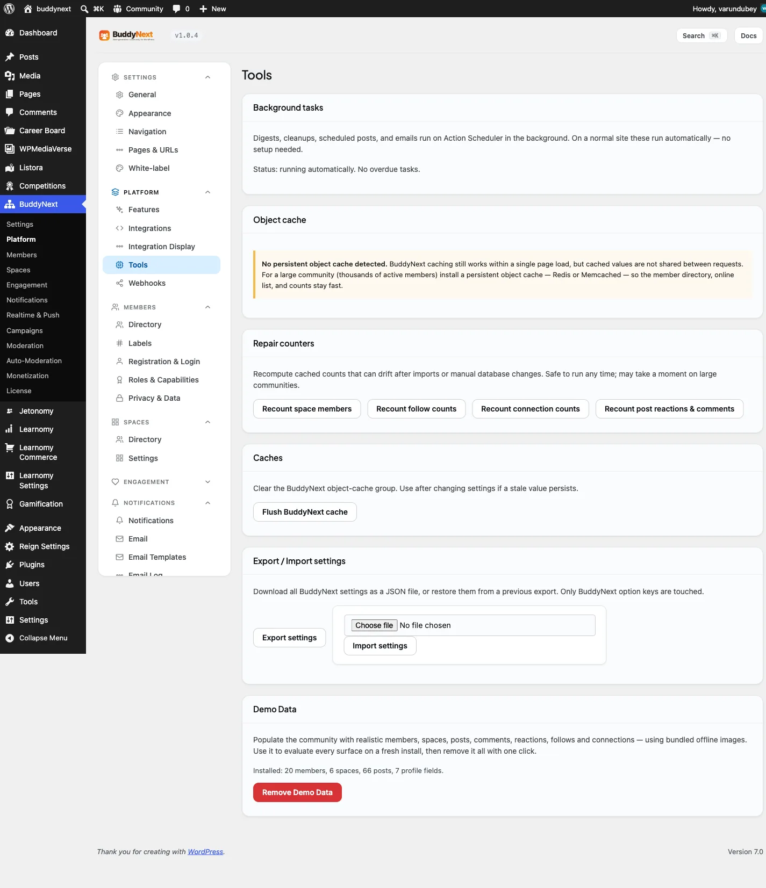

# Tools and Maintenance

Tools and Maintenance is a small health-check screen that tells you whether the behind-the-scenes parts of your community are working, and gives you a button to fix them if they are not. It covers three things every owner occasionally needs to check: background tasks, the object cache, and the search index. You find it under **BuddyNext > Platform > Tools**.

## Why use it

Most of BuddyNext runs itself, but a few jobs happen in the background - sending digest emails, cleaning up, publishing scheduled posts - and search relies on an index it builds from your content. When something upstream on your server changes, one of these can fall behind. This screen turns "is everything okay?" into a plain status you can read at a glance, and it explains in normal language what to do if it is not. On a healthy site you rarely need to touch it; when a host change breaks something, it is the first place to look.

## Background tasks

BuddyNext runs digests, cleanups, scheduled posts, and emails as background tasks. On a normal site these run automatically with no setup.

This panel confirms they are keeping up. If WordPress cron is switched off on your site (a common performance setup on larger installs) and tasks are piling up, the screen tells you plainly and shows the exact server cron line to add so the queue keeps processing. If cron is off but tasks are still clearing, it reassures you that a system cron is already driving them and no action is needed. BuddyNext never disables WordPress cron for you - it only reports what it finds.

## Object cache

A persistent object cache (such as Redis or Memcached) lets BuddyNext remember expensive results - the member directory, the online list, counts - between page loads, which keeps a large community fast.

This panel simply tells you whether one is active. If it is, you are set up the recommended way for scale. If it is not, BuddyNext still works and still caches within a single page load; the panel just notes that for a large, busy community (thousands of active members) installing a persistent object cache will keep the heavy lists fast. It is a recommendation, never a requirement.

## Search index

Global search reads a single index of members, posts, and spaces. Normally BuddyNext keeps this current for you.

If search ever looks empty or out of date - it returns nothing, or misses recent content - this panel shows the index status and a **Rebuild** button. Rebuilding re-reads your content and restores the fast full-text index. The panel also shows how many rows are indexed, whether the fast full-text index is present, and when the last full rebuild ran, so you can tell at a glance whether a rebuild is worth doing.

> **Note:** These are diagnostic tools grouped under **Advanced** for a reason - you do not need them during normal running. Reach for this screen when something feels off (search comes up empty, a digest did not go out) rather than as part of routine setup.
