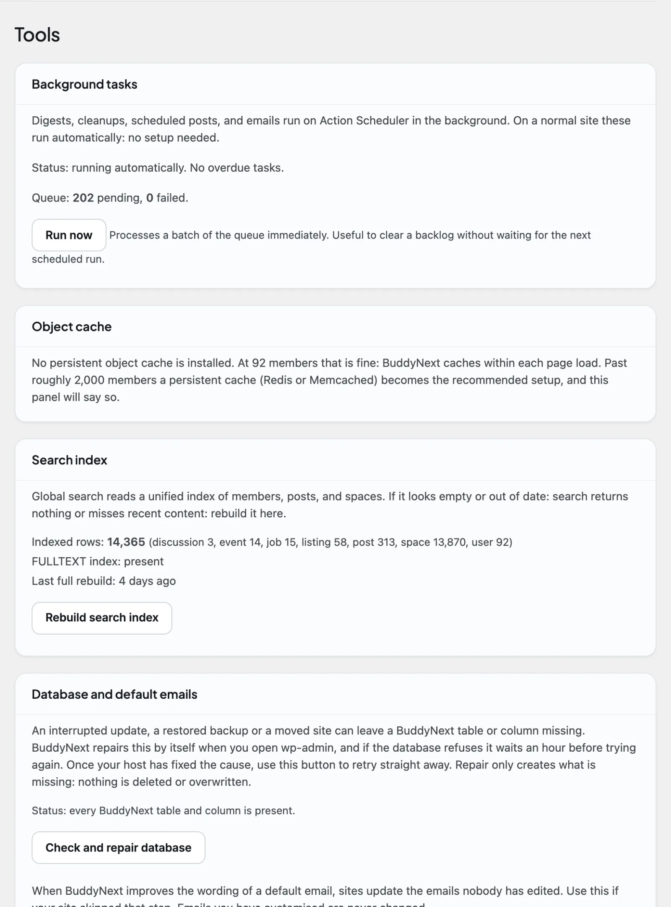

# Tools and Maintenance

Tools and Maintenance is a small health-check screen that tells you whether the behind-the-scenes parts of your community are working, and gives you a button to fix them if they are not. It covers the things every owner occasionally needs to check or fix: background tasks, the object cache, the search index, the database, counters, caches, settings export and import, and demo data. You find it under **BuddyNext > Platform > Tools**.

## Why use it

Most of BuddyNext runs itself, but a few jobs happen in the background - sending digest emails, cleaning up, publishing scheduled posts - and search relies on an index it builds from your content. When something upstream on your server changes, one of these can fall behind. This screen turns "is everything okay?" into a plain status you can read at a glance, and it explains in normal language what to do if it is not. On a healthy site you rarely need to touch it; when a host change breaks something, it is the first place to look.

## Background tasks

BuddyNext runs digests, cleanups, scheduled posts, and emails as background tasks. On a normal site these run automatically with no setup.

This panel confirms they are keeping up. If WordPress cron is switched off on your site (a common performance setup on larger installs) and tasks are piling up, the screen tells you plainly and shows the exact server cron line to add so the queue keeps processing. If cron is off but tasks are still clearing, it reassures you that a system cron is already driving them and no action is needed. BuddyNext never disables WordPress cron for you - it only reports what it finds.

## Object cache

A persistent object cache (such as Redis or Memcached) lets BuddyNext remember expensive results - the member directory, the online list, counts - between page loads, which keeps a large community fast.

This panel simply tells you whether one is active. If it is, you are set up the recommended way for scale. If it is not, BuddyNext still works and still caches within a single page load; the panel just notes that for a large, busy community (thousands of active members) installing a persistent object cache will keep the heavy lists fast. It is a recommendation, never a requirement.

## Search index

Global search reads a single index of members, posts, and spaces. Normally BuddyNext keeps this current for you.

If search ever looks empty or out of date - it returns nothing, or misses recent content - this panel shows the index status and a **Rebuild search index** button. Rebuilding re-reads your content and restores the fast full-text index. The panel also shows how many rows are indexed, whether the fast full-text index is present, and when the last full rebuild ran, so you can tell at a glance whether a rebuild is worth doing.

## Database and default emails

BuddyNext keeps its own database tables. An interrupted update, a restored backup or a moved site can leave one of them, or one column, missing, and the features that use it stop saving. BuddyNext notices this and repairs it by itself the next time you open wp-admin.

If your database refuses the repair (usually because the database user is not allowed to create or alter tables), this panel lists exactly what is missing and the reason the database gave. BuddyNext then waits an hour before trying again by itself. Once your host has fixed the cause, click **Check and repair database** to retry straight away. The repair only creates what is missing; it never deletes or overwrites your data.

When an update improves the wording of a default email, BuddyNext also updates every email you have not edited. The panel shows how many unedited emails still use older wording; **Restore default emails** brings them up to date. Emails you have customised are never changed, field by field: if you rewrote a subject, the subject stays yours and only the untouched body is updated.

WordPress **Tools > Site Health** also reports missing BuddyNext tables and links to this panel.

## Demo data

A brand-new community has nothing in it, which makes it hard to judge what a real one will look like. This panel seeds realistic sample members, spaces, posts, comments, reactions, follows, and connections (using bundled offline images, no external requests) so you can walk every surface before inviting anyone. It reports what was installed as a count of members, spaces, posts, and profile fields, and a single **Remove demo data** button clears all of it again. Before anything is installed the button reads **Install demo data**. The same option is offered on the last step of the setup wizard.

## Repair counters, caches, and settings export

- **Repair counters** recomputes the cached counts that can drift after an import or a manual database change: space members, follow counts, connection counts, post reactions and comments, and poll votes. It is safe to run at any time and may take a moment on large communities.
- **Caches** has a **Flush BuddyNext cache** button. Use it after changing a setting if a stale value persists.
- **Export / Import settings** downloads every BuddyNext setting as a JSON file and restores it on another site, for example from staging to production. Only BuddyNext settings are touched.

## Plugin isolation

Plugin isolation has its own tab, **BuddyNext > Platform > Plugin isolation**. Some plugins do their heaviest work on every page, or add markup and scripts that only matter on their own screens. Plugin isolation lets you choose which other plugins load on BuddyNext's own community pages (the activity feed, spaces, member profiles), so they run where they are needed and stay out of the way where they are not.

It is **off by default** - every plugin keeps running everywhere until you turn isolation on and pick what to skip - so nothing changes on your site until you opt in. When it is on, BuddyNext will never remove a plugin that a plugin you kept depends on, so you cannot accidentally break a feature by isolating the plugin underneath it. Reach for this only if a specific plugin is slowing your community pages or interfering with them; most sites never need it.

## Uninstall and your data

Deleting a plugin from WordPress can mean two different things: remove the plugin's files, or remove the files and everything it ever stored. This setting lets you decide which one BuddyNext does.

Data is **kept by default**. If you deactivate and delete BuddyNext - by accident, or to reinstall - your spaces, posts, members' community data and settings are still there when you bring it back. If you would rather a delete also wipe BuddyNext's data, switch the policy to remove it. Financial records such as orders and payments are always retained regardless of the setting, so your accounting history is never lost to an uninstall.

> **Note:** These are diagnostic tools grouped under **Advanced** for a reason - you do not need them during normal running. Reach for this screen when something feels off (search comes up empty, a digest did not go out) rather than as part of routine setup.

## Related

- [Plugin Isolation](08a-plugin-isolation.md) - the full detail on the isolation control summarized here.
- [Object Cache at Scale](09-object-cache-at-scale.md) - setting up the persistent cache this screen checks for.
- [Community Insights](06-community-insights.md) - the other admin health-and-status read.
- [Admin Overview](04-admin-overview.md) - where the Platform Tools screen sits.
