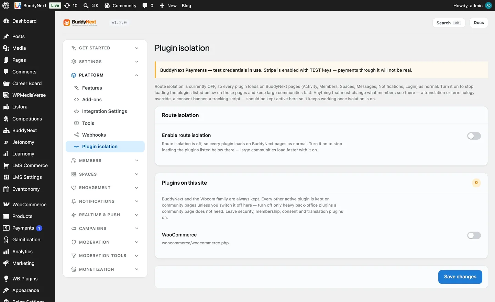

# Plugin Isolation

Plugin isolation lets you choose which other plugins load on your BuddyNext
community pages. On a busy feed or a large member directory, every extra plugin
that loads costs memory and time - even ones that have nothing to do with the
community. Isolation lets you skip those plugins on community routes only, so the
social pages stay fast, while the rest of your site runs every plugin as normal.

It is off by default, and when you do turn it on, it keeps every plugin unless you
say otherwise - so it never surprises you by silently disabling something.

## Why it exists

A WordPress site often runs a page-builder, a forms plugin, a shop, an SEO suite,
and a dozen smaller tools. Most of them do nothing on your activity feed, yet they
still load on every request to it. On a community that serves thousands of feed
views an hour, that overhead adds up.

Isolation trims it: on the feed, spaces, member, and messaging routes, you can
skip the plugins those pages never use, without touching how the rest of your
WordPress site behaves.

## How it works

The community pages run through a small always-on component that loads *before*
regular plugins. When isolation is on, it consults your list and skips the plugins
you chose to strip, on BuddyNext routes only. Every other page on your site is
untouched.

Because it decides so early, the model is deliberately safe:

- **Off by default.** A fresh install runs every plugin everywhere, exactly as
  WordPress normally does.
- **Keep everything unless you strip it.** When you turn isolation on, nothing is
  removed until you explicitly add a plugin to the skip list. There is no guessing.
- **Essential plugins are never stripped**, even if you try. See the protected list
  below.

> This is the model as of 1.1.6. Earlier versions used the opposite approach - an
> allow-list where you named the few plugins to *keep* - which made it easy to
> strip something important by leaving it off the list. The keep-everything default
> replaced it.

## Turning it on and choosing what to skip

1. Go to **BuddyNext > Platform > Plugin isolation**.
2. Turn isolation **on**.
3. You will see your active plugins. Tick the ones you want to **skip on community
   routes** - the plugins your feed, spaces, and profiles do not need.
4. Save.

Leave anything you are unsure about unticked; an unticked plugin keeps loading
exactly as before. You can revisit this screen any time as you add or remove
plugins.

## What is always protected

Some plugins are never stripped, no matter what, because removing them on community
pages would break something you could not see was missing:

- **BuddyNext and BuddyNext Pro** themselves.
- **The in-house integration family** - WPMediaVerse, Jetonomy, WB Gamification, WB
  Member Blog, Career Board, Listora, Learnomy, and Eventonomy (free and Pro).
  These power profile tabs and panels *on* the community pages, so stripping them
  would blank exactly the features they add.
- **Translation plugins** (Loco Translate, Polylang) - they rewrite every string on
  the page, including your renamed terms like "Teams" for Spaces, and the hub routes
  are where that terminology matters most.
- **Cookie-consent plugins** - so your compliance banner still shows on community
  pages.
- **Security plugins** - kept on by default so protection is never weaker on
  community routes than on the rest of the site. If you have a specific reason to
  let one go, there is an opt-out for it.
- **The object cache admin (Redis) and Query Monitor** - so a performance problem on
  the hub can still be diagnosed with the same tools as everywhere else.

## "A plugin stopped working, but only on my community pages"

This is almost always isolation stripping a plugin the community pages actually do
use. If a feature works on a normal page but disappears on the feed, a space, or a
profile:

1. Go to **BuddyNext > Platform > Plugin isolation**.
2. Find that plugin in the list and make sure it is **not** ticked to skip.
3. Save, and reload the community page.

If it is an in-house integration, it is protected already and the cause is
elsewhere - check its own settings.

## Good to know

- **It changes nothing off community routes.** Your homepage, shop, and blog run
  every plugin as always. Isolation only ever narrows what loads on BuddyNext's own
  pages.
- **It is a performance tool, not a security boundary.** The goal is memory and
  speed on the busiest pages, not sandboxing plugins from each other.
- **New plugins are kept automatically.** Because the default is keep-everything, a
  plugin you install later loads on community pages until you decide to skip it.

## Related

- [Object Cache at Scale](09-object-cache-at-scale.md) - the other big lever for keeping large communities fast
- [Tools and Maintenance](08-tools-and-maintenance.md) - the rest of the Platform tools
- [Admin Overview](04-admin-overview.md) - where the Platform section sits in the admin
