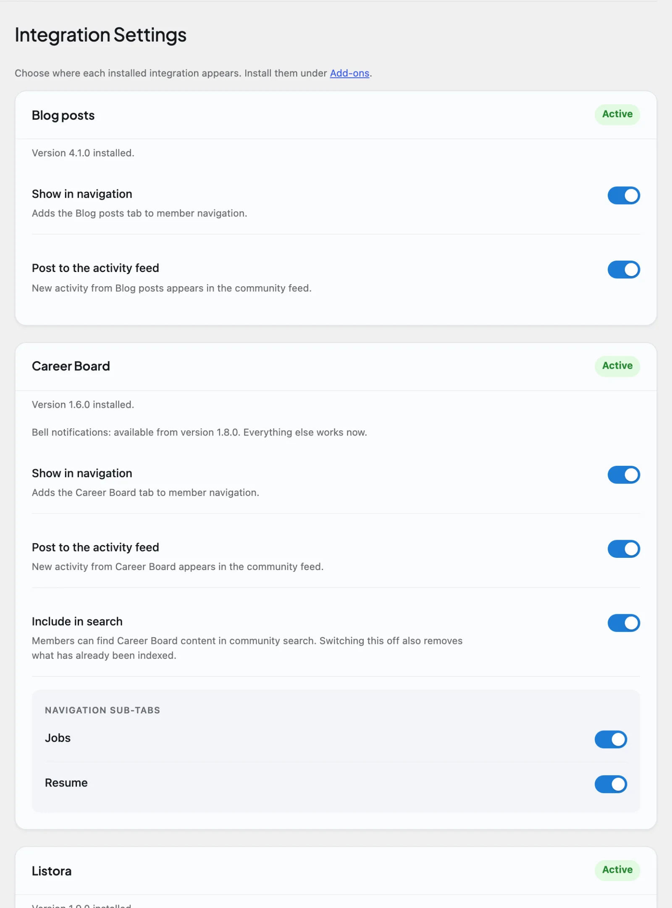

# Integrations

Integrations let your community grow into messaging, forums, gamification, jobs, courses, and listings whenever you are ready - no setup work, no code, nothing to wire together by hand. Each one is optional and stays off until you turn it on, so you add features only as your members need them.

## Why use it

A community rarely needs everything on day one. Most owners start with the social core - profiles, a feed, spaces, follows - and add capabilities as the community grows. Integrations let you do exactly that: keep BuddyNext lean, then switch on direct messaging when members ask for it, or forums when discussions get long, or points and badges when you want to reward activity.

The point is to extend the community without bloating the core. BuddyNext does not bundle a messaging engine, a forum, or a points system into its own code. Instead it recognizes companion plugins when they are present and hands the relevant work to them. If a companion is not installed, BuddyNext simply does not show that capability - nothing is loaded, nothing slows the site down.

This matters for two kinds of people:

- For the site owner, it means you choose what your community does and pay (in performance and complexity) only for what you actually use.
- For members, it means each capability behaves like a native part of BuddyNext - messages, forum threads, and badges appear inside the same profiles and feed they already know, not in a separate disconnected plugin.

## What BuddyNext integrates with

BuddyNext keeps a catalog of companion plugins it knows how to work with. Each one adds a specific capability to your community.

| Integration | What it adds | What it unlocks inside BuddyNext |
|---|---|---|
| MediaVerse | Direct messaging, media galleries, and social feeds. | Member-to-member direct messaging inside BuddyNext. |
| Jetonomy | Forum-style threaded discussions and Q&A boards. | Forum activity surfaced in the BuddyNext feed. |
| Gamification | Points, badges, levels, and leaderboards. | Badges and a leaderboard on member profiles. |
| Career Board | Job listings and applicant management. | Job posts as activity cards in the feed. |
| Learnomy | Courses, lessons, and quizzes - a full LMS for your community. | Completed courses and certificates on member profiles. |
| Eventonomy | Events, RSVPs, and calendars - members create and attend events. | Events as activity cards in the feed, plus attending events on member profiles. |
| Listora | Directory listings - members publish and manage their own listings. | Member listings surfaced in the feed and on profiles. |
| WB Member Blog | Front-end publishing - members write and manage WordPress posts without wp-admin. | An Articles tab on member profiles, plus article cards in the feed. |

Each integration has its own setup page in this section - open the page for the one you want for the full walkthrough of its settings and member experience.

> **Note:** Direct messaging in BuddyNext is provided by MediaVerse. BuddyNext renders the messaging interface, but the underlying engine lives in MediaVerse - so messaging only appears once MediaVerse is installed and active and its Messages switch is on (WPMediaVerse > Settings > Social > Messages).

### One rule for every integration

The plugin that owns the data owns its rules, wording, links and emails. BuddyNext displays what that plugin gives it and calls it when a member acts. Two things follow:

- **One bell.** Notifications from Jetonomy, Career Board, Learnomy, Eventonomy, WB Gamification and WPMediaVerse arrive in the BuddyNext bell in the partner's own words. Each plugin's notification types get their own switches in members' notification settings (grouped as Forums, Jobs, Courses, Events, Achievements and Media). While BuddyNext is active, WPMediaVerse sends no activity emails of its own. Reactions are bell-only, with no reaction emails or digest.
- **Switching an integration's navigation off also stops its notifications.** The **Show in navigation** switch (see Integration Settings below) governs that integration's bell rows as well.

## How it works (for owners)

Every integration is a bridge: BuddyNext checks whether the companion plugin is present and, if it is, connects the two. You never edit code or wire hooks yourself.

### Find the integrations screen

Open BuddyNext and go to **Platform > Add-ons**. Each companion shows as a card with its name, a one-line description of what it adds, and its current state:

- Connected - the companion is installed and running, and the integration is live.
- Installed, activate - the companion is installed but not activated. Select **Activate** to turn the integration on.
- Not installed - the companion is not on your site yet. Select **Install free** to add it in one click.

Every card also has a **Learn more** link to the product page. Below the cards, the screen lists recommended themes (BuddyX, BuddyX Pro and Reign).

### Install a companion in one click

When a companion is not installed, its card offers a one-click **Install free** button. BuddyNext downloads the free version of that plugin directly from wbcomdesigns.com, installs it, and activates it for you. There is no manual upload, no plugin search, and no license key to paste for the free plan - the download is handled for you.

After install, BuddyNext sends you to the right place to finish setup. For most companions that is the Plugins screen; for companions that have their own setup wizard (such as Career Board) you land on that companion's settings page so you can configure it straight away.

> **Tip:** One-click install needs the same permission WordPress requires for installing any plugin. If you do not see the install button, your account does not have the capability to install plugins on this site.

### Turn an integration on or off

An integration is only active when its companion plugin is active. There is no separate master switch for an integration on the Features tab: its behaviour is controlled by the switches on **Integration Settings** (below).

- To turn a capability on, install and activate its companion.
- To turn it off completely, deactivate the companion. BuddyNext stops showing it and the capability disappears cleanly - your members and feed simply no longer see it.
- To keep the companion but hide parts of it, use the switches on Integration Settings.

Some integrations also have per-space switches that a space owner sets under **Manage space > Integrations** (for example a Discussion, Media tab, Files tab, Leaderboard tab, Events tab or Businesses tab). Each is off until the space owner turns it on. Those are covered on the integration's own page.

### Choose where each integration appears (Integration Settings)

Enabling an integration decides *that* it runs; **Integration Settings** (its own section in the BuddyNext admin menu, next to Platform) decides *where members see it*. Each connected integration gets its own card with plain switches. A card also shows the partner's installed version, with an **Update needed** badge when the partner is older than the bridge supports and a **Newer partner** badge when the partner is newer than the version the bridge was last checked against (the integration still works). An **Available to add** list at the bottom links companions you have not installed yet to the Add-ons screen.

- **Show in navigation** - adds (or removes) the integration's tab in member navigation.
- **Post to the activity feed** - whether that integration's events (new discussions, new listings, new media, and so on) appear in the community feed.
- **Include in search** - whether members can find that integration's content in community search. Offered by the integrations that have content worth searching (discussions, jobs, listings, events).
- **Navigation sub-tabs** - integrations that add several member tabs (for example Career Board's Jobs and Resume, or Learnomy's Learning, Certifications and Teaching) let you switch each sub-tab individually.

This is the screen to visit when you want a companion's data without its menu clutter - for example, keeping forum posts in the feed while hiding the Discussions tab from navigation. Turning a navigation or feed switch off never deletes anything; it only hides the surface.

> **Note:** **Include in search** behaves differently from the other two, and the difference matters. Switching it off does not just stop *new* content being indexed - it also removes the content already in the search index. That is the honest behaviour: a search switch that left old results behind would be a switch that does not work. Switch it back on and the content is indexed again as members create or update it. Nothing is deleted from the companion plugin itself; only the search index is affected.

## Good to know

- An integration does nothing until its companion is present. BuddyNext loads zero integration code for a companion that is not installed, so unused integrations never affect performance.
- The catalog is extensible. Pro and third-party plugins can add their own entries, so the set of integrations you see can grow beyond the built-in list above.
- Running BuddyPress or BuddyBoss alongside BuddyNext is not supported. Treat them as a migration source only.
- Several Pro capabilities each have one switch in **Platform > Features**. That is separate from the integrations above, which have no Features switch.
- One-click install only ever downloads from wbcomdesigns.com. BuddyNext will not install an arbitrary plugin from an arbitrary source through this screen.
- **Whether the free companion is enough depends on the integration.** For most, installing the free version lights up the community surfacing, and the Pro version of that companion adds more. But Career Board, Listora, Learnomy and Eventonomy surface into the community through bridges that ship in **BuddyNext Pro** - install the companion on its own and it works as its own plugin, but you will not get the community surfacing described here until BuddyNext Pro is active. Each integration's own page states which applies.
- BuddyNext works fully standalone. If you never install a single companion, the social core - profiles, feed, spaces, follows, connections, notifications - works on its own.

## Outbound webhooks

Beyond these plugin integrations, BuddyNext can also send your community's events to any external system over a webhook - useful for automation tools like Zapier, Make, or n8n, or for syncing members into a CRM. See Outbound Webhooks for how to register an endpoint and subscribe to events.

## Related

- [WPMediaVerse](02-wpmediaverse.md) - the companion that powers direct messaging and media.
- [Jetonomy](03-jetonomy.md) - forum-style discussion boards for your spaces.
- [Outbound Webhooks](06-outbound-webhooks.md) - send community events to external tools.
- [Activity Feed](../community/01-activity-feed.md) - where most integrations surface their content.
