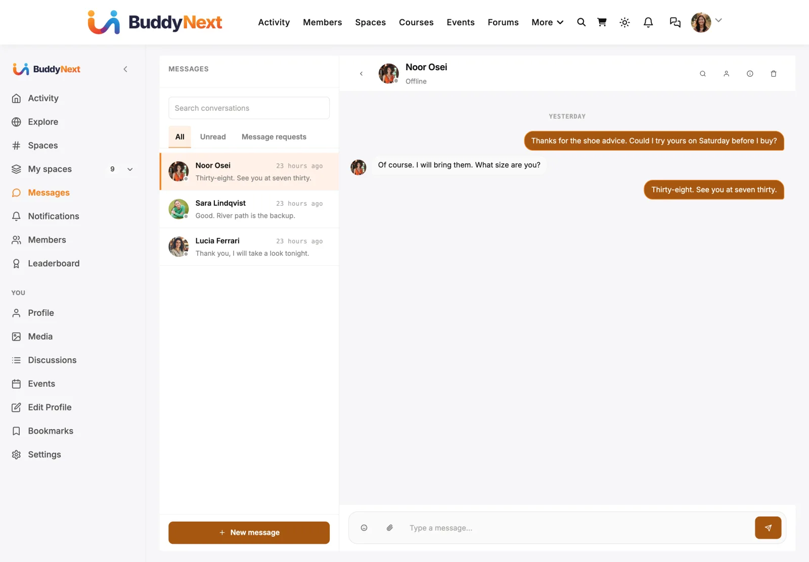

# WPMediaVerse

WPMediaVerse is the companion plugin that brings private messaging and richer media to your community. Turn it on, and members can message each other one to one and attach photos and other media to their posts and conversations - all without leaving BuddyNext.

BuddyNext is the social layer your members already know; WPMediaVerse is the messaging and media engine working quietly underneath it. Because BuddyNext presents that engine through its own screens, sending a message or sharing a photo feels like a native part of the community, not a second plugin.

## Why use it

A community without private messaging is missing the most basic way for members to talk one to one. Members expect to message someone the way they would on Facebook or LinkedIn, and to share an image as easily as they share text. BuddyNext provides the front end for both, but the actual message store and media library live in WPMediaVerse.

For a community owner, this means messaging is a one-step add-on rather than a separate build. Install the companion, and a Messages area, a Media link, and media attachments all appear inside the community, wired to BuddyNext's own notifications, blocking, and privacy rules. For members, it means they can start a conversation, share a photo, and get notified about replies without ever touching a second plugin's interface.

The real scenario it solves: someone wants to follow up privately after seeing a post, send a quick question, or share an image with another member. None of that is possible until the messaging engine is present. WPMediaVerse is what turns BuddyNext from a public feed into a place where people can also talk privately.

## How it works (for members)

Once WPMediaVerse is active, these become available to members inside BuddyNext:

### Direct messages

Members can open a private conversation with another member and exchange messages. The full member experience - opening a conversation, the inbox, message requests, and unread counts - is covered in Direct Messaging. New messages raise a BuddyNext notification (bell and email, according to each member's preferences), with no duplicate notice from the engine.

### Media in posts and messages

With the companion active, members can attach photos and other media to their activity posts, and media can be shared inside conversations. Media opens in a built-in viewer for reactions and comments, all rendered as part of the BuddyNext feed rather than a separate media interface.

A public upload made directly in WPMediaVerse also posts a shared-media card to the activity feed. It is deferred by a couple of minutes and de-duplicated, so a photo added through the BuddyNext composer never posts twice. Private uploads never post. The owner can stop these cards with the **Post to the activity feed** switch on the Media card in Integration Settings.

Feed posts follow their photos. Trash a photo in WPMediaVerse and a post with nothing left to show leaves the feed; restore it and the same post comes back with its reactions and comments; delete it permanently and the post is removed rather than left empty. A post with several photos keeps the ones that remain.

### Reporting media, and blocking an uploader

The media viewer (the full-screen lightbox a member gets when they click a photo or video) has Favorite, Share, and Download buttons, plus a **More** (three dots) menu. Two safety controls sit in that menu:

- **Report** - sends the media to moderators for review. It only appears while media reporting is on (see below).
- **Block** - blocks the member who uploaded it. This blocks the *person*, not the file, and it is BuddyNext's own block, exactly the same as blocking someone from their profile.

Both are hidden on your own media. The same menu also offers **Edit** where the viewer may edit the item, and **Remove from space** for a space owner or moderator looking at media on a space drive.

This matters more than it looks. The bridge sends the standalone media page back to the post the media came from, which is what keeps a member inside the community rather than bouncing them into a separate media plugin's page. That page happened to be the one carrying WPMediaVerse's own Report button - so without these controls, a BuddyNext community would have had no way at all for a member to report a photo. The lightbox is the media viewer on a BuddyNext site, so the controls belong there.

### Media link in the sidebar

A **Media** link appears in the BuddyNext left navigation rail for logged-in members, in the personal group with Profile and Bookmarks. It opens the member's own profile Media tab, where they browse their photos, videos and albums (see Profile Media and Albums). Guests do not see it. The owner can hide it with **Show in navigation** on the Media card in Integration Settings.

### Files in spaces and on profiles

BuddyNext shows the Files screens for spaces and profiles. WPMediaVerse Pro holds the files and applies the rules. Members can **Upload** a file or **Link** an existing one in a space's Files tab, and space owners and moderators manage the folders. A space owner turns the Files tab on under **Manage space > Integrations**. See Space Media and Albums for the full walkthrough. Files need WPMediaVerse Pro; without it the Files tab is not offered.

## Setting it up (for owners)

### Install the companion (1-click)

WPMediaVerse installs from inside BuddyNext - no manual upload or plugin search.

1. Go to **BuddyNext > Platform > Add-ons**.
2. Find the **MediaVerse** card. Its description reads "Direct messaging, media galleries, and social feeds."
3. Select **Install free**. BuddyNext pulls the plugin from the Wbcom store and installs it for you. The card then shows **Connected**.

If the plugin is already installed but switched off, the card shows an **Activate** button instead. The status badge tells you which state you are in: Connected, Installed, activate, or Not installed.

> **Note:** The 1-click install needs a site administrator with permission to install and activate plugins. If you do not see the **Install free** button, your account does not have that capability.

### What becomes available once active

The moment WPMediaVerse is active alongside BuddyNext, the bridge between them attaches automatically. There is nothing further to configure for basic messaging - the engine's own chat panel, standalone messages page, and notifications step aside so BuddyNext owns the experience. Members get direct messaging, media in posts, and the Media sidebar link with no extra setup.

Messages are switched on or off in one place: **MediaVerse > Settings > Messages** ("Turn on private messages"). BuddyNext only shows the status. **Platform > Features** shows whether Direct messages are on and links to that setting, and **Settings > General > Direct Messaging** shows the current "Who can message members" level with a **Change in WPMediaVerse** button. With Messages off, the Messages page, the Message buttons and message notifications are hidden, and stored conversations are kept for when you turn it back on.

Who can message whom is WPMediaVerse's own rule: the site-wide level set there, which members can keep or tighten in their BuddyNext privacy settings, plus BuddyNext's blocks (see Direct Messaging and Blocking and Muting).

Under **Integration Settings**, the Media card has two switches: **Show in navigation** (the Media link and profile Media tab) and **Post to the activity feed** (cards for public uploads), plus an **Albums** sub-tab switch. Direct messaging does not depend on these switches.

One BuddyNext setting does apply to media, on **Settings > General**:

**Media links** decides where a link to a photo or video takes the viewer. Members post media as activity updates, so there are two sensible destinations:

| Choice | What happens |
|---|---|
| Open the activity it was posted in (default) | A media item's own `/media/` page redirects to the post it was shared in. Media is never exposed as a separate public URL, and viewers stay in the feed where the comments and reactions are. |
| Open a dedicated media page | Each item keeps its own standalone page, which suits gallery-style sites where the image is the destination rather than the conversation around it. |

The setting is only available while WPMediaVerse is active - without the companion there is no media page for it to control, so it appears switched off.

One default is changed for you, and it is worth knowing about:

**Media reporting is turned on.** Installed on its own, WPMediaVerse ships with member reporting switched off. That is a reasonable default for a media library on a site that may have no moderators at all. A community is the opposite case: a site where members upload photos and videos and *nobody* can report one has no abuse path. So when BuddyNext is active, media reporting is on. You do not have to do anything.

**Where media reports go.** They land in WPMediaVerse's own review queue, at **MediaVerse > Moderation** in the WordPress admin - not in BuddyNext's moderation queue. The media plugin owns the media, so it owns the queue. If your community allows uploads, add that screen to your moderators' rounds alongside **BuddyNext > Moderation > Reports**.

If you genuinely want media reporting off, a developer can switch it back off in one line, and the Report button then disappears from the viewer rather than sitting there and failing when a member taps it. Blocking an uploader is unaffected either way, because that is BuddyNext's own feature.

## Good to know

- **Blocking is honored at the messaging layer.** If a member has blocked someone, that person cannot send them a direct message - the block is checked and the send is refused before any message is stored. This is the single enforcement point for message blocking, so it holds regardless of how the message was started. Site administrators are the one exception, so staff can always reach members. Message text also goes through BuddyNext's banned-word moderation before it is sent.
- **Muting and restricting are respected too.** If a member mutes or restricts another member rather than fully blocking them, an incoming message is still stored but does not interrupt the recipient - no bell notification, no feed signal.
- **No duplicate notifications.** Because BuddyNext owns the notification path, WPMediaVerse does not raise its own competing notifications for new messages, new followers, media comments or favorites, and sends no activity emails of its own while BuddyNext is active. Members get one clean notification in the BuddyNext bell. Reactions are bell-only: there are no reaction emails or digest.
- **Inert when not installed.** If WPMediaVerse is not active, BuddyNext simply has no messaging or media features - there is no error, no broken Media link, and no leftover Messages area. Installing the companion is what turns them on.

## Free vs Pro

The free WPMediaVerse companion gives BuddyNext everything described above except Files: member-to-member direct messaging, media in posts and conversations, and the Media sidebar link.

WPMediaVerse Pro extends the messaging engine with:

- **Read receipts** - see when a message has been read.
- **Group messages** - conversations with more than two members.
- **Real-time delivery** - messages arrive live without waiting for a refresh.
- **Files** - the document library behind the Files tabs on spaces and profiles.

These are engine-level upgrades. Activating WPMediaVerse Pro lights them up inside the same BuddyNext messaging experience; you do not change anything in BuddyNext itself to use them.

## Related

- [Integrations Overview](01-overview.md) - how every companion plugin connects.
- [Direct Messaging](../messaging-notifications/01-direct-messaging.md) - the member messaging experience this engine powers.
- [Blocking and Muting](../members/08-blocking-and-muting.md) - the rules that decide who can message whom.
- [Profile Media and Albums](../members/10-profile-media-and-albums.md) - where shared media appears on profiles.
- [Space Media and Albums](../spaces/10-space-media-and-albums.md) - the Media and Files tabs inside a space.
