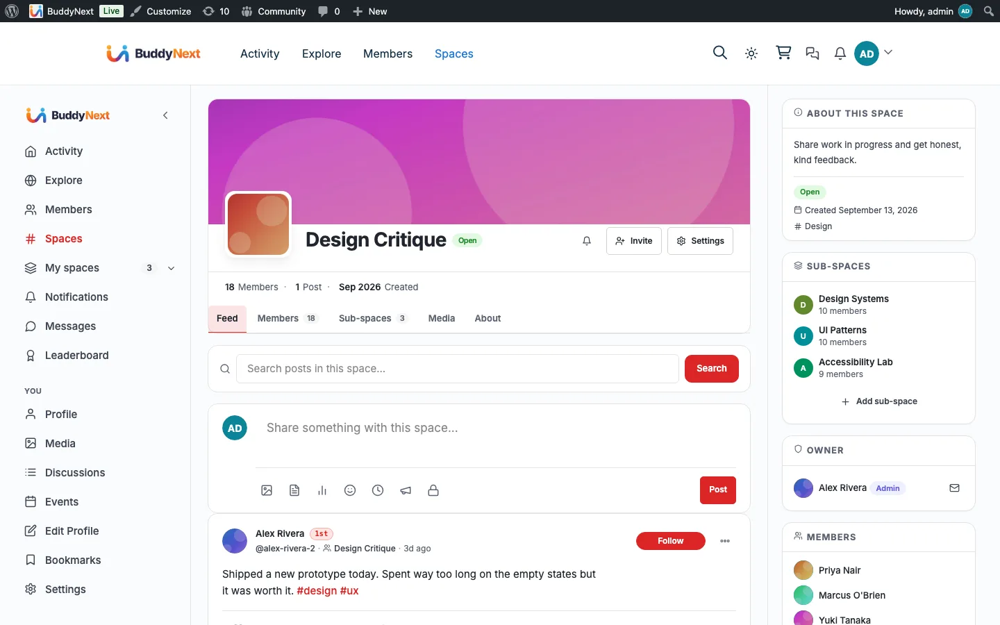

# Jetonomy

Jetonomy is the companion plugin that gives your community proper discussion boards. Turn it on, and members get a Discussions area plus a forum tab inside each space, where they can start topics, reply in threads, and vote on the best answers - the slower, more considered conversation a fast-moving feed cannot hold.

Your feed and spaces stay exactly as they are; Jetonomy simply adds discussion boards alongside them. BuddyNext ties the two together so forums feel like a natural part of the community rather than a bolt-on.

## Why use it

The activity feed is built for fast, in-the-moment posts. It is the wrong place for a question that needs a considered answer, a topic the community will return to over weeks, or a debate with many branching replies. Those belong in a forum: a titled topic, threaded replies, and a best answer that stays findable.

For a community owner, forums add the structured half of community conversation. A space can hold a quick feed for day-to-day chatter and a forum for the questions and knowledge that deserve to last. For members, a discussion thread keeps a long conversation organized in one place instead of scattering it across feed posts.

The real scenario it solves: a member asks "how do I do X," and the answer is useful to everyone. In a feed, that question scrolls away in a day. In a forum it becomes a titled discussion, gets threaded replies, can be voted on, and stays searchable. Forums complement the feed - the feed is the heartbeat, the forum is the knowledge base.

## How it works (for members)

Once Jetonomy is active, these become available to members inside BuddyNext:

### The Discussions area

A **Discussions** link appears in the BuddyNext left navigation rail, opening the community discussion home where members browse and search topics and view the leaderboard. Each member profile also gains a **Discussions** tab that lists the discussions that member has started, with a count badge.

### Per-space forum tab

Every BuddyNext space gains a **Discussions** tab. Opening it takes the member to that space's own forum. The tab's "Start a discussion" button opens the forum's new-topic composer directly, so starting a discussion takes one click instead of landing on the forum first and hunting for a way to post. The full member experience of a space forum - starting a topic, replying, voting, and how a forum is set up on first use - is covered in Space Forum.

### Discussions in the activity feed

When a member starts a new discussion in a public space, it can also appear as a card in the BuddyNext activity feed, so people following the feed see new discussions without having to visit the forum. This mirroring is controlled by an owner setting (below) and only ever surfaces public discussions from public spaces - private spaces and private topics never leak into the feed.

### Two-way discussion sync

A discussion card in the feed and its matching topic in the forum stay in sync automatically. Comment on the feed card, and that comment appears as a reply in the forum topic. Reply in the forum, and that reply appears as a comment on the feed card. Editing or deleting a comment or reply on either side carries through to the other, so members never have to re-post the same reply twice or worry about the two places drifting apart.

### Reply notifications and mentions

When someone replies to a member's discussion, that member gets a BuddyNext notification. Mentioning another member by their @username inside a discussion notifies them too, the same way mentions work everywhere else in BuddyNext.

## Setting it up (for owners)

### Install and enable the companion (1-click)

Jetonomy installs from inside BuddyNext - no manual upload or plugin search.

1. Go to **BuddyNext > Platform > Integrations**.
2. Find **Jetonomy** under **Companion plugins**. Its description reads "Forum-style threaded discussions and Q&A boards."
3. Select **Install free**. BuddyNext pulls the plugin from the Wbcom store and installs it. The card then shows **Active**.

If Jetonomy is already installed but switched off, the same row shows an **Activate** link. The status badge shows Active, Inactive, or Not installed.

> **Note:** The 1-click install needs a site administrator with permission to install and activate plugins.

### Display settings

Once Jetonomy is active, it gets a card on the **Platform > Integration Display** tab, alongside every other integration. (This is the same per-integration screen that also controls the Discussions navigation tab.)

| Setting | What it does | Default |
|---|---|---|
| Post to the activity feed (Jetonomy card) | When on, a new discussion started in a public space appears as a card in the BuddyNext activity feed, linking back to the full thread. Only public discussions in public, published topics are surfaced; private spaces and private topics are never mirrored. | On |
| Include in search (Jetonomy card) | When on, discussions are indexed for BuddyNext's community search, so members find them alongside posts, members, and spaces. Switching it off also removes the discussions already in the search index. | On |

Both switches are on by default - when Jetonomy is active, new public discussions flow into the feed and into search automatically. The two are independent: you can keep discussions searchable while keeping them out of the feed, or the reverse. The feed mirror can also be overridden per space.

### Per-space forum

There is nothing to pre-build for space forums. A space's forum is created the first time a member opens that space's **Discussions** tab, so you never end up with empty, unused forums. See Space Forum for how that on-demand setup works and who is allowed to trigger it.

## Good to know

- **Forums never leak private content into the feed.** Only public, published discussions in public spaces become feed cards. A discussion in a private or secret space, or a topic marked private, stays out of the public feed and Explore even when feed sync is on.
- **Deleting a discussion cleans up after itself.** When a discussion is removed, its feed card and its search entry are removed too, so the feed never points at a thread that no longer exists.
- **Discussions are searchable.** New discussions are indexed for BuddyNext's unified search, so members find them alongside posts, members, and spaces. This is independent of feed sync - each has its own switch on the Jetonomy card. If you turn search indexing off, the discussions already indexed are removed too, so search does not keep answering with results you have just switched off.
- **The feed card and the forum topic never drift apart.** Every comment or reply, and every edit or delete of one, is mirrored to the other side automatically - there is nothing to re-post by hand.
- **Inert when not installed.** With Jetonomy inactive, BuddyNext has no Discussions link, no space forum tab, and no feed sync - there are no errors or broken links. Installing the companion is what turns them on.

## Free vs Pro

The free Jetonomy companion delivers everything described above: the Discussions area, per-space forums, threaded replies, voting, mentions, reply notifications, feed sync, and the two-way sync between feed comments and forum replies.

Jetonomy's own paid tier extends the forum engine itself (for example its private-messaging extension). Inside a BuddyNext community, direct messaging is owned by BuddyNext through the WPMediaVerse companion, so when BuddyNext messaging is available it takes over the Messages area and Jetonomy's messaging extension steps aside - members get one consistent inbox rather than two. See WPMediaVerse and Direct Messaging for how messaging is provided.
