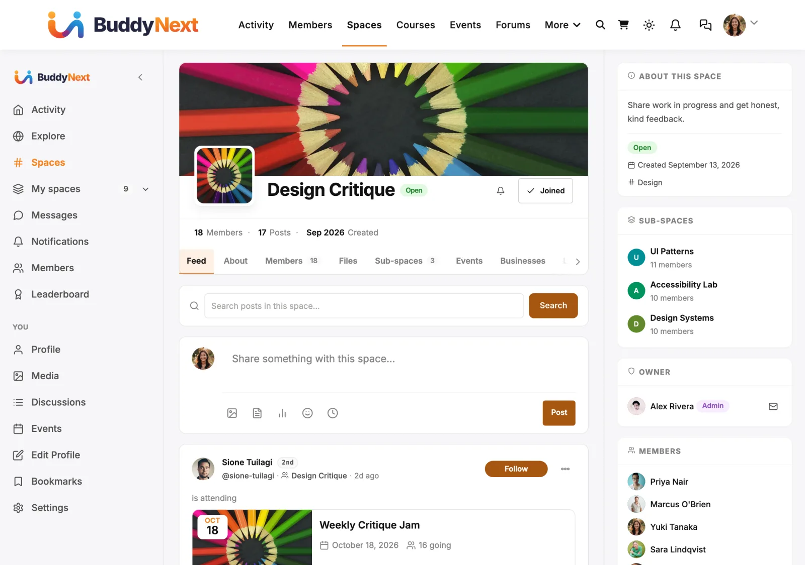

# Jetonomy

Jetonomy is the companion plugin that gives your community proper discussion boards. Turn it on, and members get a Discussions link and profile tab, plus an optional discussion area inside each space, where they can start topics, reply in threads, and vote on the best answers - the slower, more considered conversation a fast-moving feed cannot hold.

Your feed and spaces stay exactly as they are; Jetonomy simply adds discussion boards alongside them. BuddyNext ties the two together so forums feel like a natural part of the community rather than a bolt-on.

## Why use it

The activity feed is built for fast, in-the-moment posts. It is the wrong place for a question that needs a considered answer, a topic the community will return to over weeks, or a debate with many branching replies. Those belong in a forum: a titled topic, threaded replies, and a best answer that stays findable.

For a community owner, forums add the structured half of community conversation. A space can hold a quick feed for day-to-day chatter and a forum for the questions and knowledge that deserve to last. For members, a discussion thread keeps a long conversation organized in one place instead of scattering it across feed posts.

The real scenario it solves: a member asks "how do I do X," and the answer is useful to everyone. In a feed, that question scrolls away in a day. In a forum it becomes a titled discussion, gets threaded replies, can be voted on, and stays searchable. Forums complement the feed - the feed is the heartbeat, the forum is the knowledge base.

## How it works (for members)

Once Jetonomy is active, these become available to members inside BuddyNext:

### The Discussions area

A **Discussions** link appears in the BuddyNext left navigation rail for logged-in members, in the personal group with Profile and Bookmarks. It opens the member's own profile **Discussions** tab. Every member profile has that tab, listing the discussions the member has started, with a count badge. The forum itself (browse, search, leaderboard, new topic) is Jetonomy's own set of pages, which the space tab and feed cards link out to.

### Per-space forum tab

A space gets a **Discussions** tab once its owner turns on **Discussion** under **Manage space > Integrations** (off until then). The tab lists the space's recent discussions with the author, reply count and vote count, and an **Open in Community** button that opens the full forum. When the forum has no threads yet, the **Start a discussion** button opens the forum's new-topic composer directly. The full member experience of a space forum - starting a topic, replying, voting - is covered in Space Forum.

### Discussions in the activity feed

When a member starts a new discussion in a public forum, it can also appear as a "started a discussion" card in the BuddyNext activity feed, so people following the feed see new discussions without having to visit the forum. This mirroring is controlled by an owner setting (below) and only ever surfaces published, public discussions from public forums - private spaces and private topics never leak into the feed. A card follows its discussion: if the discussion is unpublished, trashed or made private the card is withdrawn, and publishing it again brings back the same card with its reactions and comments.

### Two-way discussion sync

A discussion card in the feed and its matching topic in the forum stay in sync automatically. Comment on the feed card, and that comment appears as a reply in the forum topic. Reply in the forum, and that reply appears as a comment on the feed card. Editing or deleting a comment or reply on either side carries through to the other, so members never have to re-post the same reply twice or worry about the two places drifting apart.

### Reply notifications and mentions

When someone replies to a member's discussion, or marks a reply as the accepted answer, that member gets a notification in the BuddyNext bell. Mentioning another member by their @handle inside a discussion notifies them too. Jetonomy owns the wording, who may see each notification, and its emails; BuddyNext shows the notification in the bell and does not send a second email. Members can switch each type on or off in their notification settings under **Forums**. The @handle is the member's BuddyNext handle, and profile links inside a discussion open the member's BuddyNext profile.

## Setting it up (for owners)

### Install and enable the companion (1-click)

Jetonomy installs from inside BuddyNext - no manual upload or plugin search.

1. Go to **BuddyNext > Platform > Add-ons**.
2. Find the **Jetonomy** card. Its description reads "Forum-style threaded discussions and Q&A boards."
3. Select **Install free**. BuddyNext pulls the plugin from the Wbcom store and installs it. The card then shows **Connected**.

If Jetonomy is already installed but switched off, the card shows an **Activate** button. The status badge shows Connected, Installed, activate, or Not installed.

> **Note:** The 1-click install needs a site administrator with permission to install and activate plugins.

### Display settings

Once Jetonomy is active, it gets a card on the **Integration Settings** screen, alongside every other integration.

| Setting | What it does | Default |
|---|---|---|
| Show in navigation (Jetonomy card) | Shows the Discussions link in the left rail and the Discussions tab on member profiles. Turning it off also hides the space Discussions tab and stops Jetonomy notifications reaching the bell. | On |
| Post to the activity feed (Jetonomy card) | When on, a new discussion started in a public space appears as a card in the BuddyNext activity feed, linking back to the full thread. Only public discussions in public, published topics are surfaced; private spaces and private topics are never mirrored. | On |
| Include in search (Jetonomy card) | When on, discussions are indexed for BuddyNext's community search, so members find them alongside posts, members, and spaces. Switching it off also removes the discussions already in the search index. | On |

All three switches are on by default - when Jetonomy is active, new public discussions flow into the feed and into search automatically. The feed and search switches are independent: you can keep discussions searchable while keeping them out of the feed, or the reverse. A space owner can also keep a space's activity out of the main feed with **Share activity to the main feed** under **Manage space > Integrations**.

### Per-space forum

Each space owner decides whether their space has a discussion. Under **Manage space > Integrations**, the owner switches **Discussion** on; BuddyNext then creates one dedicated discussion for the space automatically. Instead of creating a new one, the owner can search for and link a discussion they already own (a site administrator can link any). A space keeps one discussion for its lifetime, and switching it off only hides the tab - nothing is deleted, and switching it on again restores the same discussion. Moderators can open the screen but only the owner can change this switch. See Space Forum for the member side.

## Good to know

- **Forums never leak private content into the feed.** Only public, published discussions in public spaces become feed cards. A discussion in a private or secret space, or a topic marked private, stays out of the public feed and Explore even when feed sync is on.
- **Deleting a discussion cleans up after itself.** When a discussion is removed, its feed card and its search entry are removed too, so the feed never points at a thread that no longer exists.
- **Discussions are searchable.** New discussions are indexed for BuddyNext's unified search, so members find them alongside posts, members, and spaces. This is independent of feed sync - each has its own switch on the Jetonomy card. If you turn search indexing off, the discussions already indexed are removed too, so search does not keep answering with results you have just switched off.
- **The feed card and the forum topic never drift apart.** Every comment or reply, and every edit or delete of one, is mirrored to the other side automatically - there is nothing to re-post by hand.
- **Related discussions on hashtag pages.** A hashtag page lists up to five Jetonomy discussions that carry the same tag.
- **One leaderboard.** If WB Gamification hands its leaderboard to Jetonomy, BuddyNext hides its own Leaderboard link so members never see two competing rankings.
- **Inert when not installed.** With Jetonomy inactive, BuddyNext has no Discussions link, no space forum tab, and no feed sync - there are no errors or broken links. Installing the companion is what turns them on.

## Free vs Pro

The free Jetonomy companion delivers everything described above: the Discussions area, per-space forums, threaded replies, voting, mentions, reply notifications, feed sync, and the two-way sync between feed comments and forum replies.

Jetonomy's own paid plan extends the forum engine itself (for example its private-messaging extension). Inside a BuddyNext community, direct messaging is owned by BuddyNext through the WPMediaVerse companion, so when BuddyNext messaging is available it takes over the Messages area and Jetonomy's messaging extension steps aside - members get one consistent inbox rather than two. See WPMediaVerse and Direct Messaging for how messaging is provided.

## Related

- [Integrations Overview](01-overview.md) - how every companion plugin connects.
- [Space Forum](../spaces/09-space-forum.md) - the per-space forum this integration adds.
- [Activity Feed](../community/01-activity-feed.md) - where new discussions appear as cards.
- [WPMediaVerse](02-wpmediaverse.md) - the companion that owns direct messaging.
