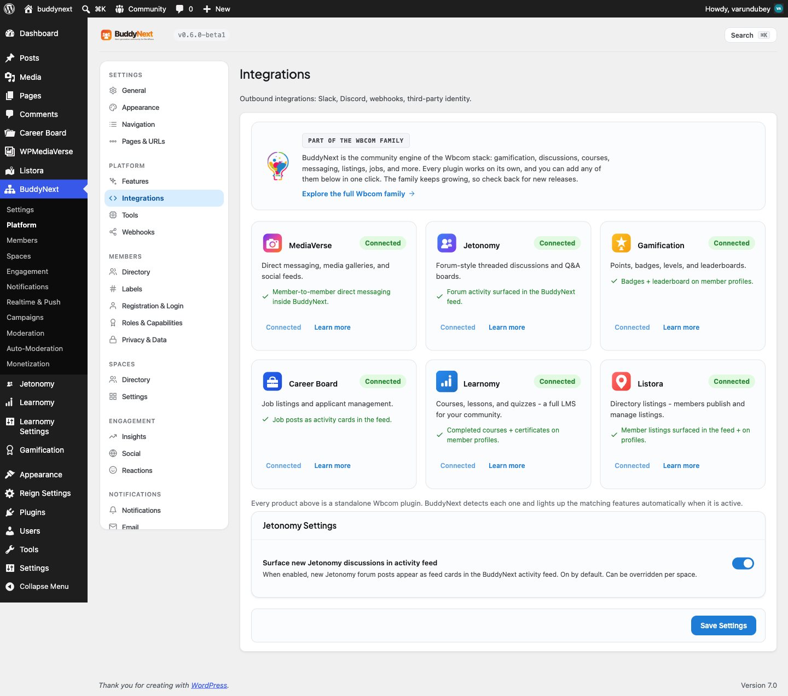

# WB Gamification

WB Gamification is the companion plugin that rewards your members for taking part. Turn it on alongside BuddyNext, and the everyday things members already do - following people, posting, joining spaces, finishing their profile - start earning them points, badges, and levels automatically. It is an easy way to make participation feel rewarding and to keep your community coming back.

This page covers connecting the two plugins and where the rewards show up. For the member-facing detail (how the Achievements tab, badges, points, levels, and leaderboard look and behave), see the Gamification page under Engagement.

## Why use it

A community grows when members keep coming back and keep contributing. Gamification gives them a reason to. Earning a badge for a milestone, watching a points total climb, or moving up a leaderboard turns ordinary participation into something members can see and take pride in.

You enable it when you want to:

- Reward early contributors so the community has activity from day one.
- Recognize the people who post, comment, and welcome new members - the ones who set the tone.
- Give quiet members a visible nudge toward their first post, first connection, or a completed profile.
- Surface credibility, so members can tell at a glance who the experienced, trusted people are.

BuddyNext does not contain any gamification logic of its own. WB Gamification watches community activity and decides what each action is worth, so the points and rules live in one place that you fully control.

## How it works (for members)

Members do not have to opt in or learn anything new. They use the community as usual, and rewards accumulate in the background.

WB Gamification can award points for community activity like these, and you set what each one is worth:

| Action | Suggested points |
|---|---|
| Followed by another member | 5 |
| Connection accepted | 10 |
| Post created | 5 |
| Joined a space | 5 |
| Profile updated | 2 |
| Profile completed | 25 |
| Reaction received on your content | 2 |
| Comment created | 3 |
| Moderation strike issued | 0 |

These are starting values. The actual points for each action are set in WB Gamification, and you can change any of them.

Where members see their rewards:

- **Achievements tab on their profile.** Once a member has earned a badge or any points, an Achievements tab appears on their profile. It shows their earned badges as a grid (credential badges first) and a standing strip with points, level, and streak. The tab stays hidden for brand-new members who have not earned anything yet, so nobody sees an empty tab.
- **Badge share pages.** Each badge links to its public share page so members can show off a credential outside the community.
- **The activity feed.** When a member earns a credential badge, BuddyNext posts a feed activity announcing it, so the whole community sees the achievement. Everyday participation badges do not post to the feed, so the feed never fills up with badge spam.
- **The leaderboard.** A "View leaderboard" link on the Achievements tab takes members to the gamification hub page, where they can see how they rank.

> **Note:** Points, badges, and levels are owned by WB Gamification. BuddyNext reads and displays them but never changes them.

## Setting it up (for owners)

1. Install and activate WB Gamification alongside BuddyNext.
2. In WB Gamification, configure the point value for each BuddyNext action you want to reward (the table above lists the actions BuddyNext reports). Set the badges and levels you want to offer.
3. Create or choose the page that hosts the gamification leaderboard, and set it as the gamification hub page. BuddyNext reads this to build the "View leaderboard" link members see.

That is the whole connection. Once both plugins are active and the actions have points, members start earning the moment they participate.

| Setting | What it does | Default |
|---|---|---|
| Gamification hub page | The page WB Gamification uses for the leaderboard. BuddyNext links members to it from the Achievements tab. When unset, the "View leaderboard" link is hidden. | None |

> **Tip:** Set the hub page so the "View leaderboard" link appears. Without it, members can still earn and see badges, but they have no in-community link to the leaderboard.

## Good to know

- **Inert when WB Gamification is not active.** Without the companion plugin, the integration does nothing - no Achievements tab, no leaderboard link, no badge feed activity. BuddyNext checks for WB Gamification before wiring anything in, so there is no error or empty surface on a site that does not run it.
- **The Achievements tab is data-gated.** It only appears for members who have earned a badge or any points. New members never see an empty Achievements tab.
- **Credential badges post to the feed; participation badges do not.** This keeps real milestones visible without flooding the feed with routine awards.
- **You control every value.** All point amounts, badge definitions, and levels live in WB Gamification. BuddyNext supplies the list of community actions; you decide what each is worth.

## Free vs Pro

The WB Gamification integration ships in BuddyNext free. You need the WB Gamification plugin installed and active for any of it to appear. No BuddyNext Pro features are required for this integration.
